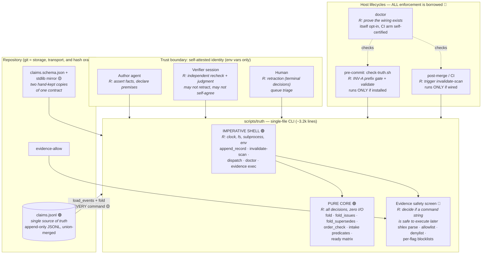
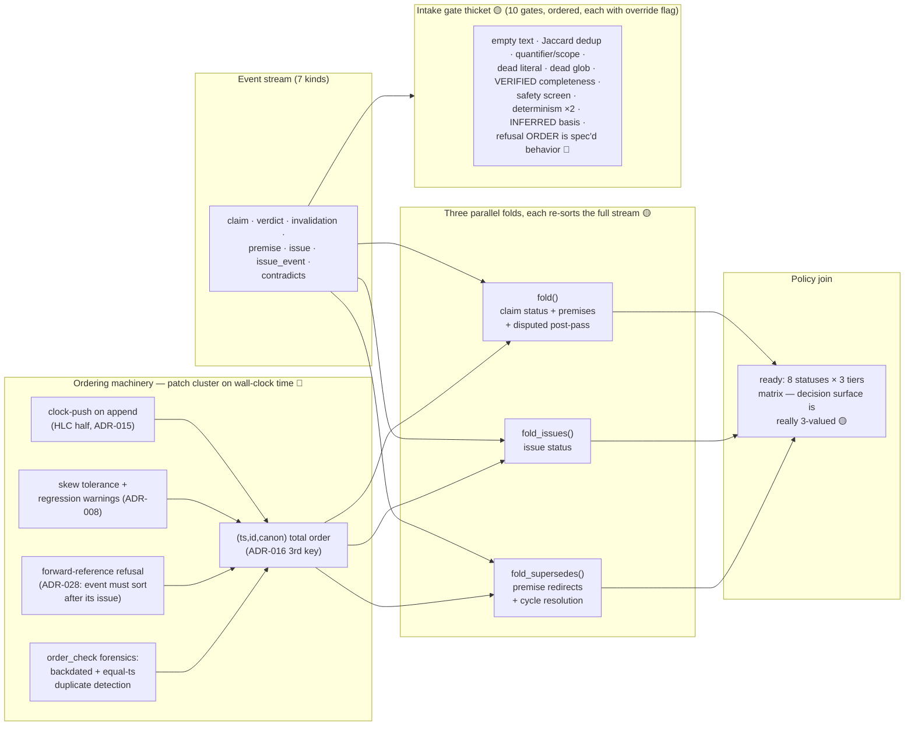
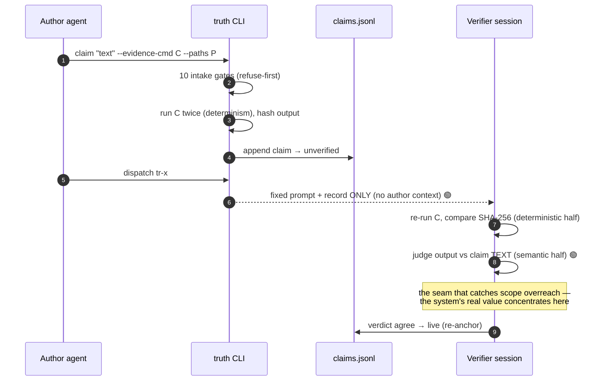

> STATUS: historical session artifact (2026-07-20). The antipattern/redesign content here was subsequently ADJUDICATED — most structural fixes were falsified by red-team review; see docs/roadmap-v3.md (do-not-do list) and docs/growth-gate/ for the settled outcomes. Kept for the reasoning record.

# Truth Ledger — Architecture Review
### Responsibilities, collaborations, antipatterns

Legend used across diagrams:
🟢 sound / keep · 🟡 overcomplication (works, costs too much) · 🔴 antipattern (structural fix warranted)

---

## 1. Container view — responsibilities & trust boundaries



---

## 2. Component view — where the complexity actually sits



---

## 3. Collaboration — verification round-trip (the happy path is sound)



## 4. Collaboration — enforcement path (the conditional spine)

```mermaid
sequenceDiagram
    autonumber
    participant W as Any writer
    participant G as git commit
    participant H as pre-commit hook
    participant S as post-merge scan
    W->>G: commit touching claims.jsonl
    alt hook installed
        G->>H: check-truth.sh
        H->>H: byte prefix check (INV-A)
        H->>H: validate + order_check<br/>(backdated / equal-ts forgeries)
        H-->>G: block or pass
    else hook absent 🔴
        Note over G: INV-A, INV-B, INV-G, INV-N and all<br/>ADR-008/016 detections silently OFF —<br/>a rewrite of history commits freely
    end
    alt scan wired
        S->>S: TTL / anchor / path-diff demotions
    else not wired 🔴
        Note over S: claims never stale; ledger drifts<br/>toward confidently wrong
    end
```

---

## 5. Antipattern map — cause → patch cluster → structural fix

```mermaid
flowchart TB
  subgraph AP1["🔴 AP-1 Wall-clock as causality (leaky proxy)"]
    C1["choice: order by ts"] --> P1["clock-push · skew rules ·<br/>3rd sort key · ADR-028 ·<br/>future-date refusals"]
    P1 --> X1["fix: causal refs / logical clocks<br/>(cf. git-bug's Lamport clocks)"]
  end
  subgraph AP2["🔴 AP-2 Enumerate-badness screen"]
    C2["choice: screen command STRINGS"] --> P2["shlex-vs-sh bypass (ADR-021) ·<br/>per-flag blocklists · deny tiers ·<br/>'git must never be allowlisted'"]
    P2 --> X2["fix: isolate at EXECUTION layer<br/>(ro-fs, no-net sandbox)"]
  end
  subgraph AP3["🔴 AP-3 Forensics past the crypto crossover"]
    C3["choice: defer hash-chain/signing"] --> P3["order_check forensics ·<br/>duplicate-id taxonomy ·<br/>residual footnotes in 4 invariants"]
    P3 --> X3["fix: prev-hash chain (~20 lines,<br/>Haber–Stornetta, no keys needed)"]
  end
  subgraph AP4["🟡 AP-4 Status-per-cause"]
    C4["8 statuses + subtype"] --> X4["fix: 3 states × reason code<br/>(trusted / attention / dead)"]
  end
  subgraph AP5["🟡 AP-5 Two products, one log"]
    C5["work kernel grew inside<br/>the claims ledger"] --> X5["fix: keep premise links,<br/>extract issue tracking"]
  end
  subgraph AP6["🔴 AP-6 Opt-in enforcement"]
    C6["all gates behind hook install"] --> X6["mitigation: doctor —<br/>itself opt-in, self-certified"]
  end
```



---

## Antipattern register (ranked)

| # | Antipattern | Evidence in artifact | Structural fix | Effort/payoff |
|---|---|---|---|---|
| AP-1 | **Leaky abstraction: wall-clock as causal order** | 5 patch mechanisms: clock-push (`append_record`), skew tolerance, canon 3rd key (ADR-016), forward-ref refusal (ADR-028), regression warnings (ADR-008) | Events carry causal reference / per-entity sequence; ts becomes display metadata | Medium / deletes 4 ADRs |
| AP-2 | **Enumerating badness** (blocklist arms race at the parse layer) | ADR-009/021/022/029; admitted: "a blocklist cannot bound an interpreter or VCS" | Execution isolation (read-only fs view, no network) instead of string screening | Medium / deletes the arms race |
| AP-3 | **Workaround accretion past the deferred-fix crossover** | order_check duplicate forensics + residual mapping in INV-G/N vs. a ~20-line `prev_hash` chain "deferred behind a growth gate" | Hash-link records (authenticates sequence, needs no keys) | Small / deletes the forgery taxonomy |
| AP-6 | **Opt-in security enforcement** | INV-A row: "where neither exists the gate never runs and this invariant is silently unenforced"; doctor's CI arm self-certified | Make `truth` verbs refuse (or loudly degrade) when doctor fails; CI as required check | Small / closes the silent-off state |
| AP-4 | **State explosion: status-per-cause** | 8 statuses whose policy join is ~3-valued; `mechanical` subtype bolted on | state + reason-code model | Medium / shrinks matrix, docs, canary surface |
| AP-5 | **Scope creep: second product in the log** | §1: "beside a work tracker it never writes to" → then ships issues, transitions, supersede cycles | Keep premise records; extract tracker | Large / optional |
| AP-7 | **Parallel contract copies** (DRY across representations) | schema + stdlib mirror drifted twice (F1, F8); FS-2 corpus holds them in lockstep but generation "remains unbuilt" | Generate mirror from schema | Small / retires a recurring defect class |
| AP-8 | **Overspecified incidental behavior** | "The list is stated here in refusal order, which is observable" — gate order as contract | Declare order unspecified; report all violations at once | Trivial |
| AP-9 | **God file** | 3,153-line single script (pure core, shell, CLI parsing, doc-strings-as-spec in one file) | Package with 4 modules; keep single-file build artifact for template distribution | Small |
| AP-10 | **Flag/override proliferation** | `--duplicate-ok --single-run --scope-ok --evidence-unsafe-ok --accept-unsafe-ok` + 3 env switches | Consolidate to one `--override <gate>:<basis>` recorded uniformly | Small |

**Deliberate positives to preserve** (not antipatterns, despite their surface cost):
pure core with zero I/O/clock (what makes 166-fault canary cheap) · derive-don't-store ·
refuse-at-intake · fail-closed detectors · ADR-per-decision · scale-gate YAGNI (FS-3:
snapshot cache unbuilt *until* doctor's warning fires — correct discipline).


