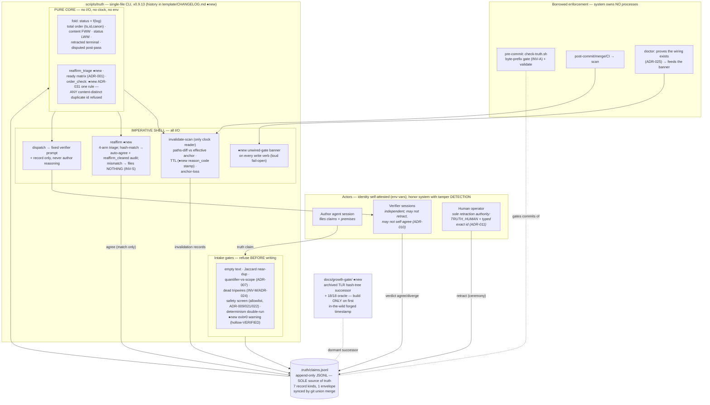
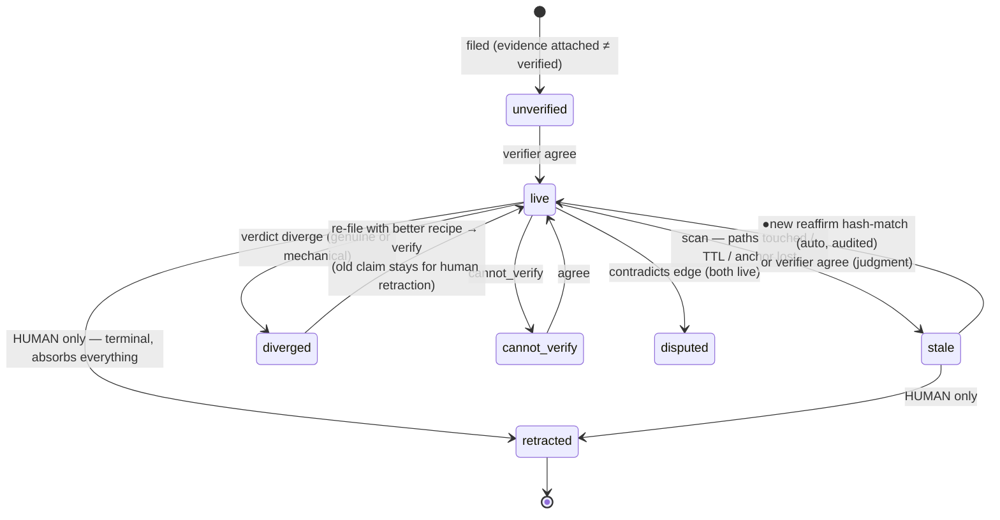
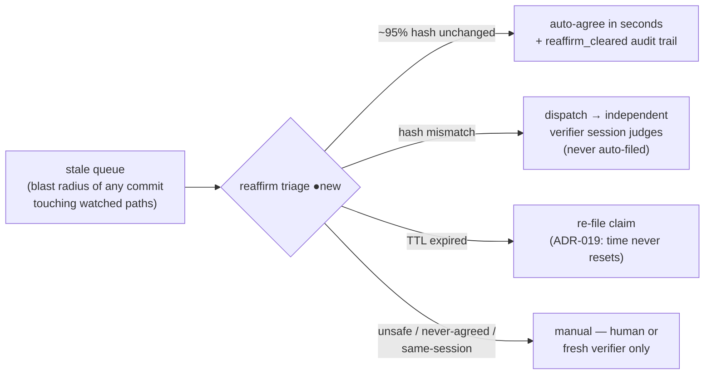

> NOTE: drawn at v0.9.13; v0.9.14 (2026-07-20) added ADR-032 scope-override decay and ADR-033 override-velocity stats on top — additive only, no structural change. See docs/roadmap-v3.md Batch 5.

# Truth Ledger — As-Built Architecture (v0.9.13)

Current, post-roadmap state. Everything shipped this session was **additive**
(marked ●new); no structural reorganization — twice adversarially confirmed
as correct for the regime (one machine · one operator · git-synced ·
Python-stdlib only · zero owned processes · compliant-agent threat model).

---

## 1. The system, one view

---

## 2. Claim lifecycle (unchanged core + the new mechanical path)

---

## 3. Verification economics — the one operational change that matters

First production run (2026-07-20): 44 stale → 42 auto-reaffirmed, 2 mechanical
divergences (recipes broke, facts held — re-filed + independently verified),
1 manual (operator item R9). Zero genuine falsifications.

---

## What was deliberately NOT changed (settled by two adversarial rounds)

Wall-clock `(ts,id,canon)` ordering · no hash chain / no signatures (growth-gated) ·
string screen not sandbox · 8 statuses (minimal policy quotient) · work kernel
stays in the log (C3 protection) · hand-written schema mirror (independence) ·
per-gate override flags (no single learnable ritual) · single-file CLI.
Full rationale: `docs/roadmap-v3.md` governing constraints + `docs/growth-gate/README.md`.
