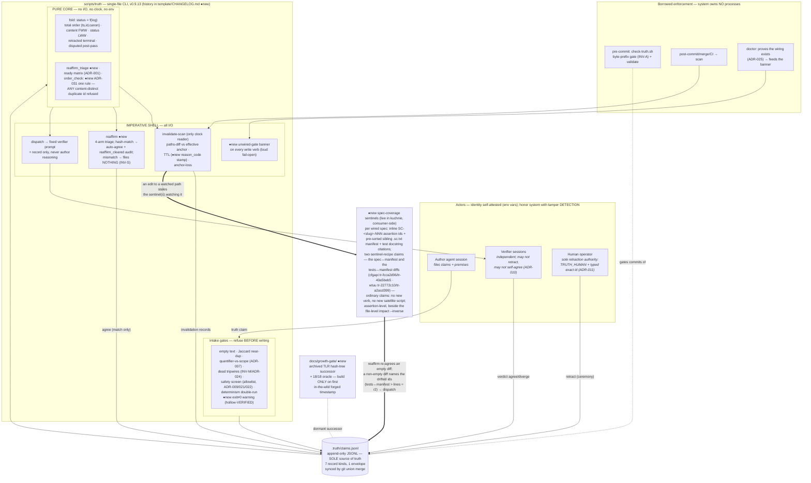
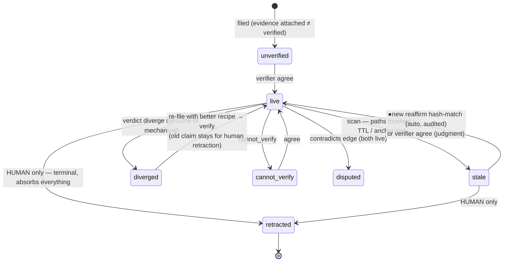
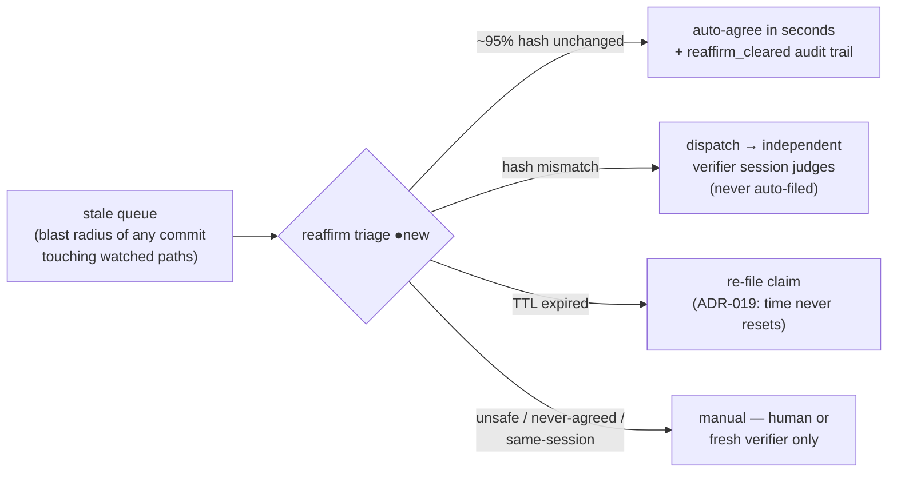

> NOTE: drawn at v0.9.13; v0.9.14 (2026-07-20) added ADR-032 scope-override decay and ADR-033 override-velocity stats on top — additive only, no structural change. See docs/roadmap-v3.md Batch 5. v0.9.15 (2026-07-23) added ISO/IEC/IEEE 42010 concern-tag triage metadata (`--concern` on claim, `list --concern`, stats `concerns` section, schema `$id` v0.11) — additive only, never a gate, fold untouched; plus an invalidate-scan rename-blindness fix (`git mv` of a watched path now stales its watchers). 2026-07-26: spec-coverage manifests pilot live in a consumer repo (docs/growth-gate/spec-coverage-manifests.md) — per-spec assertion ids + sibling manifest watched by two sentinel-recipe claims riding the existing scan→reaffirm→dispatch loop; drawn below ●new, additive only, no CLI change; v0.9.16 (2026-07-27) docs-only: V&V sections + oracle-recipes appendix in the archetype blanks and field guide, verifier-prompt attestation note — no architectural change. v0.9.17 (2026-07-28) docs-only: tail-variation filing rule in the machinery doc; consumer side 2026-07-27: second wired spec-coverage spec (wtuu) + first two executed ADR-014 acceptance oracles — no CLI change. v0.9.18 (2026-07-29) docs-only: machinery ADRs namespaced to docs/adr/truth/ (consumer number-collision fix) + filing-hygiene rules promoted into the machinery doc — no CLI change. v0.9.19 (2026-07-29) docs-only: the authoring loop (implementing worker / adversarial reviewer / orchestrator / verifiers, with its two mandatory triggers) codified beside the filing-hygiene rules — no CLI change. v0.9.20 (2026-07-31) ADR-034 gate system (R0 of the gates adoption, docs/reviews/gates-2026-07/): intake re-plumbed into a staged gate table (screen/double-run stay execution-boundary per ADR-029), post-append notices fold into one `truth: advisory:` block mirrored as `advisories[]` under --json, stats folds once, `.truth/accept-allow` joins copier _skip_if_exists — additive re-plumb, refusal semantics byte-identical, fold untouched. v0.9.21 (2026-07-31) ADR-035 positive-claim exit gate: the first post-execution row of the gate table — positive sentence (no NEGATION_TOKENS hit) + non-zero recorded evidence exit is refused at intake; `--evidence-exit-ok` stores `evidence_exit_basis` (schema `$id` v0.12), counted in the override report beside a new hollow-warned counter (the REFUSED class deliberately has no counter — a refusal appends nothing to fold); canary FAULT X (8 arms) — fold untouched. v0.9.22 (2026-07-31) ADR-036 tombstone citation gate: `verdict retracted` / `done --cancel` refuse with exit 6 while `.truth/citation-scope`-covered files (default `docs/specs/**`) cite the id — bare repo-root `git grep`, core-side `match_paths` filtering (SI-1/SI-2), ledger structurally excluded; `--orphan-ok` stores `orphan_basis` (schema `$id` v0.13, counted); new read-only `truth citations` preflight; canary FAULT TG (11 arms) — fold untouched.

# Truth Ledger — As-Built Architecture (v0.9.13)

Current, post-roadmap state. Everything shipped this session was **additive**
(marked ●new); no structural reorganization — twice adversarially confirmed
as correct for the regime (one machine · one operator · git-synced ·
Python-stdlib only · zero owned processes · compliant-agent threat model).

---

## 1. The system, one view

```mermaid
flowchart TB
  subgraph ACTORS["Actors — identity self-attested (env vars); honor system with tamper DETECTION"]
    AA["Author agent session<br/><i>files claims + premises</i>"]
    VS["Verifier sessions<br/><i>independent; may not retract,<br/>may not self-agree (ADR-010)</i>"]
    HU["Human operator<br/><i>sole retraction authority:<br/>TRUTH_HUMAN + typed exact id (ADR-011)</i>"]
  end

  subgraph CLI["scripts/truth — single-file CLI, v0.9.13 (history in template/CHANGELOG.md ●new)"]
    direction TB
    subgraph GATES["Intake gates — refuse BEFORE writing"]
      G["empty text · Jaccard near-dup ·<br/>quantifier-vs-scope (ADR-007) ·<br/>dead tripwires (INV-M/ADR-024) ·<br/>safety screen (allowlist, ADR-009/021/022) ·<br/>determinism double-run<br/>●new exit≠0 warning (hollow-VERIFIED)"]
    end
    subgraph CORE["PURE CORE — no I/O, no clock, no env"]
      F["fold: status = f(log)<br/>total order (ts,id,canon) ·<br/>content FWW · status LWW ·<br/>retracted terminal · disputed post-pass"]
      T["reaffirm_triage ●new ·<br/>ready matrix (ADR-001) ·<br/>order_check: ●new ADR-031 one rule —<br/>ANY content-distinct duplicate id refused"]
    end
    subgraph SHELL["IMPERATIVE SHELL — all I/O"]
      SC["invalidate-scan (only clock reader)<br/>paths-diff vs effective anchor ·<br/>TTL (●new reason_code stamp) ·<br/>anchor-loss"]
      RA["reaffirm ●new<br/>4-arm triage; hash-match →<br/>auto-agree + reaffirm_cleared audit;<br/>mismatch → files NOTHING (INV-S)"]
      DI["dispatch → fixed verifier prompt<br/>+ record only, never author reasoning"]
      BA["●new unwired-gate banner<br/>on every write verb (loud fail-open)"]
    end
  end

  LEDGER[(".truth/claims.jsonl<br/>append-only JSONL — SOLE source of truth<br/>7 record kinds, 1 envelope<br/>synced by git union merge")]

  subgraph HOST["Borrowed enforcement — system owns NO processes"]
    PC["pre-commit: check-truth.sh<br/>byte-prefix gate (INV-A) + validate"]
    PM["post-commit/merge/CI → scan"]
    DR["doctor: proves the wiring exists<br/>(ADR-025) → feeds the banner"]
  end

  GG["docs/growth-gate/ ●new<br/>archived TLR hash-tree successor<br/>+ 18/18 oracle — build ONLY on first<br/>in-the-wild forged timestamp"]

  SPCOV["●new spec-coverage sentinels (live in kuchnie, consumer-side)<br/>per wired spec: inline SC-&lt;slug&gt;-NNN assertion ids +<br/>pre-sorted sibling .sc.txt manifest + test docstring citations;<br/>two sentinel-recipe claims — the spec↔manifest and the<br/>tests↔manifest diffs (cfgapi tr-fcca2d96/tr-40a5beb5 ·<br/>wtuu tr-22772c10/tr-a2acd399) —<br/>ordinary claims: no new verb, no new satellite script;<br/>assertion-level, beside the file-level impact --inverse"]

  AA -->|"truth claim"| GATES --> LEDGER
  HU -->|"retract (ceremony)"| LEDGER
  VS -->|"verdict agree/diverge"| LEDGER
  DI --> VS
  LEDGER --> CORE
  CORE --> SC & RA & DI
  SC -->|"invalidation records"| LEDGER
  RA -->|"agree (match only)"| LEDGER
  PC -.gates commits of.- LEDGER
  PM --> SC
  DR --> BA
  GG -.dormant successor.- LEDGER
  SC ==>|"an edit to a watched path stales<br/>the sentinel(s) watching it"| SPCOV
  SPCOV ==>|"reaffirm re-agrees an empty diff;<br/>a non-empty diff names the drifted ids<br/>(tests↔manifest &gt; lines = r2) → dispatch"| LEDGER
```

---

## 2. Claim lifecycle (unchanged core + the new mechanical path)

```mermaid
stateDiagram-v2
    [*] --> unverified : filed (evidence attached ≠ verified)
    unverified --> live : verifier agree
    live --> stale : scan — paths touched / TTL / anchor lost
    live --> diverged : verdict diverge (genuine or mechanical)
    live --> cannot_verify : cannot_verify
    live --> disputed : contradicts edge (both live)
    stale --> live : ●new reaffirm hash-match (auto, audited)<br/>or verifier agree (judgment)
    diverged --> live : re-file with better recipe → verify<br/>(old claim stays for human retraction)
    cannot_verify --> live : agree
    live --> retracted : HUMAN only — terminal, absorbs everything
    stale --> retracted : HUMAN only
    retracted --> [*]
```

---

## 3. Verification economics — the one operational change that matters

```mermaid
flowchart LR
  Q["stale queue<br/>(blast radius of any commit<br/>touching watched paths)"] --> TR{"reaffirm triage ●new"}
  TR -->|"~95% hash unchanged"| M["auto-agree in seconds<br/>+ reaffirm_cleared audit trail"]
  TR -->|"hash mismatch"| D["dispatch → independent<br/>verifier session judges<br/>(never auto-filed)"]
  TR -->|"TTL expired"| RF["re-file claim<br/>(ADR-019: time never resets)"]
  TR -->|"unsafe / never-agreed /<br/>same-session"| MA["manual — human or<br/>fresh verifier only"]
```

First production run (2026-07-20): 44 stale → 42 auto-reaffirmed, 2 mechanical
divergences (recipes broke, facts held — re-filed + independently verified),
1 manual (operator item R9). Zero genuine falsifications.

---

## What was deliberately NOT changed (settled by two adversarial rounds)

Wall-clock `(ts,id,canon)` ordering · no hash chain / no signatures (growth-gated) ·
string screen not sandbox · 8 statuses (minimal policy quotient) · work kernel
stays in the log (C3 protection) · hand-written schema mirror (independence) ·
per-gate override flags (no single learnable ritual) · single-file CLI.
Full rationale: `docs/roadmap-v3.md` governing constraints + `docs/growth-gate/README.md`.
