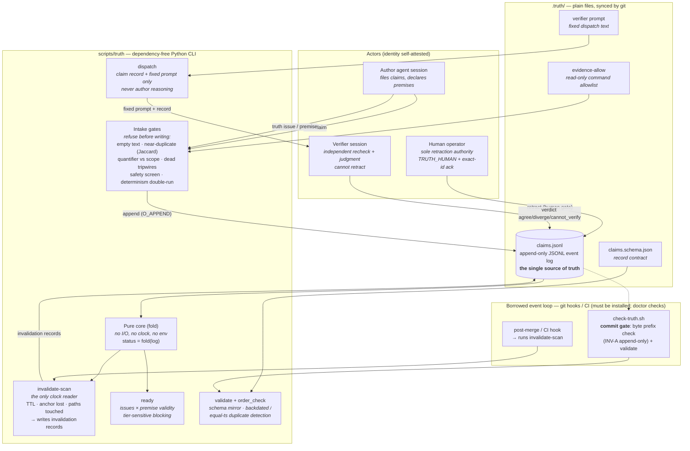
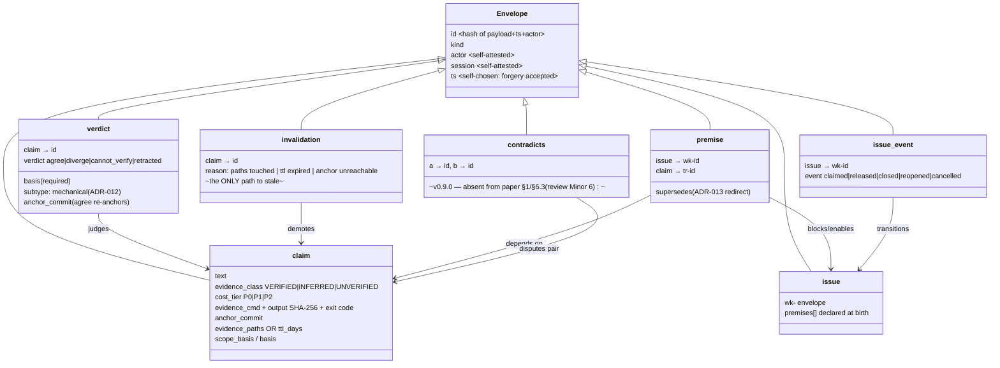
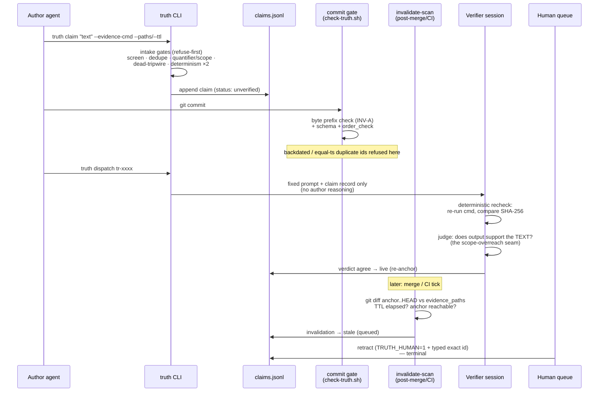
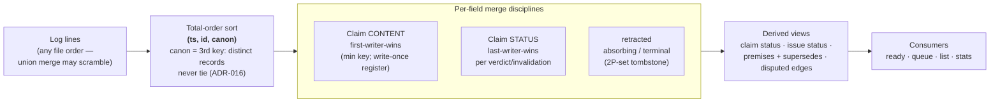
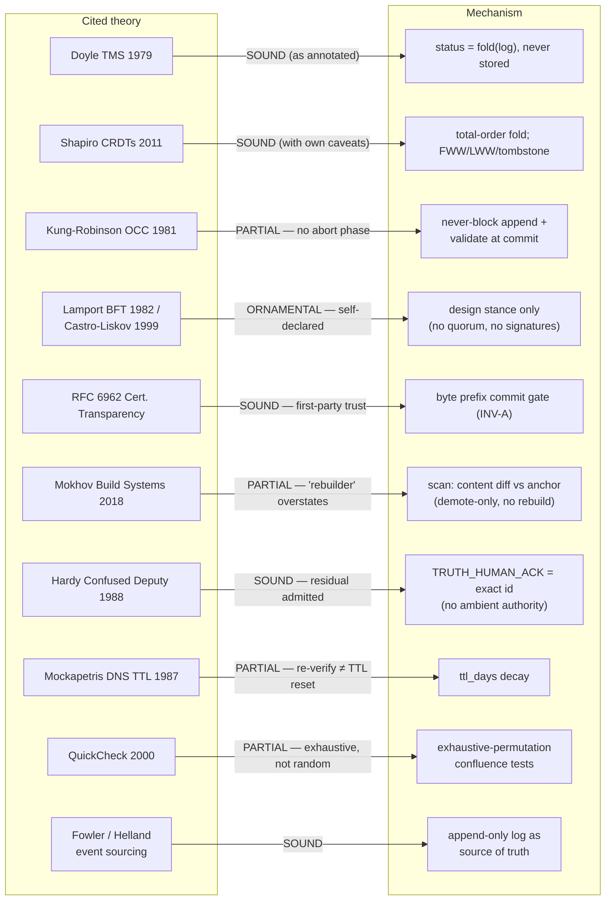

# Truth Ledger — Concept Map

Six views of the system: components, data model, status machine, lifecycle,
fold semantics, and the theory-to-mechanism map (annotated with the
novelty-review verdicts).

---

## 1. Components & responsibilities

Who does what. The system owns no process — all reactivity is borrowed from
git hooks / CI ("the borrowed event loop").



---

## 2. Record kinds (the data model)

Six-plus-one kinds share one envelope; everything else is derived, never stored.



---

## 3. Claim status machine (derived, never stored)

Recoverable vs terminal is the core asymmetry: machine judgments can be
revisited; only a human retraction is a dead end.

```mermaid
stateDiagram-v2
    [*] --> unverified : claim filed (any class —<br/>evidence at filing ≠ verification)
    unverified --> live : verdict agree
    live --> diverged : verdict diverge<br/>(genuine or --mechanical)
    live --> cannot_verify : verdict cannot_verify
    live --> stale : invalidation record<br/>(paths / TTL / anchor lost)
    unverified --> stale : invalidation record
    live --> disputed : contradicts edge fires<br/>(both sides live)
    diverged --> live : agree (recoverable)
    cannot_verify --> live : agree (recoverable)
    stale --> live : agree — re-anchors<br/>⚠ TTL claims re-stale next scan<br/>(review Major 2)
    unverified --> retracted : human retraction
    live --> retracted : human retraction
    diverged --> retracted : human retraction
    stale --> retracted : human retraction
    retracted --> [*] : TERMINAL — absorbs all later events<br/>(2P-set tombstone; readiness release<br/>also human-gated, ADR-017)
```

Readiness policy (`truth ready`) reads this machine per premise:
`live` passes · `unverified` warns · `cannot_verify` blocks P0 only ·
`stale` / `diverged` / `retracted` / missing always block.

---

## 4. Claim lifecycle (sequence)



---

## 5. Fold semantics (how status is derived)



Confluence: any permutation of the same event set folds to one state
(exhaustive-permutation tested; 166/166 seeded faults green).
The real CRDT is the grow-only set of log lines under git union merge;
the fold is a deterministic query over it.

---

## 6. Theory → mechanism map (with review verdicts)



Uncited nearest kin (review Major 1): Dynamic Safety Cases (2015),
Kelly & McDermid (1999), TUF `expires`, in-toto capsules,
Swimm / Dosu / Fiberplane doc-freshness, Panthaplackel JIT comment
invalidation (2021). The novelty is the **composition**, not any element.
