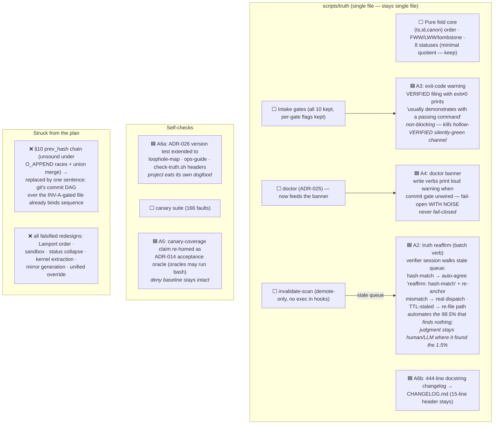
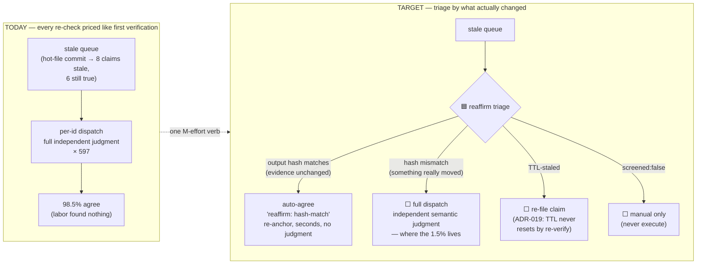
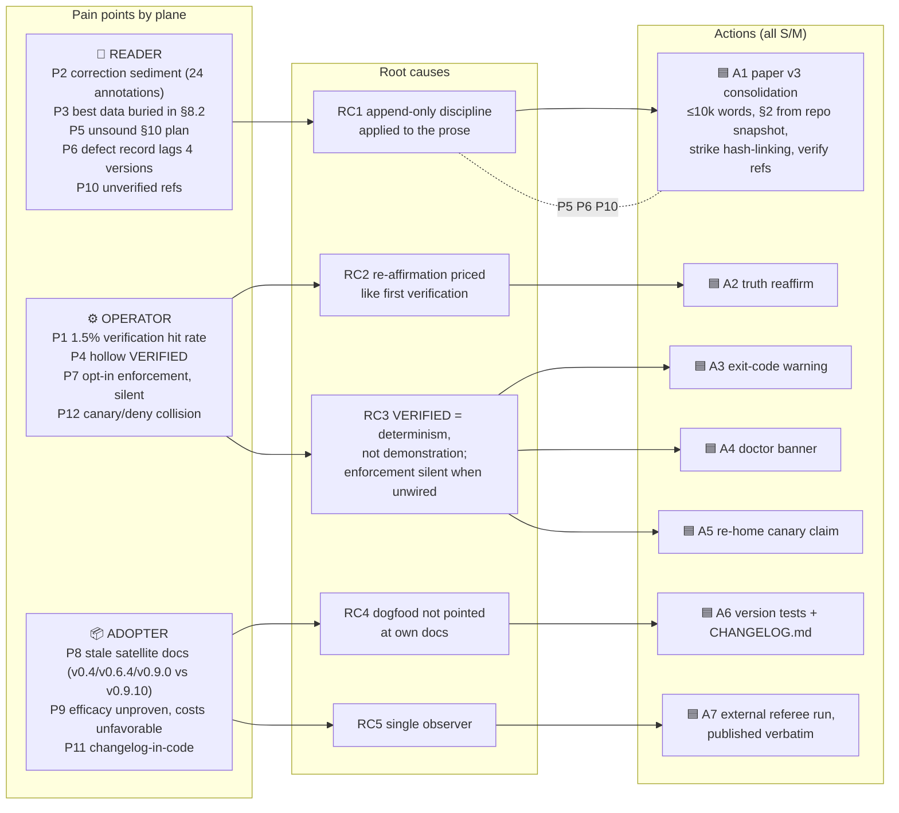
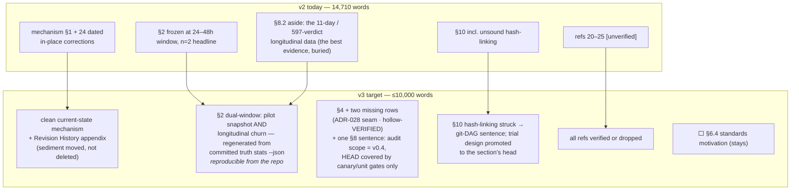
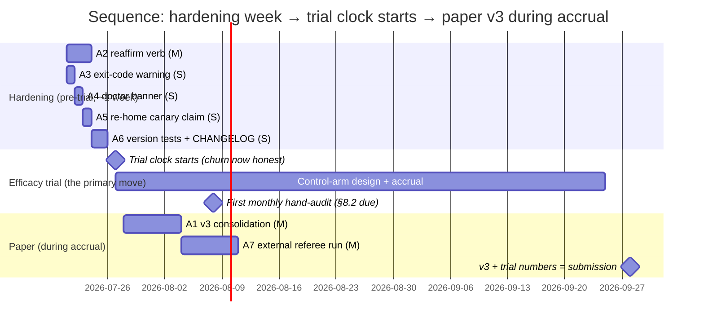

> STATUS: historical session artifact (2026-07-20). The antipattern/redesign content here was subsequently ADJUDICATED — most structural fixes were falsified by red-team review; see docs/roadmap-v3.md (do-not-do list) and docs/growth-gate/ for the settled outcomes. Kept for the reasoning record.

# Truth Ledger — Target Design (post-peer-review)

The expected design after the remediation plan. Marking convention:
🟦 **NEW** (the seven actions) · ⬜ unchanged — settled correct, do not touch ·
❌ removed / struck · every 🟦 is S/M effort; nothing large by design.

---

## 1. Target architecture — the deltas in context

---

## 2. Verification economics — the pipeline before → after

The measured problem: 597 agrees vs 9 diverges (1.5% hit rate), half-life
0.02 days, ~9.5 agrees/claim. The fix reprices re-affirmation without
touching first-verification independence.

---

## 3. Three planes → root causes → actions

---

## 4. Paper v3 — target structure

---

## 5. Roadmap — sequenced, trial-first logic

**Why this order** (the review's core argument): running the trial today
divides benefit by a churn cost with a known one-week fix — guaranteeing
an unfavorable, unrepresentative denominator. Land A2–A4 first, *then*
start the clock; consolidate the paper while data accrues; submit with
the trial's number as the new headline. Both alternative orderings
terminate in the trial anyway — polish tops out at an experience report
(§7 disclaims the central claim), and deeper hardening is a proven trap
(every large mechanism on the do-not-do list).

