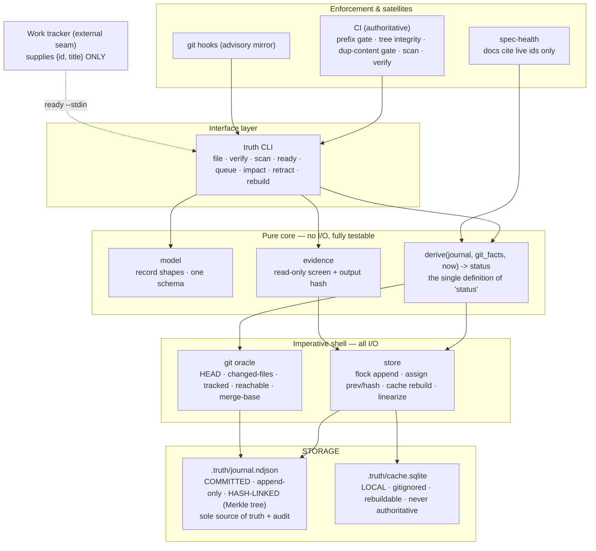
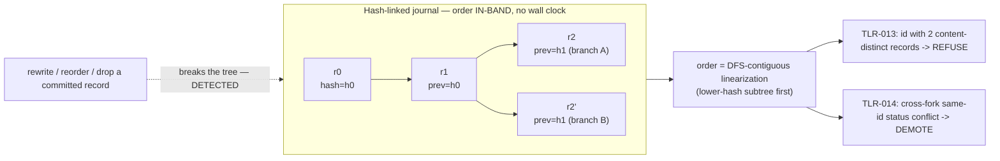
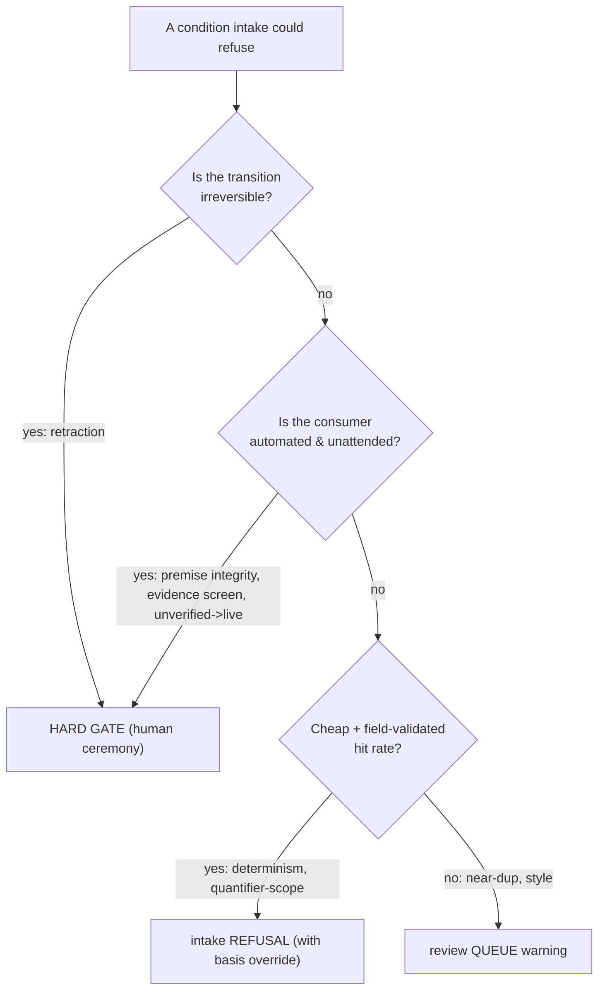

# Truth Ledger — Target Architecture & ADRs (post-adversarial-review, rev 2)

> Incorporates two adversarial review rounds. Round 1 replaced git-topo
> ordering with a hash-linked journal. Round 2 confirmed that hash-linked
> ordering, as first drafted, still shipped the C1 content-substitution
> attack (grindable fork tiebreak) and left merge reconciliation
> unimplementable. This revision names the journal what it actually is —
> a Merkle TREE — and adds the integrity gates the ordering primitive
> alone does not provide (TLR-013, TLR-014), plus the Round-2 fixes to
> TLR-001/003/004/005/008/009.

## The eight problems the system must still solve

1. Provenance  2. Mechanical invalidation  3. Anti-rot via citation
4. Independent verification  5. Work-readiness join  6. Concurrency safety
7. Retraction terminality  8. Deferred-execution safety

## Components & responsibilities



| Component | Single responsibility | Must NOT |
|---|---|---|
| journal | Hold the immutable, hash-linked event tree; sole authority on history | Store derived status; depend on git DAG for order |
| cache | Fast queries; rebuildable | Be authoritative; hold state the journal doesn't |
| derive() | The one definition of status | Do I/O; read a clock other than passed-in `now` |
| evidence | Keep re-executed commands read-only; produce capsules | Execute anything unscreened |
| store | Serialize writers (flock); assign prev/hash; linearize+rebuild | Compute status; rewrite committed lines |
| git oracle | Only git-talking component; feed derive() git-facts | Decide status |
| CLI | Orchestrate core + shell into verbs | Contain fold logic |
| review queue | Surface recoverable issues | Gate irreversible/automated transitions |
| CI | Authoritative enforcement | — |

## Ordering mechanism (hash-linked Merkle tree)



Forks are permanent (every branch/worktree that appends creates one). `prev`
is inside the hash preimage, so the structure is tamper-evident from the
file alone. Order is a pure function of the record SET (confluent for
free), but the tiebreak alone does not decide *content* safely — that is
TLR-013's and TLR-014's job.

## Collaboration — file, verify, scan

```mermaid
sequenceDiagram
  actor Author
  participant CLI
  participant Ev as evidence
  participant Git as git oracle
  participant St as store (flock)
  participant Dsp as verifier session
  participant CI

  Author->>CLI: truth file "text" --cmd --paths
  CLI->>Ev: screen(--cmd)  %% HARD GATE
  Ev-->>CLI: ok / refuse
  CLI->>Git: anchor=HEAD; paths tracked?
  CLI->>Ev: run --cmd, hash output
  CLI->>St: append(claim, prev=canonical-last tip, hash) under flock
  St-->>Author: tr-xxxx (unverified)

  Note over Dsp: SEPARATE session; author-session agree is REFUSED (TLR-004)
  Dsp->>CLI: truth verify tr-xxxx
  CLI->>Ev: screen+recheck --cmd
  CLI->>St: append(verdict agree/diverge)

  CI->>Git: changed-files since each anchor (via merge-base)
  CI->>CLI: derive -> touched/TTL -> stale; verify tree + dup-content
  CI->>St: append(invalidation events); rebuild cache
```

## Gate-vs-queue decision rule



## Contracts

- Record envelope: `{id, kind, actor, session, payload, prev, hash}`; `prev` is inside the `hash` preimage; `ts` is metadata only, never an ordering key.
- Journal invariants: (I1) committed file is an append-only line-prefix extension of its FIRST parent; (I2) tree integrity — every `prev` resolves, no committed line reordered/dropped; (I3) the first record for an id (in canonical order) fixes its content, keyed on `content_hash`, and any id bearing two records of differing `content_hash` is refused (TLR-013). **Two hashes exist:** `record_hash` (includes `prev`) drives tree links, tamper-evidence, and the fork tiebreak; `content_hash` (payload only, EXCLUDES `prev` and envelope) drives first-wins identity and TLR-013 dedup — so a content-identical re-file on a different `prev` is NOT a violation.
- Cache invariant: cache = pure function of journal; freshness stamp = SHA-256 of the **working-tree journal file contents** (+ HEAD for git-facts), checked on every read; mismatch ⇒ rebuild.
- derive() signature: `(records, git_facts, now) -> {id -> status}`; pure, deterministic, total.
- Canonical order (NORMATIVE): DFS-contiguous linearization of the Merkle tree — at each fork emit the whole subtree under the child of lower `record_hash` before its sibling; order-contested same-id events demote (TLR-014). Frontier-interleaved linearization is non-conforming even though also confluent.
- Enforcement authority: CI authoritative; hooks advisory; no local hook is a security boundary.
- Mutable-state rule: review acknowledgments are journal events; corrections are refile+supersede — never cache writes, never in-place content edits.

---

# ADRs (namespace TLR- — disjoint from the existing NNN series)

## TLR-001 — Snapshot cache; journal is the sole source of truth
Status: Proposed. Date: 2026-07-20.
Context: event-replay-per-query hits a perf cliff and forces immutability
tricks. Decision: the committed hash-linked `journal.ndjson` is
authoritative and the audit trail; a local, gitignored cache answers all
queries and is rebuilt on mismatch. The freshness stamp is the SHA-256 of
the **working-tree journal file contents** (plus HEAD for git-derived
facts) — NOT the git blob at HEAD, or a `truth file` append followed by
`truth ready` in the same uncommitted session reads a stale snapshot
(Round-2 F5). The cache is never committed, never authoritative.
Non-goals: no binary state in git; no state in the cache absent from the
journal. Falsifier: any query answered from a cache that disagrees with a
fresh derive(working-tree journal).

## TLR-002 — Hash-linked append ordering; retire wall-clock and git-topo
Status: Proposed (revised Round 2). Date: 2026-07-20. Supersedes the
ordering role of the canonical-timestamp profile.
Context: wall-clock (ts,id) ordering is forgeable and spawned the whole
backdating-defense family; git-topo ordering merely relocates the forgery
into git committer date and is undefined under union merge.
Decision: every record carries `prev` (hash of the record it was appended
after) and its own `hash`, and **`prev` is inside the hash preimage**
(without it the link is unauthenticated and adds nothing over the INV-A
prefix gate). The journal is therefore a Merkle **tree**, not a linear
chain: every branch/worktree fork produces records sharing a `prev`, and
merges leave that fork permanent. Canonical order is a deterministic
function of the record SET — **DFS-contiguous**: at each fork emit the
whole subtree under the lower-`record_hash` child before the other (this
DFS rule is NORMATIVE — frontier-interleaved is also confluent but derives
different statuses and is non-conforming). Two hashes: `record_hash`
(includes `prev`) drives tree links, tamper-evidence, and the tiebreak;
`content_hash` (payload only, excludes `prev`) drives first-wins identity
and TLR-013. Order being a pure
set-function, it is confluent for free (every merge direction, 3-way, and
octopus merge yield the same set, hence the same order — the ADR-016a
theorem, verified un-falsifiable in Round 2). `ts` is metadata, never an
ordering key.
**Reconciliation writes nothing.** "Re-threading"/linearization is
derive-time only; it never rewrites `prev`/`hash` on committed lines
(doing so would violate I1). New appends set `prev` = the canonical-last
tip. Cherry-pick and partial-staging (`git add -p`) of the journal are
UNSUPPORTED — they orphan `prev`, I2 refuses them by design; documented
as banned operations.
Two integrity properties this order alone does NOT provide, delegated to
their own ADRs: content substitution at a fork via a grindable tiebreak →
TLR-013; status flip from arbitrary cross-fork event order → TLR-014.
Consequences: order is in-band — survives shallow clone, and survives
export/fire without the repo (the axis on which this beats plain
file-order); reorder/drop of a committed line breaks the tree visibly.
Non-goals: not authorship authentication (identity self-attested); the
tree authenticates SEQUENCE and CONTENT, not WHO.
Falsifier: two merge directions of one record set deriving different
status; or a reordered/dropped committed record passing tree-integrity.

## TLR-003 — flock single-writer + explicit worktree/merge policy
Status: Proposed (revised Round 2). Date: 2026-07-20.
Context: CRDT machinery served a multi-machine regime that does not
exist, but worktrees/branches are real. Decision: one working checkout
per machine; sessions share it; appends serialized by flock.
Branches/worktrees are supported; `.gitattributes merge=union` is
retained so merges never conflict on the journal, and reconciliation is
**derive-time linearization only (TLR-002) — it writes nothing to the
journal**, so no reconciliation step can violate the append-only
invariant. `truth rebuild` after a merge simply re-derives from the
merged record set. Non-goals: no NFS/bind-mount lock guarantees
(documented out-of-regime; a host session plus a bind-mounted container
session can interleave — one-checkout rule mitigates). Falsifier: an
interleaved append corrupting a line under flock on a local filesystem.

## TLR-004 — Review queue for recoverable issues; hard gates only where warranted
Status: Proposed (revised Round 2). Date: 2026-07-20.
Context: self-attested gate ceremony was theater, but blanket removal
broke irreversible/automated protections. Decision: apply the
gate-vs-queue rule — hard gate iff the transition is irreversible OR its
consumer is automated/unattended; else a queue warning; two cheap
field-validated conditions stay as intake refusals. Every record logs
actor+session. **By this rule's own output, unverified->live has an
automated unattended consumer (`ready`, CI), so it is a HARD GATE, not a
flag:** `verify <id> agree` is refused when the filing session equals the
claim's session (rare-legitimate case takes a visible, self-attested
override); self-`diverge`/`cannot_verify` stay allowed as they run
against interest. This reinstates the ADR-010 refusal the Round-1
"theater" critique wrongly discarded (Round-2 F6). Falsifier: an
irreversible or automated-consumer transition protected only by a flag no
machine reads before acting.

## TLR-005 — Premise integrity stays in the journal; tracker seam is {id,title} only
Status: Proposed. Date: 2026-07-20.
Context: moving the premise edge to an unaudited side file reopens the F7
premise-stripping hole. Decision: `premise` and `supersede` remain
first-wins journal records governed by the existing supersede rules — and
"existing supersede rules" explicitly INCLUDES ADR-017's human gate on
superseding a *retracted* premise; without it the human veto leaks back
at the readiness layer (Round-2, Job 1). The external tracker contributes
only work identity and title. Falsifier: a HELD work item released by any
mutation outside the journal.

## TLR-006 — Retraction is a hard, human-gated, terminal transition
Status: Proposed. Date: 2026-07-20. Amends the retraction ceremony.
Context: terminality plus a post-hoc queue is inconsistent — a kill
cannot be undone after the fact, and downstream consumers are machines.
Decision: retraction keeps one honest human ceremony (TTY/ACK), remains
terminal in derivation, and is the ONLY verb that keeps a ceremony.
Non-goals: not identity; drift protection on the one irreversible act.
Falsifier: a terminal retraction minted by an unattended agent with no
ceremony.

## TLR-007 — Restore spec-health (citation checker)
Status: Proposed. Date: 2026-07-20.
Context: anti-rot via citation (problem 3) was dropped by omission.
Decision: re-adopt the sweep that judges every doc-cited tr-/wk- id by
the readiness matrix; orthogonal to TLR-001..006. Falsifier: a
post-convention doc citing a dead id that no sweep flags.

## TLR-008 — Effective-anchor recomputed in derivation
Status: Proposed (revised Round 2). Date: 2026-07-20.
Context: dropping effective-anchor causes re-verified claims to flap
stale forever (dominant operating cost). Decision: the effective anchor is a PURE function computed in derive() (=
the commit of the latest `agree`); the path-diff against it is git I/O and
lives in `scan` (shell), NOT in derive() — this split preserves derive()'s
no-I/O contract, which TLR-008 would otherwise collide with. On `agree`,
derive() advances the effective anchor; `scan` diffs effective-anchor→HEAD
and appends invalidations. When the effective anchor is not an ancestor of
the current commit (the verifier worked on another branch), diff via the
**merge-base**. Falsifier: a re-verified claim re-staling with no new
change to a watched path.

## TLR-009 — Review acknowledgments are journal events; corrections are refile+supersede
Status: Proposed (revised Round 2). Date: 2026-07-20.
Context: acks had no durable home (cache is throwaway); and a "correction
that edits content in place" both collides with I3/TLR-013 (it is a
content-distinct same-id record) and rebinds an old `agree` to text no
verifier judged (Round-2 F4). Decision: add a `review` record kind
carrying ONLY acknowledgments/dismissals of queue items, each referencing
the flagged record **by its record hash** (never a rebuild-assigned index
— that renumbers on rebuild and resurrects cleared flags, this ADR's own
falsifier). Corrections of a wrong fact stay the existing discipline:
refile under a new id + `supersede`. Rebuild replays `review` events, so
cleared flags stay cleared. Falsifier: a rebuild that loses an ack or
resurrects a dismissed flag; or an in-place content edit wearing a prior
verdict's status.

## TLR-010 — Keep determinism and quantifier-scope as intake refusals; else warn
Status: Proposed. Date: 2026-07-20.
Context: demoting all gates floods the queue that move D makes
load-bearing, and drops the countermeasure to the empirically dominant
failure mode. Decision: determinism double-run and quantifier-scope stay
hard refusals with on-record basis override; near-dup/style become queue
warnings. Falsifier: the dominant scope-overreach failure re-entering the
ledger silently.

## TLR-011 — One evidence-screen implementation carrying the existing corpus
Status: Proposed. Date: 2026-07-20.
Context: the screen is the one real security control; a rewrite risks
losing accumulated lemmas. Decision: single screen module + single
allowlist, importing the shlex-parity, control-char, redirection-
restriction, deny-baseline, and fail-closed rules as the acceptance
corpus. Falsifier: any recheck path executing a command not screened
against the current allowlist.

## TLR-012 — TTL demotion emits a journal event
Status: Proposed. Date: 2026-07-20.
Context: folding TTL purely from `now` makes the journal stop explaining
`stale` and makes baseline <ref> time-dependent. Decision: the scan that
observes TTL expiry appends an `invalidation` event (reason `ttl`), so
every demotion has an in-log cause and derivation stays a function of the
log for committed history. Falsifier: a status transition with no journal
event explaining it.

## TLR-013 — Duplicate-content integrity gate (the second half of ADR-016)
Status: Proposed. Date: 2026-07-20.
Context: TLR-002's content-derived order is confluent, but the fork
tiebreak is lexicographic `record_hash` — an attacker who perturbs any
hash-affecting field (payload whitespace, `actor`/`session`, chosen
`prev`) grinds a forged duplicate-id record's `record_hash` below the
genuine one and wins the first-wins slot, reproducing the C1 substitution
("DROP DATABASE prod" under a live-verdicted id). CONFIRMED reproducible
by the acceptance oracle (it seats the forgery first, then shows this gate
blocks it in all 400 grind positions). The substitution requires one id
bearing two content-DISTINCT records; this gate refuses exactly that, so
it makes the tiebreak IRRELEVANT to content — grinding buys nothing no
matter which record sorts first. A total order
(ADR-016a) alone never sufficed; ADR-016 shipped it WITH a duplicate gate
(016b), and TLR-002 dropped the gate. Decision: tree-integrity
verification (CI-authoritative and at the commit gate — both records are
necessarily visible post-merge, exactly where ADR-016b runs) FAILS on any
id borne by two records of differing `content_hash`. Byte-identical
duplicates AND content-identical re-files on a different `prev` share a
`content_hash` and pass (preserving the legitimate union-merge B2 shape). Consequences: grinding buys nothing; the pair is refused before
first-wins runs. Falsifier: a committed ledger, integrity green, with two
content-distinct records under one id.

## TLR-014 — Order-contested events demote instead of trusting the tiebreak
Status: Proposed. Date: 2026-07-20.
Context: TLR-013 covers duplicate IDs; it does not cover VERDICT
ordering, where last-writer-wins in canonical order decides status. For
honest concurrent writers (a 2pm `agree` on one branch, a 3pm real
`invalidation` on another) the hash-lex tiebreak is a coin flip — worse
than the current (ts,id) order, which approximates causality and lets the
later invalidation win; and a self-interested agent can grind its `agree`
to sort last and force `live`. Decision (predicate, NORMATIVE): a claim is order-contested iff, over ALL
linearizations consistent with the tree's ancestry (the `prev` partial
order) — not merely the two the tiebreak happens to pick — its derived
status is not unique. When contested, do not trust the tiebreak — demote
the claim to `stale` and queue it "order-contested," the system's own
re-check idiom.
Path-based conflicts additionally self-heal: the post-merge scan (TLR-008)
re-diffs from the effective anchor and re-appends a genuine invalidation
if a watched path really changed. Cheap: fires only on same-id cross-fork
event pairs. Falsifier: a same-id cross-fork status divergence resolved
silently by the tiebreak with no queue entry.

## Build order
TLR-002 + TLR-013 + TLR-014 together (the ordering primitive is not safe
without its two integrity gates — ship them as one unit); TLR-001
(storage split); TLR-003 (concurrency); then correctness/safety (005,
006, 008, 009); then policy (004, 010); then satellites/screen (007, 011,
012). Do NOT ship TLR-002 without 013 — it carries the confirmed C1
attack until the duplicate-content gate lands.

## Acceptance oracle
TLR-002/013/014 ship with `test-tlr-fold.py` — a stdlib-only, deterministic
reference implementation + 8 properties (convergence across merge
directions/octopus, anti-grinding across 400 positions, B2 identical-dupe
pass, order-contested demotion, tamper-evidence, cache purity, effective-
anchor durability, retraction terminality), each with a negative-control
canary that reintroduces the guarded bug and proves the property can fail.
It is the executable spec: any implementation (and any reimplementation)
must pass it unchanged.
