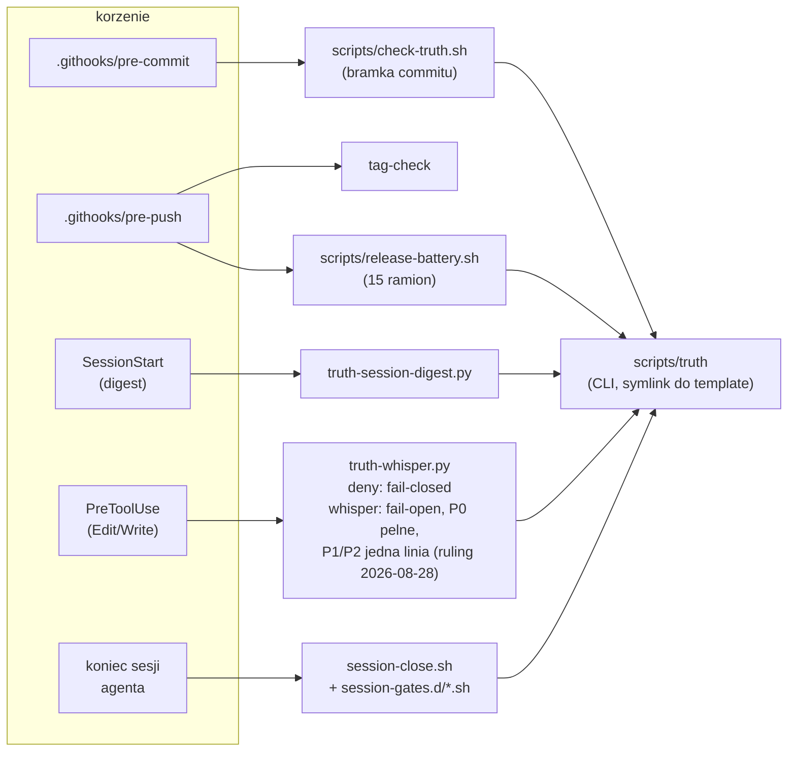
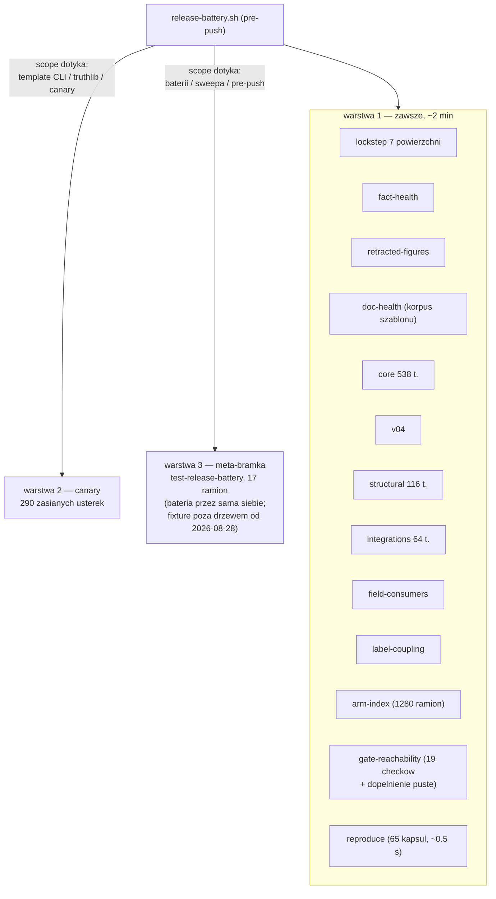
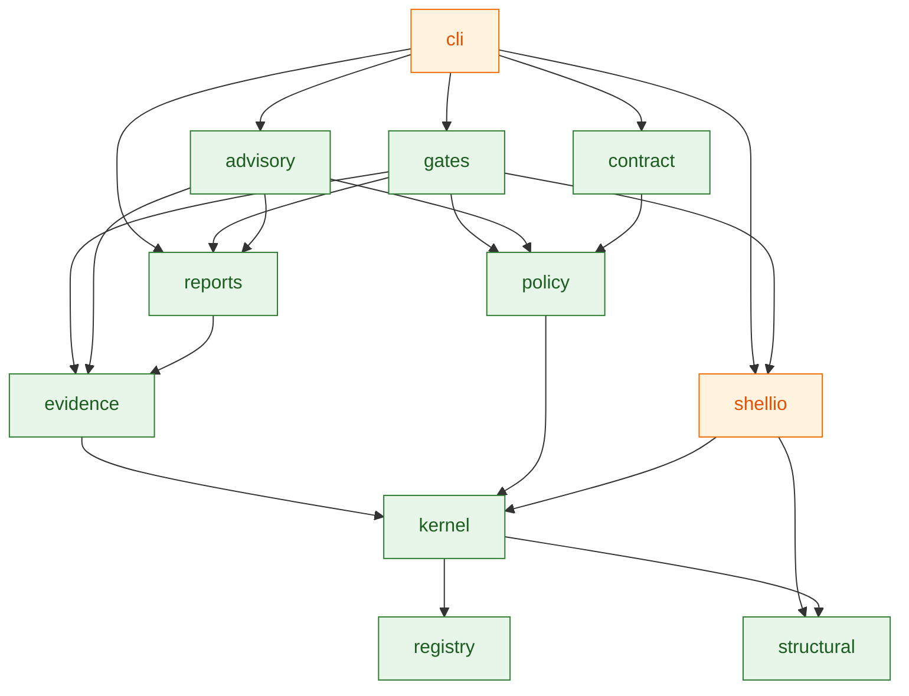
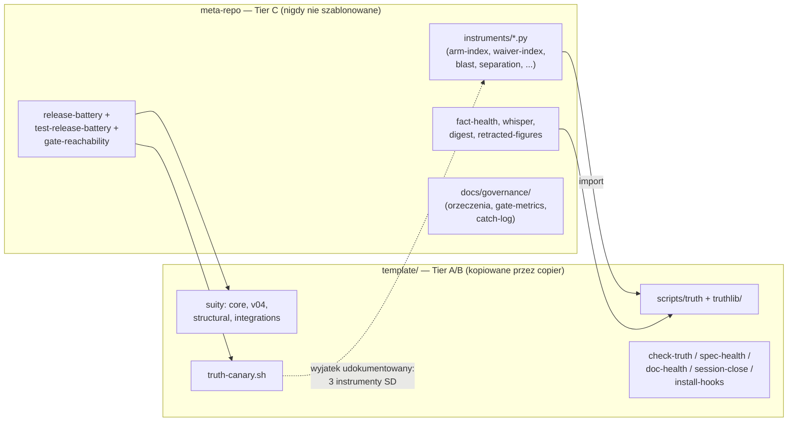
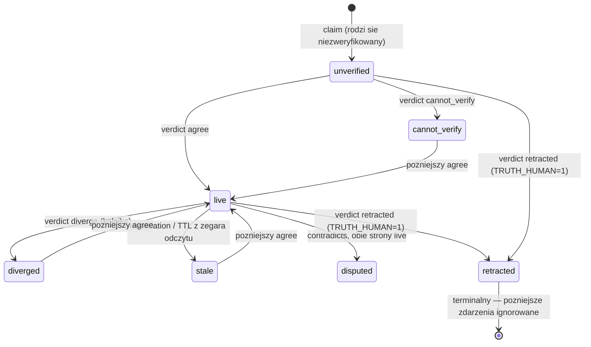

# Maszyneria truth-ledger — rysunki struktury (migawka 2026-08-29)

> Reader: każdy, kto chce zobaczyć całość maszynerii meta-repo pod jednym
> kątem, zanim dotknie kodu | Enables: orientację bez czytania 30 plików;
> wiedzę, które krawędzie są bramkowane mechanicznie, a które tylko
> narysowane | Update-trigger: zmiana wiringu hooków, ramion baterii lub
> granicy tieringu — a przy każdej wątpliwości DRZEWO WYGRYWA z rysunkiem

Ten plik jest RYSUNKIEM, nie rejestrem. Trzy figury poniżej mają
mechanicznych strażników i tam należy sprawdzać stan faktyczny:
osiągalność bramek — `bash scripts/gate-reachability.sh` (dopełnienie
orzekane od `83cd6c2`); układ truthlib — `template/docs/structure.md`
przypięty testem `TestStructureDocMatchesDisk`; skład baterii —
`scripts/release-battery.sh` jest źródłem prawdy o własnych ramionach.
Reszta jest prozą narysowaną z drzewa dnia 2026-08-29.

## 1. Pierścienie obronne i korzenie

Trzy pierścienie o rosnącym zasięgu (commit → push → sesja) plus dwa
hooki harnessu agenta. Wszystkie drogi prowadzą do jednego CLI.

## 2. Bateria push — trzy warstwy, dwa strażniki zakresu

Pomiar 2026-08-28: wariant maksymalny 10:52; zwykly push placi tylko
warstwe 1 (~2 min). Werdykt trzywarstwowy:
`docs/field-notes-2026-08-28-ceremony-cut-session.md`.

## 3. Import-DAG truthlib (functional core / imperative shell)

Zrodlem przypietym testem jest `template/docs/structure.md`. Krawedz
A --> B czytaj "A importuje B". Dla czytelnosci pominieto krawedzie,
ktore kazdy modul i tak ma do `registry`/`kernel` — pelny obraz w
strukturze przypietej.

`shellio` jest jedynym modulem z `subprocess` (pilnuje `TestModulePurity`);
`registry` czystym dnem, `cli` jedynym korzeniem. Fold w `kernel` jest
czysta funkcja — status nigdy nie jest przechowywany.

## 4. Granica tieringu (ADR-046): co jedzie do konsumenta, co zostaje

Kierunek jest czysty w jedna strone: nic z `template/` nie wola meta-strony
(poza narysowanym wyjatkiem canary); meta swobodnie importuje truthlib.

## 5. Cykl zycia claimu (fold, ADR-016/057)

Status jest zawsze projekcja `fold(events, now_dt)` — `stale` z TTL liczy
sie w chwili odczytu (ADR-057), `disputed` jest post-passem po statusach
bazowych, `retracted` absorbuje. Zadnego przechowywanego stanu.
