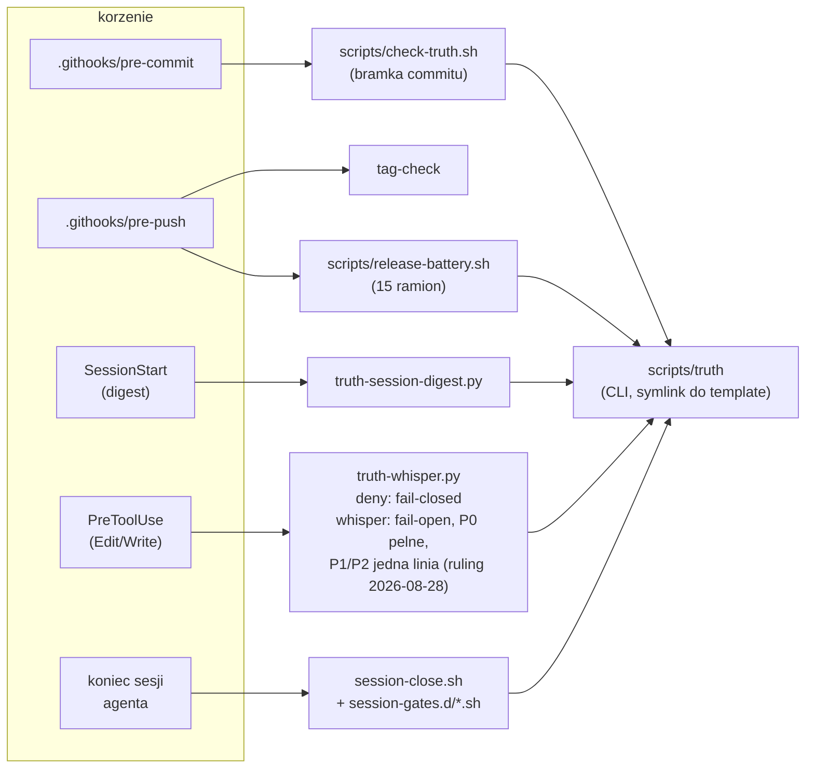
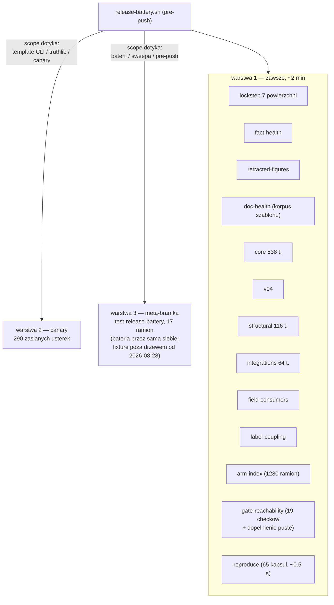
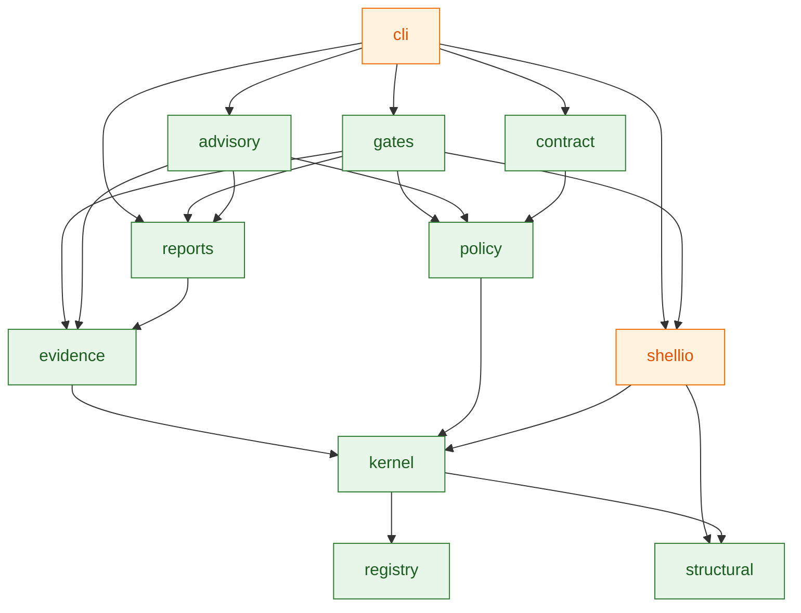
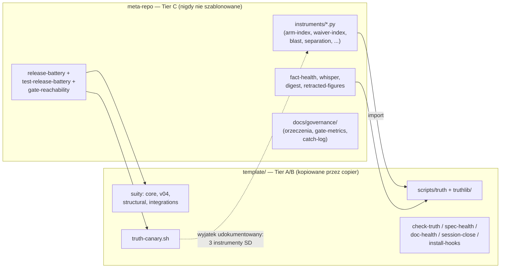
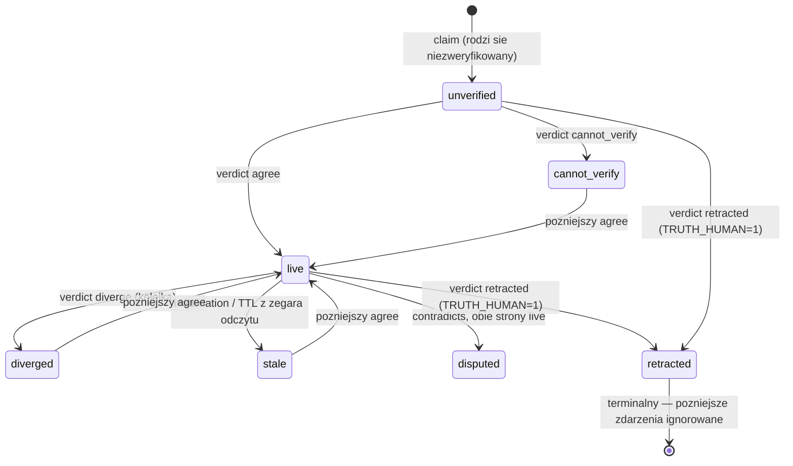

# Maszyneria truth-ledger — rysunki struktury (migawka 2026-08-29)

> Reader: każdy, kto chce zobaczyć całość maszynerii meta-repo pod jednym
> kątem, zanim dotknie kodu | Enables: orientację bez czytania 30 plików;
> wiedzę, które krawędzie są bramkowane mechanicznie, a które tylko
> narysowane | Update-trigger: zmiana wiringu hooków, ramion baterii lub
> granicy tieringu — a przy każdej wątpliwości DRZEWO WYGRYWA z rysunkiem

Ten plik jest RYSUNKIEM, nie rejestrem. Trzy figury poniżej mają
mechanicznych strażników i tam należy sprawdzać stan faktyczny:
osiągalność bramek — `bash scripts/gate-reachability.sh` (dopełnienie
orzekane od `83cd6c2`); układ truthlib — `template/docs/structure.md`
przypięty testem `TestStructureDocMatchesDisk`; skład baterii —
`scripts/release-battery.sh` jest źródłem prawdy o własnych ramionach.
Reszta jest prozą narysowaną z drzewa dnia 2026-08-29.

## 1. Pierścienie obronne i korzenie

Trzy pierścienie o rosnącym zasięgu (commit → push → sesja) plus dwa
hooki harnessu agenta. Wszystkie drogi prowadzą do jednego CLI.

## 2. Bateria push — trzy warstwy, dwa strażniki zakresu

Pomiar 2026-08-28: wariant maksymalny 10:52; zwykly push placi tylko
warstwe 1 (~2 min). Werdykt trzywarstwowy:
`docs/field-notes-2026-08-28-ceremony-cut-session.md`.

## 3. Import-DAG truthlib (functional core / imperative shell)

Zrodlem przypietym testem jest `template/docs/structure.md`. Krawedz
A --> B czytaj "A importuje B". Dla czytelnosci pominieto krawedzie,
ktore kazdy modul i tak ma do `registry`/`kernel` — pelny obraz w
strukturze przypietej.

`shellio` jest jedynym modulem z `subprocess` (pilnuje `TestModulePurity`);
`registry` czystym dnem, `cli` jedynym korzeniem. Fold w `kernel` jest
czysta funkcja — status nigdy nie jest przechowywany.

## 4. Granica tieringu (ADR-046): co jedzie do konsumenta, co zostaje

Kierunek jest czysty w jedna strone: nic z `template/` nie wola meta-strony
(poza narysowanym wyjatkiem canary); meta swobodnie importuje truthlib.

## 5. Cykl zycia claimu (fold, ADR-016/057)

Status jest zawsze projekcja `fold(events, now_dt)` — `stale` z TTL liczy
sie w chwili odczytu (ADR-057), `disputed` jest post-passem po statusach
bazowych, `retracted` absorbuje. Zadnego przechowywanego stanu.

## 6. Slowniczek — co jaki skrypt robi i jaki ma zakres

Pojecia najpierw (definicja "check" z docs/scope.md: wykonywalne, ktore
umie wyjsc niezerowo NA ZNALEZISKO i ktorego kod wyjscia ktos czyta;
co tylko drukuje, jest instrumentem, nie bramka):

- **bramka (gate)** — odmawia dzialania: intake w CLI, hook commitu,
  bateria na push. Fail-closed.
- **instrument** — liczy i raportuje; czyta go czlowiek albo test.
  Sam z siebie niczego nie blokuje.
- **advisory** — drukuje ostrzezenie i przepuszcza (fail-open); nie wolno
  mu za to milczec o wlasnej awarii.
- **bateria** — `scripts/release-battery.sh`: 15 ramion na granicy push.
- **sweep** — przebieg enumerujaco-uzgadniajacy po calej populacji
  (reachability, register-index, waiver-index...), z regula lustra
  w obie strony i orzekanym dopelnieniem.
- **whisper** — hook przed edycja: przewidywanie, ktore claimy obserwuja
  edytowany plik.
- **doctor** — `truth doctor`: samobadanie instalacji (hooki, allowlisty,
  atestacje, discovery, kolejka) — WARN/FAIL o zdrowiu wiringu, nie o
  faktach.
- **canary** — suita zasianych usterek: kazda bramka musi zlapac swoja.
- **fold** — czysta funkcja log→status; jedyne zrodlo prawdy o stanie.

### scripts/ — meta-repo, nieszablonowane (Tier C wykonawcze)

| skrypt | robi | zakres/tryb |
|---|---|---|
| `truth` (symlink) | CLI ledgera: claim/verdict/issue/fold/reproduce/doctor/... | bramka intake + narzedzie |
| `check-truth.sh` | bramka commitu: prefiks/INV-A/validate | pre-commit, fail-closed |
| `release-battery.sh` | 15 ramion na push; 2 ciezkie strzezone zakresem | pre-push, fail-closed |
| `test-release-battery.sh` | meta-bramka: mutuje baterie i patrzy na czerwien (17 ramion) | biegnie, gdy bateria sie zmienia |
| `gate-reachability.sh` | sweep: kazdy check osiagalny z korzenia + dopelnienie puste | ramie baterii; enumeruje sam siebie |
| `fact-health.sh` | zywa proza cytujaca martwe id = FAIL | ramie baterii |
| `retracted-figures.sh` | wycofane liczby nie moga stac w kodzie/polityce | ramie baterii |
| `truth-whisper.py` | PreToolUse: deny fail-closed + szept fail-open (P0 pelny, P1/P2 agregat) | hook harnessu |
| `truth-session-digest.py` | SessionStart: ATTENTION/LIVE do kontekstu sesji | hook, tylko czyta |
| `epistemic-isolate.sh` | przywraca aparature z origin/main przed biegiem osadzajacym (ADR-058) | CIEMNA BRAMKA: nic jej nie wola |
| `mutate.sh` + `mutmut-*` + `mutation-report.py` | testy mutacyjne truthlib | reczne/Makefile, wyspa |

### template/scripts/ — jedzie do konsumenta (Tier A/B)

| skrypt | robi |
|---|---|
| `truth` + `truthlib/` | wlasciwe CLI (meta uzywa go przez symlink) |
| `check-truth.sh` | lustro bramki commitu dla konsumenta |
| `install-hooks.sh` | wpina pre-commit / post-commit / post-merge / pre-merge-commit |
| `session-close.sh` | bramka konca sesji: brudne drzewo, claimed items, spec/doc-health ⇒ exit 1; + `session-gates.d/*.sh` |
| `spec-health.sh` | kazdy spec sadzony po statusie cytowanych id |
| `doc-health.sh` | zdrowie korpusu docs szablonu (linki, naglowki); woła spec-health |
| `truth-canary.sh` | 290 zasianych usterek w sandboksie — akceptacja bramek |
| `test-truth-core.py` | ~538 testow czystego jadra (fold, gates, kontrakty) |
| `test-truth-v04.py` | inwarianty fold/duplikaty (permutacje) |
| `test-structural.py` | selektory i hashowanie kanoniczne |
| `test-integrations.py` | hooki, digest, whisper, instrumenty Tier C (64 testy) |
| `test-adr051-e2e.sh` | refresh-evidence przez realny CLI, koniec-do-konca |
| `adr041-hash-stability.py` | migracja shell→argv nie zmienia hashy kapsul |
| `truth-bd-adapter.sh` | normalizuje `bd ready --json` (Beads) do wejscia `truth ready` |

### instruments/ — meta-repo, tylko czytaja (Tier C)

Wszystkie importuja truthlib i maja `--json`; bramka: TestTierCInstruments
przez baterie (wyjatki nizej nazwane).

| instrument | liczy |
|---|---|
| `arm-index.py` | cenzus ramion testowych (1280) + hashe prozy ADR-060; blokujace ramie baterii |
| `register-index.py` | sweep rejestrow z docs/registers.md, w obie strony |
| `waiver-index.py` | totalna klasyfikacja flag override / nosnikow env |
| `semantic-audit.py` | ekstrakcja zdan-uzasadnien z overrideow; zero sieci |
| `field-consumers.py` | pola payloadu, ktorych NIC nie czyta (ramie baterii) |
| `label-coupling.py` | pary modul–etykieta bez zapisu (ramie baterii) |
| `capsule-blindness.py` | kapsuly klasy fail-open (licza wzorzec, nie swiat; RULING 8) |
| `watch-derivation.py` | czy claim obserwuje to, co jego recepta czyta (J-040 zmech.) |
| `override-velocity.py` | tempo i wolumen overrideow (rejestr gate-metrics) |
| `separation-report.py` | pary autor→weryfikator, latencje agree (ADR-010) |
| `blast-report.py` | szerokosc watchy vs churn; prog advisory ADR-039 |
| `retraction-causes.py` | retrakcje wg `cause` (metryka adopcji ADR-049) |
| `concern-tag.py` | czytnik legacy tagow 42010 |
| `map.py` | klasyfikacja kazdego pliku repo → docs/map.txt; sufit scope.md |
