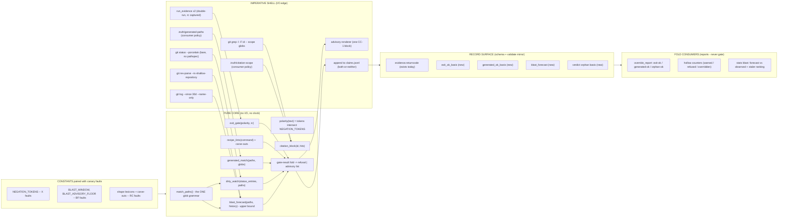
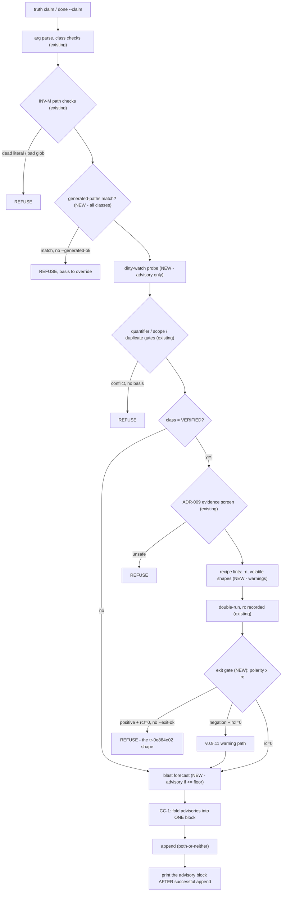
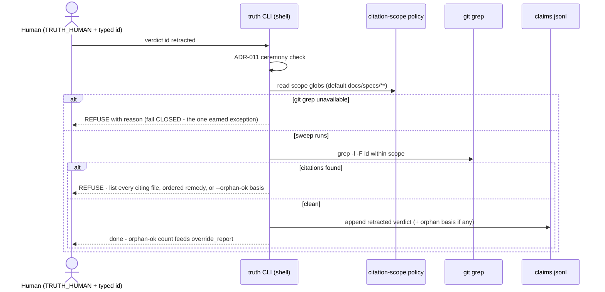
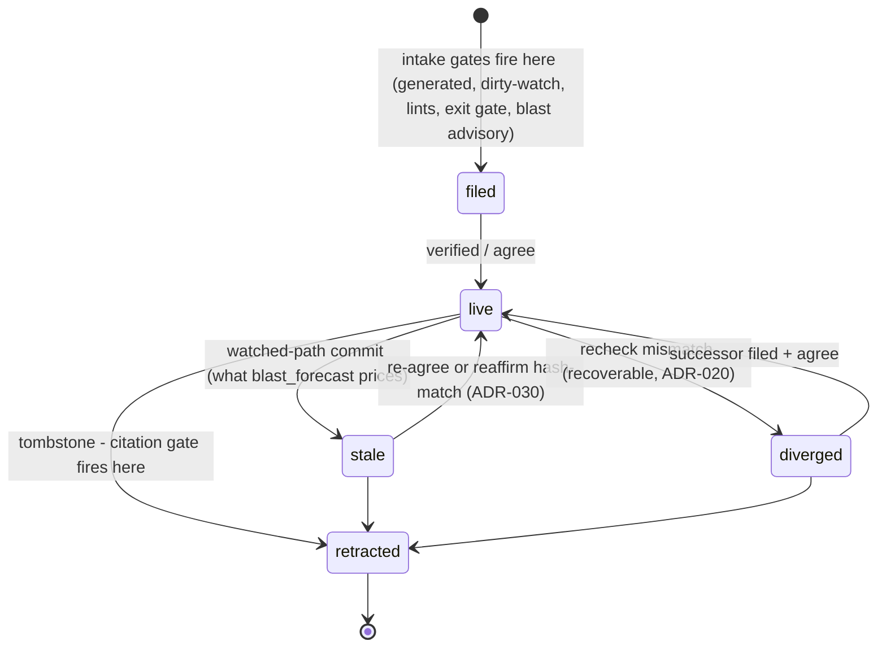

# Architecture view and review — planned intake/tombstone functionality

> Reader: the truth-ledger operator | Scope: the five proposed ADRs
> (rev-2) **with the five rev-3 fixes applied** (BL prefix renamed to
> BF here; dirty-watch via `match_paths()`; tombstone scope as
> consumer policy; floor owned as uncalibrated) | Role: software
> architect — static + dynamic views first, then a review in three
> separate cuts: antipatterns, responsibility boundaries, algorithms.
> Date: 2026-07-31.

---

## 1. Static view — components and their layer

The house architecture is a **functional-core / imperative-shell**
split (the ADR-019 log-purity discipline): everything below "PURE
CORE" is a function of its arguments — no I/O, no clock, no env.

Reading rule for the diagram: **git never receives evidence globs as
pathspecs** — the shell hands raw lists (log output, status output)
to the core, and `match_paths()` is the only component that knows
what a watch glob means. This is the v0.4 lesson made structural
(the rev-2 dirty-watch bug was its second violation).

## 2. Dynamic view — the claim-intake pipeline

Planned logical order (existing gates marked; exact code
interleaving follows `build_claim_payload`):

Ordering rationale (a property, not an accident): **cheap static →
policy refusals → text gates → safety screen → execution →
post-execution gates → advisory assembly**. Nothing executes before
the screen; nothing advises before every refusal has had its chance;
advisories print only after the append succeeds (a refused filing
must never print advice about a record that does not exist).

## 3. Dynamic view — retraction with the citation gate

## 4. Where the new machinery touches the claim lifecycle

(Simplified against ADR-020's full precedence; the point is the two
touchpoints: **all five intake gates act at one edge — birth** — and
the citation gate acts at the single terminal transition.)

---

## 5. Review, cut 1 — antipatterns

**AP-1. Accretive god-pipeline (the structural risk).**
`build_claim_payload` is already the CLI's densest function; the
plan bolts four more concerns onto it, and each ADR spends
paragraphs negotiating placement in prose ("after the INV-M checks,
before the write", "after the screen, before the double-run").
Placement-by-prose is the smell: ordering is load-bearing but
implicit. Fix: a first-class **gate table** — an ordered list of
`(stage, name, gate_fn)` where every gate is a pure function
returning `Refusal | Advisory | Silence`. Order becomes data; a
single canary fault can assert the whole sequence; CC-1 stops being
a convention and becomes the fold over the table's results; and the
next ADR adds a row, not a paragraph.

**AP-2. Aspect-by-convention (CC-1 as prose).** "At most one
advisory block, silence on clean" is a cross-cutting property that
every gate must individually honor — the classic shape of a rule
that erodes one gate at a time. With the gate table it is
enforceable in one place (the assembler); without it, CC1/CC2 canary
faults test today's gates and silently miss tomorrow's. This is the
same argument the proposal itself makes for norms→syntax, applied
to its own machinery.

**AP-3. Policy-file sprawl without an ownership manifest.** The
plan brings the `.truth/` policy census to five (`accept-allow`,
`evidence-allow`, `evidence-deny`, `generated-paths`,
`citation-scope`) — and ADR-022 established that copier ownership
is *asymmetric* (deployment-owned `_skip_if_exists` vs
template-owned auto-landing), a distinction that already cost real
debugging in the field. Neither new ADR declares its file's copier
ownership. Both must state: consumer policy, `_skip_if_exists`,
ships empty with header. One line each; omitting it re-runs the
evidence-allow confusion.

**AP-4. The two-grammars trap (recurring class, now structural).**
Git pathspec `*` crosses `/`; the CLI's `_glob_rx` deliberately does
not. Two violations exist in history (v0.4 over-invalidation;
rev-2's dirty-watch). Promote the fix to an architectural invariant
with its own fault: *no git verb ever receives an evidence glob as a
pathspec; all path semantics flow through `match_paths()`*. Cheap to
assert (grep the shell for `-- ` after git verbs in the gate code).

**AP-5. A per-repo quantity stored as a universal constant.**
`BLAST_ADVISORY_FLOOR` is a percentile of a per-deployment
distribution (meta: 85% of filings above 15; kuchnie: nearly all
below). The house pattern "constant changed only with its faults"
is the *wrong storage class* for it — a constant can be wrong in
every repo simultaneously and correct in none. Either derive it
(floor = max(15, P90 of forecasts over currently-live claims),
computed by the same report the ADR ships) or make it the third
consumer policy value. The category error, not the number, is the
finding.

**AP-6. Override-flag combinatorics (watched, not fixed).** A
single filing can now legally carry `--scope-ok --duplicate-ok
--generated-ok --exit-ok`, each with a basis sentence. The per-flag
pattern is consistent with ADR-007 precedent and should stay — but
if the gate table (AP-1) lands, flags and their `override_report`
rows should be *generated from the table*, so CC-2 ("a flag whose
use is not counted is a ritual waiting to form") is enforced by
construction instead of by release checklist.

**AP-7. TG6 promises a transaction the verb model doesn't have.**
`truth verdict` is one-id-per-invocation and the ADR-011 ceremony is
per-id; "a 25-id sweep meets 25 verdicts in one pass" needs either
a new verb (`truth retract-sweep <ids…>`, ceremony per batch with
per-id acks) or honest wording ("the refusal lists all citing files
per id, so each of the 25 invocations is one grep, not a hunt").
Decide; don't imply.

## 6. Review, cut 2 — responsibility boundaries

The plan is healthy here **if** four rules are written down as
rules, because every near-miss found so far is a boundary crossing:

| Boundary | Rule | Where the plan honors / strains it |
|---|---|---|
| Shell / core | Shell gathers and renders; core decides. History, status entries, grep hits are *arguments*. | Honored by all five gates as amended; the dirty-watch pathspec bug was a shell verb making a core decision (what matches a watch). |
| Path semantics | `match_paths()` is the sole authority on what a watch means. | New rule (AP-4); blast and dirty-watch both filter in core. |
| Gate / report | Gates never count; reports never gate. Every override flag has an `override_report` row in the same release (CC-2). | Honored; generate from the gate table to make it structural (AP-6). |
| Policy / mechanism | Which paths are generated, which corpus citations bind, (proposed) what floor applies — per-repo facts in consumer-owned `.truth/` files, `_skip_if_exists`, shipped empty+header. Mechanism (lexicons, shapes, windows) is template-owned constants+faults. | Honored in spirit; copier ownership must be declared (AP-3); the floor currently sits on the wrong side (AP-5). |
| Human / machine authority | Machines gate, advise, and forecast; they never author claims, never narrow watches, never kill records. The tombstone gate adds *information* to the ceremony, not authority. | Cleanly honored — the citation gate is the best-behaved piece: it changes what the already-authorized human knows, not what they may do. |
| CLI / docs corpus | New dependency direction: the verdict verb now reads the documentation tree. Keep it read-only, fail-closed, and *scoped by policy* so the CLI never hardcodes knowledge of any repo's doc layout. | Honored after the citation-scope amendment; "spec-health remains the backstop" must be downgraded to "where wired" (vacuous at home). |

One boundary the plan quietly gets right and should keep stating:
**all five intake gates act at a single edge (filing); recheck,
reaffirm, fold, and scan are untouched.** The blast radius of the
whole plan is the intake path plus one verdict verb — that is what
makes it reviewable at all.

## 7. Review, cut 3 — algorithms

Each algorithm separately: contract, cost, failure modes, and the
one spec hole to close before implementation.

**A-1 `blast_forecast(paths, history) → int`.** Set-union of
distinct commit ids whose file lists intersect the watch (via
`match_paths`). O(commits × files) per filing; no cache (one
`git log --name-only` over 30 d is cheaper than the double-run
already paid). Semantics: **upper bound on stalings**, stated in
the advisory text. Failure modes: shallow history (detected via
`rev-parse`, prints floor-not-bound notice); burst commits
(overestimates — accepted, it's a hotness signal). Spec hole:
*none remaining* after rev-3 amendments, except AP-5 (who owns the
floor).

**A-2 `dirty_watch(status_entries, paths) → [advisory]`.** Parse
bare `--porcelain` output; statuses M/A/R/C/D always; `??`
(untracked) included **when the watch is a glob** (literals are
already refused by INV-M; globs are exempt there, so an untracked
file under a glob watch is exactly the restale-at-birth vector).
Match via `match_paths`. O(dirty files × watch globs). Spec hole:
rename detection (`R` lines carry two paths — match either).

**A-3 `polarity(text) → {positive, negated}`.** Token-set
intersection with `NEGATION_TOKENS`; O(words). Known, accepted
limits: proxies the *sentence's* polarity, not the recipe's
(inverted recipes exit 0 and sail); X6 is a **one-directional**
drift tripwire (catches removals from the copied five, cannot catch
new negation-shaped additions to ADR-007's set — say so in the
fault's comment). Empirical profile (established): 244 real
filings → 5 refusals, all defensible; 6 warnings, all legitimate.

**A-4 `recipe_lints(command) → [warning]`.** This is the weakest
algorithmic spec in the plan. "Version-shaped token except inside a
path/filename segment or the schema-$id" needs a *tokenizer
definition* or it will be re-litigated at implementation. Propose
concretely: split the command on whitespace into arguments; an
argument is **path-context** iff it contains `/`; the shape check
runs per-argument on non-path arguments plus per-quoted-string; the
carve-out list is `(path-context, schema-$id regex, frozen-date
context: date preceded by "Accepted (" inside the quoted string)` —
a tuple of named rules living beside the lexicons, extended only
with RC faults. Measured residual after the first two carve-outs:
13/98 warn, 9 correctly, 4 fixed by the third. The `-n` lint is
trivial (flag token scan; zero false positives in the corpus).

**A-5 citation sweep.** Per-id `git grep -l -F <id> --
<scope-globs>`; exclusions structural (scope is an *inclusion*
list; claims.jsonl excluded unconditionally). O(ids × grep). TOCTOU
between sweep and append accepted and named. Batch driver is AP-7's
open decision. Truncated-ellipsis citations invisible by design —
companion hygiene rule, named residual.

**A-6 CC-1 assembler.** Input: the gate table's results in table
order. Algorithm: refusals short-circuit at their gate (the
assembler never sees them); surviving advisories are folded into
one block, ordered by table position, rendered once, **after** the
successful append; empty fold → zero output. Floors live in the
gates (domain knowledge), rendering lives in the assembler — no
gate ever prints.

## 8. Verdict and priorities

The design as amended is sound at the boundaries and honest in its
algorithms; the structural risk is concentrated in one place —
**the absence of an explicit gate pipeline** (AP-1/AP-2), which is
also the cheapest fix and makes three other findings (AP-4 via a
seam, AP-6 via generation, CC-1 via the fold) fall out for free.
Priorities for the implementation ADR set:

1. Gate table + CC-1 as its fold (AP-1, AP-2) — do this first; it
   is the difference between five gates and a gate *system*.
2. The path-grammar invariant with its fault (AP-4).
3. Copier-ownership lines in both policy-file ADRs (AP-3).
4. Move the floor to derived-or-policy (AP-5).
5. Decide TG6's carrier verb (AP-7).
6. Pin A-4's tokenizer rule in the ADR text (the one algorithm
   whose spec would otherwise be re-invented at the keyboard).
