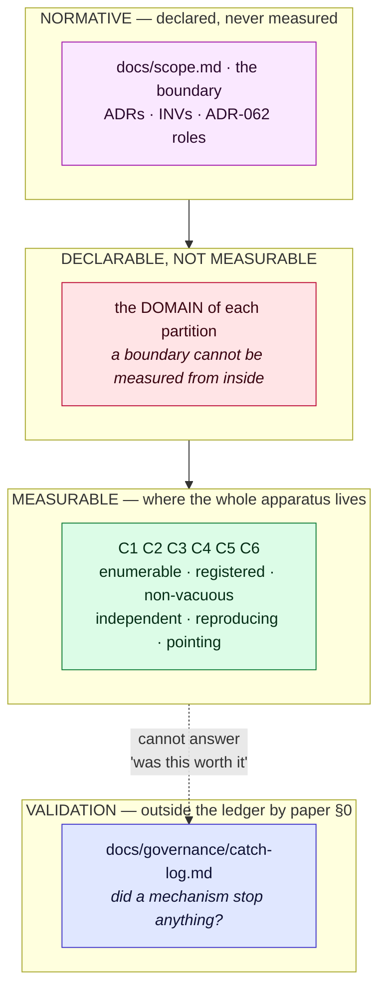

# The house — a sketch, from the roof down

Status: **SKETCH, not the artefact.** Drawn 2026-08-26 to test whether the
roof described in `docs/governance/architects-crib.md` can be built at all,
and to run the one test that section proposes: **which leaf is each
instrument evidence for?**

It is not an assurance case yet. It becomes one when the operator rules on
the top claim and each defeat condition is gated rather than written. Until
then it is a drawing with a testable property: every leaf below carries what
would KILL it, never what supports it. A diagram that acquires supports
before it acquires defeaters is theatre — the decay condition item 7 of
`work-in-flight-2026-08-26.md` names for exactly this document.

---

## 1. The house

```mermaid
flowchart TD
  TOP["<b>TOP CLAIM</b><br/>Every normative sentence in this repository<br/>corresponds to the repository state,<br/>or is marked as not corresponding"]

  TOP --> C1["<b>C1 · Enumerability</b><br/>nothing lives outside a register"]
  TOP --> C2["<b>C2 · Escapes</b><br/>every gate that can be lifted<br/>is registered as liftable"]
  TOP --> C3["<b>C3 · Non-vacuity</b><br/>every check has been<br/>demonstrated able to fail"]
  TOP --> C4["<b>C4 · Independence</b><br/>nothing is verified<br/>by its author"]
  TOP --> C5["<b>C5 · Currency of beliefs</b><br/>every recorded belief still reproduces,<br/>or has been judged"]
  TOP --> C6["<b>C6 · Currency of citations</b><br/>every normative citation still points<br/>at what it cited"]

  C1 --> E1["register-index.py"]
  C1 --> E1b["docs/registers.md<br/><i>the rule of recognition</i>"]

  C2 --> E2["waiver-index.py"]
  C2 --> E2b["docs/waivers.md<br/><i>NOT TOTAL, and says so</i>"]
  C2 --> E2c["semantic-audit.py<br/><i>extracts the rationale</i>"]
  C2 --> E2d["override-velocity.py<br/><i>counts the use</i>"]

  C3 --> E3["arm-index.py"]
  C3 --> E3b["truth-canary.sh<br/><i>seeded faults</i>"]
  C3 --> E3c["test-integrations.py<br/>test-truth-core.py"]
  C3 --> E3d["release-battery.sh<br/><i>+ its own meta-gate</i>"]

  C4 --> E4["separation-report.py"]
  C4 --> E4b["INV-O · ADR-010<br/>author is not verifier"]
  C4 --> E4c["ADR-062<br/><i>reviewer denied the spec</i>"]

  C5 --> E5["truth reproduce"]
  C5 --> E5b["capsule-blindness.py"]
  C5 --> E5c["watch-derivation.py"]
  C5 --> E5d["field-consumers.py"]

  C6 --> E6["arm-index --record-links<br/><i>suspect links</i>"]
  C6 --> E6b["arm-index prose hashes"]
  C6 --> E6c["doc-health.sh"]

  classDef claim fill:#dbeafe,stroke:#1d4ed8,color:#0b1b3a
  classDef top fill:#fef3c7,stroke:#b45309,color:#3a2606
  classDef ev fill:#f1f5f9,stroke:#475569,color:#111827
  class TOP top
  class C1,C2,C3,C4,C5,C6 claim
  class E1,E1b,E2,E2b,E2c,E2d,E3,E3b,E3c,E3d,E4,E4b,E4c,E5,E5b,E5c,E5d,E6,E6b,E6c ev
```

## 2. What would kill each leaf

The only column that matters. Written as defeaters, never as supports.

| claim | what would kill it |
|---|---|
| **C1** Enumerability | a document under `docs/` that no register's location contains and no baseline entry excuses. Today: `register-index.py` exits 1 on exactly that, and did so twice this week — once for a file the operator added, once for one the assistant added |
| **C2** Escapes | a way to lift a gate that is neither a waiver row nor a declared non-override. Today: `TRUTH_BATTERY_PLAN`, found 2026-08-26 by the sweep, minutes after being written. **Known residual:** the register is total over its harvested CARRIERS, not over bypasses — `<path>#<selector>` is exempt from both budgets by ADR-055 and no row can hold it. The register says this about itself in its first section |
| **C3** Non-vacuity | a check that can be deleted with the suite still green. Found eleven times in one review on 2026-08-24, including the check that was the block parser's whole justification |
| **C4** Independence | a verdict whose actor is the claim's filer; a reviewer that can reconstruct the brief from the diff, the dispatcher's questions, or a helpfully written handoff. The second is the live threat, not the first — see the open-design section of ADR-062 |
| **C5** Currency of beliefs | a live claim whose capsule no longer reproduces and nobody has judged. Today: three, judged 2026-08-26; two of them had been false for two weeks with every instrument green |
| **C6** Currency of citations | a normative sentence citing a position that has moved, with nothing marking the row suspect. Measured 2026-08-25: 20 of 183 backtick paths repo-wide are dead |

## 3. The finding this sketch was drawn for

Four instruments serve **no leaf**, and it is not an oversight in the drawing.

| instrument | what it produces |
|---|---|
| `blast-report.py` | churn and blast forecast (ADR-039) |
| `concern-tag.py` | a reader for legacy 42010 concern tags |
| `retraction-causes.py` | ADR-049's adoption metric |
| `label-coupling.py` | which modules share decisions without sharing code |

These are **reports, not evidence.** They measure adoption, churn and
coupling — management information about the system, not support for a claim
about it. That distinction is worth more than the four rows: it re-reads the
census in `docs/governance/catch-log.md`, where twelve of fifteen instruments
have caught nothing. Several of them **are not in the catching business at
all**, and holding them to a catch count was the wrong question.

`instruments/map.py` also serves no leaf and correctly so: it is orientation,
not evidence. Navigation is not assurance.

**What this changes:** the census needs a second column — *is this in the
catching business?* — before its zeros mean anything. Until it has one, rule 4
of the catch log ("a zero after long enough is the only deletion criterion")
would delete four instruments for failing a test they were never taking.

## 4. Where the house cannot reach

The apparatus lives entirely in the green band and is very good there. The red
band is where this week's deepest findings sat — `<path>#<selector>`, the
carriers, the ledger-blind counts that looked stale and were blind. It is
declarable, not measurable, which is why `docs/scope.md` is the only document
here that no measurement produced.

The catch log confirms the shape as a number rather than an argument: **every
recorded catch is about structure, every recorded miss is about content.**

## 5. What this sketch establishes, and what it does not

**Establishes:** the roof is constructible. Six sub-claims cover the apparatus
without straining, every leaf has a defeater that has actually fired at least
once this week, and the exercise produced a finding the drawing was not
looking for — four instruments outside the assurance business.

**Does not establish:** that the top claim is the right one. Nobody has ruled
on it. It is the assistant's phrasing of what the machinery appears to be for,
which is precisely the kind of sentence ADR-062 says an agent may prepare and
may not close.

**Not yet done:** no defeat condition here is GATED. Each is a sentence that
has been observed to fire, which is weaker than a check that fires on its own.
Turning six sentences into six gates is the work item 7 actually names.
