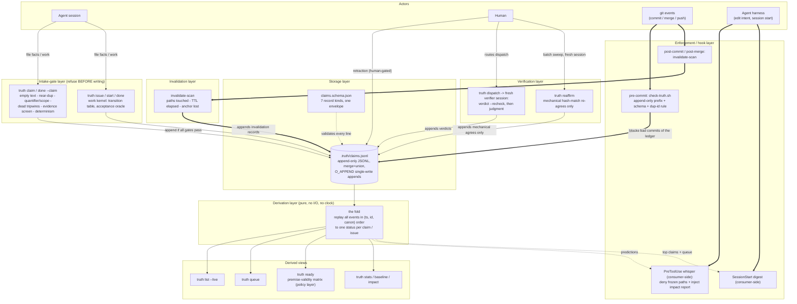
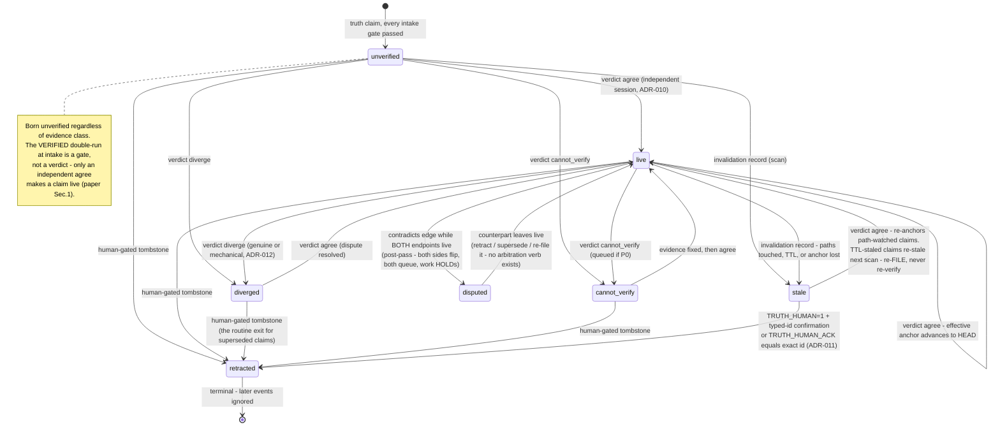
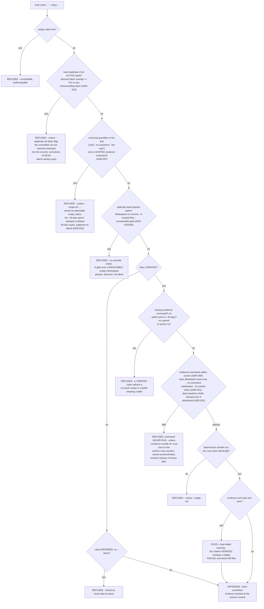
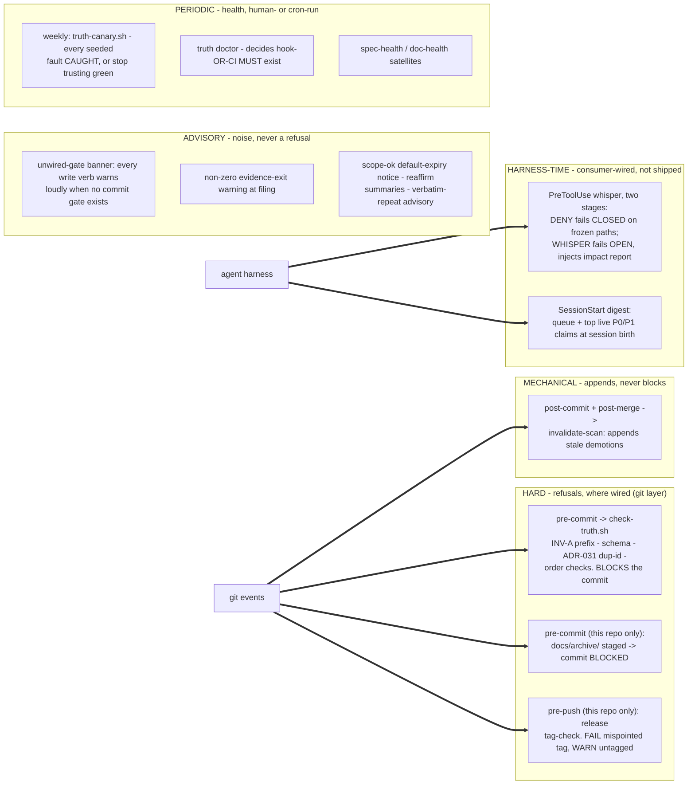

# The Truth Ledger, Explained End-to-End

*Field reference · system architecture.* A plain-language walkthrough of
every layer, gate, hook, and deliberate loophole in a system built to
keep AI coding agents' claims honest.

**Scope** CLI v0.9.14 · paper v3 (2026-07-20) · ADR-001–033 ·
**Sources** paper §N = `docs/truth-ledger-paper-v3.md`; ADR-NNN =
`template/docs/adr/NNN-*.md`

---

## 00 · The problem this solves

AI coding agents — and tired humans — constantly assert facts about a
codebase: "all tests pass," "no other call sites exist," "this endpoint
is authenticated." Those sentences get trusted, acted on, and then
silently falsified by the next code change, with no record of how the
fact was established and no mechanism to notice it died.

The truth ledger treats trusted facts like cache entries. Every one is
filed as a structured record carrying a *command* whose output was
hashed at a known commit. Any later event that could undermine the
fact — an edit to a watched file, elapsed time, rewritten git history —
mechanically demotes it back to "don't trust this until re-checked." A
second, independent session re-runs the evidence and judges whether it
still supports the sentence. Work planning is then gated on the health
of the facts it depends on.

The result: instead of hoping someone remembers to distrust old
knowledge, the system forgets *for* you — loudly, and on a git hook.

## 01 · Vocabulary, defined once

Nine terms, used freely from here on.

- **the ledger** — a single append-only file, `.truth/claims.jsonl` —
  one JSON object per line, nothing ever edited or deleted
- **claim** — a record asserting a fact, tagged VERIFIED (a command was
  run and hashed), INFERRED (reasoned, with a stated basis), or
  UNVERIFIED
- **evidence capsule** — what a VERIFIED claim carries: the command, a
  hash of its output, its exit code, the **anchor commit**, and either
  watched paths or a TTL
- **the fold** — a pure function that replays every ledger line in a
  fixed order and derives each claim's current status — status is never
  stored, only recomputed
- **verdict** — a second opinion filed about a claim: agree, diverge,
  cannot_verify, or retracted (human-only)
- **invalidation** — a mechanical demotion record written by a scan:
  watched paths changed, TTL elapsed, or the anchor commit vanished
- **premise** — a work item's declared dependency on a claim — "this
  task only makes sense if fact X still holds"
- **tier** — a claim's cost-of-being-wrong label: P0 (catastrophic) /
  P1 / P2
- **ADR** — Architecture Decision Record — a short, numbered, immutable
  note (context → decision → consequences). 33 exist; each closes one
  loophole or adds one capability

## 02 · Big-picture architecture

Everything below is one system with seven layers wrapped around a
single file. This diagram is the map; the rest of the document walks
each box in turn.



**Fig. 1** — every layer and how facts flow through them. The rest of
this document walks each box, then addresses the two questions that
matter most: which of these are real refusals vs. voluntary, and what
the system deliberately does not defend against.

## 03 · Storage layer — one append-only file

Everything — facts, second opinions, demotions, work items — is a line
in `.truth/claims.jsonl` (paper §1).

### Append-only, enforced at commit

The pre-commit gate checks that the staged file is a *line-prefix
extension* of the committed one: you can add lines, never edit or
delete one (invariant INV-A). "Fixing" a record means appending a
correction under a fresh id.

### Concurrent writers are assumed, not forbidden

Racing appends rely on POSIX `O_APPEND` atomicity: each record is
written in a single `write()` call, so two simultaneous appenders on
the same filesystem interleave whole lines rather than corrupting each
other. The paper is honest that this is a load-bearing *assumption*: in
the field so far, appends have always been serialized — the race has
been provisioned for but never actually exercised (paper §2.1, §8
item 4).

### Branches merge by union

`.gitattributes` sets `merge=union` on the ledger, so two diverged
branch ledgers merge by concatenation, no human conflict resolution.
Convergence is then the *fold's* job, not a merge procedure.

### Timestamps have exactly one legal shape

ADR-015 fixes a single format: `YYYY-MM-DDTHH:MM:SS.ssssss+00:00`,
fixed-width UTC microseconds. This exists because the fold sorts the
raw timestamp *string* — only a fixed-width, single-offset form makes
string order equal time order. The CLI also applies a small "clock
push" at append: if your clock reads at-or-before the ledger tail's
timestamp, the new record gets tail + 1 microsecond (bounded at 300s),
absorbing same-machine clock jitter.

## 04 · Record kinds — seven, one envelope

Every line satisfies `claims.schema.json`
(`$id: truth-ledger-record.v0.10`). Six envelope fields are always
required: `id`, `kind`, `actor`, `session`, `ts`, `payload`.

1. **claim** — an assertion with evidence class, tier, and (for
   VERIFIED) the evidence capsule.
2. **verdict** — agree / diverge / cannot_verify / retracted, always
   with a stated `basis`. `diverge --mechanical` (ADR-012) marks "the
   measuring recipe changed, not the fact" — same status, different
   bookkeeping.
3. **invalidation** — mechanical demotion: paths touched, TTL elapsed
   (stamped `reason_code: "ttl"` since ADR-030), or anchor commit
   unreachable after a history rewrite.
4. **premise** — links a work item to a claim it depends on; can carry
   `supersedes` to redirect a dead premise (ADR-013).
5. **issue** — a work item (`wk-` id): title, dependencies, premises,
   optionally an acceptance command (ADR-014).
6. **issue_event** — a work-item transition: claimed, released, closed,
   reopened, cancelled.
7. **contradicts** (v0.9.0) — a *declared* edge between two claims that
   cannot both hold, with a required basis. Deliberately no
   natural-language processing: "the moment a gate needs a model to
   fire, it is a review, not a refusal" (paper §1).

> **Doc-desync, found while building this page — and since fixed.**
> When this page was first compiled, `template/.truth/README.md`'s own
> "Record kinds" section still said *six* kinds with `contradicts`
> missing outright, and described the fold's sort order as `(ts, id)`
> instead of `(timestamp, id, canonical-serialization)`. Both were
> corrected in the repo the same day (commit `0c1c6ae`). The callout
> stands as the record: an independent read of the docs found exactly
> the decay class the system predicts (§5 of the paper).

The schema is explicitly **necessary, not sufficient** (ADR-027): it
fixes structure — shapes, the timestamp pattern, a floor on
anchor-commit length — but is silent on operational semantics like "was
this evidence command actually screened." Those are enforced by the CLI
at filing and recheck time. A stdlib mirror of the schema lives inside
`truth validate` so the tool has no dependencies; a generated "mutant
corpus" keeps mirror and schema from drifting apart — they drifted
twice before that existed.

## 05 · Derivation layer — the fold, and a claim's life

Status is never stored. The fold replays every event in the canonical
total order — **(timestamp, id, canonical-serialization)**, ascending,
ignoring file position entirely. That is what makes two union-merged
branch ledgers derive identical statuses regardless of merge direction
(confluence, invariant INV-I). The third sort key exists because
`(ts, id)` alone is not total: a forged duplicate id with a byte-copied
timestamp would tie, letting file position decide — the one thing the
fold must never do (ADR-016).

Three per-field merge disciplines govern what a later record can and
can't change (paper §6.3):

- **Claim content is first-writer-wins** — the first record for an id
  fixes its text and evidence forever; a later record under the same id
  is inert. This closed a "resurrect a retracted claim by appending a
  duplicate" attack.
- **Status is last-writer-wins** — each verdict or invalidation sets
  status in fold order (ADR-020).
- **`retracted` is absorbing** — once folded to retracted, every later
  setter is ignored. Only a human retraction is a dead end; a machine's
  "I couldn't check this" is an invitation to check again.

The fold reads **no clock** (ADR-019). Even TTL expiry only happens
when the scan *writes an invalidation record*; a TTL'd claim no scan
has visited is not stale, however old the fact. That keeps the fold a
pure function of the log — the same log folds to the same statuses on
any machine, at any time.



**Fig. 2** — a claim's state machine. Every arrow is one CLI verb;
nothing else moves a claim.

Three nuances worth spelling out:

- **`disputed` is a post-pass**, not a stored state: after the normal
  replay, every `contradicts` edge is checked against the *underlying*
  statuses; an edge fires only while both endpoints would otherwise be
  live. There is deliberately no "resolve dispute" verb — you retract,
  supersede, or re-file one side and the edge stops firing.
- **`stale` has exactly one entrance** (an invalidation record) and an
  asymmetric exit: a path-watched claim re-verified `agree` goes live
  and its *effective anchor advances* to the verifying commit — without
  that, re-verified claims would re-stale forever. A TTL'd claim has no
  such analogue: its clock counts from the original filing and never
  restarts, so the operational rule is *re-file expired TTL claims,
  don't re-verify them* (ADR-019).
- **Retraction is defended at two layers** (ADR-017): the status stays
  retracted under any later event, *and* the work-block a retracted
  premise imposes can only be released by the same human authority that
  imposed it. The mechanical dead states (stale, diverged,
  cannot_verify) stay ungated — no human decided those.

The work kernel has a smaller, parallel state machine (ADR-002/028):
issues move open ↔ claimed → closed, with released/reopened as
return-to-open edges; closed is *not* terminal (work is cyclical),
cancelled *is* terminal and human-gated like retraction.

## 06 · Intake gates — what refuses a filing

`truth claim` (and `done --claim`, which files through the same path)
runs an ordered battery of checks *before anything is written*. A
refused filing leaves the ledger untouched.



**Fig. 3** — the full intake battery for `truth claim`. Every red box
is a hard refusal; four carry an explicit, visible flag
(`--duplicate-ok`, `--scope-ok`, `--evidence-unsafe-ok`,
`--single-run`) and every use is stamped into the record. Empty text
and dead tripwires have no override at all.

**The safety screen decides whether a command runs at all** (ADR-029) —
it is not a peer of the other checks. A screen-failed command is never
executed, so it can never even reach the determinism check. This exists
because evidence commands are re-executed later, *inside a verifier's
session*: a prompt-injected author must not be able to plant a payload
that detonates when an obedient verifier rechecks it (ADR-009). Hence
bare allowlisted names only, no shells or generic executors even if a
consumer accidentally allowlists one (ADR-022's template-owned deny
baseline), and no control characters except tab (ADR-021 closed a live
bypass where a newline was tokenized as whitespace by the screen but
read as a statement separator by `/bin/sh` — a second command smuggled
straight past it).

**The quantifier-scope gate targets the system's measured dominant
failure mode.** Both genuine divergences in the pilot were the same
shape: a *correct* but package-scoped grep backing a *repo-wide*
sentence (paper §2). The gate doesn't judge whether the scope actually
covers the quantifier — that stays the verifier's job — it only forces
the mismatch to be *stated*, as an attackable sentence. Since ADR-032,
that sentence can't rot silently either: filed with no explicit TTL, it
decays in 30 days, the scan stales it, and re-filing re-fires this very
gate.

## 07 · Verification — dispatch, verdict, and the reaffirm shortcut

Filing a VERIFIED claim does **not** make it trusted. It is born
unverified; only an independent session's `agree` makes it live.
"Evidence attached" and "evidence confirmed" are two distinct events,
never conflated (paper §1).

```mermaid
sequenceDiagram
    autonumber
    participant A as Authoring session
    participant H as Human / router script
    participant V as Fresh verifier session
    participant L as claims.jsonl

    A->>L: truth claim "..." --class VERIFIED (born unverified)
    H->>H: truth dispatch tr-x - emits FIXED prompt + raw record,<br/>never the author's reasoning
    H->>V: paste / route dispatch context into a FRESH session
    V->>V: truth verdict tr-x --recheck (deterministic first)
    alt evidence screened:false (filed --evidence-unsafe-ok)
        V-->>V: recheck REFUSES to execute - manual verification only
    else command missing (exit 127)
        V->>L: cannot_verify (environment, not reality)
    else output hash mismatch
        V->>L: diverge (auto-filed; verifier judges genuine vs mechanical next)
    else hash matches
        V-->>V: a matching hash is a REPORT, not a judgment
        V->>V: independently judge - does this output support the SENTENCE?
        V->>L: agree (to live, anchor advances) or diverge
    end
    Note over A,L: ADR-010: agree from the CLAIM'S OWN session is refused.<br/>Self-diverge / self-cannot_verify stay allowed. Verifiers cannot retract.

    rect rgba(128, 128, 128, 0.14)
        Note over H,L: The reaffirm shortcut (ADR-030) - batch, mechanical half only
        H->>V: truth reaffirm (fresh session; --dry-run to preview)
        loop every claim with derived status STALE
            alt TTL-staled
                V-->>H: skip - re-file, never re-verify (ADR-019)
            else unscreened / screen-refused / never agreed by any verifier
                V-->>H: skip - a FIRST agree is a judgment, not a re-confirmation
            else same session as the claim's author
                V-->>H: skip - ADR-010 batch edition
            else run the SAME screened recheck path verdict --recheck uses
                alt hash AND exit code match the capsule
                    V->>L: auto-agree, basis "reaffirm: hash-match, no judgment re-run"
                else mismatch
                    V-->>H: FILES NOTHING - listed for real dispatch
                end
            end
        end
    end
```

**Fig. 4** — independent verification, and the mechanical shortcut that
automates only the re-confirmation half.

Why reaffirm exists: the meta-repo measured roughly 9.5 agree-verdicts
per claim in twelve days, and a verification *hit rate* of about 1.5% —
98.5% of verification labor was re-confirming what was already believed
(paper §2.2, §8 item 2). Reaffirm automates exactly that mechanical
majority and is forbidden from touching the judgment half: a mismatch
files *nothing*, and a claim never agreed by anyone is skipped because
there is no prior judgment to re-confirm.

Reaffirm's named residual (ADR-030): its match check looks at the
*command output*, which can be narrower than the *watch*. If a
watched-but-unread file changed — exactly what staled the claim — the
output can still match, and reaffirm re-agrees anyway, burying that
change outside every future scan window. Every such clearance is
recorded in the agree's `reaffirm_cleared` field, but auditability is
not judgment; the operating rule is *keep evidence commands as wide as
their watch paths*.

## 08 · Invalidation — how facts die mechanically

`truth invalidate-scan` is the system's only clock-reader and the only
writer of `stale`. Three triggers, all mechanical:

1. **Watched paths touched** — the scan diffs from each claim's
   *effective* anchor (the filing commit, or the commit of the latest
   re-verifying agree) to HEAD; any change matching the claim's watched
   globs appends an invalidation. One matcher, shared with
   `truth impact` — a second implementation is forbidden by decree,
   because two copies of a matching contract will drift.
2. **TTL elapsed** — strictly more than `ttl_days` since the claim's
   own timestamp, never from any verdict. The scan stamps
   `reason_code: "ttl"` so later tooling never has to re-derive expiry
   from a clock.
3. **Anchor lost** — after a rebase, squash, or gc makes the anchor
   commit unreachable, the claim is demoted "anchor unreachable." The
   system fails toward distrust when history is rewritten.

Glob semantics respect directory boundaries; a glob over an
empty-but-reachable namespace is accepted as a *dormant* watch that
fires once the namespace fills, while statically unreachable globs are
refused outright at intake.

## 09 · Policy layer — `truth ready`

`truth ready` answers "what work may start" by intersecting two things:
which issues are unblocked, and whether each issue's premises are still
healthy. The premise check is a tier-sensitive matrix, not a binary
(ADR-001):

| Premise status | Effect on the issue |
|---|---|
| live | passes clean |
| unverified | passes **with a warning** — a stated trade for low filing friction |
| cannot_verify | **blocks only if the premise is P0**; warns otherwise |
| stale, diverged, disputed, retracted, missing | **always blocks** — shown HELD with the dead fact named |

Two escape valves, both auditable:

- **Premise supersede** (ADR-013) — when a premise died *genuinely*,
  `truth premise <issue> <new> --supersedes <old>` redirects it;
  refused while the old premise is live or unverified, and the
  replacement is judged by the same matrix. Superseding a *retracted*
  premise requires the full human gate (ADR-017) — an agent cannot
  spend a human's veto.
- **Acceptance oracles** (ADR-014) — an issue may declare
  `--accept-cmd` at birth; `done` then runs it from the repo root and
  refuses the close on non-zero exit. There is deliberately no flag to
  override an oracle that ran and failed.

Honest limit: `ready` is a policy join, not a lock. `truth start`
checks only the state transition, never premise validity — a determined
agent can still work a HELD item; the gate makes the risk visible with
the dead fact named.

## 10 · Enforcement & hooks — what fires when

Five bands, from a real technical block to pure noise.



**Fig. 5** — the trigger map. The operations guide's own summary: "the
commit gate and the invalidation scan are the system's heartbeat — if
those two hooks are not firing, you do not have a truth ledger; you
have a diary."

**Everything in the "hard" column is conditional on being installed.**
Local `.git/hooks` die on every fresh clone; the committed `.githooks/`
directory needs one `git config core.hooksPath .githooks` per clone; CI
is the clone-proof backstop. ADR-025 made the requirement *decidable*:
`truth doctor` exits 1 unless, for each gate, an active hook or a CI
config naming the gate script exists.

**The harness hooks are deliberately not shipped** (ADR-003 rule 2: the
template ships only policy-free mechanisms). The `truth impact` verb is
template-side; the hook wiring is per-repo. In this repo it is wired
for both Claude Code and the pi harness — same deny list, same
per-session metric file.

## 11 · Hard rules vs. soft rules

Both the paper and the loophole map spend real space on this, because
green checkmarks mean nothing if you don't know which properties are
*enforced* and which are *hoped*. The honest taxonomy has four bands.

### Band 1 — Hard technical refusals

Given the machinery is invoked at all, these cannot be passed without
an explicit, visible override or a raw attack: every intake refusal in
§06; the append-only prefix check and schema validation at commit; the
unified duplicate-id rule (ADR-031); same-session `agree` refused
(ADR-010); a failing acceptance oracle refusing `done`; tombstones
requiring `TRUTH_HUMAN=1` plus a typed-id confirmation (ADR-011) — and,
notably, the refusal messages themselves stopped teaching the bypass,
since agent-facing refusal text is itself attack surface.

### Band 2 — Self-attested identity ("the F4 class")

The gates in Band 1 that key on *who you are* rest on environment
variables: `session` is env-derived, `TRUTH_SELF_VERDICT=1` bypasses
session separation, `TRUTH_HUMAN`/`TRUTH_HUMAN_ACK` assert humanity.
This is explicitly **defense against drift, not adversaries**: a bypass
costs one visible, attributable env export that lands in the transcript
and the record — "refusal plus auditable bypass ritual, not identity."
Under `reaffirm` the same export bypasses the seam for every
same-session claim in the sweep at once, so reaffirm prints a loud
warning naming the override and the count.

### Band 3 — Conditional enforcement

The append-only check, the first-wins protections, and every
order/duplicate detection run inside `check-truth` — which runs only
where a hook or CI is installed. Where neither exists, those invariants
are **silently unenforced**. A sandbox demonstration behind ADR-025: in
a hook-less repo, an in-place rewrite of a committed ledger line
committed successfully. Mitigations: `doctor` decides the question
mechanically, and the v0.9.11 banner makes an unwired clone noisy — but
noise, not a refusal.

### Band 4 — Behavioral norms

The outer boundary: **an agent must choose to use the layer at all.**
Discovery happens through a few lines in instruction files; a runtime
that never loads them, in a hook-less harness, bypasses everything —
the one real structural hole. Mitigated on three fronts, eliminated on
none. The saving grace: an ignoring agent leaves the ledger untouched
and still valid — the failure mode is omission, never corruption.
`ready` is advisory too: nothing stops working a HELD item. And three
judgments stay human forever: retraction, divergence triage, and the
monthly hand-audit — the only check on whether the whole machine
actually *helps*.

### Worked example — the docs/archive/ freeze

This repo's own `AGENTS.md` declares `docs/archive/` "frozen verbatim;
never update it" — a norm. It is now enforced at three layers, and the
history of why is the whole lesson in miniature:

1. **The norm.** An instruction-file sentence. A trial on 2026-07-11
   showed norms alone did not hold: an unarmed, norms-informed external
   agent made exactly the edit the norm forbids.
2. **The harness deny stage.** The pre-edit whisper hook blocks edit
   tools on `docs/archive/`, failing closed — but only binds agents
   running inside a wired harness.
3. **The git-layer backstop.** `.githooks/pre-commit` refuses any
   commit staging `docs/archive/` changes, harness-independently: "a
   human must lift the freeze deliberately before this can land."

Norm → harness property → git property, each layer added when the
previous one demonstrably failed. That escalation pattern is how most
of this system's 33 ADRs came to exist.

## 12 · Accepted gaps, in plain words

Paper §8 ranks these by how much a skeptic should discount everything
else.

1. **Everything is self-reported by one person.** The auditor, the
   pilot operator, and the paper's author are the same individual.
   Independent replication has not happened.
2. **Nobody has measured whether it helps — and the cost side is now
   measured, unfavorably.** ~1.5% of verification verdicts found
   anything; claims watching hot paths re-staled within the hour.
   `reaffirm` is the shipped countermeasure; whether it recovers that
   labor without leaking wrong auto-agrees is an open, running trial.
3. **The field windows are short.** ~48 hours of pilot, twelve days of
   dogfooding — not a steady state.
4. **Single regime.** One solo developer per repo, one machine.
   Multi-human concurrency has never actually been exercised.
5. **Agent compliance is behavioral**, and the commit-gate invariants
   are conditional on installation. `doctor` makes it decidable, but
   it's opt-in and its CI arm is self-certified.
6. **Timestamp forgery on a fresh id is accepted, not solved.** The
   worst *composition* — a forged duplicate winning content under
   first-wins — is refused at commit. What remains is backdating a
   record under a brand-new id. The cryptographic answer sits
   deliberately behind a growth gate, built only when the first forged
   timestamp is found in the wild.
7. **Vocabulary calibration is unmeasured.** The genuine-vs-mechanical
   diverge split is shipped; whether verifiers apply it consistently is
   not.
8. **The override-decay instrument is evadable.** The verbatim-repeat
   advisory is defeated by a single synonym swap. The backstop is the
   raw counters, which increment regardless of text evasion.

Standing residuals:

- **The tracked-symlink watch.** A watched path pointing at a tracked
  symlink passes intake but can never fire — git diffs show the target,
  never the immutable link. Guidance ("watch real paths"), not a gate.
- **The hollow VERIFIED.** A stably *failing* command files VERIFIED
  and rechecks green forever, because both intake and recheck compare
  hash and exit code for stability, not success. Narrowed to a loud
  warning, never refused — a legitimately failing probe (proving
  absence) exists.
- **A lone future-dated issue record still commits** — inert and
  visibly so, because `validate` is clock-free by design.
- **A resolved ceremony in this repo:** the P0 canary claim's evidence
  command was deliberately never allowlisted, so `verdict --recheck`
  refused to run it — verifiers ran the suite by hand. That claim has
  since been human-retracted, and the canary is being re-homed as an
  ADR-014 *acceptance oracle* on a work item (oracles execute code on
  purpose — that is their allowlist). The standing warning survives the
  move: `AGENTS.md` forbids "fixing" any such case by allowlisting a
  shell, which would gut the evidence screen entirely.

## 13 · The shape of the whole thing

An event log, a pure derivation, entry gates, exit triggers, an
independent recheck, and a policy join — that is the entire mechanism.
Around that core: git hooks supply the transactional moments, harness
hooks supply the attention moments, the canary attacks the machinery
weekly, and three judgments — killing a fact, resolving a disagreement,
and asking whether the green lights mean anything — are deliberately
kept human forever.

The design's one-line philosophy, repeated across the ADRs in different
words: convert norms into refusals where a cheap pure predicate exists;
where it doesn't, make the bypass visible and attributable; and where
even that fails, make sure the worst case is omission, never
corruption.

---

*Compiled by an independent read of AGENTS.md, the v3 paper, the
operations guide, the loophole map, all 33 ADRs, the four git hooks,
and the CLI source; converted from the original HTML explainer
verbatim. Diagrams are illustrative summaries of cited sections, not a
replacement for them — treat ADR text as authoritative on conflict.
This document is watched by a ledger doc-coverage claim: when the CLI
version or watched surfaces move, the claim stales and this page enters
the re-review queue.*
