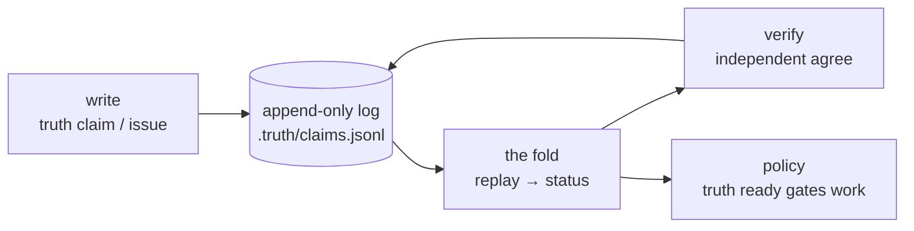
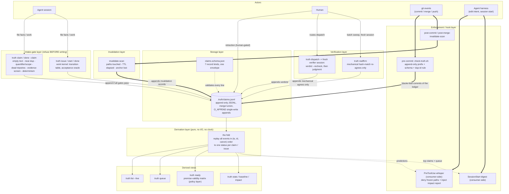
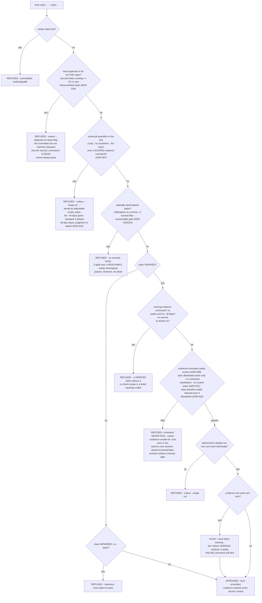
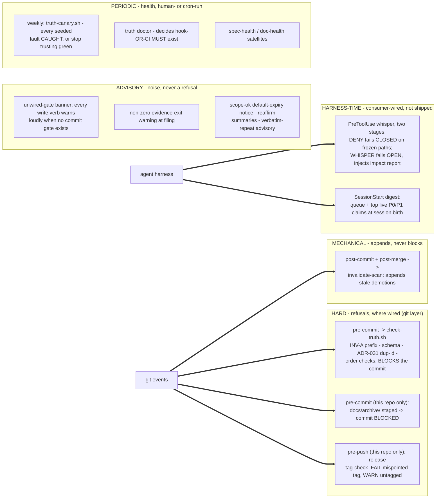

# The Truth Ledger, Explained End-to-End

*Field reference · system architecture.* A plain-language walkthrough of
every layer, gate, hook, and deliberate loophole in a system built to
keep AI coding agents' claims honest.

**Scope** CLI v0.9.14 · paper v3 (2026-07-20) · ADR-001–033 ·
**Sources** paper §N = `docs/truth-ledger-paper-v3.md`; ADR-NNN =
`template/docs/adr/NNN-*.md`

---

## The system in 90 seconds

Trusted facts about a codebase rot silently. This system files each one
as a line in an append-only **claim** log, carrying the *command* whose
output was hashed at a known commit. A pure **fold** replays that log to
derive every claim's status — never stored, always recomputed. Mechanical
**scans** demote a fact the moment its watched files change, its TTL
elapses, or its anchor commit is rewritten away. A second, **independent
session** re-runs the evidence and judges whether it still supports the
sentence. Work is then gated on the health of the facts it depends on.

The whole ambition is small: not to remember to distrust old knowledge,
but to forget *for* you — loudly, and on a git hook. It defends against
honest **drift**, not a motivated adversary — every bypass costs one
visible, attributable line in the record.

**Reading paths** — this page is long because it is complete; you almost
certainly don't need all of it, in order, today.

- **"What is this — should I care?"** Read §00, glance at Fig. 1, stop.
- **About to use it** (file claims, run verbs)? §06 (what refuses a
  filing) → §07 (verification) → §09 (what gates work). The full verb
  reference is in §14.
- **Auditing the trust model?** §11 (what's *enforced* vs. merely
  *hoped*) → §12 (the accepted holes) → §13. One-line threat model:
  drift, not adversaries.
- **Just need a term?** §14 is a 170-entry glossary — every term is
  defined at first use above and restated there.

---

## 00 · The problem this solves

AI coding agents — and tired humans — constantly assert facts about a
codebase: "all tests pass," "no other call sites exist," "this endpoint
is authenticated." Those sentences get trusted, acted on, and then
silently falsified by the next code change, with no record of how the
fact was established and no mechanism to notice it died.

The truth ledger treats trusted facts like cache entries. Every one is
filed as a structured record carrying a *command* whose output was
hashed at a known commit. Any later event that could undermine the
fact — an edit to a watched file, elapsed time, rewritten git history —
mechanically demotes it back to "don't trust this until re-checked." A
second, independent session re-runs the evidence and judges whether it
still supports the sentence. Work planning is then gated on the health
of the facts it depends on.

The result: instead of hoping someone remembers to distrust old
knowledge, the system forgets *for* you — loudly, and on a git hook.

## 01 · Vocabulary, defined once

Nine terms, used freely from here on.

- **the ledger** — a single append-only file, `.truth/claims.jsonl` —
  one JSON object per line, nothing ever edited or deleted
- **claim** — a record asserting a fact, tagged VERIFIED (a command was
  run and hashed), INFERRED (reasoned, with a stated basis), or
  UNVERIFIED
- **evidence capsule** — what a VERIFIED claim carries: the command, a
  hash of its output, its exit code, the **anchor commit**, and either
  watched paths or a TTL
- **the fold** — a pure function that replays every ledger line in a
  fixed order and derives each claim's current status — status is never
  stored, only recomputed
- **verdict** — a second opinion filed about a claim: agree, diverge,
  cannot_verify, or retracted (human-only)
- **invalidation** — a mechanical demotion record written by a scan:
  watched paths changed, TTL elapsed, or the anchor commit vanished
- **premise** — a work item's declared dependency on a claim — "this
  task only makes sense if fact X still holds"
- **tier** — a claim's cost-of-being-wrong label: P0 (catastrophic) /
  P1 / P2
- **ADR** — Architecture Decision Record — a short, numbered, immutable
  note (context → decision → consequences). 33 exist; each closes one
  loophole or adds one capability

The full glossary of every term, acronym, and identifier is §14.

## 02 · Big-picture architecture

Everything below is one system with seven layers wrapped around a
single file. Before the full map, the whole system in five boxes:



**Fig. 0** — the shape. Everything below is these five boxes with the
gates, hooks, and loopholes filled in. Fig. 1 is the reference map —
skim it; each box gets its own section.



**Fig. 1** — every layer, fully expanded: a reference map, not required
reading in order. The rest of this document walks each box, then
addresses the two questions that matter most: which of these are real
refusals vs. voluntary, and what the system deliberately does not
defend against.

## 03 · Storage layer — one append-only file

*Where everything lives and why one file can't be quietly rewritten — the storage substrate. Start here if you distrust the phrase "append-only."*

Everything — facts, second opinions, demotions, work items — is a line
in `.truth/claims.jsonl` (paper §1).

### Append-only, enforced at commit

The pre-commit gate checks that the staged file is a *line-prefix
extension* of the committed one: you can add lines, never edit or
delete one (invariant INV-A). "Fixing" a record means appending a
correction under a fresh id.

### Concurrent writers are assumed, not forbidden

<details><summary>Details — why this holds and what it assumes</summary>

Racing appends rely on POSIX `O_APPEND` atomicity: each record is
written in a single `write()` call, so two simultaneous appenders on
the same filesystem interleave whole lines rather than corrupting each
other. The paper is honest that this is a load-bearing *assumption*: in
the field so far, appends have always been serialized — the race has
been provisioned for but never actually exercised (paper §2.1, §8
item 4).

</details>

### Branches merge by union

`.gitattributes` sets `merge=union` on the ledger, so two diverged
branch ledgers merge by concatenation, no human conflict resolution.
Convergence is then the *fold's* job, not a merge procedure.

### Timestamps have exactly one legal shape

ADR-015 fixes a single format: `YYYY-MM-DDTHH:MM:SS.ssssss+00:00`,
fixed-width UTC microseconds. This exists because the fold sorts the
raw timestamp *string* — only a fixed-width, single-offset form makes
string order equal time order. The CLI also applies a small "clock
push" at append: if your clock reads at-or-before the ledger tail's
timestamp, the new record gets tail + 1 microsecond (bounded at 300s),
absorbing same-machine clock jitter.

## 04 · Record kinds — seven, one envelope

*The seven shapes a ledger line can take — the record vocabulary. Read this before you parse or hand-write JSONL.*

Every line satisfies `claims.schema.json`
(`$id: truth-ledger-record.v0.10`). Six envelope fields are always
required: `id`, `kind`, `actor`, `session`, `ts`, `payload`.

1. **claim** — an assertion with evidence class, tier, and (for
   VERIFIED) the evidence capsule.
2. **verdict** — agree / diverge / cannot_verify / retracted, always
   with a stated `basis`. `diverge --mechanical` (ADR-012) marks "the
   measuring recipe changed, not the fact" — same status, different
   bookkeeping.
3. **invalidation** — mechanical demotion: paths touched, TTL elapsed
   (stamped `reason_code: "ttl"` since ADR-030), or anchor commit
   unreachable after a history rewrite.
4. **premise** — links a work item to a claim it depends on; can carry
   `supersedes` to redirect a dead premise (ADR-013).
5. **issue** — a work item (`wk-` id): title, dependencies, premises,
   optionally an acceptance command (ADR-014).
6. **issue_event** — a work-item transition: claimed, released, closed,
   reopened, cancelled.
7. **contradicts** (v0.9.0) — a *declared* edge between two claims that
   cannot both hold, with a required basis. Deliberately no
   natural-language processing: "the moment a gate needs a model to
   fire, it is a review, not a refusal" (paper §1).

> **Doc-desync, found while building this page — and since fixed.**
> When this page was first compiled, `template/.truth/README.md`'s own
> "Record kinds" section still said *six* kinds with `contradicts`
> missing outright, and described the fold's sort order as `(ts, id)`
> instead of `(timestamp, id, canonical-serialization)`. Both were
> corrected in the repo the same day (commit `0c1c6ae`). The callout
> stands as the record: an independent read of the docs found exactly
> the decay class the system predicts (§5 of the paper).

The schema is explicitly **necessary, not sufficient** (ADR-027): it
fixes structure — shapes, the timestamp pattern, a floor on
anchor-commit length — but is silent on operational semantics like "was
this evidence command actually screened." Those are enforced by the CLI
at filing and recheck time. A stdlib mirror of the schema lives inside
`truth validate` so the tool has no dependencies; a generated "mutant
corpus" keeps mirror and schema from drifting apart — they drifted
twice before that existed.

## 05 · Derivation layer — the fold, and a claim's life

*How a claim's status is computed instead of stored — the fold. Read this if you need to trust that two machines agree on the same log.*

Status is never stored. The fold replays every event in the canonical
total order — **(timestamp, id, canonical-serialization)**, ascending,
ignoring file position entirely. That is what makes two union-merged
branch ledgers derive identical statuses regardless of merge direction
(confluence, invariant INV-I). The third sort key exists because
`(ts, id)` alone is not total: a forged duplicate id with a byte-copied
timestamp would tie, letting file position decide — the one thing the
fold must never do (ADR-016).

Three per-field merge disciplines govern what a later record can and
can't change (paper §6.3):

- **Claim content is first-writer-wins** — the first record for an id
  fixes its text and evidence forever; a later record under the same id
  is inert. This closed a "resurrect a retracted claim by appending a
  duplicate" attack.
- **Status is last-writer-wins** — each verdict or invalidation sets
  status in fold order (ADR-020).
- **`retracted` is absorbing** — once folded to retracted, every later
  setter is ignored. Only a human retraction is a dead end; a machine's
  "I couldn't check this" is an invitation to check again.

The fold reads **no clock** (ADR-019). Even TTL expiry only happens
when the scan *writes an invalidation record*; a TTL'd claim no scan
has visited is not stale, however old the fact. That keeps the fold a
pure function of the log — the same log folds to the same statuses on
any machine, at any time.


**Fig. 2** — a claim's state machine. Every arrow is one CLI verb;
nothing else moves a claim.

Three nuances worth spelling out:

<details><summary>Details — the three nuances spelled out</summary>

- **`disputed` is a post-pass**, not a stored state: after the normal
  replay, every `contradicts` edge is checked against the *underlying*
  statuses; an edge fires only while both endpoints would otherwise be
  live. There is deliberately no "resolve dispute" verb — you retract,
  supersede, or re-file one side and the edge stops firing.
- **`stale` has exactly one entrance** (an invalidation record) and an
  asymmetric exit: a path-watched claim re-verified `agree` goes live
  and its *effective anchor* — the commit the scan diffs from — advances
  to the verifying commit; without that, re-verified claims would
  re-stale forever. A TTL'd claim has no
  such analogue: its clock counts from the original filing and never
  restarts, so the operational rule is *re-file expired TTL claims,
  don't re-verify them* (ADR-019).
- **Retraction is defended at two layers** (ADR-017): the status stays
  retracted under any later event, *and* the work-block a retracted
  premise imposes can only be released by the same human authority that
  imposed it. The mechanical dead states (stale, diverged,
  cannot_verify) stay ungated — no human decided those.

</details>

The work kernel has a smaller, parallel state machine (ADR-002/028):
issues move open ↔ claimed → closed, with released/reopened as
return-to-open edges; closed is *not* terminal (work is cyclical),
cancelled *is* terminal and human-gated like retraction.

## 06 · Intake gates — what refuses a filing

*What stops a bad claim from ever being written — the refusal battery. Read this before your first `truth claim`.*

`truth claim` (and `done --claim`, which files through the same path)
runs an ordered battery of checks *before anything is written*. A
refused filing leaves the ledger untouched.

**The commands you'll actually run.** Most days are these eight verbs;
the full reference (every flag, every verb) is §14 — this table
duplicates a slice of it deliberately, as a forward reference for
first-time use.

| Verb | What it does for you |
|---|---|
| `truth claim '…' --class …` | File a fact; runs the full intake battery below. |
| `truth list --live` | Show the facts currently trusted (drop `--live` for all statuses). |
| `truth queue` | The human review queue: diverged + stale/unverifiable P0·P1. |
| `truth dispatch <id>` | Emit the fixed verifier prompt + raw record to route into a fresh session. |
| `truth verdict <id> --recheck` | Re-run a claim's evidence and compare hashes (deterministic first). |
| `truth verdict <id> agree` | File the independent judgment that makes a claim `live`. |
| `truth reaffirm` | Batch, mechanical re-confirmation of stale claims (hash-match only). |
| `truth ready` | Which work items may start, filtered by premise health. |
| `truth invalidate-scan` | The heartbeat: demote facts whose paths changed, TTL elapsed, or anchor was lost. |

**One happy path, end to end.** Filing a VERIFIED claim about a real
file, then verifying it from a fresh session. Each command's actual
output is shown inline:

```console
# 1 · Author session — file the claim. Passes every intake gate: grep is
#     an allowlisted bare command (screened), its output double-runs to an
#     identical hash (deterministic), the text is existential, not a
#     repo-wide quantifier over a scoped grep.
$ truth claim "src/payments.py calls gateway.charge" \
    --class VERIFIED \
    --evidence-cmd "grep -n gateway.charge src/payments.py" \
    --paths src/payments.py --tier P1
tr-d6217c34
$ truth list --live          # empty — a claim is born unverified
$ truth list
tr-d6217c34  unverified    P1  VERIFIED   src/payments.py calls gateway.charge

# 2 · Route it to a verifier. dispatch prints the fixed prompt + raw
#     record only (never the author's reasoning) to paste into a FRESH
#     session; the prompt carries an integrity header + END-OF-DISPATCH hash.
$ truth dispatch tr-d6217c34
INTEGRITY (check before following): a complete copy of this dispatch
contains 4 numbered rules and ends with 'END-OF-DISPATCH sha256:…'.
…verifier procedure + claim JSON…

# 3 · Verifier session (independent). Deterministic recheck first:
$ truth verdict tr-d6217c34 --recheck
tr-d6217c34 recheck: hash matches -- nothing filed. If the evidence also
supports the claim's TEXT, file your judgment: truth verdict tr-d6217c34
agree --basis '<what you checked>'

# 4 · A matching hash is a report, not a judgment — the verifier reads the
#     output, agrees it supports the SENTENCE, and files the verdict that
#     makes the claim live (ADR-010 refuses agree from the author's session).
$ truth verdict tr-d6217c34 agree \
    --basis "grep output shows the gateway.charge call on line 2"
tr-d6217c34 -> agree
$ truth list --live
tr-d6217c34  live          P1  VERIFIED   src/payments.py calls gateway.charge
```



**Fig. 3** — the full intake battery for `truth claim`. Every red box
is a hard refusal; four carry an explicit, visible flag
(`--duplicate-ok`, `--scope-ok`, `--evidence-unsafe-ok`,
`--single-run`) and every use is stamped into the record. Empty text
and dead tripwires have no override at all.

**The safety screen decides whether a command runs at all** (ADR-029) —
it is not a peer of the other checks. A screen-failed command is never
executed, so it can never even reach the determinism check. This exists
because evidence commands are re-executed later, *inside a verifier's
session*: a prompt-injected author must not be able to plant a payload
that detonates when an obedient verifier rechecks it (ADR-009). Hence
bare allowlisted names only, no shells or generic executors even if a
consumer accidentally allowlists one (ADR-022's template-owned deny
baseline), and no control characters except tab (ADR-021 closed a live
bypass where a newline was tokenized as whitespace by the screen but
read as a statement separator by `/bin/sh` — a second command smuggled
straight past it).

**The quantifier-scope gate targets the system's measured dominant
failure mode.** Both genuine divergences in the pilot were the same
shape: a *correct* but package-scoped grep backing a *repo-wide*
sentence (paper §2). The gate doesn't judge whether the scope actually
covers the quantifier — that stays the verifier's job — it only forces
the mismatch to be *stated*, as an attackable sentence. Since ADR-032,
that sentence can't rot silently either: filed with no explicit TTL, it
decays in 30 days, the scan stales it, and re-filing re-fires this very
gate.

## 07 · Verification — dispatch, verdict, and the reaffirm shortcut

*How a filed claim actually earns trust — independent verification. Read this before you run `dispatch` or `verdict`.*

Filing a VERIFIED claim does **not** make it trusted. It is born
unverified; only an independent session's `agree` makes it live.
"Evidence attached" and "evidence confirmed" are two distinct events,
never conflated (paper §1).

```mermaid
sequenceDiagram
    autonumber
    participant A as Authoring session
    participant H as Human / router script
    participant V as Fresh verifier session
    participant L as claims.jsonl

    A->>L: truth claim "..." --class VERIFIED (born unverified)
    H->>H: truth dispatch tr-x - emits FIXED prompt + raw record,<br/>never the author's reasoning
    H->>V: paste / route dispatch context into a FRESH session
    V->>V: truth verdict tr-x --recheck (deterministic first)
    alt evidence screened:false (filed --evidence-unsafe-ok)
        V-->>V: recheck REFUSES to execute - manual verification only
    else command missing (exit 127)
        V->>L: cannot_verify (environment, not reality)
    else output hash mismatch
        V->>L: diverge (auto-filed; verifier judges genuine vs mechanical next)
    else hash matches
        V-->>V: a matching hash is a REPORT, not a judgment
        V->>V: independently judge - does this output support the SENTENCE?
        V->>L: agree (to live, anchor advances) or diverge
    end
    Note over A,L: ADR-010: agree from the CLAIM'S OWN session is refused.<br/>Self-diverge / self-cannot_verify stay allowed. Verifiers cannot retract.

    rect rgba(128, 128, 128, 0.14)
        Note over H,L: The reaffirm shortcut (ADR-030) - batch, mechanical half only
        H->>V: truth reaffirm (fresh session; --dry-run to preview)
        loop every claim with derived status STALE
            alt TTL-staled
                V-->>H: skip - re-file, never re-verify (ADR-019)
            else unscreened / screen-refused / never agreed by any verifier
                V-->>H: skip - a FIRST agree is a judgment, not a re-confirmation
            else same session as the claim's author
                V-->>H: skip - ADR-010 batch edition
            else run the SAME screened recheck path verdict --recheck uses
                alt hash AND exit code match the capsule
                    V->>L: auto-agree, basis "reaffirm: hash-match, no judgment re-run"
                else mismatch
                    V-->>H: FILES NOTHING - listed for real dispatch
                end
            end
        end
    end
```

**Fig. 4** — independent verification, and the mechanical shortcut that
automates only the re-confirmation half.

Why reaffirm exists: the meta-repo measured roughly 9.5 agree-verdicts
per claim in twelve days, and a verification *hit rate* of about 1.5% —
98.5% of verification labor was re-confirming what was already believed
(paper §2.2, §8 item 2). Reaffirm automates exactly that mechanical
majority and is forbidden from touching the judgment half: a mismatch
files *nothing*, and a claim never agreed by anyone is skipped because
there is no prior judgment to re-confirm.

Reaffirm's named residual (ADR-030): its match check looks at the
*command output*, which can be narrower than the *watch*. If a
watched-but-unread file changed — exactly what staled the claim — the
output can still match, and reaffirm re-agrees anyway, burying that
change outside every future scan window. Every such clearance is
recorded in the agree's `reaffirm_cleared` field, but auditability is
not judgment; the operating rule is *keep evidence commands as wide as
their watch paths*.

## 08 · Invalidation — how facts die mechanically

*How a once-true fact gets demoted with nobody watching — the scan. Read this if you wonder why a claim went stale.*

`truth invalidate-scan` is the system's only clock-reader and the only
writer of `stale`. Three triggers, all mechanical:

1. **Watched paths touched** — the scan diffs from each claim's
   *effective* anchor (the filing commit, or the commit of the latest
   re-verifying agree) to HEAD; any change matching the claim's watched
   globs appends an invalidation. One matcher, shared with
   `truth impact` — a second implementation is forbidden by decree,
   because two copies of a matching contract will drift.
2. **TTL elapsed** — strictly more than `ttl_days` since the claim's
   own timestamp, never from any verdict. The scan stamps
   `reason_code: "ttl"` so later tooling never has to re-derive expiry
   from a clock.
3. **Anchor lost** — after a rebase, squash, or gc makes the anchor
   commit unreachable, the claim is demoted "anchor unreachable." The
   system fails toward distrust when history is rewritten.

Glob semantics respect directory boundaries; a glob over an
empty-but-reachable namespace is accepted as a *dormant* watch that
fires once the namespace fills, while statically unreachable globs are
refused outright at intake.

## 09 · Policy layer — `truth ready`

*What decides whether work may start — the premise matrix behind `truth ready`. Read this before you gate a task on a fact.*

`truth ready` answers "what work may start" by intersecting two things:
which issues are unblocked, and whether each issue's premises are still
healthy. The premise check is a tier-sensitive matrix, not a binary
(ADR-001):

| Premise status | Effect on the issue |
|---|---|
| live | passes clean |
| unverified | passes **with a warning** — a stated trade for low filing friction |
| cannot_verify | **blocks only if the premise is P0**; warns otherwise |
| stale, diverged, disputed, retracted, missing | **always blocks** — shown HELD with the dead fact named |

Two escape valves, both auditable:

- **Premise supersede** (ADR-013) — when a premise died *genuinely*,
  `truth premise <issue> <new> --supersedes <old>` redirects it;
  refused while the old premise is live or unverified, and the
  replacement is judged by the same matrix. Superseding a *retracted*
  premise requires the full human gate (ADR-017) — an agent cannot
  spend a human's veto.
- **Acceptance oracles** (ADR-014) — an issue may declare
  `--accept-cmd` at birth; `done` then runs it from the repo root and
  refuses the close on non-zero exit. There is deliberately no flag to
  override an oracle that ran and failed.

Honest limit: `ready` is a policy join, not a lock. `truth start`
checks only the state transition, never premise validity — a determined
agent can still work a HELD item; the gate makes the risk visible with
the dead fact named.

## 10 · Enforcement & hooks — what fires when

*Which gates actually fire, and only where installed — the hook map. Read this if a refusal you expected never happened.*

Five bands, from a real technical block to pure noise.



**Fig. 5** — the trigger map. The operations guide's own summary: "the
commit gate and the invalidation scan are the system's heartbeat — if
those two hooks are not firing, you do not have a truth ledger; you
have a diary."

**Everything in the "hard" column is conditional on being installed.**
Local `.git/hooks` die on every fresh clone; the committed `.githooks/`
directory needs one `git config core.hooksPath .githooks` per clone; CI
is the clone-proof backstop. ADR-025 made the requirement *decidable*:
`truth doctor` exits 1 unless, for each gate, an active hook or a CI
config naming the gate script exists.

**The harness hooks are deliberately not shipped** (ADR-003 rule 2: the
template ships only policy-free mechanisms). The `truth impact` verb is
template-side; the hook wiring is per-repo. In this repo it is wired
for both Claude Code and the pi harness — same deny list, same
per-session metric file.

### The agent-instruction surface — the documents that carry the rules

Every gate above assumes an agent that already knows the ledger exists
and reached for a `truth` verb. That knowledge lives in a small set of
plain-text documents — the layer's only entry point, and (per §11
Band 4) its outer boundary. Three of them carry rules an LLM is
expected to follow (the first in two variants — the shipped consumer
snippet and this repo's own norms file):

<details><summary>Details — the rule-carrying documents</summary>

- **`AGENTS.md` — the discovery snippet.** Roughly four lines (check
  `truth list --live` before trusting a fact, file with `truth claim`,
  use `--ttl-days` for world-facts, never edit the ledger by hand) is the
  entire friction budget the paper commits to for adoption (paper §9).
  The template ships it `_skip_if_exists` (copier clause N4): an existing
  consumer `AGENTS.md` is never clobbered, and the operator hand-merges
  the snippet. Because most runtimes read their *own* file, copier's
  after-copy message and the top-level README both tell the operator to
  fan the same snippet into `CLAUDE.md`, `.cursorrules`,
  `.github/copilot-instructions.md` — the exact paths `truth doctor`
  checks — because "a snippet in a file no runtime reads is silent
  death." This repo's own `AGENTS.md` additionally carries meta-repo
  norms (one-home-per-fact, the `docs/archive/` freeze of §11's worked
  example, the "never allowlist `bash`" rule that guards the ADR-009
  evidence screen); those are meta-repo policy, deliberately not shipped.
- **`.truth/README.md` — the contract.** Its own reader line names its
  audience: "any agent or human about to assert, trust, or re-verify a
  fact." It is the operational manual and the CLI / fold-semantics
  source-of-truth that `AGENTS.md` points agents at with the standing
  instruction *cite, don't restate* — one-home-per-fact applied to the
  layer's own documentation. The §04 doc-desync callout is what happens
  when a copy of that contract drifts.
- **`prompts/truth-verifier.md` — the verifier's fixed prompt.** The
  rules a fresh verifier session runs on: deterministic recheck first,
  decode independently, a matching hash is a *report* not a *judgment*,
  retraction is not yours. It is never pasted by hand — `truth dispatch`
  emits it plus the raw claim record and nothing else (§07). It is also
  *hardened against lossy transport*: the dispatch wraps the prompt in an
  integrity header stating how many numbered rules a complete copy
  contains and closes with `END-OF-DISPATCH sha256:<prompt-file-hash>`,
  so a proxy or context-trimmer that silently drops a rule is detectable
  — the verifier is told to stop and re-read the file from disk if the
  count or terminator is wrong. This is an anti-tamper measure aimed
  squarely at the LLM reading it, added after a compression layer was
  observed dropping an entire numbered rule in the wild.

None of these is a technical gate: an agent that never loads them
bypasses everything, which is exactly why §11 files them under Band 4,
not Band 1. Their saving grace is Band 4's — an ignoring agent leaves the
ledger untouched and still valid. The runtime-side reinforcement, the
SessionStart digest that injects the queue and top P0/P1 claims at
session birth (above), exists because instruction text a runtime never
re-reads decays into precisely this hole.

</details>

## 11 · Hard rules vs. soft rules

*Which properties are enforced versus merely hoped — the four-band trust taxonomy. Read this before you trust a green checkmark.*

Both the paper and the loophole map spend real space on this, because
green checkmarks mean nothing if you don't know which properties are
*enforced* and which are *hoped*. The honest taxonomy has four bands.

### Band 1 — Hard technical refusals

Given the machinery is invoked at all, these cannot be passed without
an explicit, visible override or a raw attack: every intake refusal in
§06; the append-only prefix check and schema validation at commit; the
unified duplicate-id rule (ADR-031); same-session `agree` refused
(ADR-010); a failing acceptance oracle refusing `done`; tombstones
requiring `TRUTH_HUMAN=1` plus a typed-id confirmation (ADR-011) — and,
notably, the refusal messages themselves stopped teaching the bypass,
since agent-facing refusal text is itself attack surface.

### Band 2 — Self-attested identity ("the F4 class")

The gates in Band 1 that key on *who you are* rest on environment
variables: `session` is env-derived, `TRUTH_SELF_VERDICT=1` bypasses
session separation, `TRUTH_HUMAN`/`TRUTH_HUMAN_ACK` assert humanity.
This is explicitly **defense against drift, not adversaries**: a bypass
costs one visible, attributable env export that lands in the transcript
and the record — "refusal plus auditable bypass ritual, not identity."
Under `reaffirm` the same export bypasses the seam for every
same-session claim in the sweep at once, so reaffirm prints a loud
warning naming the override and the count.

### Band 3 — Conditional enforcement

The append-only check, the first-wins protections, and every
order/duplicate detection run inside `check-truth` — which runs only
where a hook or CI is installed. Where neither exists, those invariants
are **silently unenforced**. A sandbox demonstration behind ADR-025: in
a hook-less repo, an in-place rewrite of a committed ledger line
committed successfully. Mitigations: `doctor` decides the question
mechanically, and the v0.9.11 banner makes an unwired clone noisy — but
noise, not a refusal.

### Band 4 — Behavioral norms

The outer boundary: **an agent must choose to use the layer at all.**
Discovery happens through a few lines in instruction files (the
surface inventoried at the end of §10); a runtime that never loads
them, in a hook-less harness, bypasses everything — the one real
structural hole. Mitigated on three fronts, eliminated on
none. The saving grace: an ignoring agent leaves the ledger untouched
and still valid — the failure mode is omission, never corruption.
`ready` is advisory too: nothing stops working a HELD item. And three
judgments stay human forever: retraction, divergence triage, and the
monthly hand-audit — the only check on whether the whole machine
actually *helps*.

### Worked example — the docs/archive/ freeze

This repo's own `AGENTS.md` declares `docs/archive/` "frozen verbatim;
never update it" — a norm. It is now enforced at three layers, and the
history of why is the whole lesson in miniature:

1. **The norm.** An instruction-file sentence. A trial on 2026-07-11
   showed norms alone did not hold: an unarmed, norms-informed external
   agent made exactly the edit the norm forbids.
2. **The harness deny stage.** The pre-edit whisper hook blocks edit
   tools on `docs/archive/`, failing closed — but only binds agents
   running inside a wired harness.
3. **The git-layer backstop.** `.githooks/pre-commit` refuses any
   commit staging `docs/archive/` changes, harness-independently: "a
   human must lift the freeze deliberately before this can land."

Norm → harness property → git property, each layer added when the
previous one demonstrably failed. That escalation pattern is how most
of this system's 33 ADRs came to exist.

## 12 · Accepted gaps, in plain words

*What the system knowingly does not defend against — the accepted holes. Read this before you rely on it in a new setting.*

Paper §8 ranks these by how much a skeptic should discount everything
else.

1. **Everything is self-reported by one person.** The auditor, the
   pilot operator, and the paper's author are the same individual.
   Independent replication has not happened.
2. **Nobody has measured whether it helps — and the cost side is now
   measured, unfavorably.** ~1.5% of verification verdicts found
   anything; claims watching hot paths re-staled within the hour.
   `reaffirm` is the shipped countermeasure; whether it recovers that
   labor without leaking wrong auto-agrees is an open, running trial.
3. **The field windows are short.** ~48 hours of pilot, twelve days of
   dogfooding — not a steady state.
4. **Single regime.** One solo developer per repo, one machine.
   Multi-human concurrency has never actually been exercised.
5. **Agent compliance is behavioral**, and the commit-gate invariants
   are conditional on installation. `doctor` makes it decidable, but
   it's opt-in and its CI arm is self-certified.
6. **Timestamp forgery on a fresh id is accepted, not solved.** The
   worst *composition* — a forged duplicate winning content under
   first-wins — is refused at commit. What remains is backdating a
   record under a brand-new id. The cryptographic answer sits
   deliberately behind a growth gate, built only when the first forged
   timestamp is found in the wild.
7. **Vocabulary calibration is unmeasured.** The genuine-vs-mechanical
   diverge split is shipped; whether verifiers apply it consistently is
   not.
8. **The override-decay instrument is evadable.** The verbatim-repeat
   advisory is defeated by a single synonym swap. The backstop is the
   raw counters, which increment regardless of text evasion.

Standing residuals:

- **The tracked-symlink watch.** A watched path pointing at a tracked
  symlink passes intake but can never fire — git diffs show the target,
  never the immutable link. Guidance ("watch real paths"), not a gate.
- **The hollow VERIFIED.** A stably *failing* command files VERIFIED
  and rechecks green forever, because both intake and recheck compare
  hash and exit code for stability, not success. Narrowed to a loud
  warning, never refused — a legitimately failing probe (proving
  absence) exists.
- **A lone future-dated issue record still commits** — inert and
  visibly so, because `validate` is clock-free by design.
- **A resolved ceremony in this repo:** the P0 canary claim's evidence
  command was deliberately never allowlisted, so `verdict --recheck`
  refused to run it — verifiers ran the suite by hand. That claim has
  since been human-retracted, and the canary is being re-homed as an
  ADR-014 *acceptance oracle* on a work item (oracles execute code on
  purpose — that is their allowlist). The standing warning survives the
  move: `AGENTS.md` forbids "fixing" any such case by allowlisting a
  shell, which would gut the evidence screen entirely.

## 13 · The shape of the whole thing

*The whole mechanism in one breath — the recap. Read this if you skipped to the end.*

An event log, a pure derivation, entry gates, exit triggers, an
independent recheck, and a policy join — that is the entire mechanism.
Around that core: git hooks supply the transactional moments, harness
hooks supply the attention moments, the canary attacks the machinery
weekly, and three judgments — killing a fact, resolving a disagreement,
and asking whether the green lights mean anything — are deliberately
kept human forever.

The design's one-line philosophy, repeated across the ADRs in different
words: convert norms into refusals where a cheap pure predicate exists;
where it doesn't, make the bypass visible and attributable; and where
even that fails, make sure the worst case is omission, never
corruption.

## 14 · Glossary — every term, acronym, and identifier

A colleague-facing reference. Every entry is checked against code, an
ADR, or the paper; the pointer in parentheses says where. This restates
the nine §01 terms more precisely and adds everything else the page and
its sources use. Where a term carries a nuance the page insists on
(dormant vs. dead, mechanical vs. genuine, report vs. judgment, gate vs.
verdict), the definition carries it too.

### Statuses — a claim's derived state (never stored, only folded)

- **`unverified`** — the birth status of every claim, regardless of
  evidence class; a VERIFIED double-run at intake is a *gate*, not a
  verdict, so evidence alone never makes a claim trusted (paper §1).
- **`live`** — a claim an independent session has `agree`d with; the
  only "trusted" status. Re-agreeing advances the effective anchor
  (paper §5).
- **`stale`** — mechanically demoted by an invalidation record (watched
  path changed, TTL elapsed, or anchor lost). Exactly one entrance (a
  scan-written record) and an asymmetric exit: a path-watched claim
  re-verified `agree` goes live with its anchor advanced; a TTL'd claim
  must be *re-filed, never re-verified* (ADR-019).
- **`diverged`** — a verifier judged the evidence no longer supports the
  sentence. May be *genuine* (the fact changed) or *mechanical* (only
  the measuring recipe changed; `diverge --mechanical`, ADR-012) — same
  status, different bookkeeping.
- **`cannot_verify`** — a verifier could not run the check (missing
  command, broken environment); a statement about the environment, not
  reality. An "invitation to check again," never a dead end.
- **`disputed`** — a *post-pass* status, not stored: after the normal
  replay, a `contradicts` edge fires while both endpoints would
  otherwise be `live`, flipping both to disputed and HOLDing dependent
  work. No "resolve dispute" verb exists — you retract, supersede, or
  re-file one side (INV-R, contradicts records).
- **`retracted`** — a human-gated tombstone; **terminal and absorbing**:
  once folded to retracted, every later setter is ignored, and the
  work-block it imposes is released only by matching human authority
  (ADR-011, ADR-017). The only status a machine can never set.
- **issue statuses** — the parallel work-kernel states: **`open`**,
  **`claimed`**, **`closed`** (not terminal — work is cyclical), plus
  `released`/`reopened` as return-to-open edges and **`cancelled`**
  (terminal, human-gated like retraction) (ADR-002/028).
- **`READY` / `HELD`** — `truth ready`'s verdict on an issue: READY = may
  start; HELD = blocked, shown with the dead premise named. Advisory,
  not a lock (ADR-001).

### Record kinds & id prefixes — seven kinds, one envelope

- **envelope** — the six always-required fields on every line: `id`,
  `kind`, `actor`, `session`, `ts`, `payload` (schema
  `$id: truth-ledger-record.v0.10`).
- **`claim`** — an assertion carrying evidence class (VERIFIED /
  INFERRED / UNVERIFIED), tier, and (for VERIFIED) the evidence capsule.
- **`verdict`** — a second opinion: `agree` / `diverge` /
  `cannot_verify` / `retracted`, always with a stated `basis`.
- **`invalidation`** — a mechanical demotion record: paths touched, TTL
  elapsed (`reason_code: "ttl"`), or anchor unreachable.
- **`premise`** — links a work item to a claim it depends on; may carry
  `supersedes` to redirect a dead premise (ADR-013).
- **`issue`** — a work item (`wk-` id): title, dependencies, premises,
  optional acceptance command (ADR-002/014).
- **`issue_event`** — a work-item transition: claimed / released /
  closed / reopened / cancelled (ADR-028).
- **`contradicts`** — a *declared* edge between two claims that cannot
  both hold, with a required basis; deliberately no natural-language
  processing (v0.9.0, paper §1).
- **`tr-` prefix** — the id namespace for claims (`tr-xxxx`).
- **`wk-` prefix** — the id namespace for work items / issues
  (`wk-xxxx`); duplicate `wk-` ids are first-wins (ADR-006).

### Evidence capsule & payload fields

- **evidence capsule** — what a VERIFIED claim carries so it can be
  re-checked: the command, a hash of its output, its exit code, the
  anchor commit, and either watched paths or a TTL (paper §1).
- **`anchor_commit` / `anchor`** — the git commit the evidence was
  hashed at; the baseline a scan diffs from. Floored to a minimum length
  by schema since ADR-027.
- **effective anchor** — the commit a scan actually diffs from: the
  filing commit, or the commit of the latest re-verifying `agree`.
  Advancing it on re-agree is what stops path-watched claims re-staling
  forever (F2 fix, INV-J).
- **`evidence_paths`** — the comma-separated globs a claim's evidence
  depends on; the "watch" a scan checks for changes (`--paths`).
- **`ttl_days`** — a time-to-live in days for facts the repo cannot
  invalidate by path; the scan stales the claim strictly after
  `now - ts > ttl_days`, counted from the claim's own timestamp, never a
  verdict (ADR-019).
- **`ttl_default`** — `true` when a `scope_basis` claim filed without an
  explicit `--ttl-days` was auto-stamped `ttl_days=30` (ADR-032/INV-T).
- **`reason_code`** — why an invalidation fired; `"ttl"` marks a TTL
  expiry so later tooling never re-derives it from a clock (ADR-030).
- **`screened`** — whether the evidence command passed the safety
  screen. `screened:false` (filed `--evidence-unsafe-ok`) makes recheck
  refuse to execute it forever after (ADR-009/029).
- **`scope_basis`** — the stored, attackable one-sentence justification a
  `--scope-ok` override records for a quantifier/scope mismatch (ADR-007).
- **`reaffirm_cleared`** — a field on a reaffirm auto-`agree` recording
  that a watched-but-unread file changed yet the output still matched;
  auditability, not judgment (ADR-030).
- **`overridden_duplicates`** — the ids machine-stamped into a record
  filed with `--duplicate-ok`, naming what the near-dup gate was
  overridden against (ADR-018).
- **`basis`** — the required stated reason on a verdict, an INFERRED
  claim, a `contradicts` edge, or a `done`; "inference must state its
  basis."
- **`subtype`** — the divergence bookkeeping tag: `mechanical` vs.
  genuine (ADR-012).
- **`output_hash` / `returncode`** — the hash of the evidence command's
  output and its exit code; recheck and reaffirm compare *both* for
  stability, not success (source of the hollow-VERIFIED residual).

### CLI verbs

- **`claim`** — file a claim end-to-end; runs the full intake battery
  (§06). `done --claim` files through the same path.
- **`verdict`** — record a verification verdict; `--recheck` re-runs the
  evidence and compares hashes first.
- **`dispatch`** — print the verifier context (fixed prompt + raw record
  only, never the author's reasoning) to route into a fresh session.
- **`reaffirm`** — batch, mechanical re-confirmation of stale claims;
  auto-`agree`s only on exact hash-and-exit match, files nothing on
  mismatch (ADR-030).
- **`invalidate-scan`** — the system's only clock-reader and only writer
  of `stale`; the heartbeat run post-commit/post-merge.
- **`premise`** — link a work item to a claim; `--supersedes` redirects a
  dead premise (ADR-013).
- **`contradicts`** — declare two claims mutually exclusive (drives
  `disputed`).
- **`issue` / `start` / `done`** — file / claim / close a work item;
  `start` files `claimed`, `done` closes and can carry `--claim` and an
  acceptance oracle.
- **`ready`** — the policy join: which issues may start, filtered by
  premise validity (ADR-001). Source: `--stdin`, `TRUTH_TRACKER_CMD`, or
  the native work kernel.
- **`list` / `issues`** — list claims / work items by derived status
  (e.g. `list --live`).
- **`queue`** — the human review queue: diverged + stale P0/P1 +
  unverifiable P0 claims.
- **`stats`** — ledger metrics (FS-1): status/tier counts, per-tier
  half-life, and the ADR-033 `overrides` velocity report.
- **`impact`** — what knowledge editing given paths would demote; shares
  one path matcher with the scan (a second is forbidden by decree).
  `--inverse` lists files watched by no active claim.
- **`baseline`** — fold the ledger at a git ref (tag/sha/HEAD), or diff
  two refs for born/transitions; deterministic JSON output.
- **`doctor`** — check the *installation*, not just the scripts: exits 1
  unless each gate has an active hook or a CI config naming it (ADR-025).
- **`validate`** — schema-check every ledger record against the stdlib
  mirror; clock-free by design, so a future-dated record still validates.

### Flags & overrides — each stamped into the record

- **`--recheck`** — re-run a claim's evidence during `verdict` and
  compare hashes before judging.
- **`--mechanical`** — annotate a `diverge` as recipe-changed-not-fact
  (ADR-012).
- **`--duplicate-ok`** — bare flag; file despite near-duplicate overlap,
  stamping the overridden ids (ADR-018).
- **`--scope-ok '...'`** — file despite a quantifier/scope mismatch,
  storing the sentence as `scope_basis`; absent `--ttl-days`, stamped a
  30-day default (ADR-007/032).
- **`--single-run`** — skip the determinism double-run (expensive
  commands).
- **`--evidence-unsafe-ok`** — file despite a failed safety screen; runs
  once in the author's own session, stored `screened:false`, refused by
  recheck forever after (ADR-009).
- **`--accept-cmd`** — declare an acceptance oracle on an issue at birth;
  `done` runs it and refuses close on non-zero exit (ADR-014).
- **`--accept-unsafe-ok`** — allow an unscreened acceptance oracle to
  execute, stamped visibly (INV-Q).
- **`--supersedes`** — on a premise, redirect a genuinely dead premise to
  a replacement (ADR-013).
- **`--ttl-days`** — set a claim's explicit TTL (see `ttl_days`).
- **`--paths`** — set the watched globs (see `evidence_paths`).
- **`--basis` / `--claim-basis`** — supply the required reasoning basis
  (INFERRED claims, verdicts, `done`).
- **`--class`** — VERIFIED / INFERRED / UNVERIFIED evidence class.
- **`--tier`** — P0 / P1 / P2 cost-of-being-wrong label.
- **`--evidence-cmd`** — the re-runnable command whose output is the
  evidence.
- **`--dry-run`** — preview (used by `reaffirm`) without writing.
- **`--json` / `--ready-json` / `--stdin`** — machine-readable output /
  input plumbing.
- **`--release` / `--reopen` / `--cancel`** — issue-event transitions on
  `start`/`done`/`issue`.

### Environment variables

- **`TRUTH_SESSION`** — sets the session id that keys independence
  checks; unset, the CLI derives a forensic `s-<ppid>-<date>` group ("not
  identity — set `TRUTH_SESSION` for real ids").
- **`TRUTH_ACTOR`** — overrides the recorded actor (defaults to `$USER`).
- **`TRUTH_HUMAN`** — asserts humanity for a tombstone; alone it is
  refused (ADR-011).
- **`TRUTH_HUMAN_ACK`** — the id-specific acknowledgement that, with
  `TRUTH_HUMAN=1`, completes a headless retraction — must equal the exact
  target id (ADR-011); closes the one-export bypass F4's fix left open.
- **`TRUTH_SELF_VERDICT`** — set to `1`, disables the same-session
  `agree` refusal (ADR-010); the F4-class self-attested override.
- **`TRUTH_NOW`** — a test-only clock hook (never production): overrides
  the timestamp and disables the clock push so seeded backdating works
  (canary FAULT D). Normalized to aware-UTC.
- **`TRUTH_TRACKER_CMD`** — a shell command printing a JSON issues array,
  one of `ready`'s three issue sources (ADR-004 tracker seam).

### Invariants — INV-A … INV-U (paper Appendix A, compressed)

Each is one property the seeded-fault suite or a gate defends. "Commit
gate" rows are conditional on an installed hook or CI (ADR-025).

- **INV-A** — the ledger is append-only: the staged file is a line-prefix
  extension of the committed file. (Commit gate.)
- **INV-B** — VERIFIED claims carry command, hash, anchor, and
  paths-or-TTL. (Intake.)
- **INV-C** — evidence-path changes demote a claim before it can be
  re-trusted.
- **INV-D** — recheck detects non-reproducing evidence (hash mismatch is
  never scored `agree`).
- **INV-E** — TTL'd claims expire: the scan writes an invalidation when
  `now - ts > ttl_days` (strict); only that record demotes — the fold
  never reads the clock (ADR-019).
- **INV-F** — history rewrites invalidate an orphaned-anchor claim, with
  a reason.
- **INV-G** — retraction is terminal at both layers: the status stays
  retracted under any event, and the readiness block is released only by
  matching human authority.
- **INV-H** — a broken premise (`stale`/`diverged`/`disputed`/
  `retracted`/missing) HOLDs its issue — the full ADR-001 blocking set.
- **INV-I** — the fold is confluent: any event order yields the same
  state; the third sort key is load-bearing (ADR-016).
- **INV-J** — re-verification is durable across scans for path-anchored
  claims (`agree` advances the effective anchor); TTL'd claims exempt —
  re-filed, not re-verified (ADR-019).
- **INV-K** — retraction requires `TRUTH_HUMAN=1` **plus** a typed-id
  confirmation or `TRUTH_HUMAN_ACK=<exact-id>` (ADR-011).
- **INV-L** — the schema-drift detector is armed or the test suite fails
  (fails closed).
- **INV-M** — no `evidence_path` is *statically* dead at filing: every
  literal matches ≥1 tracked file, no whitespace-no-comma entries, no
  statically-unreachable globs. A static-deadness gate, **not** a
  liveness guarantee; a reachable-but-empty glob is *dormant*, exempt
  (ADR-023/024).
- **INV-N** — issue-fold premise protection cannot be stripped by an
  appended duplicate `wk-` id (first-wins, ADR-006).
- **INV-O** — a verifier cannot `agree` with its own session's claim;
  same-session `diverge` *is* allowed (self-incrimination) (ADR-010).
- **INV-P** — a supersede redirect re-targets premise validity, never
  bypasses it: the replacement is judged by the same matrix, refused
  while the old premise passes `ready`, human-gated for `retracted`
  (ADR-017).
- **INV-Q** — an acceptance oracle gates issue close: non-zero exit
  refuses `done`; an unscreened oracle is refused execution unless
  `--accept-unsafe-ok` stamps it (ADR-014).
- **INV-R** — declared contradictions dispute both sides via a
  post-pass over the *underlying* statuses (order-independent, so INV-I
  survives); a dormant edge changes nothing.
- **INV-S** — a reaffirm hash-mismatch is never auto-agreed: `agree` is
  auto-filed only on an exact hash-and-exit match; TTL-staled,
  unscreened, never-agreed, and same-session claims skip with reasons
  (ADR-030).
- **INV-T** — a `scope_basis` claim filed without `--ttl-days` is stamped
  `ttl_days=30` + `ttl_default:true` and never refused; expiry rides the
  unchanged ADR-019 scan path (ADR-032).
- **INV-U** — `truth stats`'s `overrides` section counts scope-ok
  filings, decay expiries, overridden duplicates, and unscreened filings
  exactly, and flags a verbatim re-justification only when the prior is
  now dead (ADR-033).

### Findings & code series — what the letter prefixes mean

- **`F1`–`F8`** — the paper's numbered *findings*: real defects caught
  during development, each with a repair (paper §4). Notables the page
  cites: **F2** (re-verified claims re-staling → the effective-anchor
  fix), **F4** ("retraction is humans-only" enforced nowhere → the
  self-attested-identity class, since hardened), **F6** (tombstone
  resurrection by pure append, Critical), **F8** (schema-mirror drift).
- **the "F4 class"** — self-attested identity: gates that key on *who you
  are* rest on env vars, so a bypass costs one visible, attributable
  export — "defense against drift, not adversaries" (paper §8, §11
  Band 2).
- **`FS-1`…`FS-4`** — *structural future work* items (paper §10): FS-1
  claim half-life measurement (shipped mechanically), FS-2
  schema-mirror-from-source / mutant corpus, FS-4 the borrowed event
  loop (liveness only as strong as hook wiring). Distinct from findings —
  these are open directions, not fixed bugs.
- **`INV-*`** — invariants (above); the properties the suite defends.
- **`ADR-NNN`** — Architecture Decision Records (001–033); each closes
  one loophole or adds one capability.
- **canary `FAULT <code>`** — seeded faults the weekly `truth-canary.sh`
  injects; the letter families (e.g. `D` TTL, `H` human-gate, `V`
  session, `C` contradicts, `AC` acceptance-oracle, `B` append/commit,
  `RA` reaffirm, `SD` scope-decay, `OV` override-report) each attack one
  invariant. Every seeded fault must be **CAUGHT** or you "stop trusting
  green." (Enumerated in the canary script, not here.)
- **`G<n>` (two senses)** — inside Fig. 3 and the loophole-map diagrams,
  `G0`–`G6` are just flowchart *node ids* for intake gates, with no
  meaning outside the diagram. Separately, `G10`/`G11`/`G12` are *gap*
  reference numbers from the earlier gap analysis surfaced in CLI text
  (e.g. `G11` the isolation requirement, `G12` the human tombstone
  decision).

### Core concepts & jargon

- **the ledger** — the single append-only file `.truth/claims.jsonl`,
  one JSON object per line, nothing edited or deleted.
- **the fold** — the pure function that replays every line in canonical
  order to derive each claim's status; status is recomputed, never
  stored (paper §5).
- **canonical total order** — the fold's sort key
  **(timestamp, id, canonical-serialization)**, ascending, ignoring file
  position; the third key exists so a forged duplicate id can't let file
  position decide (ADR-016).
- **confluence** — the property (INV-I) that two union-merged branch
  ledgers derive identical statuses regardless of merge direction.
- **union merge** — `.gitattributes` `merge=union` on the ledger: diverged
  branches merge by concatenation, no human conflict resolution;
  convergence is the fold's job.
- **first-writer-wins (FWW)** — claim *content*: the first record for an
  id fixes its text and evidence forever; later records under that id are
  inert. Closed the resurrect-by-duplicate attack (paper §6.3).
- **last-writer-wins (LWW)** — claim *status*: each verdict or
  invalidation sets status in fold order (ADR-020).
- **absorbing / terminal** — a state later events can't leave:
  `retracted` (absorbing — ignores later setters) and `cancelled`
  (terminal work end). Machine dead-ends (stale/diverged/cannot_verify)
  are *not* absorbing — they invite re-checking.
- **clock push** — at append, if your clock is at-or-before the ledger
  tail's timestamp, the record is stamped tail + 1µs (bounded at 300s),
  absorbing same-machine clock jitter (ADR-015). Also called skew
  tolerance.
- **skew tolerance** — the 300-second bound on the clock push; beyond it
  the honest clock is kept and the order-check warning surfaces a forged
  far-future tail.
- **backdating** — filing a record stamped with an earlier timestamp to
  win fold order (or resurrect a dead id); countered by the clock push
  (ADR-015) and, at the commit gate, the unified duplicate-id rule that
  refuses any content-distinct record under an existing id regardless of
  timestamp — earlier, equal, or later (ADR-031, subsuming ADR-008); the
  seeded attack the canary drives via `TRUTH_NOW` (FAULT D).
- **evidence screen / safety screen** — the intake check deciding
  whether a command runs *at all* (ADR-029): bare allowlisted names only,
  no command substitution, no control chars but tab (ADR-021), deny-baseline
  shells refused even if allowlisted (ADR-022). Exists because evidence
  is re-executed inside a verifier's session.
- **allowlist** — `.truth/evidence-allow` / `accept-allow`: the bare
  command names the screen permits.
- **deny baseline** — `.truth/evidence-deny`: template-owned shells/
  executors refused even if a consumer allowlists them (ADR-022).
- **quantifier-scope gate** — the intake gate that refuses a universal
  quantifier ("only", "no…anywhere", "the repo") over a scoped evidence
  command unless the mismatch is *stated* via `--scope-ok`; targets the
  pilot's measured dominant failure mode (ADR-007).
- **scope overreach** — that same failure shape: a correct but
  package-scoped command backing a repo-wide sentence (paper §2).
- **near-duplicate gate** — refuses a claim with Jaccard token overlap
  ≥ 0.6 against any live/unverified claim unless `--duplicate-ok`;
  corrections of *dead* claims always pass (ADR-018).
- **hollow VERIFIED** — the residual where a stably *failing* command
  files VERIFIED and rechecks green forever, because intake and recheck
  compare hash and exit for *stability*, not success. Narrowed to a loud
  warning, never refused (legitimate absence-proving probes exist).
- **sentinel / pin-the-output** — the paper's §9 recipe for evidence
  whose *raw* output drifts though the fact still holds (embedded counts,
  timestamps): end the command with a stable marker (`… && echo CLEAN`)
  so recheck compares a fixed string, not volatile text. Stops a true
  claim from mechanically diverging as the corpus grows (paper §9).
- **mechanical vs. genuine divergence** — a `diverge` where only the
  measuring recipe changed vs. one where the fact itself changed; same
  status, tagged apart for bookkeeping (ADR-012).
- **report vs. judgment** — a matching recheck hash is a *report*, not a
  *judgment*: the verifier must still independently decide whether the
  output supports the *sentence* (paper §7).
- **the reaffirm shortcut** — automates only the mechanical
  re-confirmation half of verification; forbidden from touching the
  judgment half. Its residual: output can be narrower than the watch, so
  a reaffirm may re-agree over a watched-but-unread change (ADR-030).
- **effective anchor** — see Evidence fields; the commit the scan diffs
  from.
- **dormant watch vs. dead tripwire** — a glob over a reachable but
  empty namespace is a *dormant* watch (legitimate, fires when the
  namespace fills); a whitespace-no-comma path or statically-unreachable
  glob is a *dead tripwire*, refused at intake with no override
  (ADR-023/024).
- **tripwire** — a watched path/glob whose change demotes the claim; the
  mechanism behind path invalidation.
- **canary / seeded fault** — a deliberately broken fixture the weekly
  canary injects to prove the gates still fire ("every seeded fault
  CAUGHT, or stop trusting green").
- **falsifier** — the concrete path that would prove a decision's
  guarantee false; every ADR names one (`Falsifier:` …), and the paper's
  findings and the canary's seeded faults are falsifiers made to fire.
  Falsifiable-by-design: a mechanism you cannot name a breaker for is not
  yet trusted (all 33 ADRs, paper §4).
- **blast radius** — how much knowledge a given edit would demote; the
  reason to keep watches no broader than needed, and what `truth impact`
  reports (paper §8).
- **growth gate** — a deliberate decision to *not* build a defense (e.g.
  cryptographic timestamp signing) until the threat is seen in the wild —
  built "only when the first forged timestamp is found" (paper §8/§10).
- **premise supersede** — redirecting a genuinely dead premise to a
  replacement via `--supersedes`; refused while the old premise is
  live/unverified, human-gated if it was retracted (ADR-013/017).
- **acceptance oracle** — a command an issue declares at birth that
  `done` runs and must pass to close; oracles execute code *on purpose* —
  that is their allowlist (ADR-014). No override for one that ran and
  failed.
- **work kernel** — the native in-ledger work-item system (issues,
  premises, `fold_issues`); a smaller state machine parallel to claims
  (ADR-002).
- **satellites** — auxiliary health checks: **spec-health** (specs may
  state facts only by citing ledger ids) and **doc-health** (the same for
  prose) (ADR-003, paper §4).
- **the queue** — the human review queue surfaced by `truth queue`:
  diverged + stale P0/P1 + unverifiable P0.
- **tombstone** — a `retracted` (or `cancelled`) record; a deliberate,
  human-gated dead end.
- **dispatch context** — the fixed prompt + raw record `truth dispatch`
  emits, never the author's reasoning, to seed a fresh verifier session;
  wrapped in a **dispatch integrity header** (below).
- **dispatch integrity header** — the anti-tamper wrapper `truth
  dispatch` puts around the verifier prompt: a stated numbered-rule count
  and a terminating `END-OF-DISPATCH sha256:<prompt-file-hash>`, so a
  lossy proxy or context-trimmer that drops a rule is detectable and the
  verifier re-reads the prompt from disk. Added after a compression layer
  was seen dropping a rule in the wild.
- **scribe hazard** — the session-separation gate (ADR-010) keys on the
  *record's* `session`, so a courier who files ("scribes") another
  session's verdict misfires it both ways: an author-courier is wrongly
  refused, and an `agree` can be laundered through a third session.
  Operating rule — a verifier files its own verdict; an unavoidable
  scribe files under the verifier's identity
  (`TRUTH_SESSION=<verifier>`) (ADR-010 amendment, loophole map §D).
- **discovery snippet** — the ~4-line `AGENTS.md` block (check / file /
  ttl / never-edit) that is an agent's entire entry to the layer; the
  friction budget the paper commits to for adoption (paper §9). The
  operator fans it into `CLAUDE.md` / `.cursorrules` /
  `.github/copilot-instructions.md` — the paths `truth doctor` checks.
  The Band-4 boundary in document form.
- **instruction / discovery surface** — the set of plain-text documents
  that carry the rules an LLM agent is expected to follow: `AGENTS.md`
  (discovery + meta-repo norms), `.truth/README.md` (the contract),
  `prompts/truth-verifier.md` (the verifier prompt). The layer's only
  entry point (§10, §11 Band 4).
- **whisper hook** — the consumer-wired `PreToolUse` harness hook: a DENY
  stage that fails **closed** on frozen paths, and a WHISPER stage that
  fails **open**, injecting an impact report (ADR-005). Not shipped by
  the template.
- **digest** — the consumer-wired `SessionStart` hook: the queue plus top
  live P0/P1 claims at session birth.
- **fail-open vs. fail-closed** — fail-closed blocks on uncertainty (the
  DENY stage, the drift detector); fail-open proceeds with a warning (the
  WHISPER stage, the invalidation scan). The page labels each hook.
- **drift vs. adversary (threat model)** — the system defends against
  honest *drift* (forgetting), not a motivated *adversary*; self-attested
  identity and behavioral compliance are accepted because a bypass is
  visible and attributable, not impossible (paper §8, §11).
- **the four bands** — the honest enforcement taxonomy (§11): Band 1 hard
  technical refusals, Band 2 self-attested identity, Band 3 conditional
  (hook-dependent) enforcement, Band 4 behavioral norms.
- **doc-coverage claim** — the ledger claim watching this very page: when
  the CLI version or watched surfaces move, it stales and the page enters
  the re-review queue (colophon).
- **half-life** — the per-tier median time-to-stale `truth stats` reports
  (FS-1); how fast facts of each tier decay.
- **meta-repo** — the truth-ledger's own repository (the tool's home and
  longitudinal pilot site); distinct from a **consumer/template repo**
  that adopts the ledger.
- **trial log** — the longitudinal record of the meta-repo pilot; the
  empirical basis several design choices and loophole-map rows rest on
  (e.g. the dispatch protocol "per the pilot's trial log") (loophole map,
  operations guide).
- **template** — the `template/` tree copied into consumer repos; ships
  only policy-free mechanisms (ADR-003 rule 2).
- **copier** — the tool that installs and updates the template in a
  consumer repo (`copier update`); consumers resolve versions from git
  tags.
- **`_skip_if_exists`** — the copier setting that marks consumer-owned
  files (e.g. `CHANGELOG.md`) so `copier update` refreshes the template
  without overwriting a repo's own edits (operations guide).
- **the mutant corpus** — the generated set of malformed fixtures that
  keeps the stdlib schema mirror and the JSON schema from drifting apart
  (FS-2; they drifted twice — F1, F8 — before it existed).
- **conformance corpus** — the fixture suite each ledger record is
  checked against so the stdlib mirror and the JSON schema stay in
  agreement; a missing fixture (empty `text`) was how F8's drift slipped
  through, upgrading "keep the corpus exhaustive" to FS-2. Rides in
  lockstep with the mutant corpus (paper §4/§10).

### Acronyms & standards

- **ADR** — Architecture Decision Record.
- **CLI** — command-line interface; here the `truth` script (v0.9.14).
- **CI** — continuous integration; the clone-proof backstop for the
  commit gate when local hooks are absent (ADR-025).
- **JSONL** — JSON Lines: one JSON object per line, the ledger's format.
- **TTL** — time-to-live; a fact's decay clock (`ttl_days`), borrowed
  from DNS's decay model.
- **P0 / P1 / P2** — tier labels: cost of the claim being wrong — P0
  catastrophic, P1 serious, P2 minor.
- **FWW / LWW** — first-writer-wins / last-writer-wins (see jargon).
- **CRDT** — conflict-free replicated data type; the fold is a total-order
  replay CRDT with per-field merge disciplines (paper §6.3, Shapiro
  et al. 2011).
- **POSIX `O_APPEND`** — the OS guarantee of atomic single-`write()`
  appends that concurrent writers rely on to interleave whole lines
  (paper §2.1) — a load-bearing *assumption*, provisioned but never
  actually exercised.
- **Jaccard** — the token-overlap coefficient the near-duplicate gate
  thresholds at 0.6 (ADR-018).
- **`shlex`** — Python's stdlib shell-lexer; the evidence screen
  tokenizes candidate commands with it in punctuation-chars mode so the
  screen and the executing shell agree on word boundaries —
  screen-executor tokenizer parity (ADR-021).
- **UTC microseconds** — the single legal timestamp shape
  `YYYY-MM-DDTHH:MM:SS.ssssss+00:00`, fixed-width so string order equals
  time order (ADR-015).
- **`merge=union`** — the `.gitattributes` merge strategy on the ledger
  (see union merge).
- **HEAD / anchor / ref** — git terms: `HEAD` the current commit a scan
  diffs *to*; a *ref* any tag/sha/HEAD `baseline` can fold at.

---

*Compiled by an independent read of AGENTS.md, the v3 paper, the
operations guide, the loophole map, all 33 ADRs, the four git hooks,
and the CLI source; converted from the original HTML explainer
verbatim. Diagrams are illustrative summaries of cited sections, not a
replacement for them — treat ADR text as authoritative on conflict.
This document is watched by a ledger doc-coverage claim: when the CLI
version or watched surfaces move, the claim stales and this page enters
the re-review queue.*
