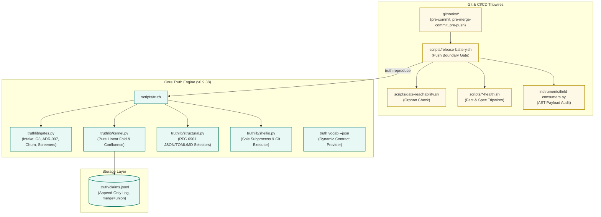
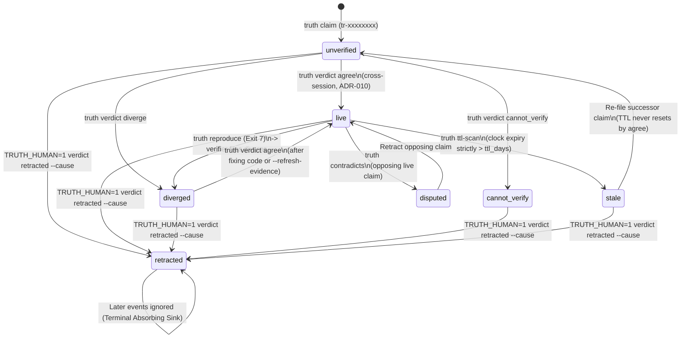
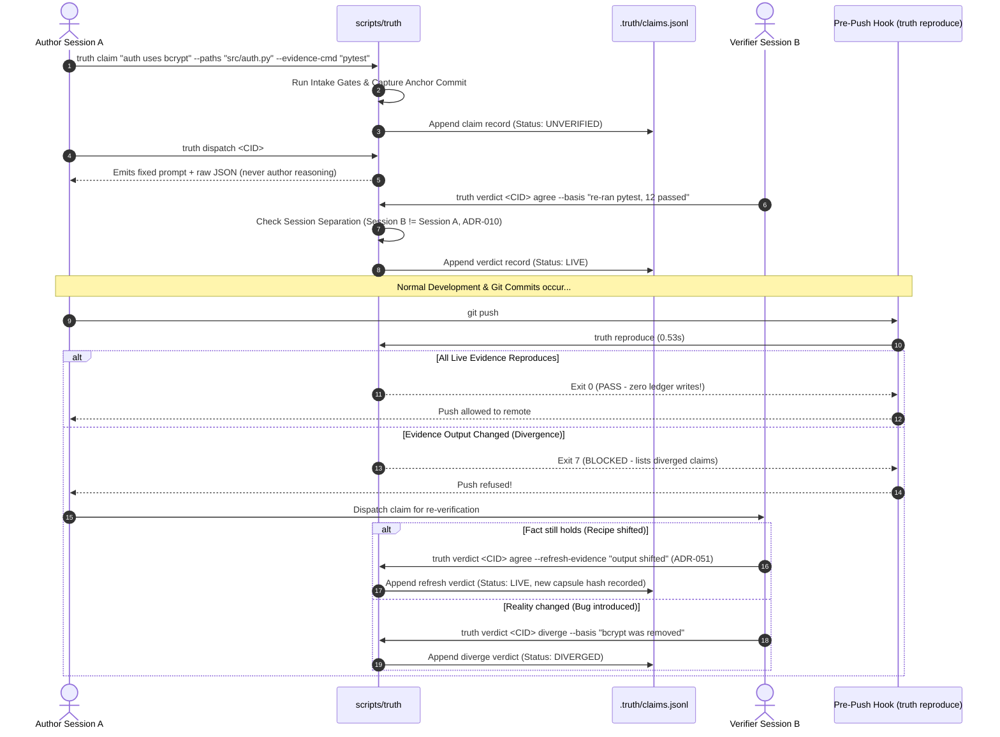

# The Truth Ledger, Explained End-to-End
**Field reference · system architecture.** A plain-language walkthrough of every layer, gate, hook, and deliberate loophole in a system built to keep AI coding agents' claims honest.

**Scope** CLI v0.9.38 · Living Specification (`template/docs/ARCHITECTURE.md`) · Historical Archive (`docs/archive/adr/`)

---

### The system in 90 seconds
Trusted facts about a codebase rot silently. This system files each one as a line in an append-only claim log, carrying the command whose output was hashed at a known commit. A pure fold replays that log to derive every claim's status — never stored, always recomputed. 

Direct execution at the push boundary (**`truth reproduce` running in ~0.5s on pre-push**) re-runs every live claim's evidence capsule and blocks on real divergence, completely eliminating the 96.4% false-alarm staling noise of earlier versions. Dedicated clock scans (**`truth ttl-scan`**) demote time-sensitive external facts when their TTL elapses. A second, independent session re-runs the evidence and judges whether it still supports the sentence. Work planning is then gated on the health of the facts it depends on.

The whole ambition is small: not to remember to distrust old knowledge, but to forget for you — loudly, deterministically, and on a git pre-push hook.

---

### Reading paths
* **"What is this — should I care?"** Read §00, glance at Fig. 0 & Fig. 1, stop.
* **About to use it (file claims, run verbs)?** §06 (intake refusals) → §07 (verification & reproduce) → §09 (what gates work). Full verb reference is in §14 and Appendix A.
* **Auditing the trust model?** §11 (hard vs soft rules) → §12 (accepted holes) → §13. One-line threat model: **drift, not adversaries**.
* **Need a specific term?** §14 is the complete glossary.

---

## 00 · The problem this solves
AI coding agents — and tired humans — constantly assert facts about a codebase: *"all tests pass,"* *"no other call sites exist,"* *"this endpoint is authenticated."* Those sentences get trusted, acted on, and then silently falsified by the next code change, with no record of how the fact was established and no mechanism to notice it died.

The truth ledger treats trusted facts like verified cache entries. Every one is filed as a structured record carrying a command whose output was hashed at a known commit. In v0.9.38, the system executes **Reproduce-on-Read**: before any code leaves the machine (`pre-push`), it directly re-runs the evidence capsules in ~0.5s. If reality changed, the push is blocked cold. A second, independent session re-runs the evidence and judges whether it still supports the sentence. Work planning is then gated on the health of the facts it depends on.

---

## 01 · Vocabulary, defined once
* **the ledger** — a single append-only file, `.truth/claims.jsonl` — one JSON object per line, nothing ever edited or deleted.
* **claim** — a record asserting a fact, tagged `VERIFIED` (command hashed), `INFERRED` (reasoned with basis), or `UNVERIFIED`.
* **evidence capsule** — what a `VERIFIED` claim carries: command, output hash, exit code, anchor commit, and watched targets/policies.
* **the fold** — a pure, clock-free function replaying ledger events in canonical `(ts, id, canon)` order to derive status fresh.
* **verdict** — a second opinion filed by a distinct session: `agree`, `diverge`, `cannot_verify`, or `retracted` (human-only).
* **reproduce** — the sub-second pre-push engine re-verifying all live capsules on-read without writing state to the ledger.
* **ttl-scan** — the dedicated clock-reader materializing time-to-live expirations (ADR-019).
* **premise** — a work item's declared dependency on a claim (*"task X only makes sense if fact Y is live"*).
* **tier** — a claim's cost-of-being-wrong label: `P0` (catastrophic) / `P1` (serious) / `P2` (minor).

---

## 02 · Big-picture architecture

```
┌─────────────────┐       ┌─────────────────┐       ┌─────────────────┐
│ 1. INTAKE GATES │ ────► │ 2. APPEND LOG   │ ────► │ 3. PURE FOLD    │
│ (Refuse noise)  │       │ (claims.jsonl)  │       │ (ts, id, canon) │
└─────────────────┘       └─────────────────┘       └────────┬────────┘
                                                             │
┌─────────────────┐                                          ▼
│ 5. REPRODUCE    │ ◄────────────────────────────── ┌─────────────────┐
│ (Pre-push 0.5s) │                                 │ 4. WORK KERNEL  │
└─────────────────┘                                 │ (truth ready)   │
                                                    └─────────────────┘
```
*Fig. 0 — The core architecture.*


```mermaid
flowchart TD
    subgraph GATES["Git & CI/CD Tripwires"]
        GitHooks[".githooks/*\n(pre-commit, pre-merge-commit, pre-push)"]
        Battery["scripts/release-battery.sh\n(Push Boundary Gate)"]
        Reachability["scripts/gate-reachability.sh\n(Orphan Check)"]
        HealthScripts["scripts/*-health.sh\n(Fact & Spec Tripwires)"]
        FieldAudit["instruments/field-consumers.py\n(AST Payload Audit)"]
    end

    subgraph ENGINE["Core Truth Engine (v0.9.38)"]
        CLI["scripts/truth"]
        Gates["truthlib/gates.py\n(Intake: G8, ADR-007, Churn, Screeners)"]
        Kernel["truthlib/kernel.py\n(Pure Linear Fold & Confluence)"]
        Structural["truthlib/structural.py\n(RFC 6901 JSON/TOML/MD Selectors)"]
        ShellIO["truthlib/shellio.py\n(Sole Subprocess & Git Executor)"]
        Vocab["truth vocab --json\n(Dynamic Contract Provider)"]
    end

    subgraph STORAGE["Storage Layer"]
        Ledger[(".truth/claims.jsonl\n(Append-Only Log, merge=union)")]
    end

    GitHooks --> Battery
    Battery --> Reachability
    Battery --> HealthScripts
    Battery --> FieldAudit
    Battery -->|truth reproduce| CLI

    CLI --> Gates
    CLI --> Kernel
    CLI --> Structural
    CLI --> ShellIO
    Kernel --> Ledger

    classDef prod fill:#e8f8f5,stroke:#117a65,stroke-width:2px;
    classDef gate fill:#fef9e7,stroke:#b7950b,stroke-width:2px;
    class CLI,Gates,Kernel,Structural,ShellIO,Vocab,Ledger prod;
    class GitHooks,Battery,Reachability,HealthScripts,FieldAudit gate;
```
*Fig. 1 — Full system topology.*

---

## 03 · Storage layer — one append-only file
Everything — facts, verdicts, work items — lives as a JSON line in `.truth/claims.jsonl`.

* **Append-only, enforced at commit (INV-A):** The `pre-commit` hook asserts that the staged ledger is an exact line-prefix extension of `HEAD`. Edits, deletions, and mid-file insertions are blocked.
* **Branches merge by union (`merge=union`):** Branch ledgers merge by concatenation without conflict markers. State convergence is guaranteed by the fold algebra.
* **Canonical Timestamps (ADR-015):** Strict 32-character UTC format (`YYYY-MM-DDTHH:MM:SS.ffffff+00:00`). Appending applies a clock-push (`tail + 1µs`) so string order strictly equals causal time order.

---

## 04 · Record kinds — seven, one envelope
Every line satisfies `claims.schema.json` ($id: `truth-ledger-record.v0.18`). Six envelope fields are required: `id`, `kind`, `actor`, `session`, `ts`, `payload`.

1. **`claim`** — Assertion with evidence class, cost tier, and evidence capsule.
2. **`verdict`** — `agree`, `diverge`, `cannot_verify`, or `retracted` (human-only, ADR-049 `--cause`).
3. **`invalidation`** — Mechanical TTL clock expiration (`reason_code: "ttl"`).
4. **`premise`** — Links a work item to a claim; supports `--supersedes` redirection (ADR-013/017).
5. **`issue`** — Work item (`wk-` id) with dependencies, premises, and optional acceptance oracle (`--accept-cmd`, ADR-014).
6. **`issue_event`** — Lifecycle transition: `claimed`, `released`, `closed`, `reopened`, `cancelled`.
7. **`contradicts`** — Declared mutual exclusion between two claims (drives `disputed`).

**The Envelope Admission Rule (ADR-046):** A payload field is admitted only if the fold or a blocking gate reads its value. Report-only data lives in Tier C instruments (`instruments/`), not in permanent records.

---

## 05 · Derivation layer — the fold, and a claim's life
Status is never stored. The fold sorts all events by `(ts, id, canon(payload))` and replays them:

* **Claim content is first-writer-wins (FWW):** The first record fixes text and evidence forever (ADR-006).
* **Status is last-writer-wins (LWW):** In fold order (ADR-020).
* **`retracted` is absorbing:** Once retracted, all subsequent verdicts are ignored (terminal sink).
* **The fold is clock-free (ADR-019):** Replaying the ledger produces identical results on any machine at any year.


```mermaid
stateDiagram-v2
    [*] --> unverified : truth claim (tr-xxxxxxxx)

    unverified --> live : truth verdict agree\n(cross-session, ADR-010)
    unverified --> diverged : truth verdict diverge
    unverified --> cannot_verify : truth verdict cannot_verify

    live --> diverged : truth reproduce (Exit 7)\n-> verifier files diverge
    live --> stale : truth ttl-scan\n(clock expiry strictly > ttl_days)
    live --> disputed : truth contradicts\n(opposing live claim)

    stale --> unverified : Re-file successor claim\n(TTL never resets by agree)
    diverged --> live : truth verdict agree\n(after fixing code or --refresh-evidence)
    disputed --> live : Retract opposing claim

    unverified --> retracted : TRUTH_HUMAN=1 verdict retracted --cause
    live --> retracted : TRUTH_HUMAN=1 verdict retracted --cause
    diverged --> retracted : TRUTH_HUMAN=1 verdict retracted --cause
    cannot_verify --> retracted : TRUTH_HUMAN=1 verdict retracted --cause
    stale --> retracted : TRUTH_HUMAN=1 verdict retracted --cause

    retracted --> retracted : Later events ignored (Terminal Absorbing Sink)
```
*Fig. 2 — The v0.9.38 Claim State Machine.*

---

## 06 · Intake gates — what refuses a filing
`truth claim` and `truth done --claim` run an ordered battery of intake gates (`INTAKE_GATES`). Any refusal leaves the ledger untouched.

### Daily Verbs Summary
| Verb | What it does for you |
| :--- | :--- |
| **`truth claim '…' --class …`** | File a fact; runs full intake refusal battery. |
| **`truth list --live`** | Show facts currently trusted (drop `--live` for all statuses). |
| **`truth queue`** | Human review queue: `diverged`, `cannot_verify` P0, and TTL-staled claims. |
| **`truth dispatch <id>`** | Emit fixed verifier prompt + raw record for a fresh session. |
| **`truth verdict <id> agree`** | File independent verification making a claim live (ADR-010). |
| **`truth reproduce`** | **Pre-Push Engine:** Re-run live capsules in ~0.5s. Exit 0: match, Exit 7: diverge, Exit 8: empty. |
| **`truth ttl-scan`** | Materialize clock TTL expirations into the ledger (ADR-019). |
| **`truth ready`** | Show unblocked work items whose premises are healthy (ADR-001). |
| **`truth impact <path>`** | Query what claims watch a file before editing (`--tree`, `--inverse`). |

### The Intake Battery Hierarchy

```
[Claim Filing] ──► 1. Text Non-Empty (G0)
               ──► 2. Near-Duplicate Check (G8: Jaccard >= 0.6) [Override: --duplicate-ok]
               ──► 3. Quantifier-Scope Gate (ADR-007) [Override: --scope-ok]
               ──► 4. Path & Dead-Tripwire Check (INV-M / ADR-024)
               ──► 5. Churn Budget & Max Paths [Override: --paths-ok / --watch-policy]
               ──► 6. Generated Paths Check (ADR-037) [Override: --generated-ok]
               ──► 7. Scope Decay Default (ADR-032: 30-day TTL on overrides)
               ──► 8. Class Precheck (VERIFIED needs command & paths/TTL)
               ──► [EXECUTION BOUNDARY: Safety Screen (ADR-009/021/040) -> Double-Run (G6)]
               ──► 9. Positive-Claim Exit Gate (ADR-035: Exit 0 required) [Override: --evidence-exit-ok]
               ──► [APPEND RECORD]
```
*Fig. 3 — The intake gate pipeline.*

---

## 07 · Verification — dispatch, verdict, and Reproduce-on-Read
Filing a claim does not make it trusted. It is born `unverified`; only an independent session's `agree` makes it `live`.


```mermaid
sequenceDiagram
    autonumber
    actor Author as Author Session A
    participant CLI as scripts/truth
    participant Log as .truth/claims.jsonl
    actor Verifier as Verifier Session B
    participant PrePush as Pre-Push Hook (truth reproduce)

    Author->>CLI: truth claim "auth uses bcrypt" --paths "src/auth.py" --evidence-cmd "pytest"
    CLI->>CLI: Run Intake Gates & Capture Anchor Commit
    CLI->>Log: Append claim record (Status: UNVERIFIED)

    Author->>CLI: truth dispatch <CID>
    CLI-->>Author: Emits fixed prompt + raw JSON (never author reasoning)

    Verifier->>CLI: truth verdict <CID> agree --basis "re-ran pytest, 12 passed"
    CLI->>CLI: Check Session Separation (Session B != Session A, ADR-010)
    CLI->>Log: Append verdict record (Status: LIVE)

    Note over Author,PrePush: Normal Development & Git Commits occur...

    Author->>PrePush: git push
    PrePush->>CLI: truth reproduce (0.53s)
    alt All Live Evidence Reproduces
        CLI-->>PrePush: Exit 0 (PASS - zero ledger writes!)
        PrePush-->>Author: Push allowed to remote
    else Evidence Output Changed (Divergence)
        CLI-->>PrePush: Exit 7 (BLOCKED - lists diverged claims)
        PrePush-->>Author: Push refused!
        Author->>Verifier: Dispatch claim for re-verification
        alt Fact still holds (Recipe shifted)
            Verifier->>CLI: truth verdict <CID> agree --refresh-evidence "output shifted" (ADR-051)
            CLI->>Log: Append refresh verdict (Status: LIVE, new capsule hash recorded)
        else Reality changed (Bug introduced)
            Verifier->>CLI: truth verdict <CID> diverge --basis "bcrypt was removed"
            CLI->>Log: Append diverge verdict (Status: DIVERGED)
        end
    end
```
*Fig. 4 — Verification, Reproduce-on-Read, and Capsule Refresh lifecycle.*

---

## 08 · Invalidation — how time expires facts mechanically
In v0.9.38, **code files are verified on-read by `reproduce`**, so file edits no longer generate fake `invalidation` records. 

Mechanical invalidation is strictly reserved for **Clock Expirations (`truth ttl-scan`)**:
* Facts about external systems (APIs, third-party docs) carry `--ttl-days N`.
* When `now - ts > ttl_days`, `truth ttl-scan` writes an `invalidation` record with `reason_code: "ttl"`.
* The fold demotes the claim to `stale`. A TTL-expired claim **must be re-filed with a new claim ID**, never re-verified (ADR-019).

---

## 09 · Policy layer — `truth ready`
`truth ready` gates task execution by intersecting unblocked work with the health of each issue's premises:

| Premise Status | Effect on Issue |
| :--- | :--- |
| **`live`** | Passes clean. |
| **`unverified`** | Passes with a warning annotation (low filing friction). |
| **`cannot_verify`** | Blocks issue if premise is `P0`; warns otherwise. |
| **`stale`, `diverged`, `disputed`, `retracted`, `missing`** | **Blocks issue unconditionally (shown as `HELD`).** |

### Escape Valves
* **Premise Supersede (ADR-013/017):** `truth premise <wk-id> <new-tr> --supersedes <old-tr>` redirects a dead premise to a corrected fact. Superseding a `retracted` premise requires human authority (`TRUTH_HUMAN=1`).
* **Acceptance Oracles (ADR-014):** `truth issue --accept-cmd "<cmd>"` binds an executable test to the task. `truth done` runs the oracle and refuses to close the issue if the command fails.

---

## 10 · Enforcement & hooks — what fires when

```
[Developer Edits Code] ──► PreToolUse Hook (truth-whisper.py) [Fails closed on docs/archive/, fails open with whisper]
[Session Starts]       ──► SessionStart Hook (truth-session-digest.py) [Injects queue and top live claims]
[git commit]           ──► pre-commit (check-truth.sh) [Strict append-only prefix check]
[git merge]            ──► pre-merge-commit (check-truth.sh) [Prevents merge commit corruption]
[git push]             ──► pre-push (release-battery.sh / truth reproduce) [Blocks on Exit 7 or Exit 8]
```
*Fig. 5 — The Git & Harness Hook Map.*

---

## 11 · Hard rules vs. soft rules

```
┌──────────────────────────────────────────────────────────────────────────────────┐
│ LAYER 1: PROSE NORMS (AGENTS.md) ──► Behavioral (Easily bypassed by LLMs)        │
├──────────────────────────────────────────────────────────────────────────────────┤
│ LAYER 2: HARNESS DENY (truth-whisper.py) ──► Fails closed on frozen archives     │
├──────────────────────────────────────────────────────────────────────────────────┤
│ LAYER 3: WORK KERNEL GATES (truth ready) ──► Blocks tasks on dead premises       │
├──────────────────────────────────────────────────────────────────────────────────┤
│ LAYER 4: CI & PRE-PUSH (truth reproduce) ──► Blocks pushes on broken evidence    │
├──────────────────────────────────────────────────────────────────────────────────┤
│ LAYER 5: COMMIT GATES (check-truth.sh) ──► Enforces append-only & schema         │
├──────────────────────────────────────────────────────────────────────────────────┤
│ LAYER 6: CORE REPLAY ALGEBRA (kernel.py) ──► Confluence (ts,id,canon), Absorbing │
└──────────────────────────────────────────────────────────────────────────────────┘
```
*Fig. 6 — The 6-Layer Enforcement Stack.*

* **Band 1 (Hard Technical Refusals):** Schema validation, append-only line prefix check, quantifier-scope refusals, exit-code gates, session separation, acceptance oracle gates, pre-push reproduce block.
* **Band 2 (Self-Attested Identity):** `TRUTH_SESSION`, `TRUTH_HUMAN=1` + `TRUTH_HUMAN_ACK=<id>`.
* **Band 3 (Conditional Gates):** Hooks depend on `core.hooksPath` or CI. `truth doctor` verifies this mechanically.
* **Band 4 (Behavioral Norms):** Discovery through `AGENTS.md`. An agent ignoring the ledger cannot corrupt it (failure mode is omission, never corruption).

---

## 12 · Accepted gaps, in plain words
1. **78% Shape Checking:** Most grep recipes check counts (`grep -c`), not values (`cat` / `sha256sum`). The system guarantees reproducibility of the recipe, not truth of the sentence.
2. **Tracked Symlinks:** Git tracks the symlink, not the target file.
3. **Single-Machine Concurrency:** `fcntl.flock` serializes same-machine writers. Multi-machine distributed concurrency relies on Git merge confluence.
4. **Behavioral Discovery:** An agent running in a hook-less harness that ignores instructions bypasses the tool (omission, not corruption).

---

## 13 · The shape of the whole thing
An event log, a pure derivation, intake refusal gates, sub-second pre-push verification, and a policy join — that is the entire mechanism.

**Core Philosophy:** Convert norms into refusals where a cheap pure predicate exists; where it doesn't, make the bypass visible and auditable; and make every layer's worst case omission, never corruption.

---

## 14 · Glossary

### Statuses
* **`unverified`** — Initial status of every claim.
* **`live`** — Confirmed by an independent session's agree verdict.
* **`stale`** — Clock TTL elapsed (`truth ttl-scan`).
* **`diverged`** — Evidence output no longer reproduces or verifier disagreed.
* **`cannot_verify`** — Missing tool or broken environment (Exit 127).
* **`disputed`** — Two live claims joined by an active `contradicts` edge.
* **`retracted`** — Human-gated terminal tombstone.

### Structural Selectors (`.truth/watch-policies`)
* **`package.json#/dependencies/stripe`** — RFC 6901 JSON pointer sub-tree watch.
* **`pyproject.toml#tool.ruff.lint`** — TOML table sub-tree watch.
* **`docs/specs/auth.md#§2-session-management`** — Markdown heading section watch.

---

## Appendix A — Commands Cheat Sheet

```bash
# Inspection & Health
make health                       # 360° health check (<1s)
truth reproduce                   # Re-run all live capsules (Exit 0: match, 7: diverge, 8: empty)
truth list --live                 # List active trusted facts
truth queue                       # Human triage queue

# Authoring & Verification
truth claim "<fact>" --class VERIFIED --evidence-cmd "<cmd>" --paths "<paths>" --tier P1
truth claim "<fact>" --class VERIFIED --evidence-cmd "<cmd>" --watch-policy <policy-name>
truth dispatch <id>               # Generate verifier prompt
truth verdict <id> agree --basis "<what was checked>"
truth verdict <id> agree --refresh-evidence "<basis>"  # When output legitimately changed

# Work Kernel
truth issue "<title>" --premise <tr-id> --accept-cmd "<test-cmd>"
truth ready                       # Show unblocked tasks with live premises
truth start <wk-id>               # Claim issue
truth done <wk-id> --basis "done" # Close issue (runs acceptance oracle)

# Administration & Maintenance
truth ttl-scan                    # Materialize TTL expirations
truth doctor                      # Verify hook wiring and repository health
make battery                      # Run full 11-arm release battery
```

---

## Appendix B — Frequently Asked Questions (FAQ)

* **Why was my claim refused?**
  Intake caught one of: missing evidence command on `VERIFIED`, quantifier without `--scope-ok`, unlisted command in `.truth/evidence-allow`, dead glob pattern, positive claim with non-zero exit code (ADR-035), or broad watch exceeding churn floor without `--paths-ok`.
* **Why did my push fail on `reproduce` (Exit 7)?**
  A live claim's evidence command output changed on your branch. Run `truth reproduce` to see the failing claim. If the code broke, fix the code. If the output legitimately shifted, file an agree with `--refresh-evidence "<basis>"`.
* **Can I edit or delete a record in `.truth/claims.jsonl`?**
  **Never.** The ledger is strictly append-only. To correct a fact, retract it (`--cause restated --successor <new-id>`) and append the new claim.
* **Why does `truth ready` say `HELD`?**
  An issue's premise claim is no longer `live` (it diverged, staled on TTL, or was retracted). Fix the premise fact or redirect it using `truth premise <wk-id> <new-id> --supersedes <old-id>`.