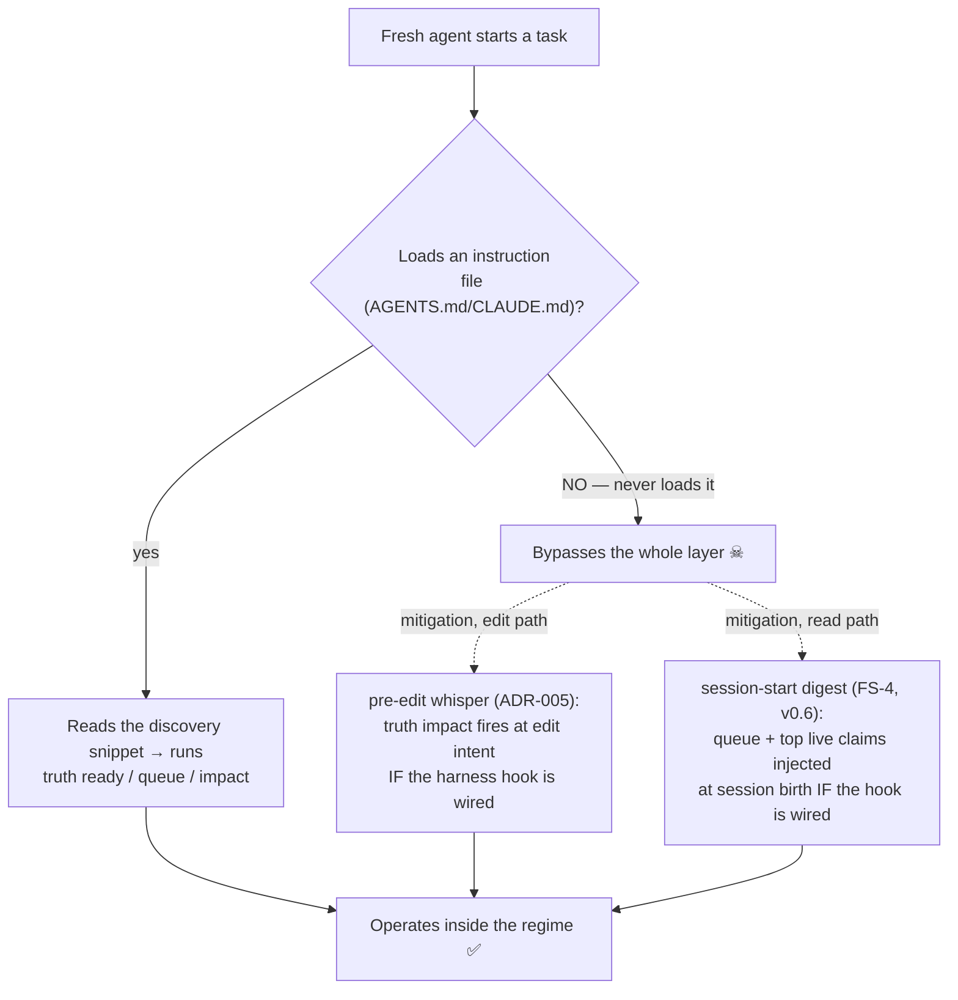
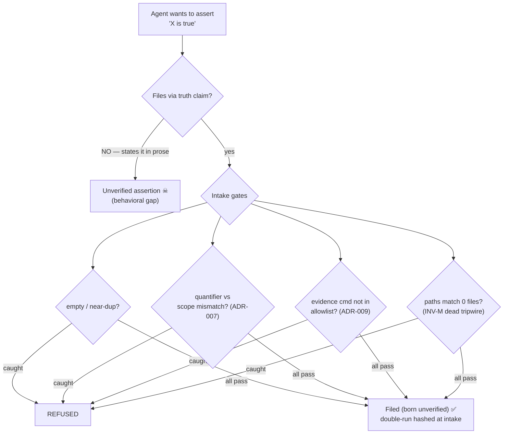
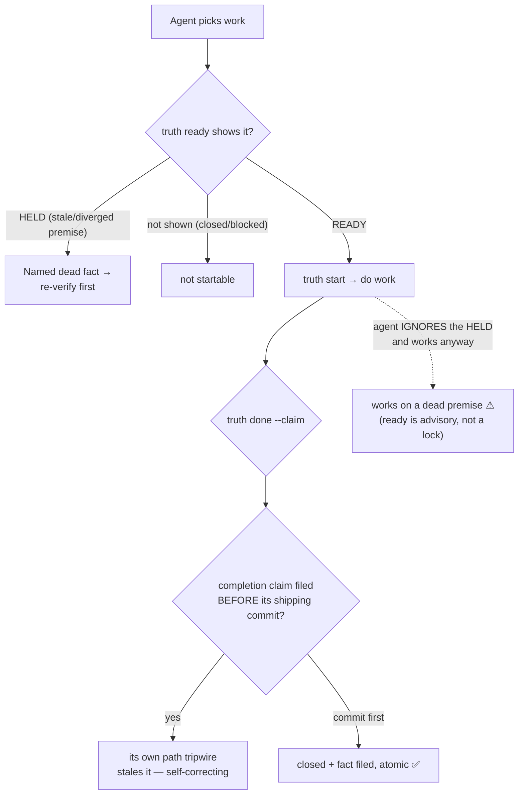
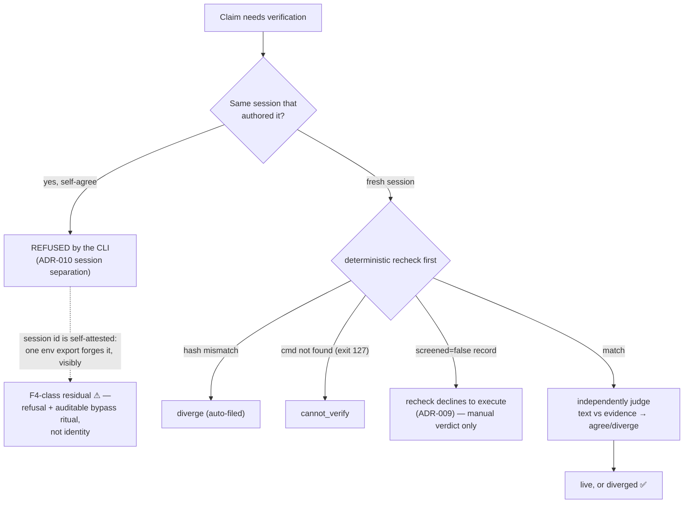
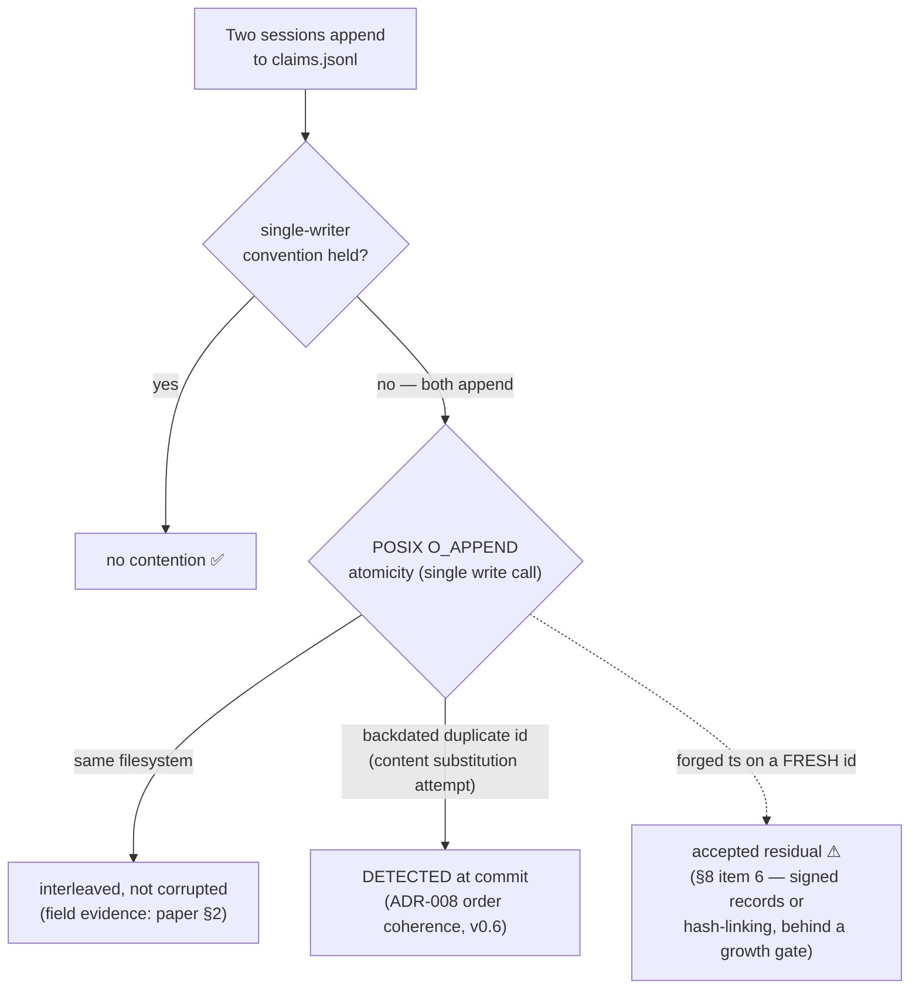

# The Loophole Map — Five Agent Events, Simulated

> Reader: anyone assessing what the truth ledger can and cannot enforce against agent behavior | Enables: knowing, per event type, which gates are CLI refusals and which residuals are behavioral — and what the worst case actually is | Update-trigger: a gate ships or a residual closes (current: CLI v0.6.4)

Provenance: adapted from a second-deployment session walkthrough
(repo `temporal-go-agent-sdk`, 2026-07 — the same session behind
`docs/field-notes-sdk-session.md`; pre-v0.6 knowledge in places);
corrected against CLI v0.6.3 and the paper v2 on 2026-07-12. Session-specific references generalized to their paper
citations. Semantics source of truth: `.truth/README.md`, the ADRs, and
[the paper](truth-ledger-paper-v2.md) — this document is a walkthrough,
not a second home for any contract.

## A. Fresh Agent Arrives (Bootstrap / Discovery)

**Loophole:** the one real structural hole — an agent that never reads
an instruction file and runs in a hook-less harness skips everything.
Known and documented (paper §8 item 5). Mitigated on three fronts, not
eliminated: doctor's G2 discovery check (plus the v0.6.3 work-kernel
discovery warn, which catches the half-documented case — facts named,
work verbs not), the ADR-005 whisper at edit intent, and the FS-4
digest at session birth. Hook-capable harnesses now have both session
entry points covered structurally; the hook-less harness remains the
ledger's outer boundary, by design.

---

## B. Agent Asserts a Fact (Truth Claim)

**Loophole:** only B's top branch — an agent can talk without filing
(behavioral, paper §1). Once it uses the CLI, the intake gates are
refusals, not warnings — the quantifier–scope gate targets the paper's
dominant real failure shape (both pilot divergences, paper §2). The
gates drawn are the agent-relevant subset; the full refusal list (G1
anchor, G6 determinism, INFERRED basis, …) is in §1 of the paper. One
narrow residual *inside* the protection metadata (found in the
meta-repo, 2026-07-13): INV-M checks that a literal path matches a
tracked file, but a tracked **symlink** passes and can never fire —
git sees only the unchanging link, not the target. Watch real paths.
Otherwise: no technical hole inside `claim`.

---

## C. Agent Starts & Finishes Work (Ready → Start → Done)

**Loophole:** `ready` is a policy join, not a lock — `truth start`
checks only the status transition, never premise validity, so a
determined agent can work a HELD item (C's dashed path). But the
premise gate makes the risk visible with the dead fact named, and
`done` still files a checkable claim. The one gap the machinery doc
flags as proposed-next: `--accept-cmd` (make `done` refuse until a
finish-line command passes). Not yet shipped — today `done` takes the
agent's word on the *acceptance criterion* (the completion claim's
evidence, if VERIFIED, still runs through intake). That's the honest
residual (upstream truth-ledger#1).

**The HELD dead-end has an exit since v0.6.4 (ADR-013):**
`truth premise <issue> <new-tr> --supersedes <old-tr>` redirects a
genuinely dead premise to its corrected claim — refused while the old
premise is live or unverified (the states needing no rescue), judged by
the same ADR-001 matrix after.
But note the **inherited residual**: a fresh *unverified* replacement
passes that matrix with only a warning, so a drifting agent could free
its own HELD work by filing a plausible unverified "correction." This
is ADR-001's unverified-passes trade surfacing through one more door,
not a new hole — and the redirect record permanently names who opened
it, with the replacement claim sitting in the ledger for any verifier
to attack.

---

## D. Agent Verifies a Claim (Dispatch → Verdict)

**Loophole:** since v0.6 (ADR-010), same-session `agree` is a CLI
*refusal* (canary V-faults), not a convention — the earlier framing
"the ledger cannot enforce it" is outdated. What remains behavioral is
*identity*: `session` is env-derived and self-attested, so a bypass
costs one visible, attributable env export (`TRUTH_SELF_VERDICT=1`) —
F4's trust class, adopted knowingly (defense against drift, not
adversaries). Asymmetric by design: self-`diverge` and
self-`cannot_verify` stay allowed — self-incrimination runs against
interest. The recheck half is enforced mechanically, including the
ADR-009 refusal to execute unscreened evidence in a verifier session.

**Second hazard — the scribe (ADR-010 amendment, 2026-07-13):** the
gate keys on the *record's* session, so a courier scribing another
session's verdict misfires it both ways — an author-courier gets a
genuinely independent `agree` refused, and a true self-verdict
launders through any other scribe. Operating rule: verifiers file
their own verdicts; an unavoidable scribe files under the verifier's
identity (`TRUTH_SESSION=<verifier-session>`).

---

## E. Concurrent Sessions Write the Ledger

**Loophole:** the duplicate-id-with-backdated-timestamp substitution —
the paper's one admitted-undefended attack — is **no longer
undefended**: since v0.6, `validate` (and therefore the commit gate)
fails any duplicate id whose timestamp sorts before the record it
duplicates (ADR-008, canary B-faults; file order is append order under
the INV-A prefix gate, so backdating is visible). The residual that
remains *accepted, not detected*, is timestamp forgery on a fresh,
non-duplicate id — closable only by signed records or hash-linking
(paper §10), deferred behind the growth gate: build it when the first
forged timestamp is found in the wild. Not reachable by an honest
agent.

---

## Verdict — The Loopholes, Ranked

| Event | Loophole | Enforced or behavioral? | Status |
|---|---|---|---|
| A. Bootstrap | Agent never loads instructions, hook-less harness | Behavioral (mitigated: G2 check + v0.6.3 kernel warn, whisper, FS-4 digest) | Known, §8.5 |
| B. Assert | Talks without filing | Behavioral | Known, §1 |
| C. Finish | `done` trusts the acceptance criterion (no `--accept-cmd`); a supersede can free HELD work with an unverified replacement (warned, auditable) | Behavioral | accept-cmd: proposed-next (upstream #1); HELD exit: ADR-013, v0.6.4 |
| D. Verify | Self-`agree` refused; session identity self-attested | Enforced as refusal; bypass is one visible export (F4 class) | ADR-010, v0.6 |
| E. Concurrent | Fresh-id timestamp forgery (dup-id substitution now detected) | Accepted residual | §8.6, ADR-008 |

---

Every loophole this walkthrough finds is a documented, accepted limit —
and they share one root: the gates that are enforced are refusals
inside the CLI (intake, verdict separation, recheck, order coherence,
tripwires, append atomicity), while the residuals live at the
behavioral boundary where an agent must choose to use the regime, plus
one accepted forgery residual behind a growth gate. Nothing produces
silent inconsistency: the worst case is an agent that ignores the
layer, which leaves the ledger untouched and still valid, not
corrupted.

**Bottom line:** there is no path where *following* the regime leaves
the project inconsistent, and the only state an *ignoring* agent can
create is "no new records." The append-only design means the failure
mode is omission, never corruption. The single highest-value residual
to shrink is C — `--accept-cmd`, already filed upstream as
truth-ledger#1.
