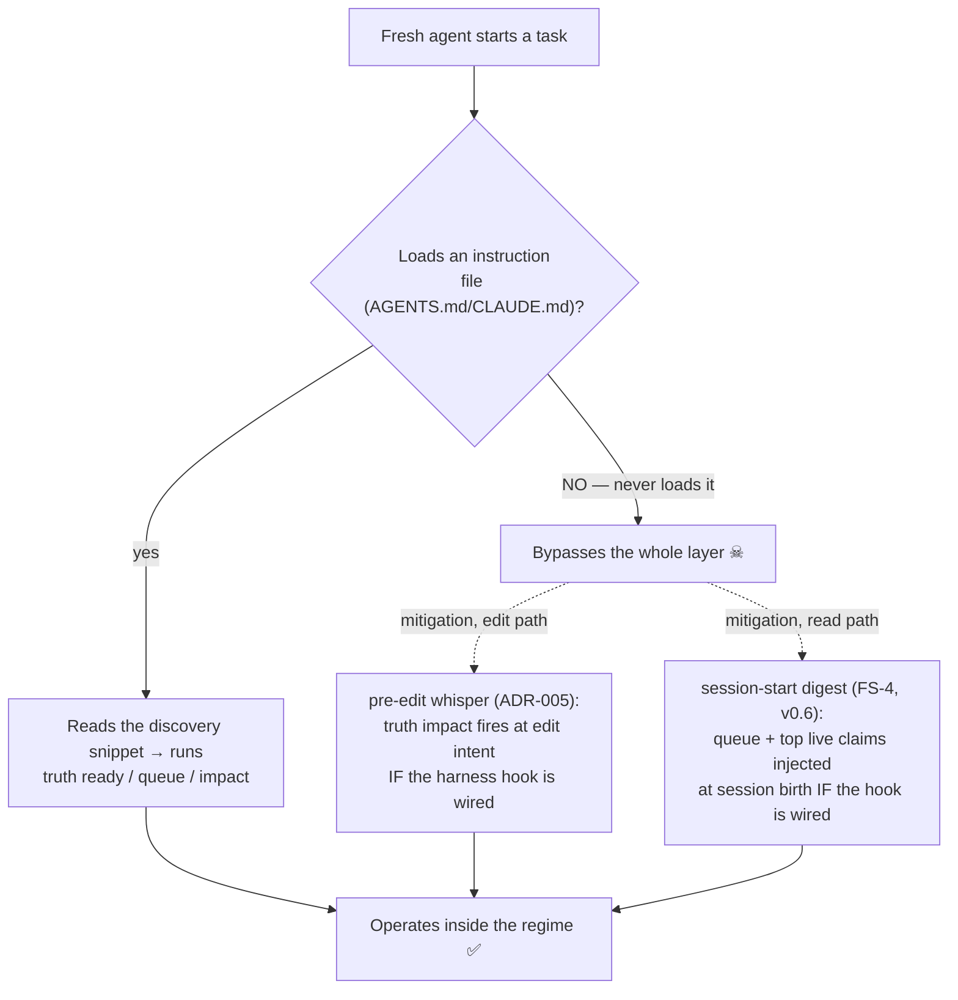
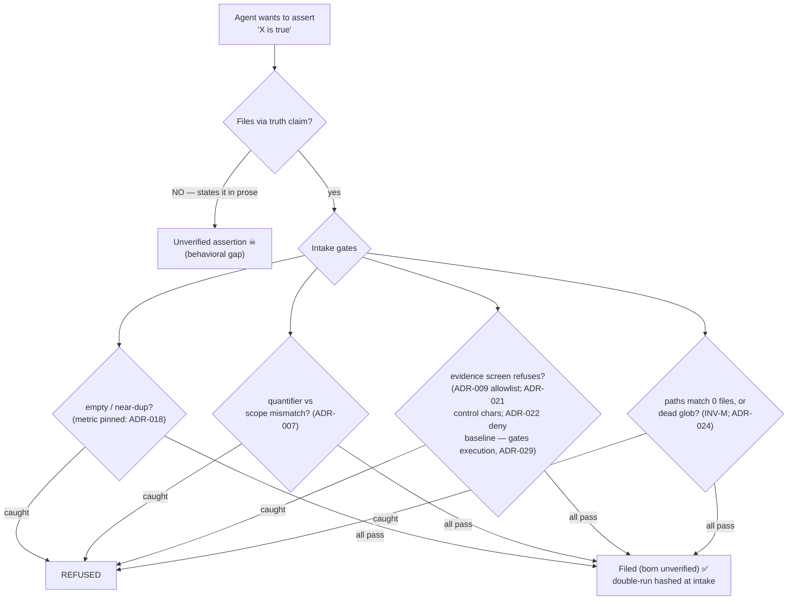
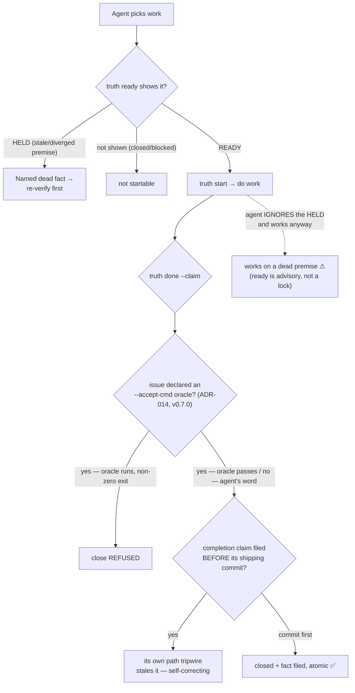
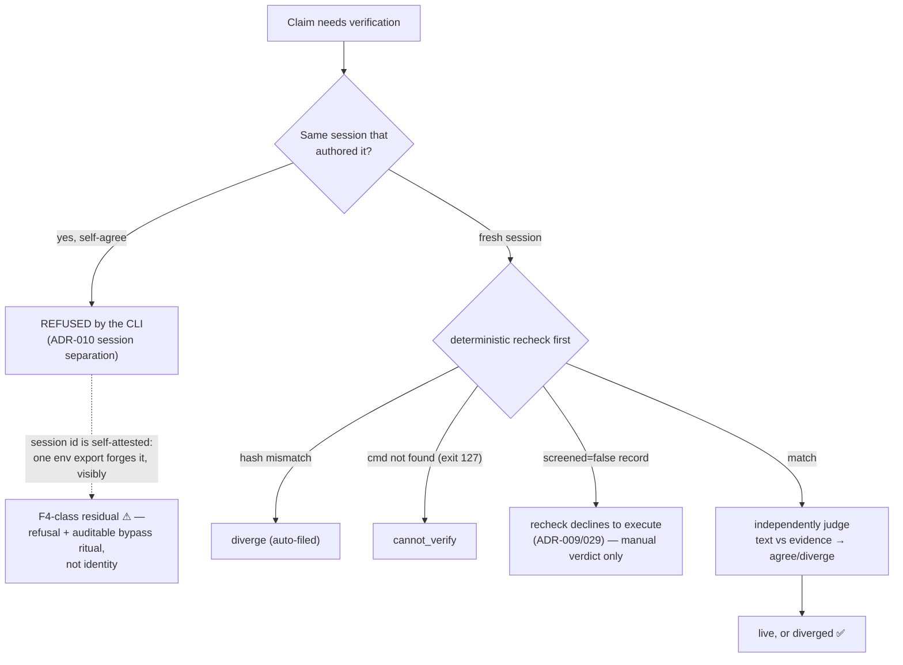
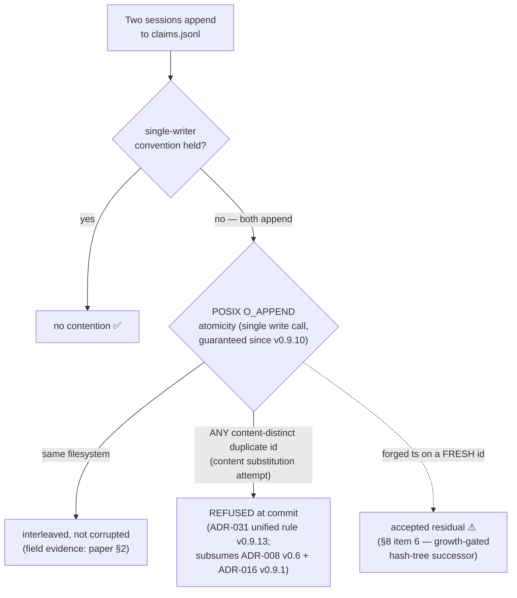

# The Loophole Map — Five Agent Events, Simulated

> Reader: anyone assessing what the truth ledger can and cannot enforce against agent behavior | Enables: knowing, per event type, which gates are CLI refusals and which residuals are behavioral — and what the worst case actually is | Update-trigger: a gate ships or a residual closes (current: CLI v0.9.14 — content re-synced at v0.9.13 on 2026-07-20, ADR-032/033 override-decay content added 2026-07-21; header pinned in lockstep by TestCrossSurfaceVersions since v0.9.13)

Provenance: adapted from a second-deployment session walkthrough
(repo `temporal-go-agent-sdk`, 2026-07 — the same session behind
`docs/field-notes-sdk-session.md`; pre-v0.6 knowledge in places);
corrected against CLI v0.6.3 and the paper v2 on 2026-07-12;
content re-synced against CLI v0.9.13, `template/CHANGELOG.md`, and
the paper v3 on 2026-07-20. Session-specific references generalized
to their paper citations. Semantics source of truth:
`.truth/README.md`, the ADRs, and
[the paper](truth-ledger-paper-v3.md) — this document is a walkthrough,
not a second home for any contract.

## A. Fresh Agent Arrives (Bootstrap / Discovery)

**Loophole:** the one real structural hole — an agent that never reads
an instruction file and runs in a hook-less harness skips everything.
Known and documented (paper §8 item 5). Mitigated on three fronts, not
eliminated: doctor's G2 discovery check (plus the v0.6.3 work-kernel
discovery warn, which catches the half-documented case — facts named,
work verbs not), the ADR-005 whisper at edit intent, and the FS-4
digest at session birth. Hook-capable harnesses now have both session
entry points covered structurally; the hook-less harness remains the
ledger's outer boundary, by design. **Status at v0.9.13: unchanged —
still open, still the outer boundary.**

---

## B. Agent Asserts a Fact (Truth Claim)

**Loophole:** only B's top branch — an agent can talk without filing
(behavioral, paper §1). Once it uses the CLI, the intake gates are
refusals, not warnings — the quantifier–scope gate targets the paper's
dominant real failure shape (both pilot divergences, paper §2). The
gates drawn are the agent-relevant subset; the full refusal list (G1
anchor — floored since v0.9.9/ADR-027, G6 determinism, INFERRED basis,
…) is in §1 of the paper. Since the v0.6.4 sync the gates got strictly
tighter: the screen refuses ASCII control characters except tab
(v0.9.6/ADR-021 — closing a live newline-smuggling bypass, see D), a
template-owned deny baseline refuses shells and generic executors even
when a consumer accidentally allowlists one (v0.9.7/ADR-022,
evidence screen only), statically dead globs over unreachable
namespaces are refused at intake (v0.9.8/ADR-024; a dormant glob over a
*reachable* namespace legitimately passes, ADR-023), and a
`--duplicate-ok` override now stamps `overridden_duplicates` into the
record — attackable ledger content instead of a traceless bypass
(v0.9.2).

**Also closed since v0.9.14 — scope-ok rot.** E2's `--scope-ok`
override, once filed, used to sit live forever with nothing re-asking
whether the scope judgment still held. ADR-032 stamps a default 30-day
TTL on any `--scope-ok` filed without an explicit `--ttl-days`; on
expiry ADR-030 arm 1 routes it to re-file, re-firing E2 rather than
trusting the sentence permanently. ADR-033 gives the adoption gate its
instrument: `truth stats`'s `overrides` section counts filings and
decay expiries, and non-blockingly flags a justification re-filed with
an identical token set after its prior died — evadable by a single
word edit, so the raw counters, not the advisory, are what an audit
actually reads (paper §8 item 8).

One narrow residual *inside* the protection metadata remains open
(found in the meta-repo, 2026-07-13; named the undecidable residual by
ADR-024): INV-M checks that a literal path matches a tracked file, but
a tracked **symlink** passes and can never fire — git sees only the
unchanging link, not the target. Watch real paths.

**New named residual since v0.6.4 — the hollow VERIFIED** (two real
instances, field-notes-batch-m): `claim --class VERIFIED` files on
*determinism* (the double-run hash-matches), not on exit 0, so a
stably-failing probe files clean and "rechecks" forever by stable
failure. Narrowed v0.9.11, not closed: intake now prints a
non-blocking stderr warning when the captured evidence exit code is
non-zero (a non-zero-but-stable probe can be a legitimate fact, so it
never refuses). Also documented, not a hole (ADR-029): the
`--evidence-unsafe-ok` escape hatch bypasses the *whole* screen at
intake — including the deny baseline — but the command runs in the
author's own session (no new capability), lands `screened: false`, and
recheck refuses it forever after.

---

## C. Agent Starts & Finishes Work (Ready → Start → Done)

**Loophole:** `ready` is a policy join, not a lock — `truth start`
checks only the status transition, never premise validity, so a
determined agent can work a HELD item (C's dashed path). But the
premise gate makes the risk visible with the dead fact named, and
`done` still files a checkable claim.

**`--accept-cmd` is no longer proposed-next — it shipped (v0.7.0,
ADR-014, closing upstream truth-ledger#1):** an issue may declare an
executable finish line at birth, and `done` runs it from the repo root
and refuses the close on non-zero exit — "done" stops being the
agent's word. The oracle is screened against its own committed
allowlist (`.truth/accept-allow`; exact repo-relative path entries
allowed since v0.7.2), never the read-only evidence list. What remains
is the honest residual in its new, narrower shape: the oracle is
**opt-in per issue** — an issue filed without `--accept-cmd` still
closes on the agent's word — and `--accept-unsafe-ok` at `done` closes
without executing an oracle that *cannot* run (unscreened /
unscreenable), stamped `executed: false` on the event; it never
overrides an oracle that ran and failed. Also closed since the sync
(v0.9.9, ADR-028): a raw-appended *future-dated* issue record used to
let `done`/`--cancel` report a transition the fold silently dropped —
now refused honestly at intake and caught at the gate; a lone
future-dated issue record still commits but is inert-and-visibly-so
(disclosed residual — `validate` is clock-free by design).

**The HELD dead-end has an exit since v0.6.4 (ADR-013):**
`truth premise <issue> <new-tr> --supersedes <old-tr>` redirects a
genuinely dead premise to its corrected claim — refused while the old
premise is live or unverified (the states needing no rescue), judged by
the same ADR-001 matrix after.
The **inherited residual** here has since been *narrowed* (v0.9.3,
ADR-017): superseding a **retracted** premise now requires the ADR-011
human gate (TRUTH_HUMAN + typed-id ack), so an agent can no longer
spend a human retraction at the readiness layer — the independent
review's C3 finding, confirmed live and closed. What remains: for the
*mechanical* dead states (stale / diverged / cannot_verify / missing —
no human decided those, so they stay ungated), a fresh *unverified*
replacement still passes the matrix with only a warning, so a drifting
agent could free its own HELD work by filing a plausible unverified
"correction." This is ADR-001's unverified-passes trade surfacing
through one more door, not a new hole — and the redirect record
permanently names who opened it, with the replacement claim sitting in
the ledger for any verifier to attack.

---

## D. Agent Verifies a Claim (Dispatch → Verdict)

**Loophole:** since v0.6 (ADR-010), same-session `agree` is a CLI
*refusal* (canary V-faults), not a convention — the earlier framing
"the ledger cannot enforce it" is outdated. What remains behavioral is
*identity*: `session` is env-derived and self-attested, so a bypass
costs one visible, attributable env export (`TRUTH_SELF_VERDICT=1`) —
F4's trust class, adopted knowingly (defense against drift, not
adversaries). Asymmetric by design: self-`diverge` and
self-`cannot_verify` stay allowed — self-incrimination runs against
interest. The recheck half is enforced mechanically, including the
ADR-009 refusal to execute unscreened evidence in a verifier session —
and that refusal's screen was itself hardened since the sync: an
independent code review found a **live bypass** (v0.9.6, ADR-021 —
the screen tokenized with shlex, the executor ran /bin/sh, and a
newline smuggled an unscreened command into a verifier's recheck),
closed by refusing ASCII control characters so the screen's token
stream soundly over-approximates the shell's; the same review moved
the stated security boundary to the bare-name **allowlist** (a deny
table cannot bound a VCS), and v0.9.7's ADR-022 deny baseline now
stops a verifier from executing an accidentally-allowlisted shell.

**Second hazard — the scribe (ADR-010 amendment, 2026-07-13):** the
gate keys on the *record's* session, so a courier scribing another
session's verdict misfires it both ways — an author-courier gets a
genuinely independent `agree` refused, and a true self-verdict
launders through any other scribe. Operating rule: verifiers file
their own verdicts; an unavoidable scribe files under the verifier's
identity (`TRUTH_SESSION=<verifier-session>`).

**New since v0.6.4 — batch reaffirmation (v0.9.12, ADR-030):**
`truth reaffirm` automates exactly the mechanical half of
re-verification (re-confirming unchanged evidence of an
already-agreed claim) through the *same* screened recheck path as
`verdict --recheck`. Its guardrails are refusal-shaped: a hash
**mismatch files nothing** — never an auto-diverge, never an
auto-agree (INV-S, canary FAULT RA; the claim is listed for real
dispatch), and TTL-staled, unscreened, no-evidence, never-agreed, and
same-session claims all skip with stated reasons. It brings **three
new residuals**, named in ADR-030:

1. **Self-verdict batch amplification** — `TRUTH_SELF_VERDICT=1`
   bypasses the ADR-010 seam for *one* claim on a manual agree, but
   for **every same-session claim in the sweep** here; reaffirm
   prints a loud stderr warning naming the override and the count it
   auto-agreed. Same F4 trust class, batch edition.
2. **Coverage narrower than the watch** — the match arm re-agrees
   whenever the evidence *command output* is unchanged, even when the
   watched-but-unread path change is exactly what staled the claim;
   the agree's anchor advance then buries that change outside every
   future scan window. Each such clearance is recorded in the agree's
   `reaffirm_cleared` audit field (`{prior_anchor, touched}` — replay
   every burial from the ledger), but auditability is not judgment:
   **keep evidence commands as wide as their evidence_paths**, or
   reaffirm silently re-agrees claims whose watched paths moved.
3. A raw-appended invalidation with a **forged reason** remains the
   general §8-item-6 forged-record residual — narrowed, not closed, by
   the scan's structured `reason_code: "ttl"` stamp, which a later
   free-text forgery can no longer flip into the auto-agree path.

---

## E. Concurrent Sessions Write the Ledger

**Loophole:** the duplicate-id content-substitution attack — the
paper's one admitted-undefended attack — is now refused in **every**
`ts` shape by **one rule (ADR-031, v0.9.13)**: `validate` (and
therefore the commit gate) fails any record whose id duplicates an
earlier line's and whose canonical content differs — earlier, equal,
*or later* timestamp. That unification subsumes the two accreted
detections this map used to narrate separately (ADR-008's backdated
shape, v0.6; ADR-016's copied-equal-ts shape, v0.9.1) and also closes
the later-ts distinct duplicate that was previously accepted as
"harmless under first-wins" — harmless to the fold, but a confusion
surface for greps, log readers, and partial-stream consumers, and a
free slot to park content under a trusted id. Corrections file under
fresh ids by design, so no legitimate content-distinct duplicate
exists; the byte-identical union-merge line is the one legal duplicate
and still passes. The comparison never parses a timestamp, so no
forged-ts encoding routes around it. The fold's `(ts, id, canon)`
total order (ADR-016) is untouched and keeps union merges confluent.

Also closed since the v0.6.4 sync, on the honest-writer side: a
non-CLI writer using `Z` or a non-UTC offset could silently misorder
events — v0.8.1 (ADR-015) mandates one canonical UTC timestamp profile
in schema and mirror, with a bounded clock-push at append; and v0.9.10
made the append a single `write(2)` call even for oversized records,
restoring the premise the concurrent-append safety statement relies
on.

**Conditionality, made loud (ADR-025, v0.9.8 → v0.9.11):** all of the
above detection runs at the commit gate, so INV-A/INV-G/INV-N and the
ADR-031 refusal are *conditional on the gate actually running*.
`doctor` now decides the hook-or-CI question mechanically, and since
v0.9.11 every **write verb** prints a loud stderr banner in an unwired
clone — fail-open with noise, never a refusal.

The residual that remains *accepted, not detected* is timestamp
forgery on a fresh, non-duplicate id — closable only by signed or
hash-linked records (paper §10), deferred behind the growth gate:
build it when the first forged timestamp is found in the wild. Not
reachable by an honest agent.
*(Correction 2026-07-20: "hash-linking" here meant a linear
prev-hash chain, which a red-team falsified for this regime; the named
growth-gate successor is the hash-TREE design in `docs/growth-gate/` —
paper v3 §10.)*

---

## Verdict — The Loopholes, Ranked

| Event | Loophole | Enforced or behavioral? | Status |
|---|---|---|---|
| A. Bootstrap | Agent never loads instructions, hook-less harness | Behavioral (mitigated: G2 check + v0.6.3 kernel warn, whisper, FS-4 digest) | Known, §8.5 — unchanged at v0.9.13 |
| B. Assert | Talks without filing; hollow VERIFIED (stably-failing probe files on determinism, not exit 0); `--scope-ok` justification rot (filed once, never re-examined) | Behavioral; hollow VERIFIED warned, never refused; scope-ok rot countered by default expiry, advisory non-blocking and evadable | Known, §1; warning v0.9.11. Symlink-tripwire residual open (ADR-024). Scope-ok decay ADR-032/033 v0.9.14 |
| C. Finish | `done` trusts the word only where no oracle was declared (`--accept-cmd` shipped v0.7.0/ADR-014, closed upstream #1); a supersede can free HELD work with an unverified replacement — mechanical dead states only, warned, auditable | Oracle: enforced at close, opt-in per issue; supersede: retracted door human-gated | ADR-014 v0.7.0; ADR-017 v0.9.3; HELD exit ADR-013 v0.6.4 |
| D. Verify | Self-`agree` refused; session identity self-attested; reaffirm adds batch self-verdict amplification (loud) + coverage-narrower-than-watch auto-clear (audited via `reaffirm_cleared`) | Enforced as refusal; bypass is one visible export (F4 class); mismatch never auto-agreed (INV-S) | ADR-010 v0.6; screen bypass closed ADR-021 v0.9.6; reaffirm ADR-030 v0.9.12 |
| E. Concurrent | Fresh-id timestamp forgery (dup-id substitution refused in EVERY ts shape — one rule) | Accepted residual; detection gate-conditional (ADR-025, banner v0.9.11) | §8.6; ADR-031 v0.9.13 (subsumes ADR-008/016) |

---

Every loophole this walkthrough finds is a documented, accepted limit —
and they share one root: the gates that are enforced are refusals
inside the CLI (intake, verdict separation, recheck, order coherence,
tripwires, append atomicity, acceptance oracles), while the residuals
live at the behavioral boundary where an agent must choose to use the
regime, plus one accepted forgery residual behind a growth gate.
Nothing produces silent inconsistency: the worst case is an agent that
ignores the layer, which leaves the ledger untouched and still valid,
not corrupted.

**Bottom line:** there is no path where *following* the regime leaves
the project inconsistent, and the only state an *ignoring* agent can
create is "no new records." The append-only design means the failure
mode is omission, never corruption. The former highest-value residual
— C's `--accept-cmd` — shipped at v0.7.0 (ADR-014); the highest-value
residuals to shrink now are operational disciplines with named audit
trails: keep evidence commands as wide as their watch paths so
reaffirm's auto-clear stays honest (ADR-030), declare acceptance
oracles on real work, and keep the commit gate wired (the v0.9.11
banner tells you when it is not).
