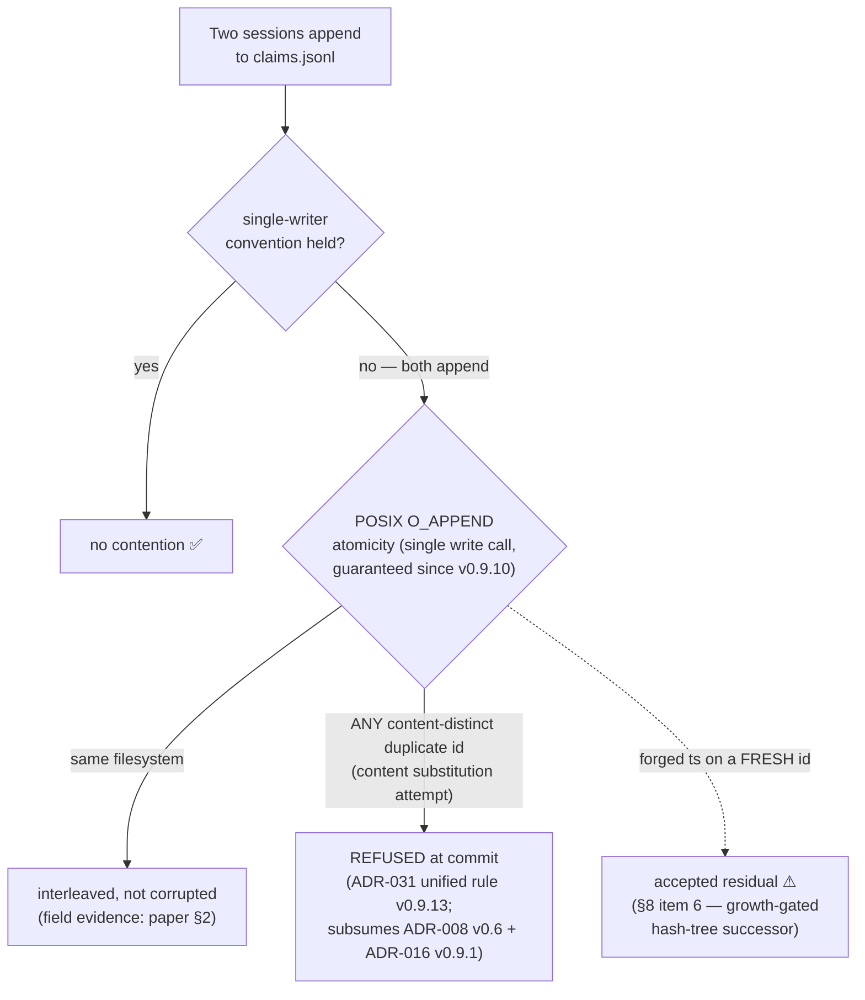
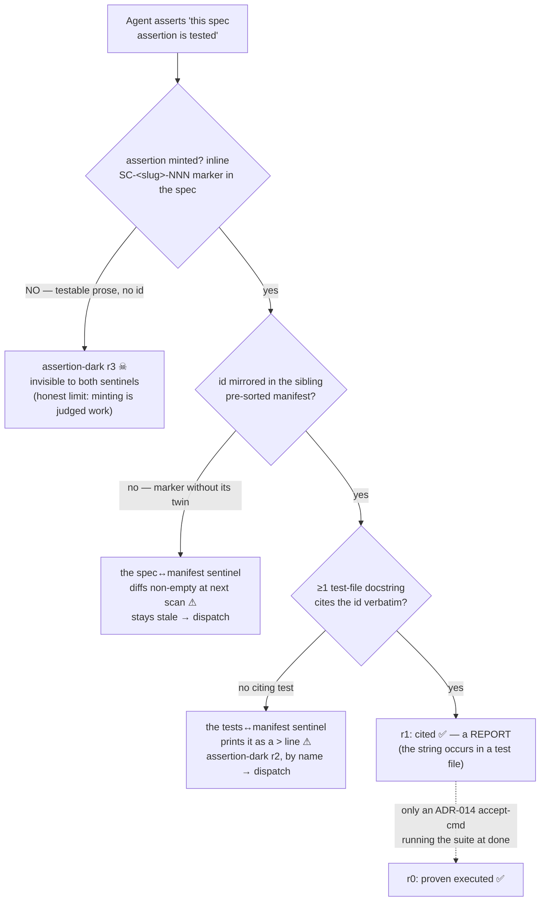

# The Loophole Map — Six Agent Events, Simulated

**Reader:** Anyone assessing what the truth ledger can and cannot enforce against autonomous agent behavior.  
**Scope:** CLI v0.9.38 · Living Specification (`template/docs/ARCHITECTURE.md`)  
**Update-trigger:** a gate ships or a residual closes (current: CLI v0.9.38 — this stamp is pinned in lockstep with the CLI docstring by `TestCrossSurfaceVersions`, ADR-026; the scope note above moves only on a real content re-sync).  
**Core Threat Model:** **Drift and omission, not motivated cryptographic adversaries.** Bypasses cost visible, attributable records in Git history.

---

## The Six Agent Events

```
  [A. BOOTSTRAP]  ──► Agent arrives: reads AGENTS.md or bypasses silently
  [B. ASSERT]     ──► Agent files fact: INTAKE_GATES enforce syntax, quantifiers & churn
  [C. WORK]       ──► Agent executes task: truth ready blocks on dead premises; done runs oracle
  [D. VERIFY]     ──► Independent check: ADR-010 enforces session separation; ADR-051 gates refresh
  [E. CONCURRENT] ──► Merging branches: Total order (ts, id, canon) guarantees union confluence
  [F. CITE]       ──► Living prose: fact-health & spec-health tripwire dead citations
```

---

### Event A · Fresh Agent Arrives (Bootstrap & Discovery)
* **The Scenario:** An AI agent starts a session in the repository.
* **The Enforcement:**
  * `truth-session-digest.py` (SessionStart hook) injects the triage queue and active P0/P1 claims directly into context.
  * `truth-whisper.py` (PreToolUse hook) intercepts file edit intents, whispering impacted claims before changes occur.
* **The Loophole (Behavioral Boundary):** An agent running in a harness without hooks that never reads `AGENTS.md` bypasses the tool entirely.
* **Worst-Case Failure Mode:** **Omission, never corruption.** An oblivious agent creates no ledger records; the existing ledger remains 100% valid.

---

### Event B · Agent Asserts a Fact (`truth claim`)
* **The Scenario:** An agent files an assertion (`VERIFIED`, `INFERRED`, or `UNVERIFIED`).
* **The Enforcement (Hard Technical Refusals):**
  * **Near-Duplicates (G8):** Jaccard token overlap $\ge 0.6$ is refused unless `--duplicate-ok` stamps the bypassed IDs.
  * **Quantifier-Scope (ADR-007):** Universal claims (*"nowhere in repo"*) over scoped commands are refused unless `--scope-ok "<basis>"` is supplied (auto-decays after 30 days under ADR-032).
  * **Watch Breadth & Churn (Phase 3):** Freehand watches $>1$ path or exceeding the churn floor (P90 / 15 commits in 30d) are refused unless bound to `.truth/watch-policies` or excused via `--paths-ok "<basis>"`.
  * **Command Safety (ADR-009/021/040):** Shells and execution wrappers in `.truth/evidence-deny` are hard-blocked.
  * **Hollow Claims (ADR-035):** Positive sentences with failing commands (Exit $\neq 0$) are refused.
* **The Loophole:** 78% of recipes check structure (`grep -c`), not semantic value (`cat` / `sha256sum`). A claim can verify that a line exists without proving the line is correct.

---

### Event C · Agent Starts & Finishes Work (`truth ready` → `start` → `done`)
* **The Scenario:** An agent picks an issue (`wk-xxxx`), works on it, and marks it finished.
* **The Enforcement:**
  * **Readiness Gate (`truth ready`):** An issue is marked `HELD` if any premise claim is `stale`, `diverged`, `disputed`, `retracted`, or `missing`.
  * **Acceptance Oracles (ADR-014):** If `--accept-cmd "<cmd>"` was declared at birth, `truth done` executes the test suite from root and **refuses close on non-zero exit**.
  * **Tombstone Authority (ADR-017):** Redirecting a `retracted` premise requires human authority (`TRUTH_HUMAN=1`).
* **The Loophole:** `truth start` does not lock the file system; an agent ignoring `truth ready` can still attempt work on a `HELD` item.

---

### Event D · Agent Verifies a Claim (`truth dispatch` → `verdict`)
* **The Scenario:** An agent is dispatched to verify a colleague's claim.
* **The Enforcement:**
  * **ADR-010 session separation:** `verdict agree` is hard-refused if `TRUTH_SESSION_filer == TRUTH_SESSION_verifier`.
  * **Capsule Coherence (ADR-051):** If the command's output shifted, `agree` is refused unless accompanied by `--refresh-evidence "<basis>"`, updating the anchor and capsule hash together.
  * **Reproduce-on-Read:** All live claims are re-tested at `pre-push`.
* **The Loophole:** `TRUTH_SESSION` is self-attested via environment variables. An agent forging a new session ID can self-verify (visible in Git log).

---

### Event E · Concurrent Sessions Write the Ledger
* **The Scenario:** Multiple agents commit ledger records concurrently across Git branches.
* **The Enforcement:**
  * **Single-Machine Lock (ADR-045):** `fcntl.flock` on `.git/truth-ledger.lock` serializes read-gate-append operations.
  * **Confluence Algebra (ADR-016):** Total fold order `(ts, id, canon)` guarantees that `git merge=union` derives identical state regardless of merge direction.
  * **Unified Duplicate Rule (ADR-031):** Any duplicate ID with differing content is refused at commit.
* **The Loophole:** Multi-machine clock skew beyond 300s is flagged as a warning, not a hard rejection (to allow legitimate offline merges).

---

### Event F · Agent Cites Facts in Living Prose
* **The Scenario:** Markdown documentation or feature specifications cite ledger IDs (`tr-xxxxxxxx`).
* **The Enforcement:**
  * **Citation Tripwires (`fact-health.sh` & `spec-health.sh`):** Scans all active Markdown docs; fails CI if any cited ID is `stale`, `diverged`, `disputed`, `retracted`, or `missing`.
  * **Tombstone Citation Gate (ADR-036):** Retracting a claim that is actively cited in live docs is refused (Exit 6).
* **The Loophole:** Citation of an unverified fact emits a warning, not a hard build failure (low-friction tradeoff).

---

## Summary Matrix of Loopholes and Guarantees

| Event | Mechanism | Enforcement Level | Worst-Case Failure Mode |
| :--- | :--- | :--- | :--- |
| **A. Bootstrap** | `truth-whisper.py`, `truth-session-digest.py` | Behavioral (Harness Hooks) | **Omission:** Ledger is ignored, never corrupted. |
| **B. Assert** | `INTAKE_GATES` table (G8, ADR-007, Churn, ADR-035) | **Hard Technical Refusal** | Storing a shallow count recipe (`grep -c`). |
| **C. Work** | `truth ready` (ADR-001), Oracles (ADR-014) | **Hard Gate at Close** | Working on a `HELD` item without checking. |
| **D. Verify** | ADR-010 Separation, ADR-051 Refresh, Reproduce | **Hard Pre-Push Gate** | Forging `TRUTH_SESSION` export in transcript. |
| **E. Concurrency**| `flock`, `merge=union`, `(ts, id, canon)` fold | **Mathematical Confluence** | Backdated fresh-ID timestamp (warned at commit).|
| **F. Cite** | `fact-health.sh`, `spec-health.sh`, ADR-036 | **Hard CI & Retract Gate** | Spec citing an `unverified` claim (warned). |


***

**Second hazard — the scribe (ADR-010 amendment, 2026-07-13):** the
gate keys on the *record's* session, so a courier scribing another
session's verdict misfires it both ways — an author-courier gets a
genuinely independent `agree` refused, and a true self-verdict
launders through any other scribe. Operating rule: verifiers file
their own verdicts; an unavoidable scribe files under the verifier's
identity (`TRUTH_SESSION=<verifier-session>`).

**New since v0.6.4 — batch reaffirmation (v0.9.12, ADR-030):**
`truth reaffirm` automates exactly the mechanical half of
re-verification (re-confirming unchanged evidence of an
already-agreed claim) through the *same* screened recheck path as
`verdict --recheck`. Its guardrails are refusal-shaped: a hash
**mismatch files nothing** — never an auto-diverge, never an
auto-agree (INV-S, canary FAULT RA; the claim is listed for real
dispatch), and TTL-staled, unscreened, no-evidence, never-agreed, and
same-session claims all skip with stated reasons. It brings **three
new residuals**, named in ADR-030:

1. **Self-verdict batch amplification** — `TRUTH_SELF_VERDICT=1`
   bypasses the ADR-010 seam for *one* claim on a manual agree, but
   for **every same-session claim in the sweep** here; reaffirm
   prints a loud stderr warning naming the override and the count it
   auto-agreed. Same F4 trust class, batch edition.
2. **Coverage narrower than the watch** — the match arm re-agrees
   whenever the evidence *command output* is unchanged, even when the
   watched-but-unread path change is exactly what staled the claim;
   the agree's anchor advance then buries that change outside every
   future scan window. Each such clearance is recorded in the agree's
   `reaffirm_cleared` audit field (`{prior_anchor, touched}` — replay
   every burial from the ledger), but auditability is not judgment:
   **keep evidence commands as wide as their evidence_paths**, or
   reaffirm silently re-agrees claims whose watched paths moved.
3. A raw-appended invalidation with a **forged reason** remains the
   general §8-item-6 forged-record residual — narrowed, not closed, by
   the scan's structured `reason_code: "ttl"` stamp, which a later
   free-text forgery can no longer flip into the auto-agree path.

---

## E. Concurrent Sessions Write the Ledger


```mermaid
flowchart TD
    P["Two sessions append<br/>to claims.jsonl"] --> A1{"single-writer<br/>convention held?"}
    A1 -->|yes| SAFE2["no contention ✅"]
    A1 -->|"no — both append"| OA{"POSIX O_APPEND<br/>atomicity (single write call,<br/>guaranteed since v0.9.10)"}
    OA -->|"same filesystem"| OK2["interleaved, not corrupted<br/>(field evidence: paper §2)"]
    OA -->|"ANY content-distinct duplicate id<br/>(content substitution attempt)"| DET["REFUSED at commit<br/>(ADR-031 unified rule v0.9.13;<br/>subsumes ADR-008 v0.6 + ADR-016 v0.9.1)"]
    OA -.->|"forged ts on a FRESH id"| RESID["accepted residual ⚠<br/>(§8 item 6 — growth-gated<br/>hash-tree successor)"]
```

**Loophole:** the duplicate-id content-substitution attack — the
paper's one admitted-undefended attack — is now refused in **every**
`ts` shape by **one rule (ADR-031, v0.9.13)**: `validate` (and
therefore the commit gate) fails any record whose id duplicates an
earlier line's and whose canonical content differs — earlier, equal,
*or later* timestamp. That unification subsumes the two accreted
detections this map used to narrate separately (ADR-008's backdated
shape, v0.6; ADR-016's copied-equal-ts shape, v0.9.1) and also closes
the later-ts distinct duplicate that was previously accepted as
"harmless under first-wins" — harmless to the fold, but a confusion
surface for greps, log readers, and partial-stream consumers, and a
free slot to park content under a trusted id. Corrections file under
fresh ids by design, so no legitimate content-distinct duplicate
exists; the byte-identical union-merge line is the one legal duplicate
and still passes. The comparison never parses a timestamp, so no
forged-ts encoding routes around it. The fold's `(ts, id, canon)`
total order (ADR-016) is untouched and keeps union merges confluent.

Also closed since the v0.6.4 sync, on the honest-writer side: a
non-CLI writer using `Z` or a non-UTC offset could silently misorder
events — v0.8.1 (ADR-015) mandates one canonical UTC timestamp profile
in schema and mirror, with a bounded clock-push at append; and v0.9.10
made the append a single `write(2)` call even for oversized records,
restoring the premise the concurrent-append safety statement relies
on. Since v0.9.29 (ADR-045) the write verbs are also *gate-coherent*
on one machine: an exclusive `flock` around each verb's whole
load→gates→append section means no concurrent same-filesystem append
can slip between an intake gate's fold and its append (the R10 TOCTOU
class) — multi-machine concurrency is unchanged and untested, §8
item 4 stands.

**Conditionality, made loud (ADR-025, v0.9.8 → v0.9.11):** all of the
above detection runs at the commit gate, so INV-A/INV-G/INV-N and the
ADR-031 refusal are *conditional on the gate actually running*.
`doctor` now decides the hook-or-CI question mechanically, and since
v0.9.11 every **write verb** prints a loud stderr banner in an unwired
clone — fail-open with noise, never a refusal.

The residual that remains *accepted, not detected* is timestamp
forgery on a fresh, non-duplicate id — closable only by signed or
hash-linked records (paper §10), deferred behind the growth gate:
build it when the first forged timestamp is found in the wild. Not
reachable by an honest agent.
*(Correction 2026-07-20: "hash-linking" here meant a linear
prev-hash chain, which a red-team falsified for this regime; the named
growth-gate successor is the hash-TREE design in `docs/growth-gate/` —
paper v3 §10.)*

---

## F. Agent Cites a Spec Assertion


```mermaid
flowchart TD
    F0["Agent asserts 'this spec<br/>assertion is tested'"] --> M1{"assertion minted? inline<br/>SC-&lt;slug&gt;-NNN marker in the spec"}
    M1 -->|"NO — testable prose, no id"| R3["assertion-dark r3 ☠<br/>invisible to both sentinels<br/>(honest limit: minting is judged work)"]
    M1 -->|yes| M2{"id mirrored in the sibling<br/>pre-sorted manifest?"}
    M2 -->|"no — marker without its twin"| SM["the spec↔manifest sentinel<br/>diffs non-empty at next scan ⚠<br/>stays stale → dispatch"]
    M2 -->|yes| M3{"≥1 test-file docstring<br/>cites the id verbatim?"}
    M3 -->|"no citing test"| TM["the tests↔manifest sentinel<br/>prints it as a &gt; line ⚠<br/>assertion-dark r2, by name → dispatch"]
    M3 -->|yes| R1["r1: cited ✅ — a REPORT<br/>(the string occurs in a test file)"]
    R1 -.->|"only an ADR-014 accept-cmd<br/>running the suite at done"| R0["r0: proven executed ✅"]
```

**Loophole:** citation-without-verification. r1 — the grade the cite
path above ends on — is string-presence in a test file, nothing more:
the tests↔manifest sentinel greps test files for the ids and diffs
against the manifest, so deleting every citing test method and pasting
all the ids into one comment line of one test file passes
byte-identical to the honest state, forever, without even a dispatch
(reproduced). Behavioral, not enforced — kin of B's hollow VERIFIED,
one layer up: a citation is a *report*, not a judgment. Only r0 (an
ADR-014 `--accept-cmd` oracle actually running the suite at `done`)
proves execution, and only the sentinel's non-empty-diff dispatch
produces a judgment that a test asserts what its id names. The two
sentinel-recipe claims are deliberately a review trigger, never a gate
— staling on every legitimate spec/manifest/test edit is their whole
job (the ADR-series count-sentinel precedent, retired with the corpus). Per this map's
Provenance rule, the contract (id grammar, manifest shape, tested
recipes, mandatory recipe rules) is not restated here — semantics
source of truth: `docs/growth-gate/spec-coverage-manifests.md`.

---

## Verdict — The Loopholes, Ranked

| Event | Loophole | Enforced or behavioral? | Status |
|---|---|---|---|
| A. Bootstrap | Agent never loads instructions, hook-less harness | Behavioral (mitigated: G2 check + v0.6.3 kernel warn, whisper, FS-4 digest) | Known, §8.5 — unchanged at v0.9.13 |
| B. Assert | Talks without filing; hollow VERIFIED (stably-failing probe files on determinism, not exit 0); `--scope-ok` justification rot (filed once, never re-examined) | Behavioral; hollow VERIFIED warned, never refused; scope-ok rot countered by default expiry, advisory non-blocking and evadable | Known, §1; warning v0.9.11. Symlink-tripwire residual open (ADR-024). Scope-ok decay ADR-032/033 v0.9.14 |
| C. Finish | `done` trusts the word only where no oracle was declared (`--accept-cmd` shipped v0.7.0/ADR-014, closed upstream #1); a supersede can free HELD work with an unverified replacement — mechanical dead states only, warned, auditable | Oracle: enforced at close, opt-in per issue; supersede: retracted door human-gated | ADR-014 v0.7.0; ADR-017 v0.9.3; HELD exit ADR-013 v0.6.4 |
| D. Verify | Self-`agree` refused; session identity self-attested; reaffirm adds batch self-verdict amplification (loud) + coverage-narrower-than-watch auto-clear (audited via `reaffirm_cleared`) | Enforced as refusal; bypass is one visible export (F4 class); mismatch never auto-agreed (INV-S) | ADR-010 v0.6; screen bypass closed ADR-021 v0.9.6; reaffirm ADR-030 v0.9.12 |
| E. Concurrent | Fresh-id timestamp forgery (dup-id substitution refused in EVERY ts shape — one rule) | Accepted residual; detection gate-conditional (ADR-025, banner v0.9.11) | §8.6; ADR-031 v0.9.13 (subsumes ADR-008/016) |
| F. Cite | Citation-without-verification gaming (all ids pasted into one comment line passes byte-identical; r1 is a report, not a judgment) | Behavioral (sentinels mechanical; execution proof stays ADR-014) | New at v0.9.15; second consumer spec + first executed r0 oracles 2026-07-27; docs/growth-gate/spec-coverage-manifests.md |

---

Every loophole this walkthrough finds is a documented, accepted limit —
and they share one root: the gates that are enforced are refusals
inside the CLI (intake, verdict separation, recheck, order coherence,
tripwires, append atomicity, acceptance oracles), while the residuals
live at the behavioral boundary where an agent must choose to use the
regime, plus one accepted forgery residual behind a growth gate.
Nothing produces silent inconsistency: the worst case is an agent that
ignores the layer, which leaves the ledger untouched and still valid,
not corrupted.

**Bottom line:** there is no path where *following* the regime leaves
the project inconsistent, and the only state an *ignoring* agent can
create is "no new records." The append-only design means the failure
mode is omission, never corruption. The former highest-value residual
— C's `--accept-cmd` — shipped at v0.7.0 (ADR-014); the highest-value
residuals to shrink now are operational disciplines with named audit
trails: keep evidence commands as wide as their watch paths so
reaffirm's auto-clear stays honest (ADR-030), declare acceptance
oracles on real work, and keep the commit gate wired (the v0.9.11
banner tells you when it is not).
