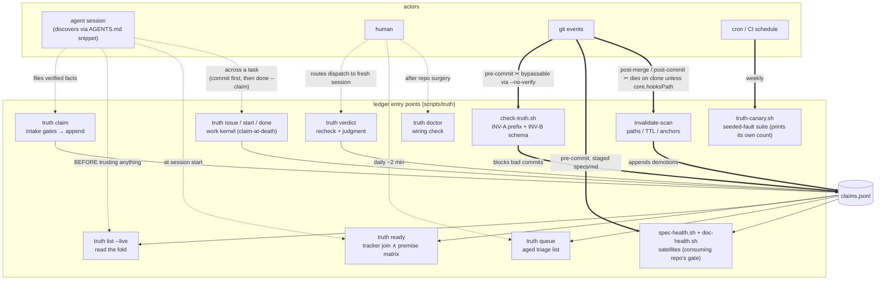
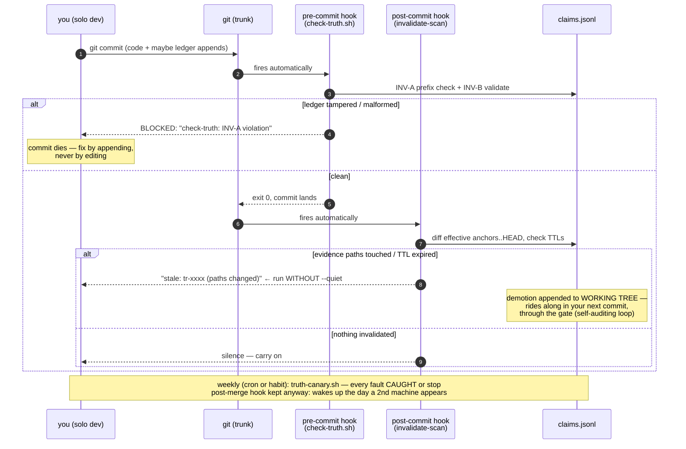
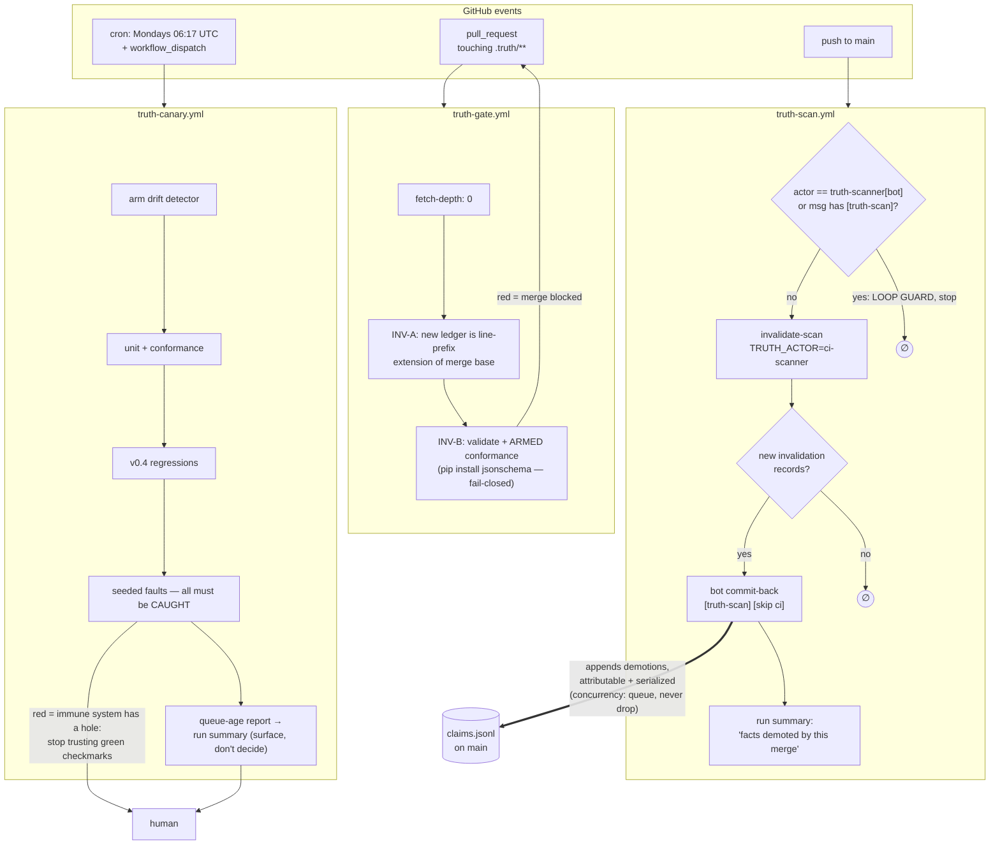
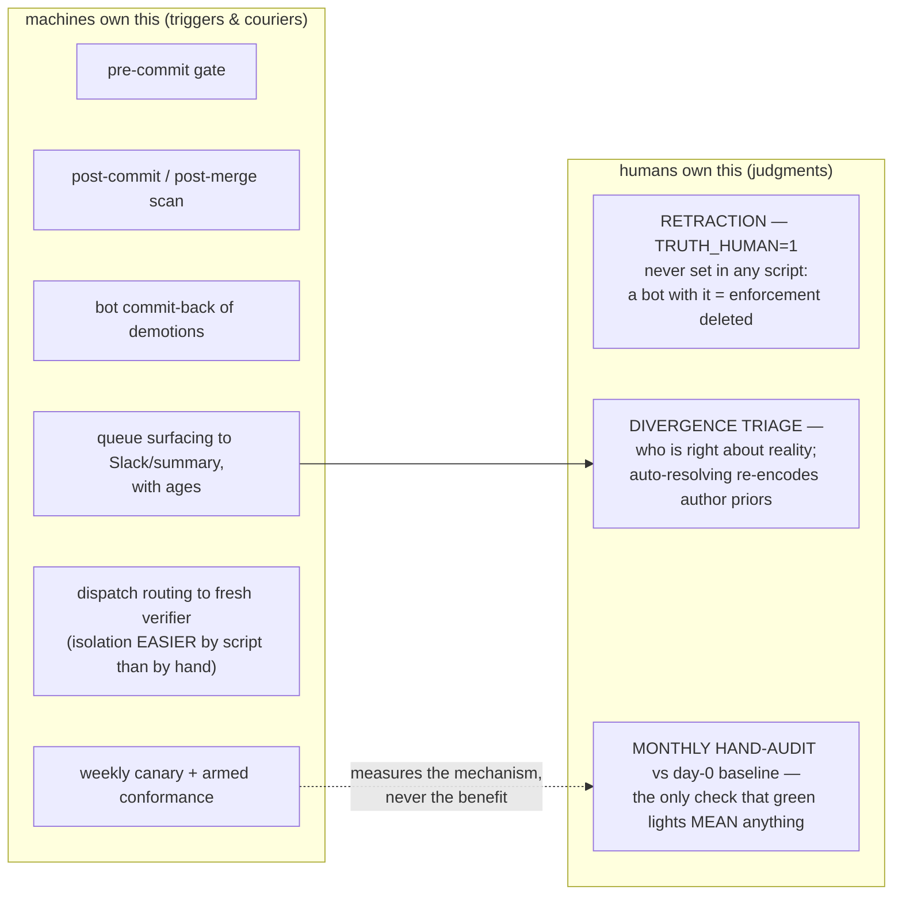

# Truth Ledger — Operations Guide: Triggers, Observability, and Automation

> Reader: any developer operating a truth ledger day-to-day | Enables: knowing every point where the ledger executes, spotting it firing, and automating everything except the three judgments that must stay human | Update-trigger: CLI trigger surface or hook wiring changes (current: v0.5.5)

## 1. The trigger map — every point where the ledger executes

There are ten entry points. Five are human/agent-initiated, five can be fully mechanical.

| Trigger | What runs | Initiated by | Automatable? |
|---|---|---|---|
| Filing a fact | `truth claim` (intake gates + append) | Agent or human, mid-task | Already agent-driven via the AGENTS.md snippet |
| Trusting a fact | `truth list --live` | Agent, *before* relying on anything | Agent-driven via snippet |
| Picking work | `truth ready` (tracker join ∧ premise matrix, ADR-001) | Agent, at session start | Agent-driven via snippet |
| Working an issue | `truth issue` / `start` / `done --claim` (work kernel, v0.5/ADR-002) | Agent or human, across a task | Agent-driven; `done --claim` files through the same intake gates — **commit the work first**, or the claim trips its own tripwire (see README, Claim discipline) |
| **Every commit touching the ledger** | `check-truth.sh` via pre-commit hook (INV-A prefix check + schema validation) | **git, automatically** | ✅ Fully |
| **Every merge/pull** | `invalidate-scan` via post-merge hook (paths, TTL, lost anchors) | **git, automatically** | ✅ Fully |
| Spec & doc hygiene | `spec-health.sh` (cited ids judged by the ADR-001 matrix) + `doc-health.sh` (forbidden names, broken links) — v0.5.1/v0.5.2 satellites | Consuming repo's pre-commit on staged specs/markdown; weekly sweep | ✅ Fully |
| Verification | `dispatch` → fresh session → `verdict --recheck` → judgment | Human or script routes the context | ⚠️ Partially (see §3, rung 3) |
| Triage | `truth queue` | Human, daily | ✅ The *surfacing*; not the deciding |
| Health | `doctor` + canary | Human, weekly | ✅ Fully (CI cron) |

The two bolded rows are the system's heartbeat — they make knowledge decay *mechanical* instead of vigilance-dependent. If those two hooks are not firing, you do not have a truth ledger; you have a diary.

## 2. Spotting when it is triggered

The ledger is deliberately quiet, so learn its signatures.

**The pre-commit gate** announces itself during any commit that stages the ledger: `validate: N record(s) OK` (stdout) scrolling by during `git commit` *is* the gate passing. A blocked commit prints `check-truth: INV-A violation` or `INV-B violation` on stderr and the commit dies.

**The post-merge scan** prints `stale: tr-xxxx (paths changed)` lines unless run with `--quiet`. Tuning tip: consider removing `--quiet` from the hook — a fact silently dying on merge is exactly the event a human should glimpse.

**Agent-side triggers** are visible in transcripts: watch for `scripts/truth ready` or `list --live` early in a session (discovery working), `truth start` when work is claimed, and `truth claim` / `done --claim` after verification work (filing discipline working). Their *absence* in transcripts is the leading indicator that a runtime is not loading the snippet — the silent-death failure mode.

**The satellites** announce themselves the same way the gate does: `spec-health: N failure(s), M warning(s) across K spec(s)` and `doc-health: N failure(s) across K live doc(s)` scrolling by during a commit that stages specs or markdown. A satellite blocking a commit is working as designed — a spec standing on a dead fact or a doc pointing at a moved file is exactly what should not merge.

**Forensics**: the ledger *is* the log. Every record carries `actor`, `session`, and `ts`, so `git log -p .truth/claims.jsonl` gives a complete, tamper-evident audit trail of who triggered what, when — including which invalidations fired on which merge commits.

## 3. Eliminating the human — the automation ladder

Work through these in order; each rung removes one manual step.

**Rung 1 — hooks that survive clones.** Local `.git/hooks` die on every clone, so shims-in-hooks protects one machine. Promote to the committed hooks dir the template already ships: `.githooks/` (pre-commit, post-commit, post-merge — all three executable), activated by one line per clone, `git config core.hooksPath .githooks`. Note the two wirings are exclusive: `install-hooks.sh` refuses to write `.git/hooks` shims when `core.hooksPath` is set, precisely so dead files never impersonate a gate. The committed hooks update through normal file diffs.

**Rung 2 — CI as the enforcement backstop.** Hooks are bypassable (`--no-verify`) and clone-fragile; CI is neither. Three jobs:

1. On every PR touching `.truth/`, run `check-truth.sh` (needs enough fetch depth that HEAD's version of the ledger exists for the prefix check).
2. On every merge to main, run `invalidate-scan` and — the key move — **auto-commit any resulting invalidation records back** with a bot identity (`TRUTH_ACTOR=ci-scanner`). That closes the loop with zero humans: teammate merges, scan fires, stale facts are demoted, and the demotions are themselves ledger history.
3. A weekly cron running the canary plus `pip install jsonschema && python3 scripts/test-truth-core.py` — the armed drift detector — failing the pipeline loudly.

**Rung 3 — automate the verification dispatch.** Today a human runs `dispatch` and pastes into a fresh session. Mechanize the routing: a scheduled job picks unverified P0/P1 claims (or queue items), feeds `dispatch` output to a fresh agent session via API — the isolation requirement (G11) is *easier* to guarantee programmatically than by human copy-paste discipline, since the script provably sends nothing but the fixed prompt and the record — and lets the verifier's `verdict --recheck` + judgment land as appends. The human courier is replaced while the fresh-context property is kept. *Field note: the pilot runs this rung today — an operator session spawns fresh subagent sessions carrying dispatch-only context, including two verifiers that independently caught the claim author's scope overreach (see [the paper §2](truth-ledger-paper-v2.md)).*

**Rung 4 — automate the queue's surfacing, not its verdicts.** Pipe `truth queue` into whatever the humans already look at (Slack, PR comments, dashboard), with the age numbers. `doctor` already warns past 14 days; wire that warning to a channel.

## 4. The three humans you cannot eliminate — and should not try

Over-automating a trust system quietly destroys it.

**Retraction** is enforced-human by design (`TRUTH_HUMAN=1`): the one irreversible act. v0.4 made "humans only" a property precisely so no automation pathway can tombstone a claim. Never set that variable in any script — a bot with `TRUTH_HUMAN=1` is the enforcement deleted.

**Divergence triage**: automation can *detect* that verifier and author disagree; deciding who is right is a judgment about reality, and auto-resolving it (e.g., "recheck agrees, so overwrite the diverge") would just re-encode the author's priors.

**The monthly hand-audit** against the day-0 baseline is irreducible for a deeper reason: it is the only check on whether the whole machine *helps*. Every automated signal (green canaries, empty queues) measures the mechanism, and a mechanism can run perfectly while agents have simply learned to file plausible claims that pass recheck. Only a human comparing claims to ground truth catches that.

## Summary

Automate every *trigger* and every *courier*; never automate a *judgment*. The end state is a system where humans are consulted exactly three times — to kill a fact, to resolve a disagreement, and to periodically ask whether the green lights mean anything — and everything else fires off git events and cron without anyone remembering to care. Which is the point: vigilance does not scale; hooks do.

Authoring discipline for the claims themselves (scope the text to the evidence; pin health-gate evidence output stable; commit before `done --claim`) lives in the template README's **Claim discipline** section; the field evidence behind those rules is in [the paper](truth-ledger-paper-v2.md) (§2, §9).

---

## 5. Diagrams

Per the layer's own honesty rule: each caption states what the diagram is
grounded in. D1–D2 are OBSERVED (every arrow is a code path in `scripts/truth`
v0.5.5, the hooks, or the workflow YAML, exercised by the canary or the
template tests). D3 is SPECIFIED (it depicts the shipped workflow YAML, which
has not run on GitHub infrastructure yet). D4 is a policy map, not code.

### D1 — The trigger map: who fires what, and what can go wrong

Solid arrows are mechanical (fire without anyone remembering); dashed arrows
require an actor to act. The ✂ marks are the two places the mechanical chain
can be silently severed — watch them.

Caption: OBSERVED — command surface of scripts/truth v0.5.5 plus both hooks
and both satellites; mechanical arrows gated by canary faults A–N, S1–S4,
D1–D3; the two ✂ severance points are why §3 rung 1 (committed hooks) and
rung 2 (CI backstop) exist.

### D2 — Local flow, solo dev on trunk (no PRs)

The one structural surprise for trunk-solo work, drawn: **post-merge never
fires** (no merges happen), so the scan moves to **post-commit**. Note the
deliberate loop: scan demotions land in the *working tree* and ride into the
next commit through the gate — the ledger audits its own demotions.

Caption: OBSERVED — hook shims from §3 wiring; gate behavior exercised by
canary faults A and N; scan behavior by faults B, D, E; the demotion-rides-
along loop by fault L (re-verification durability).

### D3 — GitHub Actions flow (team / multi-machine regime)

Three workflows, three jobs-to-be-done: **gate** (catch what local hooks
missed), **scan** (the zero-human heartbeat with bot commit-back), **canary**
(the immune system checking itself). The loop-guard on the scan is
load-bearing: without it, the bot's own commit re-triggers the scan forever.

Caption: SPECIFIED — depicts truth-gate.yml, truth-scan.yml, and
truth-canary.yml as shipped; the underlying CLI paths are canary-gated, but
the workflows themselves have not yet executed on GitHub infrastructure. If
the YAML changes and this diagram does not, this diagram is lying with
authority.

### D4 — The human boundary: what may never be automated

Everything left of the line fires off git events and cron. The three boxes on
the right are judgments — automating any of them deletes the property it
implements.

Caption: policy map of §4, not code — the boundary is enforced for H1 (v0.4,
canary FAULT M), detected for H2 (queue), and purely disciplinary for H3.
