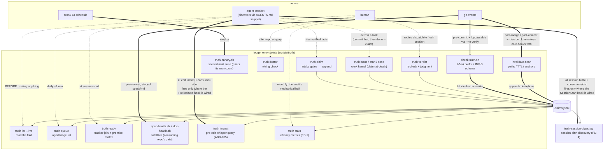
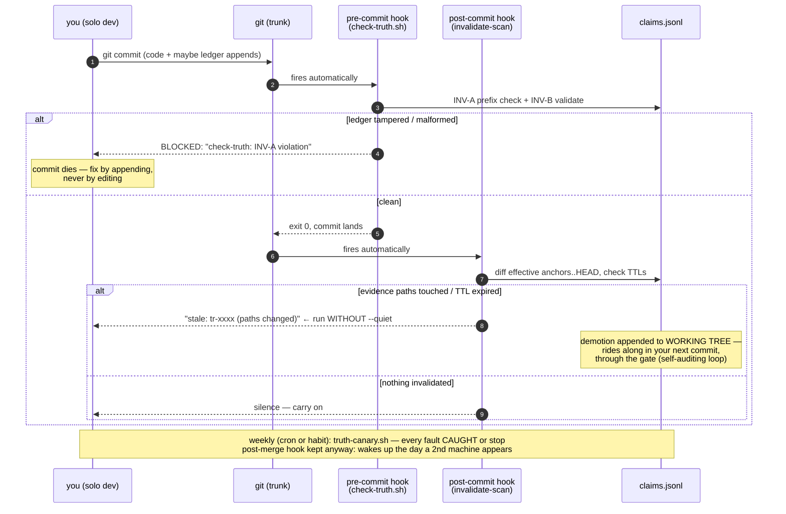
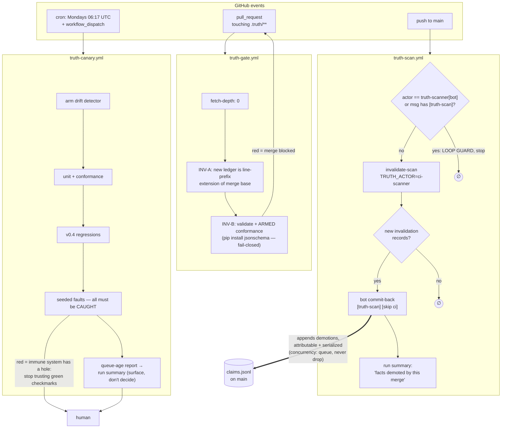
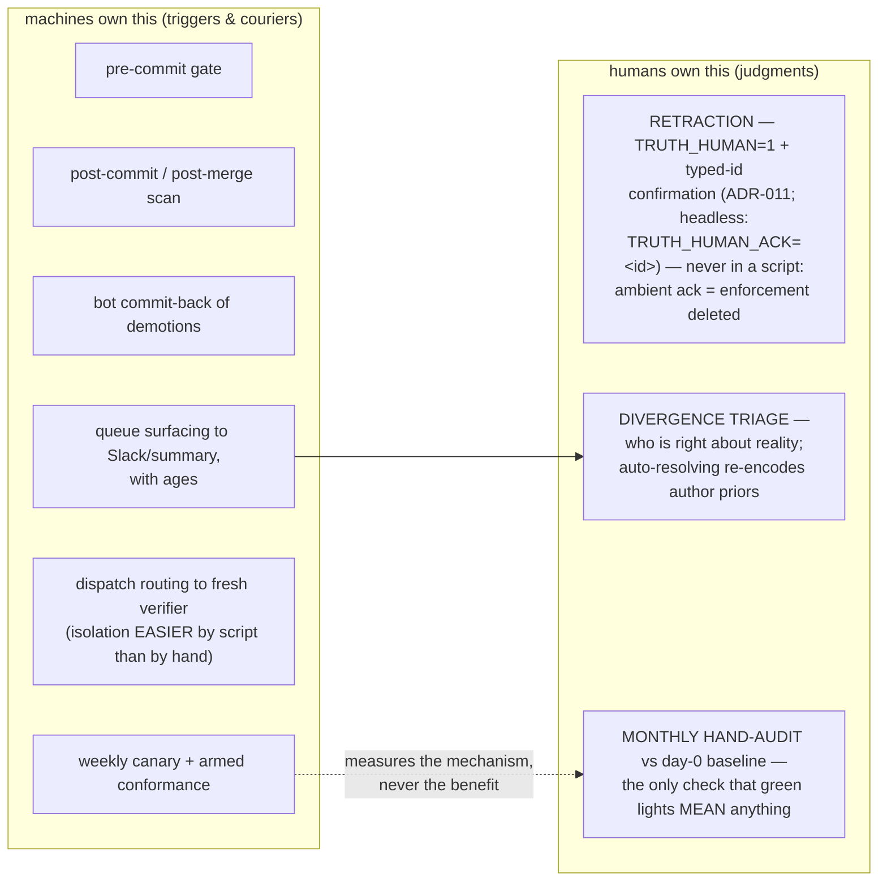

# Truth Ledger — Operations Guide: Triggers, Observability, and Automation

> Reader: any developer operating a truth ledger day-to-day | Enables: knowing every point where the ledger executes, spotting it firing, and automating everything except the three judgments that must stay human | Update-trigger: CLI trigger surface or hook wiring changes (current: CLI v0.9.14 — content re-synced at v0.9.13 on 2026-07-20, ADR-032/033 override-decay content added 2026-07-21; header pinned in lockstep by TestCrossSurfaceVersions since v0.9.13. Surface changes since the v0.6.2 diagrams below, in order: `done` executes a declared acceptance oracle (ADR-014, v0.7.0); `impact --inverse` is the backward-trace audit row (issue #5, v0.7.1); `baseline` the release-accounting row (issue #3, v0.8.0); `contradicts` the consistency row (issue #4, v0.9.0); every write verb carries the commit-gate banner and VERIFIED filing the exit-code warning (v0.9.11); `reaffirm` is the mechanical re-confirmation row (ADR-030, v0.9.12); v0.6.3 added output within doctor, v0.6.4 a flag within premise)

## 1. The trigger map — every point where the ledger executes

The table below is the full trigger surface — some rows human/agent-initiated, the rest fully mechanical (the Automatable? column says which).

| Trigger | What runs | Initiated by | Automatable? |
|---|---|---|---|
| Filing a fact | `truth claim` (intake gates + append) | Agent or human, mid-task | Already agent-driven via the AGENTS.md snippet |
| Trusting a fact | `truth list --live` | Agent, *before* relying on anything | Agent-driven via snippet |
| Picking work | `truth ready` (tracker join ∧ premise matrix, ADR-001) | Agent, at session start | Agent-driven via snippet |
| Working an issue | `truth issue` / `start` / `done --claim` (work kernel, v0.5/ADR-002) | Agent or human, across a task | Agent-driven; `done --claim` files through the same intake gates — **commit the work first**, or the claim trips its own tripwire (see README, Claim discipline) |
| Closing an issue with a declared finish line | `done` executes the issue's `--accept-cmd` oracle from the repo root and refuses the close on non-zero exit (v0.7.0/ADR-014); screened against `.truth/accept-allow` — the one trigger that runs REPOSITORY code, by declared policy | Agent or human, at close | ✅ The execution; declaring the oracle (and the allowlist policy) stays human-reviewed |
| **Every commit touching the ledger** | `check-truth.sh` via pre-commit hook (INV-A prefix check + schema validation) | **git, automatically** | ✅ Fully |
| **Every merge/pull** | `invalidate-scan` via post-merge hook (paths, TTL, lost anchors) | **git, automatically** | ✅ Fully |
| **Every push (meta-repo only)** | release tag-check via pre-push hook: WARN when the CLI's stated version has no git tag (copier consumers resolve versions from tags, so an untagged release is invisible to them), FAIL when the tag's tree states a different version (mispointed tag) | **git, automatically** | ✅ Fully — untemplated like the whisper: releasing the template is meta-repo policy, not consumer machinery |
| Pre-edit intent (where wired) | `truth impact` via a PreToolUse whisper hook (ADR-005; deny stage for frozen paths, whisper stage injects the prediction) | **the agent harness, automatically, at edit intent** | ✅ Fully — but consumer-side: the verb ships in the template (v0.5.7, FAULTS W1–W4), the hook and deny list deliberately do not (ADR-003 rule 2) |
| Session birth (where wired) | `truth-session-digest.py` via a SessionStart hook (FS-4, v0.6): one bounded block — queue, top live P0/P1 claims, the check-facts line — so read-only sessions discover the ledger without loading instruction files | **the agent harness, automatically, at session start** | ✅ Fully — same consumer-side placement as the whisper (ADR-003 rule 2); empty ledger or queue injects nothing |
| Spec & doc hygiene | `spec-health.sh` (cited ids judged by the ADR-001 matrix) + `doc-health.sh` (forbidden names, broken links) — v0.5.1/v0.5.2 satellites | Consuming repo's pre-commit on staged specs/markdown; weekly sweep | ✅ Fully |
| Verification | `dispatch` → fresh session → `verdict --recheck` → judgment | Human or script routes the context | ⚠️ Partially (see §3, rung 3) |
| Mechanical re-confirmation | `truth reaffirm [--dry-run] [--json]` — walks every stale claim, one pure triage per claim (ADR-030, v0.9.12); a write verb, run it in a fresh verifier session | Human or script, daily or after a scan stales claims | ✅ The *mechanical* half only: hash-match auto-agrees (fixed basis `"reaffirm: hash-match, no judgment re-run"`); every judgment case is surfaced, never decided (see §3, rung 3) |
| Triage | `truth queue` | Human, daily | ✅ The *surfacing*; not the deciding |
| Efficacy metrics | `truth stats [--json] [--since ts]` (status/tier counts, verdict rates by subtype, per-tier claim half-life, queue aging — the mechanical half of the monthly audit, v0.6/FS-1; an `overrides` section since v0.9.14/ADR-033: scope-ok filings, ADR-032 decay expiries, overridden duplicates, unscreened filings, max scope TTL, and a non-blocking verbatim-repeat advisory) | Human, monthly (or CI report) | ✅ The *measuring*; the hand-audit judgment stays human (§4) |
| Health | `doctor` + canary | Human, weekly | ✅ Fully (CI cron) |
| Backward-trace audit | `truth impact --inverse [--under dir]` — tracked files no active claim watches (24765; exit 4 = dark files exist, gateable; v0.7.1/issue #5) | Human or CI, weekly | ✅ The *surfacing*; dark-file triage (adopt/attic/delete) stays human |
| Release accounting | `truth baseline <tag-a> --diff <tag-b>` — born/transitions/disappeared between releases (10007; exit 5 = a record disappeared, i.e. rewritten history; v0.8.0/issue #3) | Human, per release; CI on tags | ✅ Fully — the delta IS the ledger half of the release notes |
| Declaring a contradiction | `truth contradicts <a> <b> --basis` — both live sides derive DISPUTED, premised work HOLDs, both queue (29148 R5; v0.9.0/issue #4) | Agent or human, on discovering incompatible claims | ✅ The *derivation*; declaring and resolving (retract/supersede one side) stay human-judged |

The two bolded rows are the system's heartbeat — they make knowledge decay *mechanical* instead of vigilance-dependent. If those two hooks are not firing, you do not have a truth ledger; you have a diary.

## 2. Spotting when it is triggered

The ledger is deliberately quiet, so learn its signatures.

**The pre-commit gate** announces itself during any commit that stages the ledger: `validate: N record(s) OK` (stdout) scrolling by during `git commit` *is* the gate passing. A blocked commit prints `check-truth: INV-A violation` or `INV-B violation` on stderr and the commit dies. Since v0.9.13 the duplicate-id half of `validate` is **one rule** (ADR-031, subsuming ADR-008's backdated and ADR-016's equal-ts detections): it refuses *any* record whose id duplicates an earlier line's and whose canonical content differs — earlier, equal, or later timestamp — with a message naming ADR-031; the byte-identical union-merge duplicate is the only duplicate id that passes. If you see that refusal, someone appended a content-distinct record under an existing id — corrections always file under fresh ids.

**The unwired-gate banner** (v0.9.11): every *write* verb (`claim`, `verdict`, `issue`, `start`, `done`, `premise`, `invalidate-scan`, `reaffirm`, …) prints a loud stderr `truth: WARNING -- no commit gate is wired` banner when neither an active check-truth hook nor a CI config naming the gate script exists (doctor's ADR-025 check, probed once per invocation). It never blocks and never changes an exit code — fail-open with noise. Seeing it means INV-A/INV-B and the ADR-031 detection are not enforced on commits in that clone: run `scripts/truth doctor` and wire §3 rung 1.

**The exit-code warning at VERIFIED filing** (v0.9.11): `claim --class VERIFIED` (and `done --claim`) files on *determinism* — the two intake runs hash-matching — not on exit 0, so a stably-failing probe files clean ("hollow VERIFIED", two real instances). After a successful append with a non-zero evidence exit code, intake now prints `truth: warning: evidence command exited N ...` on stderr. Non-blocking by design (a non-zero-but-stable probe can be a legitimate fact); treat it as a prompt to re-shape the evidence (`... && echo OK`).

**The scope-ok default-expiry notice** (v0.9.14/ADR-032): `claim --scope-ok "<sentence>"` filed without an explicit `--ttl-days` files normally — never refused — and prints on stderr: `note: --scope-ok override filed with no --ttl-days -- stamped a default 30-day expiry (ADR-032) so the scope judgment is re-asked when it lapses. Pass an explicit --ttl-days (a large value is the visible opt-out) to choose a different shelf life.` The claim then decays like any TTL'd claim (ADR-019): on expiry the scan invalidates it and `reaffirm` (ADR-030 arm 1) routes it to re-file, re-firing the ADR-007 scope gate rather than trusting the sentence forever.

**Reaffirm** announces itself with one line per stale claim (`<id>  <arm>  <action>`) and a summary: `reaffirm: N stale claim(s) -- X reaffirmed, Y diverged (dispatch), Z ttl (re-file), W manual, V same-session`. `--dry-run` prints the same triage with `[dry-run: nothing filed]` appended and match rows saying "would file agree" — run it first to see what a sweep would do.

**The post-merge scan** prints `stale: tr-xxxx (paths changed)` lines unless run with `--quiet`. The committed `.githooks/` hooks already run un-quieted; the `--quiet` variant appears in `install-hooks.sh`'s hook-manager guidance — if you wired the scan through a hook manager from that snippet, consider dropping the flag: a fact silently dying on merge is exactly the event a human should glimpse.

**The session digest** (where the FS-4 SessionStart hook is wired) is the block of `LIVE tr-xxxx …` lines at the top of an agent session — discovery working before the agent has read a single file. Its absence at session birth in a hook-capable harness means the wiring is dead, not the ledger empty (an empty ledger injects nothing, but so does a missing hook — `doctor` tells the two apart).

**Agent-side triggers** are visible in transcripts: watch for `scripts/truth ready` or `list --live` early in a session (discovery working), `truth start` when work is claimed, and `truth claim` / `done --claim` after verification work (filing discipline working). Their *absence* in transcripts is the leading indicator that a runtime is not loading the snippet — the silent-death failure mode.

**The satellites** announce themselves the same way the gate does: `spec-health: N failure(s), M warning(s) across K spec(s)` and `doc-health: N failure(s) across K live doc(s)` scrolling by during a commit that stages specs or markdown. A satellite blocking a commit is working as designed — a spec standing on a dead fact or a doc pointing at a moved file is exactly what should not merge.

**Forensics**: the ledger *is* the log. Every record carries `actor`, `session`, and `ts`, so `git log -p .truth/claims.jsonl` gives a complete, tamper-evident audit trail of who triggered what, when — including which invalidations fired on which merge commits. A reaffirm agree is grep-able by its fixed basis string, and carries a `reaffirm_cleared: {prior_anchor, touched}` payload field recording which watched-file changes its anchor advance auto-cleared — replay any mechanical clearance from the ledger alone (ADR-030).

**Version archaeology**: since v0.9.13 the CLI states only its *current* version (docstring line 2); the full version history lives in `CHANGELOG.md` at the template root (shipped to consumers by copier, never clobbering a consumer's own). The version stamps on the CLI, the `.truth/README` title, `check-truth.sh`'s "current CLI:" comment, and the `current: CLI vX.Y.Z` headers of this guide and the loophole map are pinned in lockstep by `TestCrossSurfaceVersions` (ADR-026) — a release that bumps one without the others fails the core suite.

## 3. Eliminating the human — the automation ladder

Work through these in order; each rung removes one manual step.

**Rung 1 — hooks that survive clones.** Local `.git/hooks` die on every clone, so shims-in-hooks protects one machine. Promote to the committed hooks dir the template already ships: `.githooks/` (pre-commit, post-commit, post-merge — all three executable), activated by one line per clone, `git config core.hooksPath .githooks`. Note the two wirings are exclusive: `install-hooks.sh` refuses to write `.git/hooks` shims when `core.hooksPath` is set, precisely so dead files never impersonate a gate. The committed hooks update through normal file diffs.

**Rung 2 — CI as the enforcement backstop.** Hooks are bypassable (`--no-verify`) and clone-fragile; CI is neither. Three jobs:

1. On every PR touching `.truth/`, run `check-truth.sh` (needs enough fetch depth that HEAD's version of the ledger exists for the prefix check).
2. On every merge to main, run `invalidate-scan` and — the key move — **auto-commit any resulting invalidation records back** with a bot identity (`TRUTH_ACTOR=ci-scanner`). That closes the loop with zero humans: teammate merges, scan fires, stale facts are demoted, and the demotions are themselves ledger history.
3. A weekly cron running the canary plus `pip install jsonschema && python3 scripts/test-truth-core.py` — the armed drift detector — failing the pipeline loudly.

**Rung 3 — automate the verification dispatch.** First cut the volume: since v0.9.12, `truth reaffirm` (ADR-030) automates the *mechanical* half of re-verification — the measured bulk of the labor (paper §8 item 2) — so only judgment cases reach the dispatch path at all. Run it in a fresh verifier session (it is a write verb: it appends verdicts, so ADR-010 session separation applies — same-session claims are skipped), daily or whenever a merge/scan stales claims; `--dry-run` first to preview, `--json` for harnesses. It triages every stale claim into exactly one arm: **(1) TTL-staled** → skip, re-file required (ADR-019: re-verification never resets a TTL; read from the scan's stamped `reason_code`, never recomputed from a clock); **(2) mechanically unexecutable** → skip, manual verification only — `screened: false` capsules, commands the *current* allowlist refuses, claims with no evidence command or that exit 127, and claims **no verifier ever agreed with** (a first agree is a judgment, not a re-confirmation); the command is never run in this arm; **(3) same-session** → skip (dispatch it — `TRUTH_SELF_VERDICT=1` remains the loud override, and reaffirm warns with a count because one env var here amplifies the bypass to the whole sweep); **(4) otherwise execute** the evidence through the *same* screened recheck path `verdict --recheck` uses: a hash-and-exit **match** auto-files `agree` (advancing the effective anchor, with the burial recorded in `reaffirm_cleared`); a **mismatch files nothing** — the claim is listed "diverged evidence — dispatch for judgment" and stays stale. The named residual (ADR-030): the match arm checks the *command output*, which can be narrower than the watch — so **keep evidence commands as wide as their `evidence_paths`**, or reaffirm will silently re-agree claims whose watched-but-unread paths changed (auditable after the fact via `reaffirm_cleared`, but auditability is not judgment).

For what remains after the sweep: today a human runs `dispatch` and pastes into a fresh session. Mechanize the routing: a scheduled job picks unverified P0/P1 claims (or queue items), feeds `dispatch` output to a fresh agent session via API — the isolation requirement (G11) is *easier* to guarantee programmatically than by human copy-paste discipline, since the script provably sends nothing but the fixed prompt and the record — and lets the verifier's `verdict --recheck` + judgment land as appends. The human courier is replaced while the fresh-context property is kept. *Field note: the pilot runs this rung today — an operator session spawns fresh subagent sessions carrying dispatch-only context, including two verifiers that independently caught the claim author's scope overreach (see [the paper §2](truth-ledger-paper-v3.md)).*

**Attribution caveat (ADR-010 amendment, 2026-07-13).** The verdict of record must carry the *verifier's* session, or the session-separation gate misfires both ways. So: the verifier session files its own verdict — never route verification to a read-only (plan-mode) peer whose verdicts a writer then scribes. If a scribe is ever unavoidable, it files under the verifier's identity (`TRUTH_SESSION=<verifier-session> scripts/truth verdict …`), which the CLI already honors. Do not scribe `agree` under your own session.

**Rung 4 — automate the queue's surfacing, not its verdicts.** Pipe `truth queue` into whatever the humans already look at (Slack, PR comments, dashboard), with the age numbers. `doctor` already warns past 14 days; wire that warning to a channel.

## 4. The three humans you cannot eliminate — and should not try

Over-automating a trust system quietly destroys it.

**Retraction** is enforced-human by design: the one irreversible act. v0.4 made "humans only" a property, and v0.6 (ADR-011) hardened it — a tombstone needs `TRUTH_HUMAN=1` **plus** an interactive typed-id confirmation at a real terminal, or `TRUTH_HUMAN_ACK=<exact-id>` for headless human use; `TRUTH_HUMAN=1` alone is refused headless. Since v0.9.3 (ADR-017) the same human gate also guards *superseding* a retracted premise — `truth premise --supersedes` on a `retracted` old premise is refused without it, so an agent cannot spend a human retraction at the readiness layer (the mechanical dead states — stale/diverged/cannot_verify/missing — stay ungated: no human decided those). Never export either variable in a standing script or agent environment — an ambient acknowledgment is the enforcement deleted.

**Divergence triage**: automation can *detect* that verifier and author disagree; deciding who is right is a judgment about reality, and auto-resolving it (e.g., "recheck agrees, so overwrite the diverge") would just re-encode the author's priors. `reaffirm` honors this boundary by construction: a batch hash mismatch files *nothing* — not even a diverge — and lists the claim for dispatch instead (ADR-030).

**The monthly hand-audit** against the day-0 baseline is irreducible for a deeper reason: it is the only check on whether the whole machine *helps*. Every automated signal (green canaries, empty queues) measures the mechanism, and a mechanism can run perfectly while agents have simply learned to file plausible claims that pass recheck. Only a human comparing claims to ground truth catches that.

## Summary

Automate every *trigger* and every *courier*; never automate a *judgment*. The end state is a system where humans are consulted exactly three times — to kill a fact, to resolve a disagreement, and to periodically ask whether the green lights mean anything — and everything else fires off git events and cron without anyone remembering to care. Which is the point: vigilance does not scale; hooks do.

Authoring discipline for the claims themselves (scope the text to the evidence; pin health-gate evidence output stable; commit before `done --claim`; keep evidence commands as wide as their `evidence_paths` so reaffirm's match arm stays honest, ADR-030) lives in the template README's **Claim discipline** section; the field evidence behind those rules is in [the paper](truth-ledger-paper-v3.md) (§2, §9).

---

## 5. Diagrams

Per the layer's own honesty rule: each caption states what the diagram is
grounded in. D1–D2 are OBSERVED (every arrow is a code path in `scripts/truth`
v0.6.2, the hooks, or the workflow YAML, exercised by the canary or the
template tests). D3 is SPECIFIED (it depicts the shipped workflow YAML, which
has not run on GitHub infrastructure yet). D4 is a policy map, not code.
Honesty note (2026-07-20 re-sync): the diagrams still draw the **v0.6.2**
command surface; every arrow drawn remains a real code path at v0.9.13, but
the verbs shipped since — the `done` acceptance oracle (v0.7.0),
`impact --inverse` (v0.7.1), `baseline` (v0.8.0), `contradicts` (v0.9.0),
`reaffirm` (v0.9.12) — appear in §1's trigger table and are not drawn here.

### D1 — The trigger map: who fires what, and what can go wrong

Solid arrows are mechanical (fire without anyone remembering); dashed arrows
require an actor to act. The ✂ marks are the two places the mechanical chain
can be silently severed — watch them.

Caption: OBSERVED — the full command surface of scripts/truth v0.6.2 plus
both hooks, both satellites, and the FS-4 digest; every mechanical arrow is
canary-gated (the suite names its own faults and prints its own count — run
it rather than trusting a list restated here) except the digest, which is
consumer-side and fixture-tested rather than canary-gated (FS-4's
acceptance fixtures); the
✂ severance points are why §3 rung 1 (committed hooks) and rung 2 (CI
backstop) exist, and why the impact and digest arrows are consumer-side
(ADR-003 rule 2).

### D2 — Local flow, solo dev on trunk (no PRs)

The one structural surprise for trunk-solo work, drawn: **post-merge never
fires** (no merges happen), so the scan moves to **post-commit**. Note the
deliberate loop: scan demotions land in the *working tree* and ride into the
next commit through the gate — the ledger audits its own demotions.

Caption: OBSERVED — hook shims from §3 wiring; gate behavior exercised by
canary faults A and N; scan behavior by faults B, D, E; the demotion-rides-
along loop by fault L (re-verification durability).

### D3 — GitHub Actions flow (team / multi-machine regime)

Three workflows, three jobs-to-be-done: **gate** (catch what local hooks
missed), **scan** (the zero-human heartbeat with bot commit-back), **canary**
(the immune system checking itself). The loop-guard on the scan is
load-bearing: without it, the bot's own commit re-triggers the scan forever.

Caption: SPECIFIED — depicts truth-gate.yml, truth-scan.yml, and
truth-canary.yml as shipped; the underlying CLI paths are canary-gated, but
the workflows themselves have not yet executed on GitHub infrastructure. If
the YAML changes and this diagram does not, this diagram is lying with
authority.

### D4 — The human boundary: what may never be automated

Everything left of the line fires off git events and cron. The three boxes on
the right are judgments — automating any of them deletes the property it
implements.

Caption: policy map of §4, not code — the boundary is enforced for H1
(v0.4 FAULT M, hardened v0.6 by ADR-011's confirmation ladder, canary
FAULTS H1–H3), detected for H2 (queue), and purely disciplinary for H3.

## Gate vs. queue — the decision rule

*(adopted from the TLR review, 2026-07-20)*

When a new check could either refuse an operation (gate) or record a
warning for later triage (queue), decide by consequence, not by
severity intuition:

- **Hard gate** iff the bad outcome is *irreversible* (a lost or
  rewritten committed line, a released HELD block) OR an *automated,
  unattended consumer* would act on the bad state before any human
  looks (CI, a scripted sweep, an agent reading `ready`).
- **Intake refusal** when the check is *cheap and field-validated* —
  a pure predicate over the record being filed, with at least one real
  instance it would have caught (INV-M, the quantifier–scope gate,
  ADR-031's duplicate rule are the shipped examples).
- **Queue warning** otherwise — anything needing judgment, anything
  reversible, anything whose false-positive rate is unmeasured (the
  v0.9.11 evidence-exit warning is the shipped example: loud, never
  blocking, its efficacy part of the running trial).

## Coverage policy — which `.md` files a claim must watch

*(adopted from the coverage-policy audit, 2026-07-21; instrument:
`truth impact --inverse`)*

`impact --inverse` reports every tracked file no active claim watches
("dark"). Dark is not a defect to blanket-fix — universal coverage is
its own smell (false intentionality, churn, blast radius; paper §9). A
file is correctly dark or correctly watched by its **kind**, and there
are three kinds.

**RECORD — dark by design.** A record fixes a decision or a moment: the
ADRs, field notes (`docs/field-notes-*.md`), trial prompts
(`trial-prompts/*.md`, incl. `RUNBOOK.md`), the growth-gate archive
(`docs/growth-gate/`), dated/historical diagrams
(`docs/diagrams/*-2026-07-20.md`), and anything under `docs/archive/`.
Its currency is not "does a command still pass" but "has a later
decision superseded it" — a question no path-watch can answer. Freshness
discipline for a record is a **supersession or Status note written into
the record itself** (the dated diagrams already carry a `> STATUS:
historical session artifact …` banner; superseded ADRs carry an
`Amended by:` / `Supersedes:` line), enforced socially and by
kuchnie-style `ADR_AMEND` gates where those are wired — never by a
freshness claim. Do **not** file per-record content claims to light
records up: that manufactures churn and a false air of intentionality.

  *One deliberate exception, at the set level.* The ADR **series**
  carries a single RECORD-integrity claim — `tr-ebac6513`, watching
  `template/docs/adr/*.md` — asserting the series is dense (001-033,
  contiguous, endpoints present) and every ADR carries a `Status:` line.
  It **will** stale on every new ADR and on any Status-header edit; that
  staling is its whole job — a new ADR should re-assert the series'
  shape once, in a fresh verifier session, not silently extend it. Note
  the 17 ADRs lit *today* are lit by **literal per-file** paths that the
  living behaviour-claims cite as their doc surface (e.g. `tr-58077018`
  lists `…/029-…md`), not by a directory glob — so a new ADR does not
  stale them, it simply arrives dark until the series claim or a
  behaviour claim names it. That is correct; the earlier worry about
  "incidental glob coverage of the ADR series" does not hold here (no
  such glob exists).

**LIVING CONTRACT — must be watched by a deliberate claim.** A living
contract states machinery other surfaces obey *now*; if it drifts,
readers act on stale rules. Each carries an explicit, narrow watch with
a **sentinel recipe** — a rule count, a key phrase, a version stamp, not
a whole-file hash that cries on every typo. The enumerated set and its
watcher:

  | Living contract | Watching claim |
  |---|---|
  | `template/prompts/truth-verifier.md` — the verifier protocol | `tr-1820b1aa` (four-step shape + the `agree\|diverge\|cannot_verify` verdict form) |
  | `docs/truth-ledger-explained.md` — the explainer | `tr-11beb903` (version-synced to the CLI) |
  | `template/docs/beads-integration-guide.md` — the ready/adapter seam | `tr-301931eb` (`bd ready --json` default + adapter seam) |
  | `template/.truth/README.md` — the tracker-seam contract | `tr-ef37611b` (+ `tr-7b5a5e72`, `tr-d570e6c2`, `tr-fcdd4af2`) |

  The meta stub `docs/beads-integration-guide.md` is a pointer, not a
  contract ("one home per fact"); its only integrity property — the
  link resolves — is already guarded by `doc-health.sh` (§2), so it
  stays deliberately dark. The current-state diagrams
  (`docs/diagrams/asbuilt-architecture.md`, `concept-map.md`) are living
  contracts in principle but are **deferred, not enumerated here yet**:
  `asbuilt` pins a *drawn-at* version (v0.9.13) that intentionally lags
  the CLI, so a version-lockstep claim would be born false, and a bare
  file-watch on a diagram churns on every legitimate redraw without a
  crisp contract to pin. Fold them under the architecture-review
  cadence, or add a "drawn-at vs current" delta sentinel, before adding
  them to the enumerated set below.

**SELF-DATING — dark OK.** A self-dating file carries its currency in
its own dated entries: `docs/roadmap-v3.md`, `template/CHANGELOG.md`. A
reader sees at a glance whether it is current; a freshness claim adds
nothing a scroll to the top does not already show.

**The policy's own health check (periodic, not commit-time).** The
living-contract table above is the enumerated invariant. This is a
**queue** check, not a gate (gate-vs-queue rule above: no unattended
consumer acts on a newly-dark contract before the weekly sweep, and
blanket commit-time coverage-forcing is exactly the smell this policy
refuses). Run it alongside the weekly `impact --inverse` sweep:

    for p in template/prompts/truth-verifier.md \
             docs/truth-ledger-explained.md \
             template/docs/beads-integration-guide.md \
             template/.truth/README.md; do
      scripts/truth impact "$p" >/dev/null 2>&1 && echo "DARK: $p"
    done

`truth impact <path>` exits **3 when a claim watches** the path and **0
when none does** (silent), so any `DARK:` line is a living contract that
lost its watcher — a claim retracted or superseded, or a path renamed —
and wants a fresh narrow watch. The check is per-file forward `impact`
because `impact --inverse` takes no path list (it enumerates all tracked
files; scope with `--under`). When the set grows, add the path to this
loop and its claim in the same change.
