# An Append-Only Truth Ledger for Agentic Software Development: Design, Adversarial Falsification, and Repair

**Status:** Draft for internal review · **Artifact version audited:** truth v0.2/v0.3 · **Repaired version:** truth v0.4

---

## Abstract

We present two coupled contributions. The first is an **artifact**: a plain-JSONL, append-only "truth ledger" that records claims about a software repository together with their evidence class, cost tier, provenance, and machine-checkable invalidation conditions, and that derives each claim's epistemic status by replaying an event log rather than storing it. The ledger transposes the framing of Byzantine fault tolerance from node failures to *epistemic* failures: in agent-assisted development, the unreliable components are not servers but assertions — hallucinated, stale, unverified, or correlated claims made by language-model agents and humans about the state of a codebase. The second contribution is a **method**: a falsification-driven review battery — dual-contract drift auditing, seeded-fault acceptance testing, permutation-based property testing, adversarial red-teaming under an explicit threat model, and fail-open analysis of the detection machinery itself — applied to a system that was *itself designed around named refutations*. Subjecting the system to its own doctrine yielded six confirmed defects, including the falsification of one invariant (retraction terminality, INV-G) through its own stated refutation condition ("one resurrected tombstone"), achieved by a pure-append attack that passed every shipped gate. All six defects were repaired in v0.4; every repair is gated by a new regression test or seeded fault, and the extended acceptance suite (19 seeded faults) passes in full. Notably, the audit's own first repair failed — a timestamp-granularity flaw introduced by the confluence fix — and was caught by the very acceptance suite under study, closing the falsification loop on the method as well as the artifact. We argue that the closed loop — *design around refutations, attack the refutations, repair, re-gate* — is a transferable discipline for validating trust infrastructure in agentic systems.

---

## 1. Introduction

### 1.1 The problem

Language-model agents now read, modify, and reason about codebases at scale. In doing so they continuously assert facts: *"the payments module handles all currency conversion," "no call sites remain for this deprecated API," "the vendor rate limit is 100 requests/minute."* These assertions drive downstream work — refactors, deletions, architectural decisions — yet in current practice they carry no provenance, no expiry, no record of how they were established, and no mechanism by which a later change to the repository invalidates them. An assertion made truthfully on Monday is repeated confidently on Friday after the code it described has been rewritten.

Human teams have partial defenses: institutional memory, code review, skepticism. Agent workflows amplify the failure mode in three ways. First, **volume**: agents generate claims orders of magnitude faster than humans audit them. Second, **confidence uniformity**: a hallucinated claim and a verified claim are rendered in identical prose. Third, **session amnesia**: an agent that verified a fact yesterday has, in a fresh session, no memory that it did so, nor of what evidence supported it — so facts are either wastefully re-derived or, worse, trusted on the say-so of a transcript.

### 1.2 The framing: Byzantine fault tolerance, transposed

Byzantine fault tolerance (Lamport, Shostak & Pease, 1982; Castro & Liskov, 1999) formalized how a distributed system reaches correct agreement when components fail *arbitrarily* — not merely crashing, but lying, equivocating, and colluding. Its deepest lesson is structural: **trust need not be a judgment about any individual component; it can be a quantifiable property of the system's redundancy and protocol.** One does not need to know *which* nodes are honest, only that the protocol guarantees correctness if *enough* are.

We transpose this frame. In agent-assisted development, the "nodes" are epistemic actors (agent sessions, humans, verification runs) and the "messages" are claims about the repository. The failure modes map directly:

| BFT failure class | Epistemic analogue |
|---|---|
| Crash fault | Claim never verified; verification interrupted |
| Omission fault | Fact silently outdated by a later commit |
| Byzantine fault | Hallucinated or fabricated claim; forged provenance |
| Correlated fault | Verifier shares the author's priors and rubber-stamps |

The ledger described in this paper is not a consensus protocol — it targets a solo-developer-plus-agents regime, not adversarial replication — but it inherits BFT's central move: replace "do I trust this actor?" with "does the structure guarantee that a false claim is *detected*?" Where PBFT buys safety with `3f+1` replicas, the ledger buys detectability with **anchored, reproducible evidence and mechanical invalidation**: every trusted claim must carry a command whose output was hashed at a known commit, and any event git can see (or any clock the fact depends on) that could undermine the claim mechanically demotes it.

### 1.3 Contributions

1. **The artifact** (§3): a minimal, dependency-free truth layer — an event-sourced claims ledger with a pure fold deriving status, intake gates refusing unverifiable claims, mechanical invalidation triggers, a scripted independent-verification protocol, and a tier-sensitive join against a work-tracking system that holds work whose premises no longer hold.
2. **The method** (§4): a battery of falsification techniques with long track records in other fields, assembled into a review protocol for trust infrastructure, and applied end-to-end.
3. **The results** (§5): six confirmed, reproducibly demonstrated defects in a system that was unusually well-defended — including one invariant falsified by exactly the refutation condition its designers named.
4. **The repair and re-validation** (§6): version 0.4, in which each defect's fix ships with the seeded fault or property test that would have caught it, and a recursive episode in which the method caught a defect in its own repair.

### 1.4 A note on epistemic style

The system under study states its own limits ("recheck proves reproducibility, not sound interpretation"), names a refutation for every invariant, and gates each with a seeded fault. This is falsificationism practiced as engineering. The scientific question this paper asks is therefore sharp: **when a system built on named refutations is attacked precisely at its refutations, what survives?** The answer — most of it, but not all, and not the parts one would guess — is the empirical core of the paper.

---

## 2. Related Work and Theoretical Foundations

**Byzantine agreement and practical BFT.** The Byzantine Generals Problem (Lamport et al., 1982) established the `3f+1` bound for agreement under arbitrary faults; PBFT (Castro & Liskov, 1999) made it practical with a three-phase commit among known replicas; Nakamoto consensus and later hybrids (Tendermint, HotStuff) extended agreement to open-membership settings. We borrow the *epistemology* of this line — trust as structure, detectability over prevention — rather than its protocols.

**Event sourcing and derived state.** The ledger's core pattern — an append-only event log with all state derived by a pure fold — descends from event-sourcing practice and from functional-core/imperative-shell architecture. The pattern's virtue for a trust system is auditability: because status is never stored, there is nothing to tamper with except the log itself, concentrating the integrity problem into a single invariant (append-only) that can be gated mechanically.

**Convergent replicated data (CRDTs).** Our confluence analysis (§5, F3) is the CRDT question in miniature: does the same set of events, merged in different orders, converge to the same state? The v0.2 fold did not; the v0.4 fold achieves order-independence by folding over a total order `(timestamp, id)` rather than file position — the standard CRDT move of replacing arrival order with a deterministic total order.

**Falsificationism.** Popper's demarcation — a claim is scientific only insofar as it specifies what would refute it — is used here not as philosophy of science but as an engineering acceptance criterion. The system's invariant table (each row: property, falsifier, canary) is Popper operationalized. Our method (§4) takes the next step: *attack the falsifiers themselves* for completeness, since a weak falsifier passing is not evidence.

**Testing lineages.** Property-based testing (Claessen & Hughes, QuickCheck, 2000) supplies universally quantified properties checked over generated inputs; mutation testing supplies the dual (corrupt the implementation, demand the tests notice); fault injection and red-teaming come from dependable-systems and security practice. Our battery composes these.

**Provenance and reproducibility.** The evidence record (command, output hash, exit code, anchor commit) is a minimal provenance capsule in the spirit of reproducible-research practice: enough to mechanically re-execute and compare, deliberately not enough to prove the *interpretation* correct — a gap the system documents rather than hides, and which our method confirms is real (§7.2).

**Software evolution and entropy.** Lehman's laws of software evolution (Lehman, 1980) established empirically that a used program must change and that, absent explicit counter-effort, its complexity grows — decay as the default trajectory, order as a continuously funded exception. The ledger extends this observation from code to *knowledge about code*: facts about an evolving system decay for the same structural reason the system itself does, and require the same explicit, budgeted counter-effort. §7.4 develops this into an information-theoretic reading of the ledger's mechanics.

---

## 3. System Design: The Truth Ledger

### 3.1 Overview and design goals

The ledger is a single JSONL file (`.truth/claims.jsonl`) living beside a work-tracking system (Beads), plus a ~750-line dependency-free Python CLI (`scripts/truth`), two shell gates, a fixed verifier prompt, and a JSON Schema. Design constraints, in the artifact's own terms:

- **E1** — the work tracker is read-only from the truth layer; the ledger answers *what is known and how*, work records answer *what to do*.
- **E4** — a friction budget of one command to file a claim and four lines of instruction-file text to make agents discover the layer.
- **Survivability** — the schema is the "part that survives fires": the durable contract from which everything else could be reconstructed.

### 3.2 The record model

Four record kinds share an envelope (`id`, `kind`, `actor`, `session`, `ts`):

- **claim** — a factual assertion with an `evidence_class` ∈ {VERIFIED, INFERRED, UNVERIFIED}, a `cost_tier` ∈ {P0, P1, P2} encoding the cost of acting on it if false, and — for VERIFIED — an evidence capsule: the command run, a SHA-256 of its output, its exit code, the `anchor_commit` at which it ran, and either watched `evidence_paths` (for facts git can see) or `ttl_days` (for facts about the world outside the repository, such as vendor APIs).
- **verdict** — a judgment on a claim: `agree`, `diverge`, `cannot_verify`, or `retracted`, always with a `basis` sentence recording what the judge actually did.
- **invalidation** — a mechanical demotion with a reason: evidence paths touched since the anchor, TTL elapsed, or anchor commit unreachable after history rewriting.
- **premise** — a link declaring that a work item depends on a claim.

### 3.3 The fold: status as derived state

Status is never stored. A pure function replays the log and derives one terminal state per claim:

```
no events                → unverified
verdict agree            → live
verdict diverge          → diverged        (queued for human attention)
verdict cannot_verify    → cannot_verify   (queued if P0)
verdict retracted        → retracted       (TERMINAL tombstone; later events ignored)
invalidation             → stale           (queued if P0/P1)
```

Terminality of `retracted` is the system's strongest promise: a human decision to kill a claim cannot be undone by any later event. (§5 shows this promise held on the verdict path and failed on an append path its designers did not enumerate.)

### 3.4 Intake gates

`truth claim` refuses, *before* anything is written: VERIFIED claims with no evidence command (INV-B), with neither paths nor TTL (uninvalidatable, G10), or in a repository with no commits (nothing to anchor to, G1); evidence commands whose two intake runs hash differently (nondeterministic, G6; explicitly overridable); and near-duplicates of active claims by token-overlap ≥ 0.6 (G8; overridable, and corrections of dead claims are always allowed). A refused claim leaves no trace; an accepted one is immutable.

### 3.5 Mechanical invalidation

A scan (wired to post-merge hooks or CI) demotes claims whose premises git can check: evidence paths touched since the anchor commit; TTL elapsed for out-of-repo facts; anchor commit unreachable after rebase/squash/gc — which **fails toward distrust**, demoting with reason "anchor unreachable" rather than assuming innocence. Diff failures of any other kind follow the same policy.

### 3.6 The verification round trip

`truth dispatch <id>` emits a fixed verifier prompt plus the claim record — *and nothing else*: never the authoring session's transcript or reasoning (G11 — independence is scripted, not hoped for). The verifier first runs a deterministic recheck (hash mismatch → diverge; command not found → cannot_verify; deleted evidence → diverge), then — because a matching hash proves only that the command still produces that output — independently asks whether the evidence supports the claim's *text*, checking the classic gap: a correct grep with a wrong conclusion. Verifiers may not retract; the prompt frames divergence as a success of the process and `cannot_verify` as an honorable first-class outcome.

### 3.7 Epistemic readiness (ADR-001)

`truth ready` intersects the work tracker's unblocked issues with premise validity under a tier-sensitive matrix: `live` passes; `unverified` passes **with a warning** (requiring verification of every premise before any work would contradict the friction budget); `cannot_verify` blocks only P0 premises; `stale`, `diverged`, `retracted`, and missing claims always block. The trade — work may proceed on an unverified premise that later proves false — is stated in the ADR as the price of low friction, with a named fallback if warning fatigue appears. The tracker coupling is a deliberate adapter seam (v0.4.1): the join consumes any source emitting a JSON array of issue objects with an `id`, sourced from standard input, a configurable command (`TRUTH_TRACKER_CMD`), or the default Beads adapter; a missing or failing tracker degrades the ledger from a gate to a dashboard with explicit guidance rather than erroring, and all three source paths are canary-gated.

### 3.8 The self-defense apparatus

The system ships its own falsification machinery, which is what makes it a suitable subject for this study:

- **Invariant table** — eight invariants (INV-A through INV-H), each naming the single observation that would falsify it and the seeded fault that gates it.
- **Canary** — ten seeded faults run weekly against the real CLI in sandbox repositories: a mutated ledger line must block a commit, a touched evidence path must stale a claim, rotted evidence must diverge on recheck, a TTL must expire, an erased anchor must demote with reason, unverifiable claims must be refused at intake, a verdict after retraction must be rejected, near-duplicates refused, and an issue premised on a stale claim must be held.
- **Dual-contract conformance** — a shared fixture corpus asserted against both contract representations (the Python validator always; the JSON Schema when the optional `jsonschema` package is importable), on the stated principle that two representations of one contract are acceptable *only while something detects their drift*.
- **Doctor** — installation checks distinguishing "the scripts work in a sandbox" (canary) from "your repository is actually wired" (doctor).
- **Stated limits** — reproducibility ≠ interpretation; side-effectful evidence undetectable at intake; verifier/author priors correlate; same-machine concurrency rests on POSIX `O_APPEND` folklore.

---

## 4. Methodology: The Falsification Apparatus

The review protocol composed seven instruments. Each targets a defect class the others miss; the meta-principle is Popperian: **evidence is survival of serious refutation attempts, not accumulation of confirmations.** A hundred green canary runs mean less than one well-designed attack that fails to break the system.

### 4.1 Consistency audit of the specification

Before executing anything: hunt for contradictions among the README, the schema, the ADR, the diagrams, and the code — two copies of any contract *will* drift. Made executable here by running both contract representations against the same records and diffing their judgments.

### 4.2 Seeded-fault acceptance testing (fault injection)

Run the shipped canary to establish the baseline (it must be green as claimed), then audit its *coverage*: map each seeded fault to the invariant table and enumerate properties asserted anywhere (code comments, diagrams, prompts) that no fault exercises. Unseeded properties are predictions of latent defects.

### 4.3 Property-based and permutation testing

State invariants as universally quantified properties and let the machine hunt counterexamples. The decisive property for an event-sourced ledger merged with `merge=union` is **confluence**: for any multiset of events, all file orders must fold to the same state. Checked exhaustively over permutations of small adversarial event sets.

### 4.4 Adversarial red-teaming under an explicit threat model

Enumerate actors (agent sessions, humans, verifiers, CI) and fault classes (crash, rational, Byzantine, correlated), then for each capability an actor *actually has* — notably, appending well-formed records to the ledger — attempt to violate an invariant using only that capability. Every property must land in exactly one bucket: prevented, detected, or accepted-and-documented. Anything in no bucket is a finding.

### 4.5 Boundary and degenerate-case analysis

Empty ledgers, single events, duplicate identifiers, same-timestamp events, glob edge cases (`*` across directory separators), first-commit repositories, rewritten histories.

### 4.6 Fail-open analysis of the detection machinery

The guards guarding the guards: does the drift detector run when its optional dependency is absent, and if not, does the suite fail or silently pass? A detector that fails open converts "unchecked" into "green."

### 4.7 Independent reproduction and the recursive check

All findings are demonstrated by runnable scripts against the actual artifact in fresh sandboxes, never by code reading alone. And the method is applied to its own output: every repair must survive the same battery, including the original acceptance suite unchanged — which, in the event, caught a defect in the audit's first repair (§6.3).

---

## 5. Results: Findings

Six defects were confirmed, each demonstrated end-to-end. Falsification cuts both ways, so §5.7 reports what survived, and §5.8 reports a prediction the evidence refuted.

### Findings summary

| # | Finding | Severity | Demonstration | Caught by the system's own tests? |
|---|---------|----------|---------------|-----------------------------------|
| F1 | Schema stale vs. code on two headline features (`retracted` verdicts; TTL-only VERIFIED claims); drift detector **fails open** without optional `jsonschema` | High (contract integrity) | Real CLI produced a ledger the durable schema rejects; suite reports `OK (skipped=2)` in a jsonschema-free environment | Yes — *iff* the optional dependency is installed |
| F2 | Re-verified claims re-stale on every scan: the anchor commit is frozen at filing, so one historical path change demotes the claim forever | High (operational: queue churn → warning fatigue) | stale → agree → live → next scan with zero new edits → stale | No |
| F3 | Fold is not confluent under `merge=union`: the multiset {agree, diverge} folds to `live` or `diverged` depending on merge direction | Medium (multi-branch regimes) | Exhaustive permutation check on the pure fold | No |
| F4 | "Retraction is humans-only" is enforced nowhere: the CLI checks only that a `--basis` is present, never the actor | Medium (norm presented as property) | Verifier-actor retraction accepted by the CLI | No |
| F5 | Evidence-path globs use `fnmatch`, whose `*` crosses `/`: `src/*.py` matches `src/sub/deep.py` | Low (errs toward over-invalidation) | Direct check | Partially (the glob test suite never crosses a separator) |
| F6 | **Tombstone resurrection by pure append**: appending a well-formed duplicate claim record bearing a retracted claim's id resets its status to `unverified`, because the fold's claim branch bypasses the terminality guard; the commit gate's "no deleted diff lines" heuristic is weaker than append-only and passes both this and mid-file insertion of forged, backdated records | **Highest** | A retracted P0 claim ("the database is safe to drop") resurrected through both shipped gates and `validate` | No — the canary seeded only the CLI verdict path |

### 5.1 F1 — Contract drift and a detector that fails open

Driving the real CLI produced a ledger containing a retraction verdict and a TTL-anchored VERIFIED claim — both first-class, documented features. The Python validator accepted the ledger; the JSON Schema — the stated "formal contract (survives fires)" — rejected both records (`'retracted' is not one of [...]`; `[] should be non-empty`). The conformance corpus, to its designers' credit, *contains both fixtures*, and the suite fails loudly with `jsonschema` installed. But the schema check is guarded by `skipUnless(jsonschema, ...)`: absent the optional dependency, the identical suite reports **`OK (skipped=2)`**. The claim that the two contract copies "cannot drift silently" is therefore true only conditional on an optional package — a detector that fails open. The shipped artifacts were themselves internally inconsistent (code and tests agree; both disagree with the schema), indicating the suite had last been run in an environment where the detector was disarmed.

### 5.2 F2 — The re-staling loop

The state diagram advertises `stale → live (re-verified)` as a durable transition. It survives exactly one scan: `anchor_commit` is fixed at filing, the scan diffs `anchor..HEAD` forever, and no verdict ever advances the anchor — so the same historical change re-demotes the claim on every cycle. Structurally, the system manufactures the precise warning fatigue its own growth-gates section fears.

### 5.3 F3 — Non-confluence under union merge

`merge=union` is the documented concurrency model, but "file order, last event wins" makes derived status depend on merge *direction*: two branches concurrently judging one claim converge to `live` or `diverged` according to who merged first — a merge artifact presented as a fact. Retraction alone is safe, because a terminal state is a sink and sinks are order-independent.

### 5.4 F4 — A norm dressed as a property

The diagram says "HUMANS ONLY (G12)"; the verifier prompt says "retracted is NOT available to you." The only enforcement is that prompt — an instruction addressed to a language model. Any actor able to run the CLI can retract.

### 5.5 F5 — Glob semantics

`fnmatch`'s `*` spans directory separators, so path patterns match more deeply than directory intuition suggests. The error direction is safe (over-invalidation) but unstated.

### 5.6 F6 — Tombstone resurrection by pure append

The decisive finding. The fold's claim branch assigns `claims[id] = {status: unverified, ...}` unconditionally — bypassing the guard that makes retraction terminal. An attacker (or a confused agent) with the one capability the system grants everyone — *appending well-formed records* — appends a duplicate claim record bearing a retracted claim's id: the tombstone silently becomes `unverified`. Both shipped gates pass: the commit gate checks only that no diff line was *deleted* (pure additions sail through — including mid-file insertion of backdated forgeries), and `validate` checks well-formedness, not id uniqueness. INV-G's own named refutation is "one resurrected tombstone"; the canary seeded that fault only through the CLI verdict path, which correctly refuses. The invariant was falsified through a path adjacent to the one its designers gated.

### 5.7 What survived attack

Calibration requires the negatives. Retraction terminality on the *verdict* path held under reordering and resurrection attempts; all intake gates fired as documented; the invalidation scan is idempotent; degenerate ledgers fold cleanly; the ADR-001 matrix is implemented exactly as decided (code, test, and ADR agree cell-for-cell); anchor-loss demotion fails toward distrust; the dispatch seam strips the human-only header and leaks nothing; and the functional-core/imperative-shell claim is real — the core takes time as a parameter and touches no I/O, which is precisely what made this audit's unit-level attacks cheap.

### 5.8 A refuted prediction

The audit predicted F1's root cause was fixture-corpus omission. Wrong: the corpus contains both cases, and the suite fails correctly when armed. The actual root cause — a detector failing open on an optional dependency — is worse for process and better for design than predicted. We report this because a review method that cannot be surprised is not measuring anything.

---

## 6. Repair and Re-Validation: Version 0.4

Every fix ships with the gate that would have caught it. The acceptance suite grew from 14 checks to 19; the original 14 remain green, which is what demonstrates behavior preservation.

### 6.1 The fixes

| Finding | Repair | New gate |
|---|---|---|
| F1 | Schema updated: `retracted` in the verdict enum; VERIFIED accepts `anyOf` {paths, ttl_days}. Missing `jsonschema` is now a test **failure** unless explicitly waived (`TRUTH_ALLOW_NO_JSONSCHEMA=1`) — the detector fails closed | Conformance corpus (now passing); armed-detector test |
| F2 | `agree` verdicts on path-anchored claims record the current commit; the fold tracks an **effective anchor** that such verdicts advance; the scan diffs from the effective anchor | Canary FAULT L: re-verified claim must stay live across a subsequent scan |
| F3 | The fold sorts events into the total order `(ts, id)` before replay — order-independent of file position, hence confluent under union merge | Permutation property test: all orders of adversarial event sets must fold identically |
| F4 | Retraction requires `TRUTH_HUMAN=1`; the norm is now a property | Canary FAULT M: unconfirmed retraction refused; confirmed retraction accepted |
| F5 | Custom glob translation: `*`/`?` stop at `/`; `**` spans | Boundary tests across separators |
| F6 | Two independent layers: the fold ignores duplicate claim ids (**first claim wins** — appends cannot reset status), and the commit gate replaces the diff heuristic with a **line-prefix check** (the staged ledger must literally extend the committed one), blocking edits, deletions, and insertions alike | Canary FAULT K (resurrection append must be ignored) and FAULT N (mid-file insertion must block the commit) |

### 6.2 Semantics change, stated plainly

v0.4 changes the fold's contract: "last event wins" now means last *in time* (deterministically tie-broken by id), not last in file position. This is the CRDT-style trade — convergence purchased by trusting timestamps — and it surfaces the residual threat honestly: an appender chooses `ts`, so backdated forgery can reorder events. The prefix gate makes such appends permanent and attributable in git history, and record ids could be bound to content by recomputing them at validation, but full timestamp trust requires signing — deferred behind a growth gate rather than half-built.

### 6.3 The recursive episode: the method catches its own repair

The first confluence fix used the existing second-granularity timestamps. Events created within the same second therefore tied, and the `(ts, id)` tie-break fell to the id — a random hash. The fold was now confluent but *wrong under ties*: a mechanical invalidation and a human re-verification landing in the same second could order either way. The original canary — unchanged, running as the acceptance oracle — failed nondeterministically on FAULT E, exposing the defect immediately; the repair (microsecond timestamps, retaining the id tie-break for true ties) restored 19/19. We highlight this episode because it is the method validating itself: the seeded-fault suite whose coverage the audit had criticized caught the auditor's own bug. A review protocol should be judged by whether it binds its practitioner too.

### 6.4 Final verification state

41 unit and conformance tests green (jsonschema armed); 12 new regression tests green; 19/19 seeded faults caught; the drift detector verified to fail closed in a jsonschema-free environment; and both original attacks replayed verbatim against v0.4 — the resurrection append leaves the tombstone `retracted`, and all six permutations of the confluence multiset fold to one status.

---

## 7. Discussion

### 7.1 Trust as structure, norms versus properties

The BFT inheritance runs deeper than framing. The audit's most consequential findings (F4, F6) share one shape: **a guarantee stated as a norm where the system's threat model demanded a property.** "Humans only" was a sentence in a prompt; "append-only" was a heuristic about diff lines; both were true of well-behaved actors and false of the capability model. BFT's discipline — assume components fail arbitrarily, then ask what the *structure* still guarantees — is exactly the discipline that finds these. The practical test we propose: for every "must/only/never" in a design document, ask *which code path fails if this sentence is deleted?* If the answer is none, it is a norm, and norms addressed to language models are configuration, not enforcement.

### 7.2 What the ledger knows and what it cannot

The system's stated limit — recheck proves reproducibility, not sound interpretation — survived the audit intact and deserves emphasis, because it locates the human (or the semantic verifier) precisely. The evidence capsule mechanizes *"does this command still produce this output?"*; the gap between that and *"does this output support this sentence?"* is irreducible by hashing and is exactly where correlated verifier priors live. A trust layer that claimed to close this gap would be lying with authority; one that names it can budget human attention onto it.

### 7.3 The detector-of-detectors problem

F1's fail-open guard and F6's weak gate are instances of one pattern: the machinery that checks the invariants acquires invariants of its own, which nothing checks. The apparatus of §4.6 — enumerate every guard, ask what happens when its preconditions fail — generalizes: *skip conditions in test suites are load-bearing and must themselves be gated.*

### 7.4 An information-theoretic reading: the ledger as entropy accounting

The ledger's mechanics admit a compact reading in Shannon's terms. At the moment of verification, uncertainty about a proposition is reduced to (approximately) zero, and the anchor commit timestamps that moment. Every subsequent event that *could* have invalidated the fact — a commit touching its evidence paths, a day elapsing against its TTL — reinjects uncertainty, whether or not it actually changed the truth value: the observer cannot know without re-checking, and unresolved possibility *is* entropy. Under this reading, the record's `evidence_paths` and `ttl_days` are an explicit model of the fact's **decay channels** — the specific event classes through which uncertainty re-enters — and the `stale` status is the mechanical admission that accumulated uncertainty has crossed the trust threshold. Re-verification is the energy spent to reduce entropy back to zero, and v0.4's effective anchor (F2's repair) is precisely what makes that expenditure *durable*: without it, the system charged the re-verification cost every cycle while never crediting the entropy reduction. The readiness matrix (ADR-001) then acquires a cleaner justification than its own ADR offers: it is an **entropy budget per cost tier** — P0 premises tolerate no unresolved uncertainty of the `cannot_verify` kind, lower tiers trade tolerated uncertainty for throughput, and the warning annotation prices unverified debt without blocking on it. We note this reading is a framing, not a formalism — no quantitative entropy is computed — but it points at a measurable future-work question (§9): claim half-life, estimated empirically from invalidation logs, would turn the decay-channel model into a calibrated one, and would let intake suggest TTLs from observed decay rates rather than author guesses.

### 7.5 Why the closed loop is the contribution

Neither half stands alone. The artifact without the audit is engineering with impressive self-description; the audit without the repair-and-re-gate is criticism. The loop — refutations designed in, refutations attacked, defects repaired, repairs gated, the original oracle preserved to prove behavior preservation, and the method itself caught erring once — is what we propose as transferable practice for agentic-era trust infrastructure.

---

## 8. Threats to Validity and Limitations

**Efficacy is unmeasured.** Everything demonstrated here concerns *mechanism* — the machine detects the faults it is built to detect. Whether the ledger reduces false-VERIFIED rates in practice requires the control comparison the system itself prescribes (monthly hand-audits against a day-0 baseline) and has not yet been run. This is the difference between "the machine runs" and "the machine helps," and we state it as the largest open claim.

*Post-draft note (2026-07-09): this paper is frozen at the v0.4 audit. Field evidence from the first pilot deployment — including confirmation of §7.2's failure-location prediction, one new defect class (a proposed INV-M), and interim dispatch statistics — accumulates in the living companion `truth-ledger-field-notes.md`.*

**Single-regime evaluation.** The design targets a solo developer with agent sessions; multi-human, high-concurrency regimes exercise the confluence and `O_APPEND` assumptions far harder than this audit did.

**Agent compliance is the weakest link and is behavioral.** The whole layer is discovered through four lines in instruction files; an agent runtime that never loads them bypasses everything. No technical finding in this paper touches that risk.

**Residual threat: timestamp forgery.** Accepted and documented (§6.2), not solved.

**Auditor degrees of freedom.** The battery was assembled by one auditor; a different threat enumeration might have found different defects. The refuted prediction (§5.8) is weak evidence the process was not merely confirming its own hypotheses, but independent replication of the audit itself — a second team, same artifact — is the real check.

**Environment.** POSIX-only; findings reproduce on Linux with system git and Python 3.

---

## 9. Future Work

- **Formal verification of the fold.** The core is a pure function over small event alphabets — a natural target for exhaustive model checking (TLA+/Alloy) of confluence, terminality, and single-status reachability, replacing permutation sampling with proof.
- **Signed records.** Binding `actor` and `ts` cryptographically closes the backdating threat; the growth-gate discipline says: build it when the first forged timestamp is found in the wild, not before.
- **Attestation upgrade.** Session-manifest attestation (recording *everything* a claiming session executed) when recheck proves too narrow — already gated in the artifact's roadmap.
- **Claim half-life measurement.** Estimating per-tier and per-decay-channel claim lifetimes from invalidation logs (§7.4), enabling data-driven TTL suggestions at intake.
- **The efficacy trial.** Longitudinal measurement of false-VERIFIED rates with and without the ledger, across multiple repositories and agent runtimes.
- **Cross-language reimplementation as replication.** A port (e.g., Go) using the unchanged 19-fault canary as its acceptance oracle would constitute an unusually clean independent replication of the behavioral contract.

---

## 10. Conclusion

We described a truth ledger that transposes Byzantine fault tolerance's central insight — trust as a structural, checkable property rather than a judgment of actors — into the epistemics of agent-assisted software development, and a falsification battery that took the system's own Popperian doctrine seriously enough to attack it. Six defects fell out, including the falsification of a headline invariant through its own named refutation, by an attack path one capability wide. All were repaired; every repair is gated; the original acceptance oracle, preserved unchanged, both proved behavior preservation and caught the audit's own first mistake. The general lesson is neither that the system was weak (it was unusually strong) nor that the method is sharp (its instruments are decades old), but that the two belong together: **a system that names its refutations invites the attack that improves it, and a method that survives being turned on its own output earns the word *scientific*.**

---

## Appendix A. The invariant table (v0.4)

| ID | Property | Falsified by | Gate |
|----|----------|--------------|------|
| INV-A (strict) | Ledger is append-only: staged file is a line-prefix extension of committed file | One edit, deletion, **or insertion** committed | Canary A, N; prefix gate |
| INV-B | VERIFIED claims carry command, hash, anchor, and paths-or-TTL | One bare VERIFIED accepted | Canary F; intake tests |
| INV-C | Evidence-path changes demote before re-trust | One stale claim rendered live | Canary B |
| INV-D | Recheck detects non-reproducing evidence | One hash mismatch scored agree | Canary C |
| INV-E | TTL'd claims expire | One claim outliving its TTL | Canary D |
| INV-F | History rewrites invalidate, with reason | One orphaned anchor still trusted | Canary E |
| INV-G | Retraction is terminal, **on every path** | One resurrected tombstone | Canary H (verdict path), K (append path) |
| INV-H | Broken premises hold work | One issue ready on a stale premise | Canary J |
| INV-I *(new)* | Fold is confluent: any event order, same state | Two orders, two statuses | Permutation property test |
| INV-J *(new)* | Re-verification is durable across scans | One re-verified claim re-staled without new changes | Canary L |
| INV-K *(new)* | Retraction requires human confirmation | One unconfirmed retraction accepted | Canary M |
| INV-L *(new)* | The drift detector is armed or the suite fails | One green run with the schema unchecked | Armed-detector test |

## Appendix B. Reproduction

All findings and repairs are demonstrated by scripts driving the actual CLI in fresh sandbox repositories. The v0.4 artifact package comprises: `scripts/truth` (CLI, pure core over imperative shell), `scripts/check-truth.sh` (prefix-based commit gate), `scripts/truth-canary.sh` (19 seeded faults), `scripts/test-truth-core.py` (unit + armed conformance), `scripts/test-truth-v04.py` (regression properties for F2/F3/F5/F6), and `.truth/schema/claims.schema.json` (v0.4 contract). Requirements: POSIX, git, Python 3; `jsonschema` for the armed drift detector.

## Appendix C. Fold state machine (v0.4)

```mermaid
stateDiagram-v2
    state "active claim (events folded in (ts,id) total order; duplicate claim ids ignored)" as active {
        [*] --> unverified: claim filed (first claim with this id wins)
        unverified --> live: verdict agree
        unverified --> diverged: verdict diverge
        live --> diverged: verdict diverge
        diverged --> live: verdict agree (dispute resolved)
        live --> stale: invalidation (paths / TTL / anchor lost)
        unverified --> stale: invalidation
        stale --> live: verdict agree (re-verified; ANCHOR ADVANCES — durable)
        unverified --> cannot_verify: verdict cannot_verify
        live --> cannot_verify: verdict cannot_verify (recheck exit 127)
        cannot_verify --> live: verdict agree
    }
    active --> retracted: verdict retracted (TRUTH_HUMAN=1 enforced)
    retracted --> [*]: terminal — later verdicts, invalidations, AND duplicate claim appends ignored
```



## References

*(Indicative; the author of this draft is a language model without database access — citations must be verified before submission.)*

- Lamport, L., Shostak, R., & Pease, M. (1982). The Byzantine Generals Problem. *ACM TOPLAS*, 4(3).
- Castro, M., & Liskov, B. (1999). Practical Byzantine Fault Tolerance. *OSDI '99*.
- Popper, K. (1959). *The Logic of Scientific Discovery.*
- Lehman, M. M. (1980). Programs, Life Cycles, and Laws of Software Evolution. *Proceedings of the IEEE*, 68(9).
- Claessen, K., & Hughes, J. (2000). QuickCheck: A Lightweight Tool for Random Testing of Haskell Programs. *ICFP '00*.
- Shapiro, M., Preguiça, N., Baquero, C., & Zawirski, M. (2011). Conflict-free Replicated Data Types. *SSS 2011*.
- Nakamoto, S. (2008). Bitcoin: A Peer-to-Peer Electronic Cash System.
- Yin, M., Malkhi, D., Reiter, M., Gueta, G., & Abraham, I. (2019). HotStuff: BFT Consensus with Linearity and Responsiveness. *PODC '19*.
