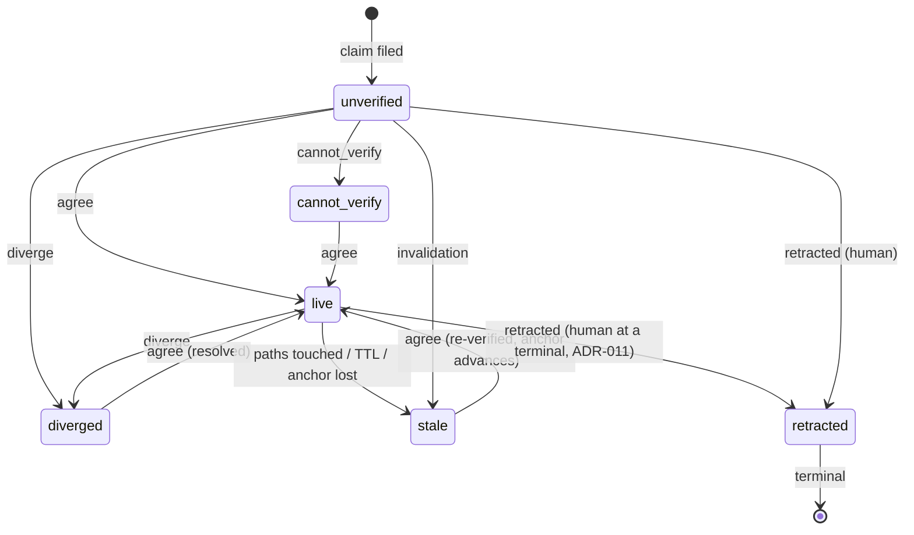

# The Truth Ledger — A Guided Explanation for Developers Working with Agents

> **How to read this:** each part is a complete, honest picture at its depth. Stop after Part 2 and you can use the tool correctly. Parts 3–5 explain *why* it's built that way. Parts 6–7 are for when you start to question it — which we want.

---

## Part 0 — The Hook

### 0.1 A war story

Monday, 10:14. You ask your agent whether anything still calls `legacyAuth()`. It greps, reads, and answers: "No call sites remain. Safe to remove." It's right — you spot-check it yourself. Nice.

Tuesday, a teammate merges a hotfix. Buried in it: one new call to `legacyAuth()`, because their branch was cut last week, before the cleanup.

Friday, 16:40. Different chat, fresh agent session, same repo. You're finishing the refactor and ask, "anything blocking removal of legacyAuth?" The agent — which cannot remember Monday, but *can* read Monday's notes in your planning doc — answers with perfect confidence: "No, this was already verified as unused." You delete the module. CI is green, because the hotfix path only runs in production.

Saturday belongs to the on-call engineer.

Now the uncomfortable part: **nobody lied.** Monday's agent was right on Monday. Friday's agent faithfully repeated a fact that had been true. The repo changed in between, and there was no mechanism — none — by which Tuesday's commit could reach back and mark Monday's fact as expired. The fact had no expiry date, no list of files it depended on, no record of how it was established. It was just a confident sentence, and confident sentences don't age visibly. They stay crisp while reality rots underneath them.

You already have a tool that would never let this happen to *code*. If the hotfix had conflicted with your refactor, git would have stopped the merge cold. Git is ruthless about one question: *what changed?* But git has no opinion whatsoever about the other question: *what did we believe, and does the change break it?*

### 0.2 The one-sentence pitch

> **Git tracks what changed. The truth ledger tracks what we still believe — and lets the changes kill the beliefs.**

Concretely: on Monday, the agent's finding becomes one command —

```bash
truth claim "no call sites remain for legacyAuth()" \
  --class VERIFIED --evidence-cmd "grep -rn legacyAuth src/" \
  --paths "src/**" --tier P0 \
  --scope-ok "all runtime code lives under src/; nothing outside it can call legacyAuth()"
```

— a sentence with a *recipe* (the exact grep, a hash of its empty output, the commit it ran at) and a *tripwire* (the paths it depends on). That last flag is a gate you just hit without noticing: a universally quantified claim ("**no** call sites") backed by a command scoped to `src/` is the exact shape of real verified-but-wrong claims, so intake refuses the pair unless you state, on the record, why the scope covers the quantifier (the quantifier–scope gate, Part 5.1). Tuesday's hotfix touches `src/`; the post-merge scan sees the tripwire and demotes the claim to **stale** — mechanically, with no human vigilance involved. Friday's agent, before trusting anything, runs `truth list --live` — and Monday's fact simply isn't in the list anymore. Better: the removal task was *premised on* that claim, so `truth ready` shows it as **HELD** before any agent even picks it up.

Saturday belongs to nobody.

---

## Part 1 — The Problem (before any solution)

### 1.1 Agents assert facts constantly — and every assertion sounds equally confident

Read any agent transcript and count the factual claims: "the config is loaded from env vars," "this function is only called from tests," "the API returns ISO dates." Dozens per session. Here's the trap: a fact the agent *verified*, a fact it *inferred*, and a fact it *made up* are rendered in **identical prose**. Confidence in the writing tells you nothing about confidence in the checking. Humans have tells — hedging, "I think," a glance away. Language models write hallucinations in the same crisp declarative voice as verified truths.

### 1.2 Three failure modes you've already seen

**Hallucinated facts** — the claim was never true. The agent pattern-matched to how codebases usually work. ("Config validation happens in `config.py`" — there is no validation.)

**Stale facts** — the claim was true when made and reality moved. The war story above. This is the sneakiest one, because spot-checking at claim time *passes*.

**Unverified facts** — nobody knows. It was asserted, sounded plausible, and got promoted to "known" purely by being repeated. Unverified facts don't stay unverified — they quietly graduate.

### 1.3 Session amnesia makes it worse

An agent that verified something yesterday remembers *nothing* in a fresh session. So either the fact gets wastefully re-derived every session (slow, expensive), or — worse — the new session trusts a transcript or a doc that *says* it was verified, with no way to check whether the verification still holds. Notes about facts age exactly like the facts, and nothing in a markdown file goes stale automatically.

### 1.4 "Just review the agent's output" doesn't scale

Agents generate claims orders of magnitude faster than humans audit them. Reviewing every assertion returns you to doing all the work yourself, minus the fun parts. Attention is the scarce resource; the question is not "how do we check everything" but "how do we spend human attention only where a machine can't."

### 1.5 The question the ledger answers

Work trackers answer *what should we do*. Git answers *what changed*. Nothing answers:

> **What do we currently know, how do we know it, and does it still hold?**

That's the gap. Everything else in this guide is one small tool filling exactly that gap and nothing more.

---

## Part 2 — Using It (the 10-minute practical layer)

### 2.1 The mental model

A diary of claims **that the repo can contradict**. You (or an agent) write down what you believe and how you checked. From then on, the repository itself — through commits, merges, and the calendar — gets to argue back. When it does, the claim is demoted automatically. You never argue with the diary; you only add to it.

### 2.2 Your four commands

```bash
# 1. Before relying on a fact — is it still believed?
truth list --live

# 2. When you verify something — write it down with its recipe
truth claim "<fact>" --class VERIFIED \
  --evidence-cmd "<the command you ran>" \
  --paths "<glob,glob — comma-separated>" --tier P1

# 3. When you check someone else's claim — record your judgment
truth verdict <id> agree --basis "re-ran the grep, still 0 matches"

# 4. Before starting work — is it safe to start?
truth ready
```

For facts about the world *outside* the repo (vendor APIs, host versions), swap `--paths` for `--ttl-days N` — git can't see vendors change their docs, but a calendar can tell you when your knowledge is old.

That's the whole daily surface. One more for hygiene: `truth queue` shows what needs a human — run it daily; empty means carry on.

### 2.3 Evidence classes: a confidence label, not a moral judgment

- **VERIFIED** — "I ran a command; here's the recipe." Highest trust, most requirements.
- **INFERRED** — "I reasoned it from something; here's my basis." Honest middle ground.
- **UNVERIFIED** — "I'm saying it out loud so it can be checked later."

UNVERIFIED is not shameful. *Unlabeled* confidence is. Filing an UNVERIFIED claim is strictly better than asserting the same thing in chat, because now it exists somewhere a verifier can find it.

### 2.4 Cost tiers: how much does it hurt if you're wrong?

P0 / P1 / P2 encode not how *sure* you are, but the **cost of acting on the claim if it's false**. "The database is safe to drop" at P0 gets strict treatment (blocks work when unverifiable); "the logo is blue" at P2 gets a shrug. Separating confidence from consequence is the trick — a highly confident P0 claim still deserves more scrutiny than a shaky P2.

### 2.5 What happens automatically

Once filed, a VERIFIED claim is watched. Touch its evidence paths in a commit → **stale**. TTL elapses → **stale**. Someone rewrites history and the anchor commit vanishes → **stale**, with reason "anchor unreachable" (the system fails toward *distrust*, never toward benefit of the doubt). Stale doesn't mean false — it means "the ground moved; re-check before trusting."

### 2.6 Daily routine

Daily (~2 min): `truth queue`. Weekly (~30 s): the canary (Part 5.3). After repo surgery — rebase sprees, hook changes, new agent runtimes: `truth doctor`. That's it.

---

## Part 3 — Concepts You Need (the ideas under the commands)

### 3.1 Append-only: you never edit the ledger

To change a claim's status you **append** a new record — a verdict, an invalidation. You never modify or delete an existing line, not even a typo. Why so strict? Because the moment history is editable, every record's meaning depends on trusting whoever could have edited it — and the whole point is to *not* need that trust. A commit gate enforces it: the staged ledger must literally *extend* the committed one, or the commit is refused. Lab notebook in pen: cross out by writing more, never by tearing pages.

### 3.2 Derived state: status is never stored

There is no "status" field to update. A pure function — the **fold** — replays every event about a claim in order and derives its current status fresh, every time. Same log in, same statuses out. This is `reduce()` over history, and it has a beautiful security consequence: since status isn't stored, there's nothing to tamper with *except the log*, and the log is guarded by exactly one invariant (3.1). All the eggs in one basket — and one very well-watched basket.

### 3.3 Evidence as a recipe

A VERIFIED claim carries: the command, a SHA-256 of its output, its exit code, and the **anchor** — the commit it ran at. That's a recipe a machine can re-execute later and compare. A screenshot proves you saw something once. A recipe proves it can be seen again — or that it can't, which is even more valuable. When you re-verify a stale claim, the anchor moves forward, so one old change doesn't haunt the claim forever.

### 3.4 Facts git can see vs. facts it can't

"No call sites for X" — git can see every commit that could break this: watch paths. "Vendor allows 100 req/min" — git is blind here: use a TTL, because the only honest statement about outside-world facts is "this knowledge expires."

### 3.5 Retraction: the one permanent decision

A retracted claim is a **tombstone**: terminal, forever. Later verdicts bounce off, duplicate records bounce off, nothing resurrects it. Because it's irreversible, it's the one operation gated to humans (the tool demands explicit confirmation) — verifiers who think a claim should die file a *diverge* with their reasons, and a human decides. Irreversible power and automated actors don't mix.

### 3.6 Premises: connecting knowing to doing

`truth premise <issue> <claim>` declares "this work item stands on this fact." Now the fold's output has teeth: `truth ready` intersects your tracker's unblocked issues with premise health, and an issue standing on a stale or diverged claim shows as **HELD** — before any agent picks it up. Without premises, the ledger is a dashboard. With them, it's a gate.

One more verb for the honest edge case (v0.6.4, ADR-013): when a premise dies *genuinely* — the fact was wrong, and its correction lives under a new claim id — re-verifying would be dishonest, and the work would otherwise stay HELD forever. `truth premise <issue> <new-id> --supersedes <old-id>` files an auditable redirect: refused while the old premise is live or unverified (the states that need no rescue), and the replacement is judged by the same matrix afterward. It re-targets protection; it never removes it.

Premises gate the *start* of work; since v0.7.0 (ADR-014) the *end* has a gate too: `truth issue --accept-cmd "<cmd>"` declares an executable finish line at birth, and a plain `done` runs it from the repo root and refuses the close on a non-zero exit — "done" stops being the agent's word. Because these oracles execute repository code on purpose (a test suite, a golden-diff runner), they're screened against their own committed allowlist, `.truth/accept-allow` — separate from the read-only evidence list, so a real oracle never needs an unsafe override. An optional `--accept-kind validation` marks a golden-diff oracle ("built the right thing") apart from the default `verification` ("built right"). The escape hatch, `--accept-unsafe-ok`, covers an oracle that *cannot run* — stamped visibly on the record — and never one that ran and failed.

---

## Part 4 — Science You Might Not Know Yet (why smart people built it this way)

### 4.0 Entropy: why nothing stays true (or tidy) on its own

Entropy started in physics as a measure of **disorder** — the number of arrangements consistent with what you see. A tidy desk is low-entropy (few arrangements count as "tidy"); a messy one is high-entropy (astronomically many count as "messy"). The Second Law of Thermodynamics says entropy in a closed system never decreases — and the reason is brutally statistical: there are vastly more ways to be disordered than ordered, so *random change of any kind* almost always lands on disorder. Order isn't destroyed by malice. It's destroyed by anything happening at all. The escape clause: you *can* decrease entropy locally — tidy the desk — but only by continuously spending energy from outside. **Order is never free and never permanent; it's rented.**

Claude Shannon reused the word for **uncertainty**: entropy as the number of yes/no questions between you and the truth. A fair coin flip: one bit. A rigged coin: zero. Information is precisely what reduces entropy.

Both versions hit software:

- **Code rot** — every deadline hack is a random perturbation, and perturbations favor disorder. Lehman proved this empirically in 1980: a used program must change, and changing programs grow complex *unless work is actively done to reduce it*. Refactoring is rent paid on order. "No time to refactor" isn't saving that rent — it's borrowing at compound interest, which is what "technical debt" means, thermodynamically.
- **Design decay** — the big ball of mud isn't a design anyone chooses; it's the maximum-entropy state everything falls into when nobody spends energy resisting.
- **Knowledge decay** — Shannon's version, and the ledger's whole reason to exist. The moment a fact is verified, your uncertainty about it is zero. Then commits land. Each one *might* have broken the fact, and since you don't know, each injects uncertainty back. Monday's crisp fact and Friday's stale fact are the same bytes — what grew is the entropy around them.

Now the whole ledger snaps into focus as an **entropy-accounting system for knowledge**: the anchor records the moment of zero uncertainty; paths and TTLs model the *decay channels* through which uncertainty re-enters; `stale` says "entropy crossed the trust threshold here"; re-verification is energy spent cooling the fact back down. Even append-only is thermodynamically shaped — you can't reduce the entropy of history, only stack new low-entropy statements on top.

Carry one lesson out of this section: bugs, rot, and stale knowledge are not failures. They're the **default**. Everything we call engineering discipline is one thing in different costumes — a continuously powered pump moving disorder out. The pump never finishes. Your only choices are which currents to pump against, and whether your pumps are *enforced* or merely *hoped for* — because the Second Law is very patient with hope. (Hold that thought until 7.2.)

### 4.1 Byzantine fault tolerance in 5 minutes

In 1982, Lamport, Shostak, and Pease asked: can generals surrounding a city agree on a plan via messengers when some generals are traitors who send *different lies to different people*? The stunning answer: yes, if fewer than a third are traitors — and the deep lesson is that **trust can be a property of structure, not of individuals**. You never learn who's honest; you design the protocol so that *enough* honesty guarantees the right outcome.

Transpose it: your "generals" are agent sessions, humans, and verification runs; the "messages" are claims about the repo. Crash fault → a claim never verified. Omission → a fact silently outdated. Byzantine → a hallucination or forged provenance. Correlated → a verifier that shares the author's blind spots and rubber-stamps. The ledger isn't a consensus protocol — but it steals BFT's central move: stop asking "do I trust this agent?" and start asking "**does the structure guarantee a false claim gets *detected*?**" Detection is bought with recipes, anchors, and tripwires instead of `3f+1` replicas.

### 4.2 Event sourcing: the log is the truth

You already use this daily — it's how git works. Git doesn't store "the current state" as the primary thing; it stores a history, and any state is derivable from it. The ledger applies the same pattern to beliefs: the event log is primary, status is a *view*. Views can be wrong, stale, or recomputed; the log just is.

### 4.3 Falsifiability: Popper for engineers

Philosopher Karl Popper's rule for what counts as science: a claim is only meaningful if you can say **what observation would prove it wrong**. "This system is secure" is marketing; "this system is append-only, falsified by one mutated historical line surviving a commit" is engineering. The ledger runs on this rule: every invariant it claims about itself ships with its named breaker *and a weekly test that seeds the breaker* (Part 5). When someone hands you a guarantee, your first question is now permanent: *what would break it, and where's the test that tries?*

### 4.4 "Reproducible" ≠ "true"

The recheck machinery proves one thing: the recorded command still produces the recorded output. It does **not** prove the claim's sentence is a sound interpretation of that output. The classic gap: a grep that correctly returns zero matches... in the wrong directory, or with a typo'd pattern. Reproducible, and wrong. No hash can close this gap — which is why the verifier's job (4.5) has a mandatory second step: *independently decode* whether the evidence supports the claim as written. For absence claims especially: would this search have found the thing if it existed?

### 4.5 Independent verification: why the verifier gets nothing

When a claim is dispatched for checking, the verifier — a **fresh** agent session — receives exactly two things: a fixed prompt and the claim record. Never the author's transcript, plan, or reasoning. Why so austere? Because a verifier who reads the author's reasoning inherits the author's blind spots, and then agreement proves only that the same mistake is stable. Independence isn't a hope here; it's *scripted* — the dispatch command physically constructs a context that contains nothing else. (Deep cut: the honest residual risk is that author and verifier are the same model family sharing priors — so real decorrelation comes from varying the *evidence modality*, not from adding more verifiers.)

### 4.6 The order-of-events problem (confluence, gently)

Two branches, two agents, both file verdicts on the same claim, then the branches merge. The ledger's merge strategy just concatenates both sets of records — so which order do they land in? If the derived status depends on merge *direction*, you get a merge artifact wearing the costume of a fact. The fix (which this system learned the hard way — see 7.1): derive status from a **total order that doesn't depend on file position** — sort events by timestamp, tie-break by id. Same events, any arrival order, same answer. Distributed-systems folks call this property *confluence*, and it's the exact question CRDTs answer at scale.

---

## Part 5 — How the Machine Defends Itself (trust, but verify the verifier)

### 5.1 Intake gates: refusal is a feature

`truth claim` refuses to even *record*: a VERIFIED claim with no evidence command; one with neither paths nor TTL (uninvalidatable — a fact nothing can ever demote is a lie waiting to mature); one in a repo with no commits (nothing to anchor to); an evidence command whose two intake runs hash differently (nondeterministic — your recipe would diverge tomorrow by luck); a near-duplicate of an active claim (file a verdict on the original instead); a **universally quantified claim over a scoped command** — "no call sites *anywhere*" backed by a grep of one directory — unless `--scope-ok "<one sentence>"` states why the scope covers the quantifier, on the record where a verifier can attack it (the quantifier–scope gate, ADR-007); an **evidence command that isn't read-only** — the recipe re-executes later inside a verifier session, so every program in it must appear in the committed allowlist `.truth/evidence-allow` (ADR-009; test runners deliberately aren't shipped there — they execute repository code; `--evidence-unsafe-ok` files anyway, and recheck then refuses to ever execute that command); a **dead tripwire** — a `--paths` entry containing whitespace with no comma (you forgot the comma; the space-joined literal matches no real file), or a literal path matching zero tracked files (explicit globs are exempt: watching an empty-for-now pattern is legitimate intent, a typo'd literal is not); and empty claim text. A refused claim leaves no trace. An accepted one is immutable. The gate is where quality is cheapest.

### 5.2 The invariant table: promises with named breakers

The system maintains a table of every promise it makes — append-only, TTLs expire, retraction is terminal, broken premises hold work, the fold is confluent, re-verification is durable, retraction needs a human, the drift detector is armed — and next to each, **the single observation that would falsify it**. This is 4.3 practiced, not preached. A promise without a named breaker in this system is a bug in the documentation.

### 5.3 The canary: seeded lies, weekly

Once a week, a script builds sandbox repos and deliberately commits dozens of seeded faults (it prints its own count — the suite grows with every mechanism) — a tampered ledger line, a touched evidence path, rotted evidence, an expired TTL, an erased anchor, a resurrection attempt, a mid-file forgery, an issue standing on a stale premise... Every seeded lie must be CAUGHT. One miss and the run fails loudly: *the immune system has a hole* — stop trusting green checkmarks until it's fixed. This inverts normal testing: instead of confirming the happy path works, it confirms **the lies you know about get caught**, which is the only evidence that means anything for a trust system.

### 5.4 Doctor vs. canary

Subtle and important: the canary proves *the scripts* can catch faults — in a sandbox. It says nothing about **your** repo. `truth doctor` checks your wiring: hooks installed, gitattributes set, discovery snippet present in the files your agents actually read. A perfect canary with a broken installation is a smoke detector still in its box.

### 5.5 The commit gate: you physically can't rewrite history

Pre-commit, the gate checks the staged ledger is a **line-prefix extension** of the committed one — old content, byte-for-byte, then new lines. Edits fail. Deletions fail. Insertions *in the middle* fail (a subtler attack than you'd think — see 7.1). Only true appends pass. And each appended record must satisfy the schema. Note the shape: this is a *property*, enforced in code, not a *norm* written in a README — a distinction 7.2 will make into the biggest lesson of the whole guide.

---

## Part 6 — Honest Limits (what it cannot do for you)

### 6.1 It checks reproducibility, not interpretation

Section 4.4's gap, restated as your job description: the machine will faithfully tell you a grep still returns zero matches. Whether zero matches *means what the claim says* is a human (or semantic-verifier) judgment, forever. The ledger's real gift isn't removing that judgment — it's *concentrating* your scarce attention exactly on it, having automated everything else.

### 6.2 It only works if agents discover it

The entire layer hangs on four lines of instructions in the files your agent runtimes load (AGENTS.md, CLAUDE.md, etc.). An agent that never reads those lines bypasses everything, silently. This is the weakest link, it is behavioral rather than technical, and no invariant in Part 5 touches it. It's why doctor checks the snippet's presence — but presence in a file no runtime reads is silent death, so put it in *every* instruction file, and audit fresh sessions occasionally.

### 6.3 Warnings you learn to ignore stop working

Unverified premises pass with a warning by design (blocking everything would make the tool unusable, and unusable tools get abandoned — the worst epistemic outcome). But the trade is real: if warnings become wallpaper, the system has failed while its checks stay green. The designers named this risk and pre-committed a fallback: if warning fatigue appears, tighten the matrix. Watch yourself for it.

### 6.4 Timestamps are trusted, not proven

Whoever appends a record chooses its timestamp, and event order derives from timestamps. So a determined forger can backdate. The worst composition of that — backdating a *duplicate* of an existing id so it sorts first and silently substitutes the claim's content — is now detected at commit time (since v0.6, ADR-008): within one repository, file order is append order, so a record that sorts before an earlier line with its own id fails validation. What remains accepted is the residue: forging the timestamp on a *fresh* id. The gate makes even that permanent and attributable in git history — you can't do it *quietly* — but cryptographic proof would need signed records, deliberately not built until a real forgery justifies it. Accepted risk, stated out loud, which is the only honest way to have risks.

### 6.5 Green checkmarks mean nothing without the monthly hand-audit

Monthly, re-audit a few fresh sessions' claims *by hand* against your day-0 baseline. If false-VERIFIED rates haven't moved, the machinery is decoration. This is the control-group logic of any experiment: the canary proves the mechanism runs; only the baseline comparison proves it *helps*. Never confuse the two.

---

## Part 7 — For the Curious (optional deep end)

### 7.1 The audit story: six defects, one resurrected tombstone

This exact system — designed around named refutations — was subjected to a falsification battery aimed *at* its refutations. Six real defects fell out. The headline: the "retraction is terminal" invariant, whose own named breaker is *one resurrected tombstone*, was broken — by appending a well-formed duplicate claim record bearing a retracted claim's id. Pure append, passed every gate, and a retracted P0 claim ("the database is safe to drop") came back as merely unverified. The commit gate's old check ("no deleted lines") was weaker than actual append-only; the fold's claim-handling bypassed the terminality guard. Also found: the two copies of the schema contract had drifted while the drift detector *failed open* on a missing optional package; re-verified claims went stale again on every scan (frozen anchors); the fold wasn't confluent (4.6); "humans-only retraction" was enforced nowhere; and glob patterns matched deeper than intended. All six were repaired, every repair now has its own seeded fault — and, deliciously, the audit's *own first fix* introduced a bug (timestamp ties) that the canary under study caught. The method survived being turned on its own output, which is roughly the definition of earning the word "scientific."

### 7.2 Norms vs. properties: the most transferable lesson here

The two worst defects shared one shape: **a guarantee written as a sentence where the threat model demanded a check.** "Retraction is humans-only" lived in a prompt — a norm addressed to a well-behaved language model. "Append-only" lived in a diff heuristic that trusted a narrower attack than actors could actually mount. Both were true of polite actors and false of the capability model. Your permanent test, applicable to any system you'll ever build: for every *must / only / never* in a design doc, ask — **which code path fails if this sentence is deleted?** If the answer is none, it's a norm. And entropy (4.0) is very patient with norms.

### 7.3 The readiness matrix: a trade decided out loud

Why do unverified premises pass with a warning instead of blocking? Because the strictest option ("only verified facts pass") was tried and made the tool unusable for a solo dev — and the loosest ("anything not-dead passes") let critical unknowns through. The decision — live passes; unverified warns; cannot_verify blocks only P0; stale/diverged/retracted/missing always block — is recorded in an Architecture Decision Record with the trade-off, the rejected options, *and the fallback if it fails* (if warning fatigue appears, revert to strict with a cheap bulk-verify path). That's what a decision looks like when it expects to be questioned. In entropy terms: it's an uncertainty budget per cost tier.

### 7.4 Growth gates: features deliberately not built

Session attestation, signed timestamps, pruned ledger views, docs generated from claims — all designed, none built. Each waits behind a trigger: *build it when the first failure it prevents actually occurs.* This is YAGNI with receipts, and it's why the system stayed small enough to audit — which, given 7.1, turned out to matter.

### 7.5 Where to go deeper

Lamport, Shostak & Pease, *The Byzantine Generals Problem* (1982) — read the first three pages, they're a delight. Castro & Liskov, *Practical BFT* (1999). Lehman, *Programs, Life Cycles, and Laws of Software Evolution* (1980). Popper, *The Logic of Scientific Discovery* — or any good summary of falsificationism. Claessen & Hughes, *QuickCheck* (2000) for property-based testing. Shapiro et al., *CRDTs* (2011) for confluence at scale. And Shannon, *A Mathematical Theory of Communication* (1948), for entropy as uncertainty.

---

## Appendix A — Cheat Sheet

**Commands**

| Command | When |
|---|---|
| `truth list --live` | Before relying on any repo fact |
| `truth claim "<fact>" --class VERIFIED --evidence-cmd "<cmd>" --paths "<glob,glob>" --tier P1` | You verified something in-repo (paths are comma-separated) |
| `... --class VERIFIED --evidence-cmd "<cmd>" --ttl-days N` | You verified an outside-world fact |
| `... --class INFERRED --basis "<why>"` / `--class UNVERIFIED` | You reasoned / you're just flagging |
| `truth verdict <id> --recheck` | Mechanical recheck (hashes) |
| `truth verdict <id> agree\|diverge\|cannot_verify --basis "<what you did>"` | Your judgment, with receipts |
| `TRUTH_HUMAN=1 truth verdict <id> retracted --basis "<why>"` — then type the id back when prompted (headless human use: add `TRUTH_HUMAN_ACK=<id>`) | Kill a claim forever (humans, at a terminal — ADR-011) |
| `truth premise <issue> <claim-id>` | Tie work to a fact |
| `truth premise <issue> <new-id> --supersedes <old-id>` | Redirect a genuinely dead premise to its corrected claim (ADR-013; refused while the old one is live or unverified) |
| `truth issue "<title>" --accept-cmd "<cmd>" [--accept-kind validation]` | Declare the executable finish line at birth; `done` refuses the close unless it exits 0 (ADR-014; screened against `.truth/accept-allow`) |
| `truth ready` | Which work is epistemically safe to start |
| `truth queue` | Daily: what needs a human (empty = carry on) |
| `truth impact <path>...` | Before editing: what knowledge would this edit endanger? (read-only) |
| `truth impact --inverse [--under <dir>]` | The backward question: which tracked files does the ledger know nothing about? (exit 4 when dark files exist; issue #5) |
| `truth stats` | Monthly: status/tier counts, verdict rates, claim half-life, queue aging |
| `truth baseline <ref> [--diff <ref>]` | The frozen status account at a git ref; --diff prints the release-notes delta and alarms (exit 5) if any record disappeared (issue #3) |
| `truth contradicts <a> <b> --basis "<why>"` | Declare two claims cannot both hold: while both are live, both derive DISPUTED and premised work HOLDs; resolve by retracting/superseding one side (issue #4) |
| `truth doctor` | After any repo surgery |

**Statuses**: `unverified` (filed, unjudged) → `live` (confirmed) → `stale` (ground moved) / `diverged` (checker disagrees — the process *working*) / `cannot_verify` (honest shrug) → `retracted` (tombstone, terminal).

**State machine**



**Golden rules**: never edit the ledger · status changes are new records · UNVERIFIED beats unlabeled · P-tier = cost of being wrong, not confidence · stale ≠ false, stale = re-check first · watch real files — a symlinked path is a tripwire that can never fire (git tracks the link, not the target).

## Appendix B — FAQ

**Why was my claim refused?** The gate caught one of: VERIFIED without an evidence command; without paths *or* TTL (nothing could ever demote it); a repo with no commits; a nondeterministic evidence command (two runs hashed differently — add `--single-run` only if you accept false divergences); a near-duplicate of an active claim (verdict the original, or `--duplicate-ok` if genuinely distinct); a universally quantified claim text over a scoped evidence command (ADR-007 — state why the scope covers the quantifier with `--scope-ok "<one sentence>"`); an evidence command using a program not in `.truth/evidence-allow` (ADR-009 — it would re-execute in a verifier session; use an allowlisted read-only command, consciously extend the allowlist, or `--evidence-unsafe-ok` and accept manual-only verification); a dead-tripwire path (INV-M) — `--paths "a.sh b.sh"` means you forgot the comma, and a literal path matching zero tracked files can never fire; or empty claim text. Refusal at intake is the system working — a claim that can't be invalidated is a lie maturing.

**It says my `--paths` entry "contains whitespace with no comma".** `--paths` takes one quoted, comma-separated list: `--paths "src/auth/**,scripts/deploy.sh"`. A space-separated list stores as a single literal path that matches nothing — a tripwire that can never fire — so intake refuses it outright (INV-M, v0.5.4).

**Why did my claim go stale again right after I re-verified it?** In old versions (≤ v0.3), it would have — the anchor was frozen at filing, a real defect fixed in v0.4. Now an `agree` verdict advances the anchor to the current commit. If you still see re-staling: either the paths genuinely changed *again* after your verdict, or you're on an old version — check the docstring.

**Can I delete a wrong claim?** No — and you don't need to. If it's wrong, file `diverge` with your evidence. If it should be dead forever, a human retracts it at their own terminal (`TRUTH_HUMAN=1` plus typing the id back when prompted; `TRUTH_HUMAN_ACK=<id>` for headless human use — ADR-011). The wrongness stays in history *on purpose*: "we believed X and were wrong" is itself valuable knowledge, and editable history is worthless history.

**My verdict was refused — "retraction is a human decision."** Correct behavior. Verifiers diverge; humans tombstone. If you're a human at a keyboard, re-run in your own terminal with `TRUTH_HUMAN=1` and type the claim's id back at the confirmation prompt (headless: `TRUTH_HUMAN_ACK=<exact-id>` too — `TRUTH_HUMAN=1` alone is refused without a terminal, ADR-011). If you're an agent reading this: file the diverge and say why it should die; the queue will bring a human.

**`truth ready` says HELD — but I checked, the premise is fine!** Then say so on the record: re-verify the premise claim (`verdict <id> agree --basis ...`) and `ready` will release the issue. HELD isn't the system claiming the fact is false — it's the system refusing to let work proceed on a fact *nobody has re-checked since the ground moved*. And if the premise is *genuinely dead* — wrong, with the corrected fact filed under a new id — don't fake an agree: redirect it with `truth premise <issue> <new-id> --supersedes <old-id>` (ADR-013, v0.6.4).

**The fact legitimately changed — how do I "update" a claim?** You don't edit; you replace, in death-first order. Run `truth verdict <old-id> --recheck` — the hash mismatch files the diverge for you, mechanically and honestly — *then* file the corrected claim. The near-duplicate gate enforces this order: it refuses a successor while the old claim is still live, which is the system making sure the ledger never holds two live contradictory truths.

**Do I need Beads/a work tracker?** No — and since v0.5 you don't even need one for `truth ready`: the ledger ships a native work kernel (`truth issue --premise` / `start` / `done --claim`), so work items can live in the same ledger as facts and the broken-premise gate works with zero external tools. Prefer an external tracker? The join reads a JSON array of `{id, title}` issues from `TRUTH_TRACKER_CMD="your-cmd"` or a pipe (`your-tracker export --json | truth ready --stdin`), with Beads (`bd ready --json`) as the fallback default — note the native kernel outranks that default as soon as any issue record exists. With neither, the ledger still stands alone as claims + verdicts + queue: a dashboard instead of a gate.

**The evidence command works in my shell but the recheck says cannot_verify.** Exit 127: the verifier's environment can't find the command. That's classified as an *environment* problem, not a reality problem — deliberately distinct from diverge. Fix the environment or record evidence using the boring universal vocabulary: grep, find, ls, test runs.

**What goes in `--basis`?** What you *did*: "re-ran grep, 0 matches in services/", "compared schema to migration 0042". Never a vibe ("looks right"). Your verdict is itself a claim, and it carries your name.

## Appendix C — Glossary (read these like trading cards, not a dictionary)

**Claim** — A sentence about the repo that someone dared to write down. Writing it down is the point: a claim in the ledger can be checked, aged, and killed. A claim in a chat transcript just haunts you.

**Ledger** — One JSONL file, `.truth/claims.jsonl`. The only file in your repo that remembers what everyone believed and when. You never edit it. Ever. Not even to fix a typo. *Especially* not to fix a typo.

**Append-only** — The rule that makes the ledger trustworthy: history grows, it never changes. To "fix" a wrong claim you add a new record saying it's wrong. A lab notebook in pen — crossing out is allowed, tearing out pages is not.

**Fold** — The trick that makes append-only livable. Nobody stores a claim's status; a pure function *replays* every event about it and derives the status fresh. Same log in, same statuses out, every time. If the word bothers you: it's `reduce()` over history.

**Status** — What the fold spits out per claim: `unverified` (filed, unjudged), `live` (independently confirmed), `stale` (its evidence changed under it), `diverged` (someone checked and disagreed — the system *working*, not failing), `cannot_verify` (honest shrug), `retracted` (dead).

**Evidence class** — The confidence label you attach at filing. **VERIFIED**: "I ran a command, here's the recipe." **INFERRED**: "I reasoned it from something, here's my basis." **UNVERIFIED**: "I'm saying it out loud so it can be checked later." UNVERIFIED is not shameful — unlabeled confidence is.

**Cost tier** — P0/P1/P2: not how *sure* you are, but how much it *hurts* if you're wrong. "The DB is safe to drop" at P0 gets treated very differently from "the logo is blue" at P2, even at identical confidence.

**Evidence recipe** — For VERIFIED claims: the exact command, a hash of its output, its exit code, and the commit it ran at. Enough for a machine to re-run it later and notice the world changed. A screenshot proves you saw something once; a recipe proves it can be seen again.

**Anchor** — The commit your evidence was cooked at. The scan watches everything between the anchor and HEAD; touch the claim's files in that window and it goes stale. Re-verify, and the anchor moves forward — that's what makes re-verification stick.

**TTL** — Time-to-live, for facts git can't see ("the vendor API allows 100 req/min"). Git can't tell you when a vendor changes their docs, but a calendar can tell you when your knowledge is old enough to distrust.

**Verdict** — A judgment on a claim by someone who checked: agree, diverge, cannot_verify — always with a **basis** ("re-ran grep, 0 matches"), never a vibe ("looks right"). Your verdict is itself a claim, and it carries your name.

**Verifier** — A *fresh* agent session handed exactly one claim and a fixed prompt — never the author's reasoning. If the verifier saw the author's transcript, it would inherit the author's blind spots and agreement would prove nothing. Independence isn't hoped for; it's scripted.

**Recheck** — The mechanical half of verification: re-run the recipe, compare hashes. Catches *changed reality*, not *wrong interpretation*. A correct grep with a wrong conclusion passes recheck — that gap is yours.

**Tombstone** — A retracted claim. Terminal. Later verdicts bounce off it, duplicate appends bounce off it, nothing resurrects it. The one irreversible act in the system, which is exactly why it's humans-only and requires explicit confirmation.

**Premise** — A link saying "this work item depends on this claim." The bridge from knowing to doing: if the claim dies, the work is held before an agent picks it up.

**Invariant** — A promise the system makes about itself, stated *with* the observation that would break it. "The ledger is append-only — falsified by one mutated historical line." No named breaker, no real promise.

**Canary** — Dozens of deliberate lies seeded into sandbox repos every week (the suite prints its own count and grows with every mechanism). Every lie must be caught. The day one isn't, the immune system has a hole and you stop trusting green checkmarks until it's fixed.

**Doctor** — Checks *your* wiring, not the tool. The canary proves the scripts can catch faults in a sandbox; doctor proves your actual repo would.

**Queue** — Everything needing a human: diverged claims, stale P0/P1s, unverifiable P0s — with their age in days, because a queue nobody drains is a dashboard, and a dashboard is not a defense.

**Entropy** — The reason all of this exists. Order is rented, knowledge decays, and the ledger is the rent ledger. (Part 4.0.)
