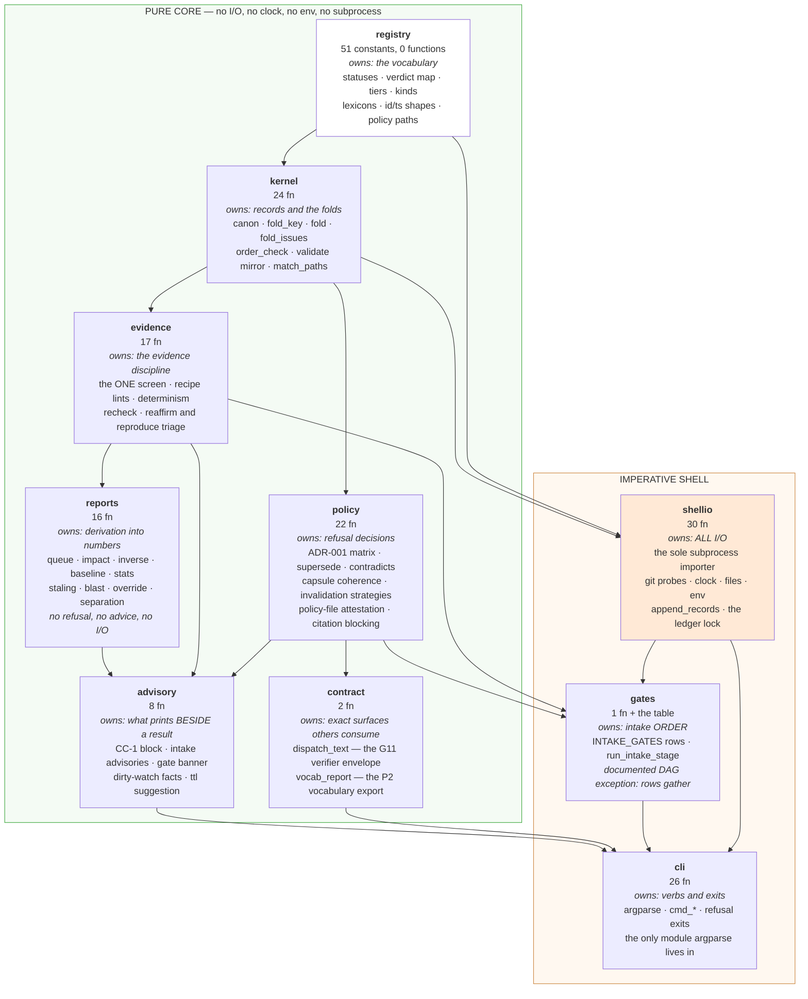
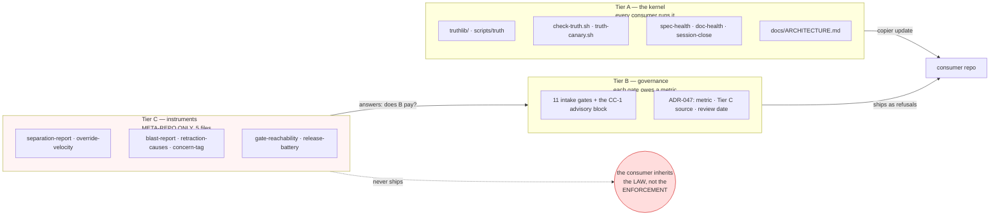
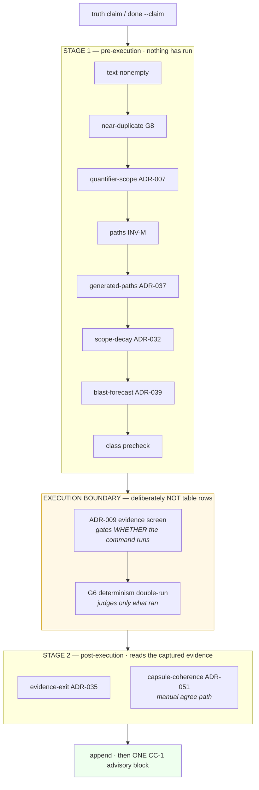

# Structure — what this is built from

> Reader: anyone about to change the machinery, or deciding where a new
> mechanism belongs | Enables: seeing the components, what each owns, and the
> three hierarchies that constrain them, without reconstructing them from five
> ADRs | Update-trigger: a module is added or removed, an import edge changes,
> a tier boundary moves, or a gate stage is added

> **STATUS: OBSERVED.** Every module, edge and count below was extracted from
> `truthlib/*.py` with `ast` on 2026-08-13 at v0.9.37, not read from the ADRs
> that decided them. Where this document and an ADR disagree, this document is
> reporting the code and the ADR is reporting the intent — and that gap is
> itself the finding.

This is the **structural** view. The behavioural views — triggers, lifecycles,
sequences, human seams — live in the consumer's machinery atlas; the arguments
live in `docs/ARCHITECTURE.md`. Three documents, three jobs.

---

## Why this document exists

The system had nine drawn viewpoints and none of them structural. Provenance,
triggers, claim lifecycle, work kernel, twin coupling, gate anatomy, human
seams, defence map, sequences — every one is *behaviour* or *flow*. A reader
could learn exactly what happens and never learn what it is made of.

`docs/diagrams/asbuilt-architecture.md` was the nearest thing, and it shows
the failure mode this repository exists to prevent: drawn at v0.9.13, carried
forward to v0.9.33 by prepending roughly three thousand words of version
deltas to its own header rather than being redrawn. The word `truthlib` appears
in it once, inside that prose blob, and on no diagram — so the package split
that has organised the code since v0.9.28 was never drawn at all.

**Restatement instead of citation** (paper §5), in the architecture
description of the thing that mechanises citation.

---

## 1. Decomposition — the modules and what each owns

**Reading the arrows.** An arrow is `may import`. The DAG is strict and
one-directional: nothing in the pure core may import `shellio` or `cli`, and
each pure module imports only modules below it. `registry` is the floor — it
imports nothing but `re`.

**`gates` is the one documented exception** (ADR-044): its rows gather their
own facts through `shellio`, exactly as they did inline before the split, and
`run_intake_stage` exits the first refusal. Not purified, and said so.

**This is a theorem, not a comment.** `TestModulePurity` parses each pure
module with `ast` and refuses: any `subprocess` import, any `os.environ`
access, any `open()` call (allowlist deliberately empty — pure modules receive
file content as data), any clock read, and any import edge outside the DAG
above. The green box is checked, not asserted.

**Verified independently for this drawing:** only `shellio` imports
`subprocess`. `cli` carries `test_cli_never_imports_subprocess` as a separate
arm, because `cli` is impure and cannot be covered by the purity test — the
one module the theorem cannot reach, guarded by name.

---

## 2. Tiers — what reaches a consumer, and what never does

**The admission rule that polices this boundary** (ADR-046): a payload field is
admitted only if the fold or a blocking gate reads it. Report-only data lives
in Tier C instruments, never in records. Two fields have been evicted by it —
`concerns` and `blast_forecast` — and both remain legacy-admitted so
append-only history keeps validating.

**The asymmetry is deliberate and is the system's largest single risk.**
Tier C is where the question *"is Tier B worth its cost?"* gets answered, and
Tier C does not ship. A consumer receives eleven gates and no instrument for
retiring any of them.

---

## 3. Intake order — the third hierarchy, and the only one that is data

**Why the boundary is not a row.** ADR-029: the screen decides *whether a
command runs at all*; the double-run judges *only a command that ran*. Drawing
them as peers in a flat list is the misreading that ADR made a decision
against, and canary FAULT SD pins the contrast — a screen-failed command
reports the screen refusal, never determinism.

**Order is data.** `INTAKE_GATES` is a tuple of `(stage, name, fn)` rows; a
later gate ADR adds a row, not a paragraph. A core test pins the sequence and
canary GS1/GS2 pin it end-to-end.

---

## 4. The three hierarchies, side by side

They are orthogonal. A mechanism has a position on each axis, and the three
answers are independent.

| axis | question it answers | where decided | how enforced |
|---|---|---|---|
| **module DAG** | what may depend on what | ADR-044 | `TestModulePurity` — AST, a theorem |
| **tier** | who receives it | ADR-046 | envelope admission rule; placement test ADR-003 |
| **intake stage** | when it runs | ADR-034 | `INTAKE_GATES` as data; core + canary pins |

**Worked example — where does a new gate go?**

1. *Module:* does it decide, or does it gather? Decisions go to `policy`;
   gathering goes to `shellio`; the row that wires them goes to `gates`.
2. *Tier:* does it refuse? Then Tier B, and it owes ADR-047 a metric, a Tier C
   data source and a review date before it may block. Does it only report?
   Then Tier C, meta-repo, and it does not ship.
3. *Stage:* does it read captured evidence? Then post-execution. Otherwise
   pre-execution. It is never a peer of the screen.

Three questions, three ADRs, one answer each. **This table is the hierarchy
the system has always had and never drew.**

---

## 5. Stakeholders and concerns

ISO/IEC/IEEE 42010 asks a view to frame the concerns of a named stakeholder.
This system had the views and not the anchoring: `--concern` was recorded as
claim metadata from v0.9.15, correctly evicted at v0.9.30 for failing the
envelope admission rule, and nothing replaced the anchoring it was reaching
for. It does not belong in the envelope. It belongs here, in prose, costing
nothing.

| stakeholder | their concern | the view that frames it |
|---|---|---|
| **Operator** (sole retraction authority) | *what needs my judgment, and what may I safely automate?* | human seams · queue · the ADR-047 registry |
| **Author agent session** | *what may I file, and what will refuse me?* | §3 intake order · the ADR series |
| **Verifier session** | *what am I being asked to judge, and on what evidence?* | claim lifecycle · the dispatch envelope |
| **Consumer repo** | *what arrives, what must I wire myself?* | §2 tiers · provenance view · placement test |
| **Machinery maintainer** | *where does a change belong, and what may it depend on?* | **§1 and §4 — this document** |
| **Auditor** | *can I reproduce these findings without trusting the tool?* | invariant table · paper §7 falsifiers · reproduction appendix |

The last row is load-bearing and easy to lose: every audit that has found
something real here — the capsule orphaning, the four unreachable suites, the
dark citation gate — was run **against the artifacts, not through the CLI**.
An architecture description that only supports the CLI's own view of itself
would have hidden all three.

---

## 6. What this view deliberately does not show

- **Behaviour.** Triggers, state machines, sequences and human seams are the
  atlas's job. Two documents drawing the same thing drift apart; this one owns
  structure only.
- **Argument.** Why a boundary sits where it does is the ADR's job. Every
  boundary above cites the record that decided it.
- **The consumer's own wiring.** Which hooks a given repo installed is
  consumer state, not machinery structure (ADR-003 rule 1).
- **Anything unverified.** Nothing here is drawn from an ADR's description of
  the code. Where the two disagree, that is a finding to file, not a diagram
  to reconcile quietly.
