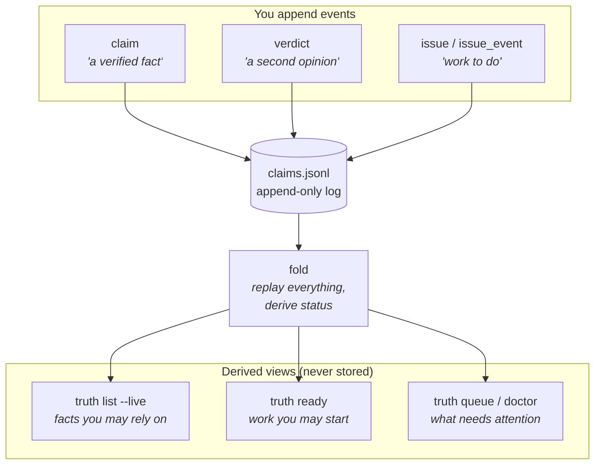
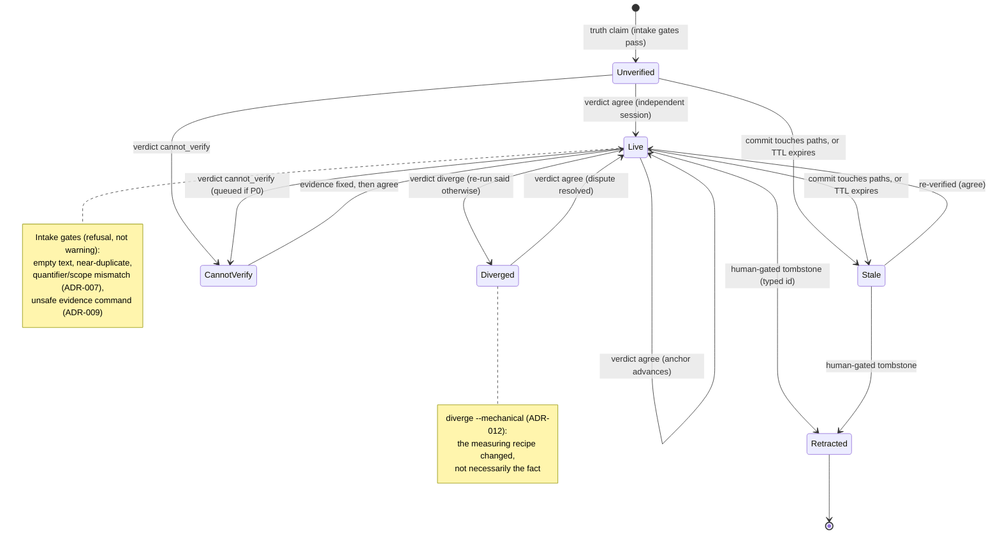
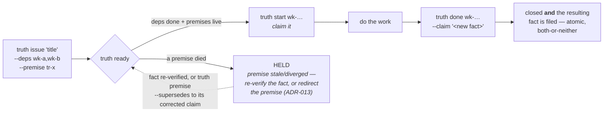
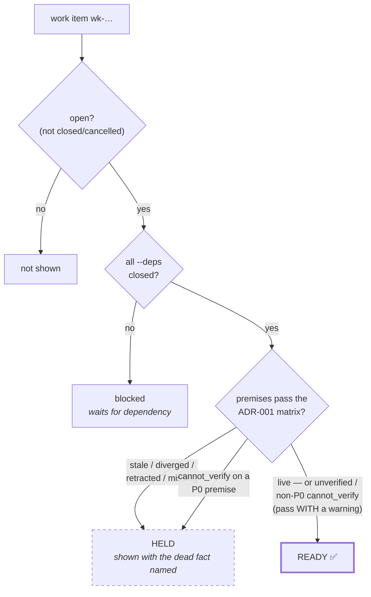
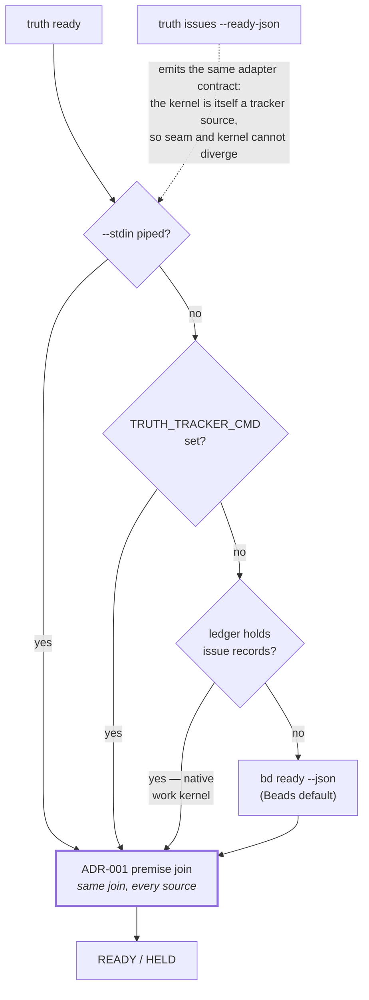
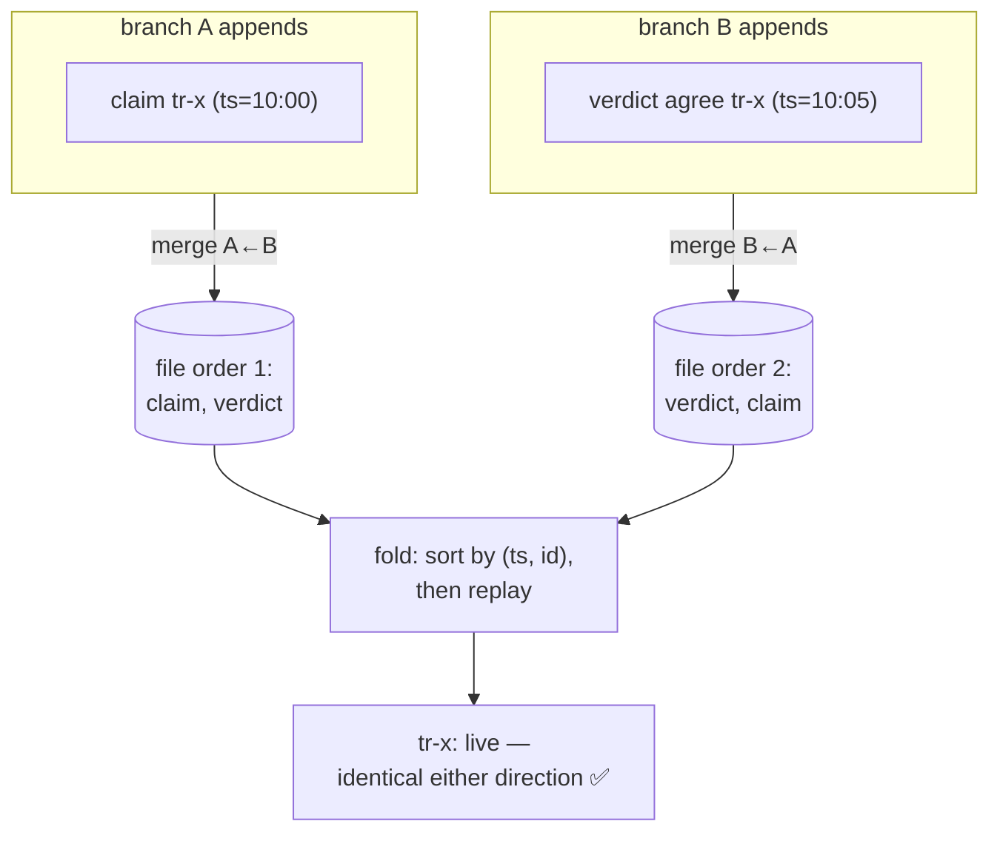
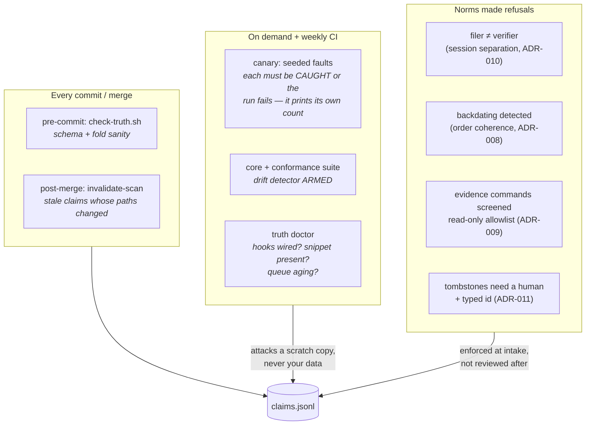
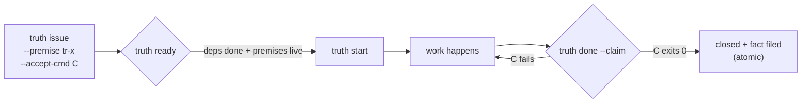

# The Truth Ledger, Illustrated

> Reader: anyone being introduced to the truth ledger (presentation audience, new collaborator) | Enables: understanding the machinery well enough to trust its gates and file claims/issues correctly | Update-trigger: a consumed template version changes fold semantics, gates, or verbs

Presentation-friendly diagrams of how the truth ledger works. Source of
truth for semantics: `.truth/README.md` and the ADRs in `docs/adr/`.
GitHub renders these natively; for slides, paste each block into any
mermaid renderer (e.g. mermaid.live).

---

## 1. The big picture — one file, derived truth

Everything — verified facts *and* work items — is an append-only line in
`.truth/claims.jsonl`. Nothing stores a status; status is **recomputed**
every time by replaying all events in order (the "fold"). You can never
edit history, only append to it.

**Why it matters:** there is no field an agent (or human) can quietly
flip to "done" or "true". The only way to change a status is to append a
new, attributable, gate-checked event.

---

## 2. Life of a fact — how a claim stays honest

A claim is born with an **evidence command** (how to re-check it) and
either **paths** (repo facts) or a **TTL** (world facts). It is born
**unverified**: filing runs and hashes the evidence twice, but that
double-run is a gate, not a verdict — only an independent session's
`agree` makes it *live*. Evidence attached and evidence confirmed are
two distinct events, never conflated. The repo itself stales it: any
commit touching its paths knocks it back to *stale* until someone
re-verifies.

**Why it matters:** facts decay automatically. Nobody has to remember
to distrust old knowledge — the ledger forgets *for* you, loudly.

---

## 3. Life of a work item — planning that stands on facts

Work items live in the same ledger. Each one can declare the facts it
**stands on** (`--premise`). If a premise dies, the work is HELD — the
plan invalidates itself the moment its factual basis does.

**Why it matters:** an agent will happily execute a plan whose factual
basis died three sessions ago. Humans notice; models don't. The premise
gate makes that impossible by construction.

---

## 4. The ready gate — what "you may start this" actually checks

The premise check is a tier-sensitive **matrix** (ADR-001), not a
binary: `live` passes clean; `unverified` passes with a warning (low
filing friction is a stated trade); `cannot_verify` blocks only P0
premises and warns otherwise; `stale`, `diverged`, `retracted`, and
missing claims always block.

The same gate works with an external tracker (Beads via adapter, or any
command printing `[{id,title}]` JSON) — the ledger contributes the
premise filter either way (ADR-004 seam; the source precedence is the
next diagram).

---

## 5. Where the work comes from — one join, four sources

`truth ready` doesn't care who the tracker is. Sources resolve in a
fixed precedence order (ADR-002), and the **premise join is applied
identically to whichever source won** — which is what makes the seam
and the kernel incapable of disagreeing.

**Why it matters:** the ledger stands alone with no tracker, joins any
tracker that can print `[{id,title}]` JSON, and — because the native
kernel speaks the same contract through `issues --ready-json` — the
adapter seam can be tested against the kernel itself. A missing or
failing tracker degrades with guidance, never a traceback.

---

## 6. Two branches, one truth — union-merge confluence

Ledgers on diverged branches merge by **union** (`.gitattributes`:
`merge=union`), and the fold replays events in a canonical
`(timestamp, id)` total order — *not* file order. So both merge
directions derive identical status.

Three per-field merge disciplines make this safe (paper §6.3), each an
audit scar: claim **content** is first-writer-wins — a duplicate id
can never substitute text or evidence (F6); **status** is
last-writer-wins in `(ts, id)` order (F3); **retraction** is terminal
— a tombstone can never be resurrected by a later append (G12). A
backdated duplicate id that tries to game the sort is detected at
commit (ADR-008), because within one history, file order is append
order.

**Why it matters:** agents on parallel branches never coordinate, and
nobody resolves ledger merge conflicts — convergence is a property of
the fold, not a procedure for the humans.

---

## 7. The immune system — who guards the guards

The machinery distrusts itself. Every safety property is either
executed regularly or was converted from a norm ("please don't")
into syntax ("the CLI refuses").

**Why it matters:** a safety check whose failure mode is a print
statement is a norm, not a property. Here, failing checks *stop the
machine*.

---

## 8. Proposed next: `--accept-cmd` — "done" must be demonstrable

Filed upstream as
[truth-ledger#1](https://github.com/m1981/truth-ledger/issues/1):
today `done` takes the agent's word; with an acceptance command declared
at birth, `done` refuses until the finish line actually passes.

Born on live facts (premise-at-birth), dies into a verifiable fact
(accept-cmd + claim-at-death). The loop closes.
